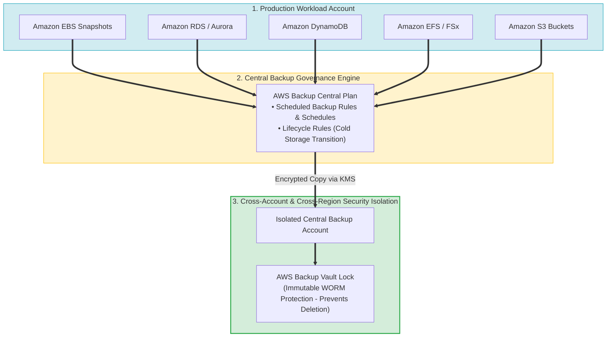
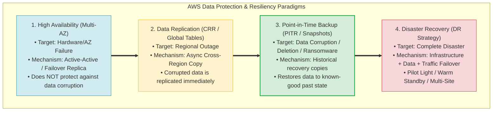
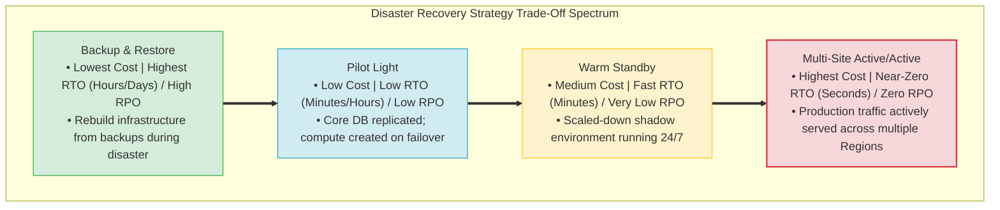
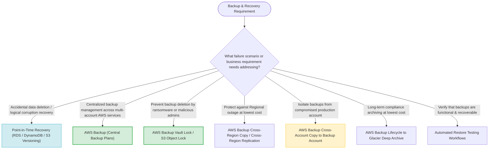

# Task 3.2: Determine a Strategy to Improve Security — Backup Practices and Methods

> [!NOTE]
> **Exam Mindset**: For the AWS Solutions Architect Professional (SAP-C02) and AI Practitioner (AIP-C01) exams, backup is a critical security, compliance, and disaster recovery control.
> Differentiate key resiliency concepts:
> **High Availability (Multi-AZ)** $\neq$ **Data Replication (Cross-Region)** $\neq$ **Backup & PITR (Corruption Recovery)** $\neq$ **Disaster Recovery Strategy**.

---

## 1. Multi-Service Centralized Enterprise Backup Pipeline



---

## 2. High Availability vs. Replication vs. Backup vs. DR Spectrum



---

## 3. Core Data Protection Paradigms Breakdown Matrix

| Protection Paradigm | Primary Target Failure | Mechanism / AWS Service | Operational Characteristics |
| :--- | :--- | :--- | :--- |
| **High Availability (HA)** | AZ / Instance Hardware Failure | **RDS Multi-AZ, ASG Multi-AZ** | Synchronous failover; does NOT prevent corruption |
| **Data Replication** | Regional Data Availability | **S3 Cross-Region Replication, DynamoDB Global Tables** | Asynchronous copy; corrupts target if source corrupts |
| **Backup & Restore / PITR**| Accidental Deletion / Ransomware | **AWS Backup, S3 Versioning, RDS PITR** | Historical recovery to known-good prior state |
| **Disaster Recovery (DR)** | Complete Regional Catastrophe | **Pilot Light, Warm Standby, Elastic Disaster Recovery**| Full business continuity framework with RTO/RPO SLA |

---

## 4. DR Strategy RTO/RPO & Cost Spectrum



> [!IMPORTANT]
> **Ransomware & Tamper Protection**:
> To protect backups against **ransomware or compromised administrator credentials**, implement **AWS Backup Vault Lock** (or S3 Object Lock) in **Compliance Mode** combined with **Cross-Account Backup Copy** to a separate, isolated security backup account. Once locked, backups cannot be modified or deleted by anyone, including the root account.

---

## 5. Storage Tiering & Lifecycle Optimization for Backups

> [!TIP]
> **Cost Optimization via Cold Storage Transition**:
> AWS Backup supports automated lifecycle policies that transition recovery points to **cold storage** (e.g. S3 Glacier / Glacier Deep Archive) for supported resources (EFS, DynamoDB, EBS, RDS). Configure retention rules to move backups older than 30 days to cold storage for long-term compliance retention.

---

## 6. SAP-C02 Backup & Recovery Master Selection Decision Engine



---

## 7. SAP-C02 Exam Keyword Cheat Sheet

```
"Centralized backup management across services"     ──> AWS Backup
"Prevent backup deletion even by AWS root user"     ──> AWS Backup Vault Lock (Compliance Mode) / S3 Object Lock
"Isolate backups from compromised account"         ──> AWS Backup Cross-Account Copy to Dedicated Backup Account
"Recover database to 5 minutes before corruption"   ──> Point-in-Time Recovery (RDS / DynamoDB PITR)
"Accidental S3 object overwrite / deletion"        ──> S3 Versioning
"Long-term regulatory archival at lowest cost"      ──> AWS Backup Lifecycle to Glacier Deep Archive
"Lowest-cost DR strategy with hours of RTO"         ──> Backup and Restore Strategy
"Verify backup integrity and recoverability"        ──> Automated Restore Testing
```

---

## 8. Common SAP-C02 Exam Traps

1. **Trap 1: Confusing High Availability (Multi-AZ) with Data Backup**: Multi-AZ synchronously replicates database operations. If an administrator drops a database table, Multi-AZ drops it on the replica immediately. Use **Point-in-Time Recovery (PITR) or Snapshots** for corruption recovery.
2. **Trap 2: Assuming S3 Durability Eliminates the Need for Backups**: 11 9s of S3 durability protects against hardware storage loss, not accidental deletion or malicious overwrite. Use **S3 Versioning, Object Lock, or AWS Backup**.
3. **Trap 3: Using Custom Script Automation instead of AWS Backup**: Writing custom Lambda scripts to manage EBS snapshots or RDS copies across accounts adds high operational overhead. Use **AWS Backup policy-driven automation**.
4. **Trap 4: Selecting Active-Active DR for Low-Budget Requirements**: Multi-Site Active/Active provides near-zero RTO but carries the highest cost. If the requirement specifies "lowest cost", choose **Backup and Restore**.

---

## 9. Final Mental Model

`Centralize (AWS Backup) ➔ Protect (Vault Lock & Cross-Account) ➔ Recover Corruption (PITR) ➔ Tier Cost (Glacier) ➔ Verify (Restore Testing)`