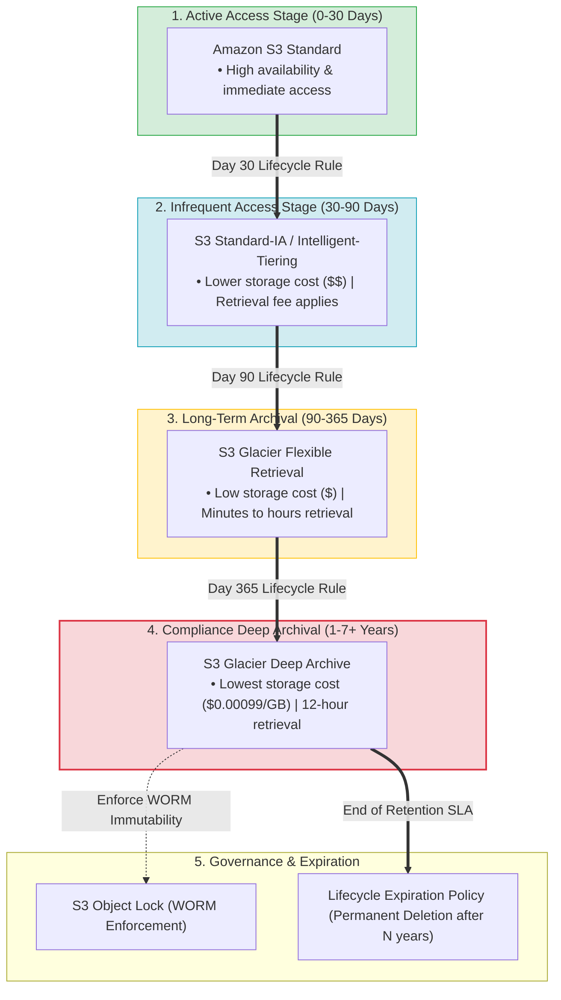
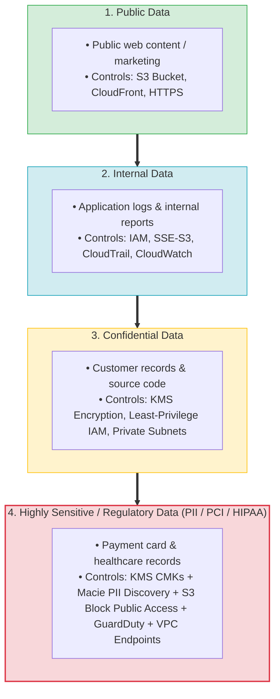
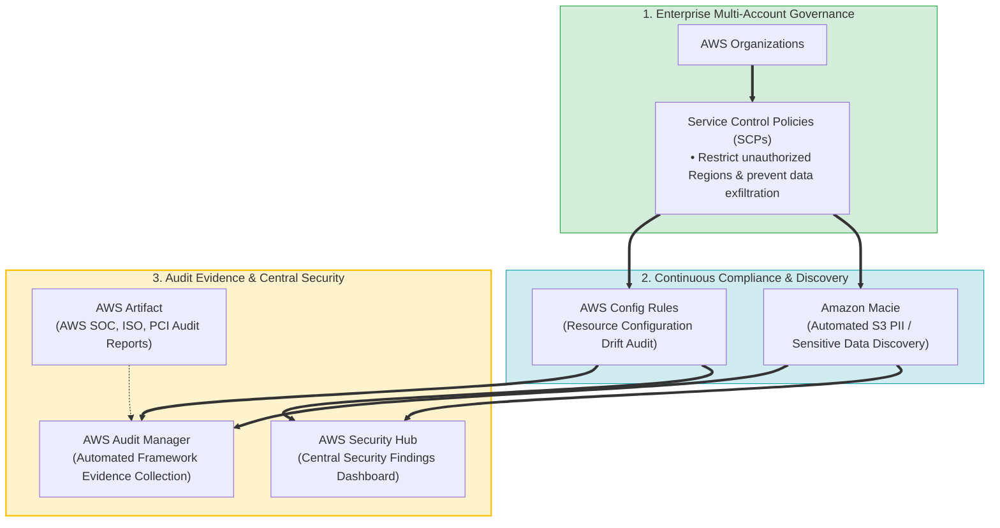
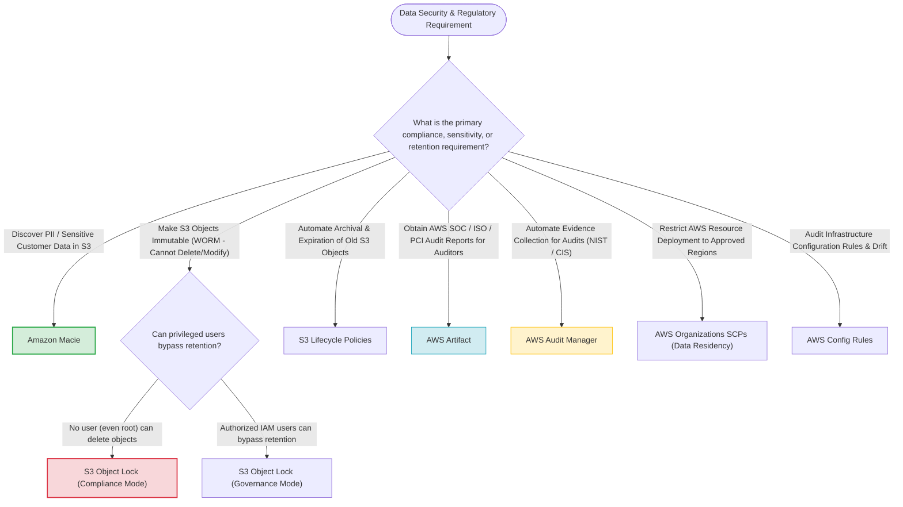

> [!NOTE]
> **Exam Mindset**: For the AWS Solutions Architect Professional (SAP-C02) and AI Practitioner (AIP-C01) exams, data security architecture is evaluated across four distinct dimensions:
> **Data Sensitivity** (Security & Access Controls) $\rightarrow$ **Data Retention** (Lifecycle & Storage Tiering) $\rightarrow$ **Regulatory Requirements** (Residency, Governance, Immutability) $\rightarrow$ **Business Requirements** (Access SLAs & Cost Optimization).

---

## 1. Data Lifecycle & Automated Archival Pipeline (S3 Lifecycle Spectrum)



---

## 2. Data Sensitivity & Security Controls Breakdown

| Classification | Example Data Types | Required Security Controls | Key AWS Services Involved |
| :--- | :--- | :--- | :--- |
| **Public** | Website content, public marketing docs | Standard IAM, HTTPS in transit | Amazon S3, Amazon CloudFront |
| **Internal** | Application logs, internal documentation | IAM, Encryption (SSE-S3), CloudTrail auditing | CloudWatch Logs, AWS CloudTrail |
| **Confidential** | Customer records, financial data, source code | KMS Encryption (SSE-KMS), Least Privilege IAM | AWS KMS, AWS IAM, Private VPC Subnets |
| **Highly Sensitive**| Healthcare (PHI), Payment (PCI), PII | KMS CMKs, Macie PII discovery, Private VPC Endpoints, GuardDuty | Amazon Macie, AWS KMS, AWS Security Hub, S3 Block Public Access |

---

## 3. Data Sensitivity & Security Tiering Spectrum



---

## 4. Immutable Data Retention: S3 Object Lock Modes

> [!IMPORTANT]
> **S3 Object Lock (WORM Architecture)**:
> S3 Object Lock prevents object deletion or overwrite during a specified retention period.
> - **Governance Mode**: Prevents object deletion by standard users, but users with special IAM permissions (`s3:BypassGovernanceRetention`) **can** bypass protection.
> - **Compliance Mode**: **NO ONE**, including the AWS Root Account owner, can delete or overwrite protected object versions until the retention period expires.

---

## 5. Enterprise Compliance & Governance Stack



---

## 6. Governance & Compliance Services Comparison Matrix

| AWS Compliance Service | Operational Purpose | Primary Deliverable | Key Exam Trigger Keyword |
| :--- | :--- | :--- | :--- |
| **AWS Artifact** | On-demand access to AWS compliance reports | Downloadable AWS SOC, ISO, & PCI reports | *"AWS compliance reports for external auditors"* |
| **AWS Audit Manager** | Automates evidence gathering for compliance frameworks | Automated audit assessment reports (NIST, CIS) | *"Automate collection of audit evidence for compliance"* |
| **AWS Config** | Evaluates AWS resource configurations against rules | Real-time non-compliance detection & history | *"Evaluate configuration compliance & drift"* |
| **Amazon Macie** | Machine learning discovery of sensitive data in S3 | PII classification & public exposure alerts | *"Discover sensitive data / PII in Amazon S3 buckets"* |
| **AWS Organizations (SCPs)**| Enforce data residency by restricting AWS Regions | Service Control Policies preventing creation | *"Prevent workloads outside approved AWS Regions"* |

---

## 7. SAP-C02 Data Security & Regulatory Master Selection Decision Engine



---

## 8. SAP-C02 Exam Keyword Cheat Sheet

```
"Discover sensitive PII data in S3 buckets"           ──> Amazon Macie
"Immutable write-once read-many (WORM) storage"       ──> S3 Object Lock (Compliance Mode)
"Bypass retention permitted for admin users"           ──> S3 Object Lock (Governance Mode)
"Automate S3 storage tiering to Glacier & expiration" ──> S3 Lifecycle Policies
"Download AWS SOC, ISO, or PCI compliance reports"    ──> AWS Artifact
"Automate evidence collection for audit framework"     ──> AWS Audit Manager
"Prevent deployment of resources outside EU Regions"   ──> AWS Organizations SCPs (Data Residency)
"Audit resource encryption & security group compliance"──> AWS Config Rules
"Log all AWS API user calls & identity actions"        ──> AWS CloudTrail
```

---

## 9. Common SAP-C02 Exam Traps

1. **Trap 1: Confusing AWS Artifact with AWS Audit Manager**: AWS Artifact provides *AWS's own* SOC/ISO compliance reports; AWS Audit Manager collects evidence for *your application workloads*.
2. **Trap 2: Using S3 Versioning Alone for Immutable Regulatory Retention**: Versioning allows deleting object versions with proper permissions. For strict legal WORM compliance where no root user can delete objects, use **S3 Object Lock (Compliance Mode)**.
3. **Trap 3: Retaining All Data in S3 Standard for Long Periods**: Keeping 7-year archives in S3 Standard wastes budget. Use **S3 Lifecycle rules** to transition data to **Glacier Flexible Retrieval** or **Glacier Deep Archive**.
4. **Trap 4: Confusing Sensitivity Controls with Retention Controls**: Data sensitivity dictates *encryption keys (KMS) & access policies (IAM)*; data retention dictates *lifecycle storage classes & Object Lock*.

---

## 10. Final Mental Model

`Sensitivity (KMS/Macie) ➔ Retention (S3 Lifecycle/Glacier) ➔ Immutability (S3 Object Lock) ➔ Residency (SCPs) ➔ Audit (Audit Manager/Artifact)`