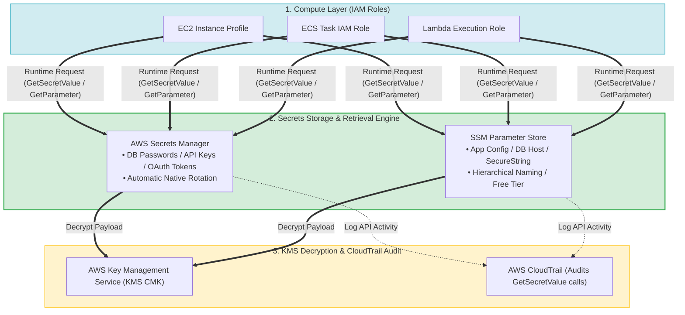
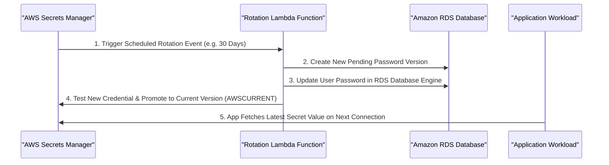
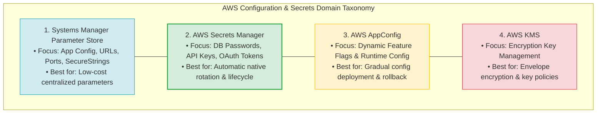
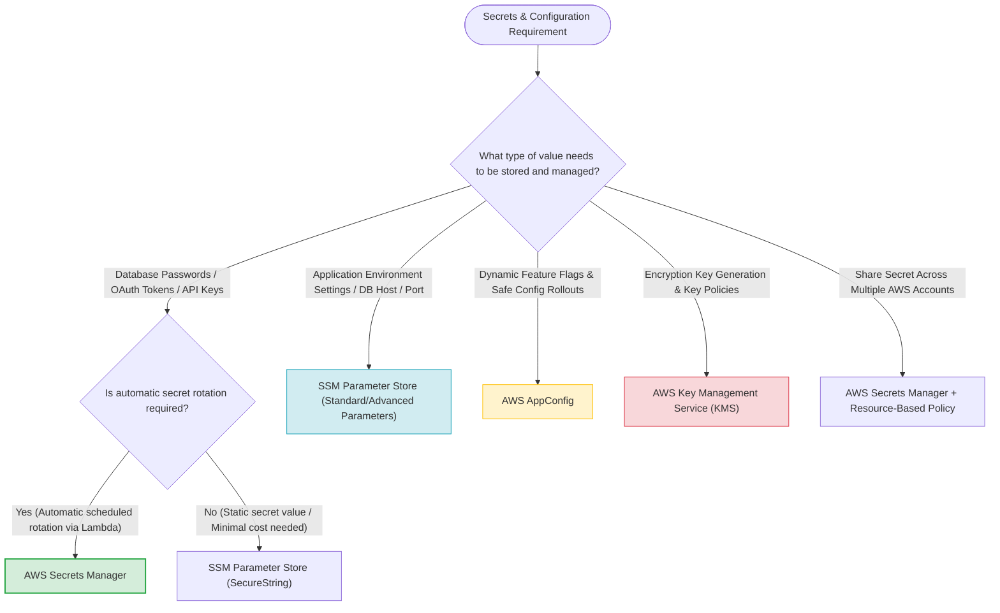

> [!NOTE]
> **Exam Mindset**: For the AWS Solutions Architect Professional (SAP-C02) and AI Practitioner (AIP-C01) exams, secrets management ensures credentials are **never hardcoded** in source code, AMIs, container images, Git repositories, or plaintext config files.
> Applications retrieve secrets dynamically at runtime using IAM Roles. Select the appropriate store based on:
> **Automatic Rotation Requirement** $\rightarrow$ **Cost & Parameter Volume** $\rightarrow$ **Dynamic Configuration vs. Secrets** $\rightarrow$ **Cross-Account Sharing**.

---

## 1. Secure Runtime Secrets Ingestion Architecture



---

## 2. Secrets Manager vs. Parameter Store Comparison Matrix

| Feature / Requirement | AWS Secrets Manager | SSM Parameter Store |
| :--- | :--- | :--- |
| **Primary Focus** | Passwords, API keys, database credentials | Application configuration parameters, URLs, ports |
| **Automatic Rotation** | **Native automatic rotation (RDS, Redshift, DocumentDB, Lambda)** | No automatic rotation capabilities |
| **Cost Model** | Monthly fee per secret + API request charges | **Standard parameters are FREE** ($0$) |
| **KMS Encryption** | Mandatory encryption (KMS CMK or AWS Managed) | Optional encryption (`SecureString`) |
| **Cross-Account Access**| Native Resource-Based Policies | AWS Resource Access Manager (RAM) for supported types |
| **Key Exam Trigger** | *"Rotate database credentials automatically every 30 days"* | *"Store 50,000 application parameters at lowest cost"* |

---

## 3. Automated RDS Secret Rotation Workflow



> [!IMPORTANT]
> **Automatic Rotation Rule**:
> When a scenario requires **automatic scheduled rotation** of database credentials (RDS, Aurora, Redshift), **AWS Secrets Manager** is the mandatory choice. Secrets Manager natively invokes AWS Lambda to update the credential in the database engine and store the new secret version seamlessly.

---

## 4. Configuration vs. Secrets vs. Feature Flags vs. Keys Taxonomy



---

## 5. Compute Service Integrations: ECS, Lambda, EC2

> [!TIP]
> **Performance Optimization - Secret Caching**:
> - **Amazon ECS**: Pass secret ARNs into ECS Task Definitions to automatically inject Secrets Manager values into container environment variables without writing SDK code.
> - **AWS Lambda**: Do **not** call `GetSecretValue` on every Lambda invocation. Fetch the secret once outside the handler function (in global initialization memory) to cache the credential across warm invocations, reducing latency and KMS API costs.

---

## 6. Configuration & Secrets Services Comparison Breakdown

| Service | Primary Use Case | Deployment & Lifecycle Control |
| :--- | :--- | :--- |
| **SSM Parameter Store** | Key-value settings, database hostnames, environment variables | Standard/Advanced parameter hierarchy (`/prod/db/host`) |
| **AWS Secrets Manager** | Database credentials, API tokens, OAuth keys | Scheduled automatic rotation, versioning, resource policies |
| **AWS AppConfig** | Dynamic feature flags, runtime operational toggles | Gradual rollout strategies, monitoring, automated rollback |
| **AWS KMS** | Master encryption keys (CMKs) for data at rest | Key policy management, key rotation, envelope encryption |

---

## 7. SAP-C02 Secrets & Configuration Master Selection Decision Engine



---

## 8. SAP-C02 Exam Keyword Cheat Sheet

```
"Automatically rotate database credentials"         ──> AWS Secrets Manager
"Rotate database password every 30 days"             ──> AWS Secrets Manager
"Cross-account access to secret without copying"     ──> AWS Secrets Manager Resource-Based Policy
"Store 50,000 application parameters at lowest cost" ──> SSM Parameter Store
"Store database hostname or environment URL"         ──> SSM Parameter Store
"Encrypted parameter with KMS"                      ──> SSM Parameter Store (SecureString)
"Dynamic feature flags with gradual rollout"        ──> AWS AppConfig
"Audit secret retrieval & access calls"             ──> AWS CloudTrail (`GetSecretValue`)
"Least privilege access to secret"                  ──> IAM Task Role / Instance Profile
```

---

## 9. Common SAP-C02 Exam Traps

1. **Trap 1: Selecting Secrets Manager for Tens of Thousands of Ordinary Parameters**: Parameter Store standard parameters are **free**; Secrets Manager charges per secret per month. For high-volume non-rotating settings, select **Parameter Store**.
2. **Trap 2: Hardcoding Credentials in Code, Container Images, or AMIs**: Storing credentials in git or AMIs is always incorrect. Applications must retrieve secrets dynamically at runtime using **IAM Roles**.
3. **Trap 3: Confusing Secrets Manager with KMS**: KMS manages *encryption keys*; Secrets Manager manages *application credentials & passwords*. Secrets Manager uses KMS to encrypt secret payloads.
4. **Trap 4: Confusing Parameter Store with AppConfig**: Parameter Store holds static values; AppConfig actively deploys dynamic configuration changes and feature flags with validation and automated rollback.

---

## 10. Final Mental Model

`App Config (Parameter Store) ➔ Credentials + Rotation (Secrets Manager) ➔ Feature Flags (AppConfig) ➔ Encryption Keys (KMS) ➔ Auth (IAM)`