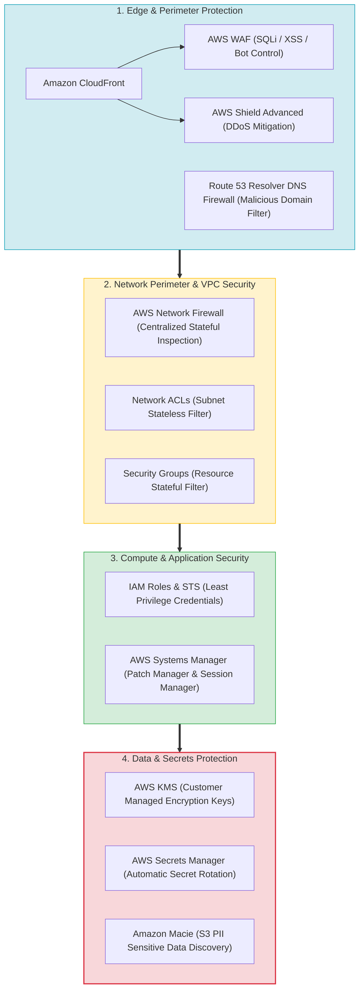
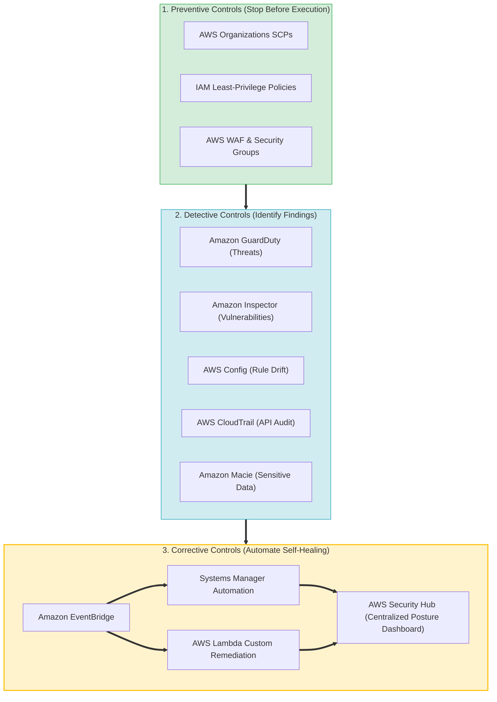
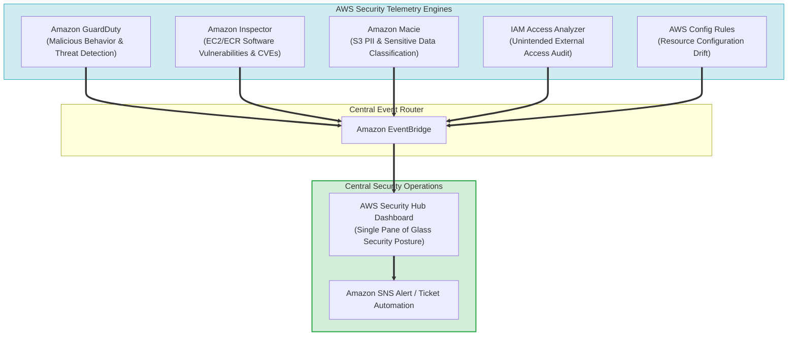
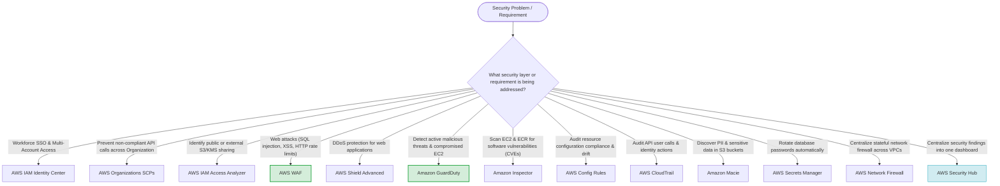

> [!NOTE]
> **Exam Mindset**: For the AWS Solutions Architect Professional (SAP-C02) and AI Practitioner (AIP-C01) exams, never evaluate security services as isolated products. Always process security architecture through the problem lifecycle:
> **Security Requirement** $\rightarrow$ **Threat Model** $\rightarrow$ **Security Control Type (Prevent / Detect / Correct)** $\rightarrow$ **AWS Service** $\rightarrow$ **Lowest Cost & Operational Overhead**.

---

## 1. AWS Multi-Layer Security & Defense in Depth Stack



---

## 2. Comprehensive Security Services Problem-to-Solution Matrix

| Security Problem | Primary Control Type | Target AWS Service | Key Exam Keyword Trigger |
| :--- | :--- | :--- | :--- |
| **Workforce SSO & Identity Access** | Prevention | **AWS IAM Identity Center** | *"Single sign-on across multiple AWS accounts"* |
| **Unintended External Resource Access**| Detection | **AWS IAM Access Analyzer** | *"Identify resources unintentionally shared externally"* |
| **Organization-Wide Permission Ceilings**| Prevention | **AWS Organizations SCPs** | *"Prevent users from performing actions across all accounts"* |
| **Application Layer Attacks (SQLi/XSS)**| Prevention | **AWS WAF** | *"Block SQL injection, XSS, & malicious HTTP requests"* |
| **DDoS Attack Mitigation** | Prevention | **AWS Shield Advanced** | *"Protect web application against DDoS attacks"* |
| **Intelligent Threat Detection** | Detection | **Amazon GuardDuty** | *"Detect compromised credentials & malicious behavior"* |
| **Software Vulnerability Scanning** | Detection | **Amazon Inspector** | *"Scan EC2 instances & ECR images for CVEs"* |
| **Centralized Security Posture** | Aggregation | **AWS Security Hub** | *"Centralize security findings across multiple services"* |
| **Resource Configuration Drift** | Detection | **AWS Config Rules** | *"Continuously evaluate configuration compliance"* |
| **API User & Identity Auditing** | Audit | **AWS CloudTrail** | *"Audit API activity & discover who deleted a resource"* |
| **Sensitive PII Discovery in S3** | Discovery | **Amazon Macie** | *"Discover sensitive PII data in Amazon S3 buckets"* |
| **Centralized Stateful VPC Firewall** | Prevention | **AWS Network Firewall** | *"Centralized stateful traffic inspection across VPCs"* |
| **Outbound DNS Malicious Filtering** | Prevention | **Route 53 Resolver DNS Firewall**| *"Block DNS resolution for known malicious domains"* |

---

## 3. Prevention vs. Detection vs. Remediation Lifecycle Workflow



---

## 4. Specialized Security Findings Aggregation Topology



> [!IMPORTANT]
> **Security Detector Triad: GuardDuty vs. Inspector vs. Config**:
> - **Amazon GuardDuty**: Detects **active threats and suspicious behavior** (e.g. compromised credentials, cryptomining, malicious IP communication).
> - **Amazon Inspector**: Scans workloads for **software vulnerabilities (CVEs) and package flaws** in EC2, ECR container images, and Lambda functions.
> - **AWS Config**: Evaluates **resource configuration drift** against defined compliance rules (e.g. unencrypted EBS volumes or open security groups).

---

## 5. Security Services Decision Matrix: GuardDuty vs. Inspector vs. Config vs. Security Hub

| Operational Question | Target Security Service |
| :--- | :--- |
| *"Is something malicious or suspicious happening right now?"* | **Amazon GuardDuty** |
| *"Does my workload have known software vulnerabilities (CVEs)?"* | **Amazon Inspector** |
| *"Is my resource configuration compliant with security policy?"* | **AWS Config Rules** |
| *"What is our overall enterprise security posture and consolidated findings?"* | **AWS Security Hub** |
| *"Is sensitive PII exposed or stored in S3?"* | **Amazon Macie** |
| *"Who called what AWS API action and from what IP address?"* | **AWS CloudTrail** |

---

## 6. SAP-C02 Security Solutions Master Selection Decision Engine



---

## 7. SAP-C02 Exam Keyword Cheat Sheet

```
"SQL injection or Cross-Site Scripting (XSS)"       ──> AWS WAF
"DDoS attack mitigation"                             ──> AWS Shield Advanced
"Detect malicious activity or compromised credentials"──> Amazon GuardDuty
"Scan EC2 & ECR for vulnerabilities (CVEs)"          ──> Amazon Inspector
"Consolidate security findings across services"     ──> AWS Security Hub
"Evaluate resource configuration compliance"         ──> AWS Config Rules
"Audit API calls & find who deleted an S3 bucket"    ──> AWS CloudTrail
"Discover sensitive PII data in S3"                  ──> Amazon Macie
"Single sign-on across multiple AWS accounts"        ──> AWS IAM Identity Center
"Identify unintended public or external resource sharing"──> AWS IAM Access Analyzer
"Centralized stateful traffic inspection in VPC"     ──> AWS Network Firewall
"Block outbound DNS queries to malicious domains"   ──> Route 53 Resolver DNS Firewall
```

---

## 8. Common SAP-C02 Exam Traps

1. **Trap 1: Selecting AWS WAF for DDoS Protection**: AWS WAF filters HTTP/HTTPS application-layer attacks (SQLi/XSS). For volumetric DDoS mitigation, choose **AWS Shield Advanced**.
2. **Trap 2: Confusing GuardDuty with Amazon Inspector**: GuardDuty detects *active malicious threats*; Inspector scans *software packages for known vulnerabilities (CVEs)*.
3. **Trap 3: Using Network Firewall when AWS WAF is Requested**: Network Firewall operates at IP/Port network layers across VPCs; AWS WAF operates specifically at HTTP/HTTPS web application layers.
4. **Trap 4: Deploying Every Security Service without a Specific Requirement**: The SAP exam rewards selecting the *minimal effective security architecture* matching the stated requirement.

---

## 9. Final Mental Model

`Prevent (IAM/SCP/WAF/Shield) ➔ Detect (GuardDuty/Inspector/Macie/Config/CloudTrail) ➔ Aggregated Posture (Security Hub) ➔ Remediate (SSM/Lambda)`