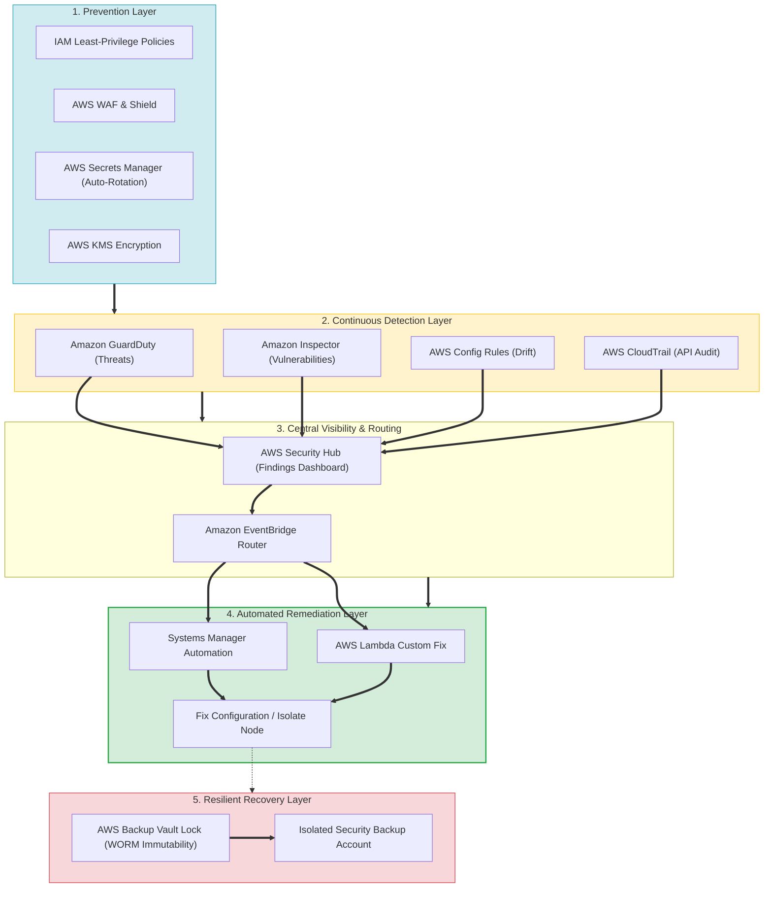
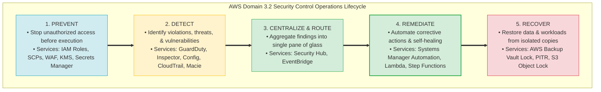
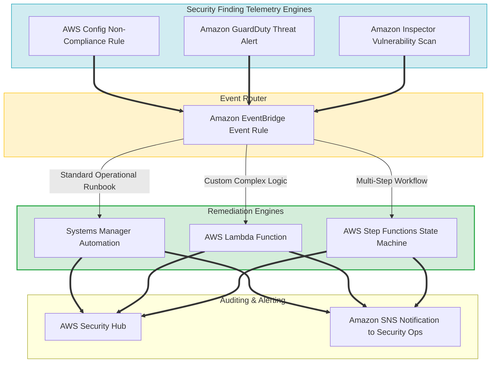
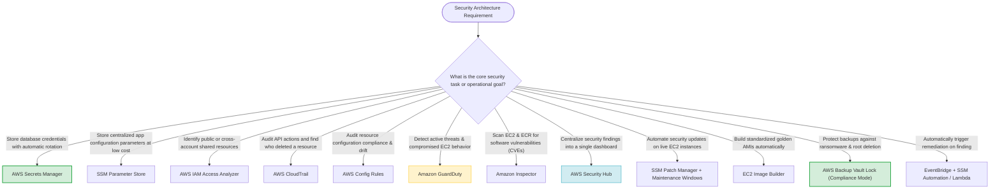

# Domain 3.2 Skills: Determine a Strategy to Improve Security — Comprehensive Review & Synthesis

> [!NOTE]
> **Exam Mindset**: For the AWS Solutions Architect Professional (SAP-C02) and AI Practitioner (AIP-C01) exams, Domain 3.2 synthesizes security architecture into five continuous operational phases:
> **PREVENT (IAM / KMS / WAF / Secrets Manager)** $\rightarrow$ **DETECT (GuardDuty / Inspector / Config / CloudTrail)** $\rightarrow$ **CENTRALIZE (Security Hub)** $\rightarrow$ **AUTOMATE REMEDIATION (EventBridge + SSM / Lambda)** $\rightarrow$ **RECOVER (AWS Backup Vault Lock / PITR)**.

---

## 1. End-to-End Enterprise Security Governance & Resiliency Architecture



---

## 2. Prevention vs Detection vs Remediation vs Recovery Lifecycle Spectrum



---

## 3. Core Domain 3.2 Security Services Master Comparison Matrix

| Security Service | Core Security Objective | Primary Operational Question Answered | Key Exam Trigger Keyword |
| :--- | :--- | :--- | :--- |
| **AWS Secrets Manager** | Secret Lifecycle & Auto-Rotation | *"How do I automatically rotate database credentials?"* | *"Automatic secret rotation / Database password"* |
| **SSM Parameter Store** | Centralized App Parameters | *"How do I store static app configuration at low cost?"* | *"Application configuration parameters / SecureString"* |
| **IAM Access Analyzer** | Least Privilege & Trust Audit | *"Are my resources accessible outside my organization?"* | *"Identify unintended external access"* |
| **AWS CloudTrail** | API User & Identity Auditing | *"Who deleted the S3 bucket or altered the security group?"*| *"Audit API calls / Who performed action"* |
| **Amazon GuardDuty** | Intelligent Threat Detection | *"Is there malicious activity or credential compromise?"* | *"Threat detection / Malicious IP / Cryptomining"* |
| **Amazon Inspector** | Software Vulnerability Scanning | *"Are there software CVE vulnerabilities in EC2/ECR?"* | *"Scan EC2/ECR for software vulnerabilities (CVEs)"* |
| **AWS Config Rules** | Configuration Drift & Compliance| *"Is resource configuration compliant with security rules?"* | *"Configuration drift / Encrypted EBS check"* |
| **AWS Security Hub** | Posture Management & Aggregation| *"What is our enterprise security posture dashboard?"* | *"Centralize security findings across services"* |
| **SSM Patch Manager** | OS Security Patching | *"How do I patch hundreds of EC2 instances on a schedule?"*| *"Scheduled EC2 OS security patching / Patch baseline"* |
| **EC2 Image Builder** | Automated Golden AMI Pipelines | *"How do I build standardized, pre-patched AMIs?"* | *"Golden AMI / Immutable infrastructure"* |
| **AWS Backup Vault Lock**| Ransomware & Immutability | *"How do I protect backups from deletion by root users?"* | *"Vault Lock / Immutable WORM backups"* |

---

## 4. Automated Event-Driven Security Remediation Topology



> [!IMPORTANT]
> **Detector Triad & Auditing Distinctions**:
> - **Amazon GuardDuty**: Detects **active malicious threats and anomalous behavior** (e.g. compromised IAM keys, cryptomining).
> - **Amazon Inspector**: Scans workloads for **software vulnerabilities (CVEs) and package flaws** in EC2, ECR, and Lambda.
> - **AWS Config**: Evaluates **resource configuration drift** against static policy rules.
> - **AWS CloudTrail**: Logs **API activity and user identity audit trails** (*Who performed what API action*).

---

## 5. Defense in Depth Across Application Layers

> [!TIP]
> **Layered Security Architecture (Defense in Depth)**:
> Combine multiple independent security boundaries so that a failure in one layer does not compromise the entire application:
> `Edge (CloudFront + WAF + Shield) ➔ VPC Network (Network Firewall + Security Groups) ➔ Compute (IAM Roles + SSM Session Manager) ➔ Data (KMS Encryption + Macie) ➔ Governance (CloudTrail + GuardDuty + Security Hub)`.

---

## 6. SAP-C02 Domain 3.2 Security Skills Master Selection Decision Engine



---

## 7. SAP-C02 Exam Keyword Cheat Sheet

```
"Automatic database password rotation"              ──> AWS Secrets Manager
"Store application config parameters at lowest cost"──> SSM Parameter Store
"Identify unintended public or external access"     ──> AWS IAM Access Analyzer
"Audit API calls and user identity activity"        ──> AWS CloudTrail
"Detect compromised credentials & threats"          ──> Amazon GuardDuty
"Scan EC2 and ECR for software vulnerabilities"      ──> Amazon Inspector
"Evaluate configuration compliance & drift"         ──> AWS Config Rules
"Consolidate security findings across services"     ──> AWS Security Hub
"Automate OS patching on live EC2 fleet"           ──> Systems Manager Patch Manager + Maintenance Windows
"Build standardized golden AMIs automatically"       ──> EC2 Image Builder
"Prevent backup deletion even by AWS root user"     ──> AWS Backup Vault Lock (Compliance Mode)
"Event-driven automated remediation"                ──> EventBridge + SSM Automation / Lambda
```

---

## 8. Common SAP-C02 Exam Traps

1. **Trap 1: GuardDuty vs. Inspector vs. Config Confusion**: GuardDuty detects *malicious behavior*; Inspector scans *software packages for CVEs*; Config checks *static resource configuration rules*.
2. **Trap 2: CloudTrail vs. CloudWatch Logs**: CloudTrail records *AWS API calls and identity audit trails*; CloudWatch monitors *application logs, performance metrics, and alarms*.
3. **Trap 3: Patch Manager vs. EC2 Image Builder**: Patch Manager updates *existing live EC2 instances*; Image Builder creates *new golden AMIs for immutable ASG deployments*.
4. **Trap 4: Secrets Manager vs. SSM Parameter Store**: Secrets Manager handles *credentials requiring native automatic rotation*; Parameter Store holds *static configuration parameters*.
5. **Trap 5: High Availability (Multi-AZ) vs. Backup**: Multi-AZ provides *hardware/AZ failover*, but synchronously replicates data corruption. Use **AWS Backup & PITR** for corruption recovery.

---

## 9. Final Mental Model

`Prevent (IAM/KMS/WAF/Secrets Manager) ➔ Detect (GuardDuty/Inspector/Config/CloudTrail) ➔ Centralize (Security Hub) ➔ Automate (EventBridge + SSM) ➔ Recover (AWS Backup Vault Lock)`