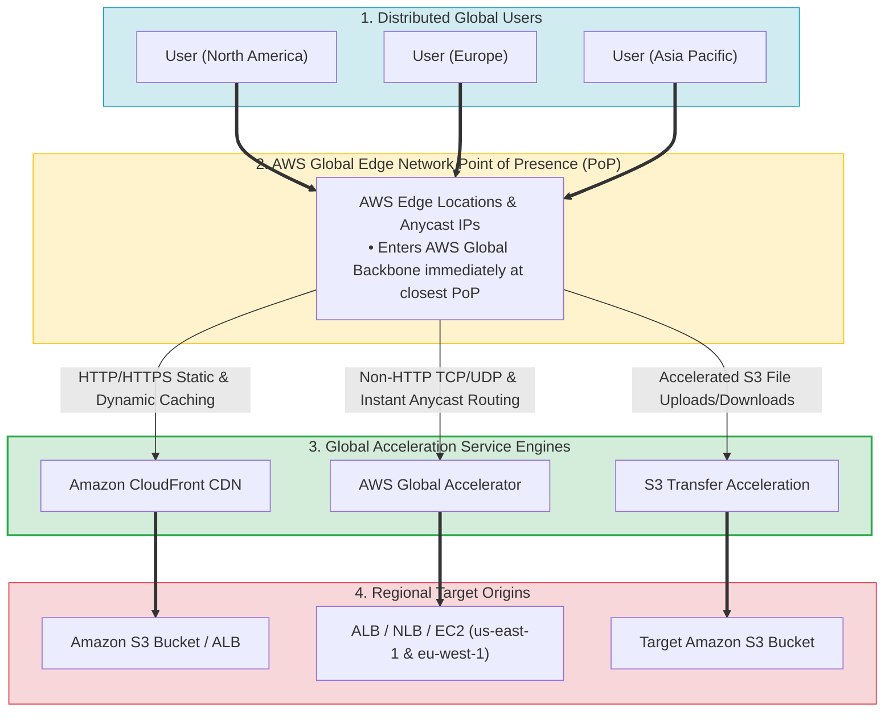
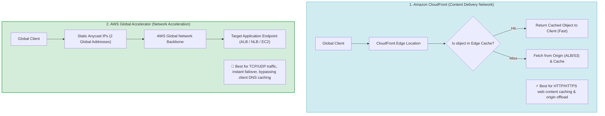
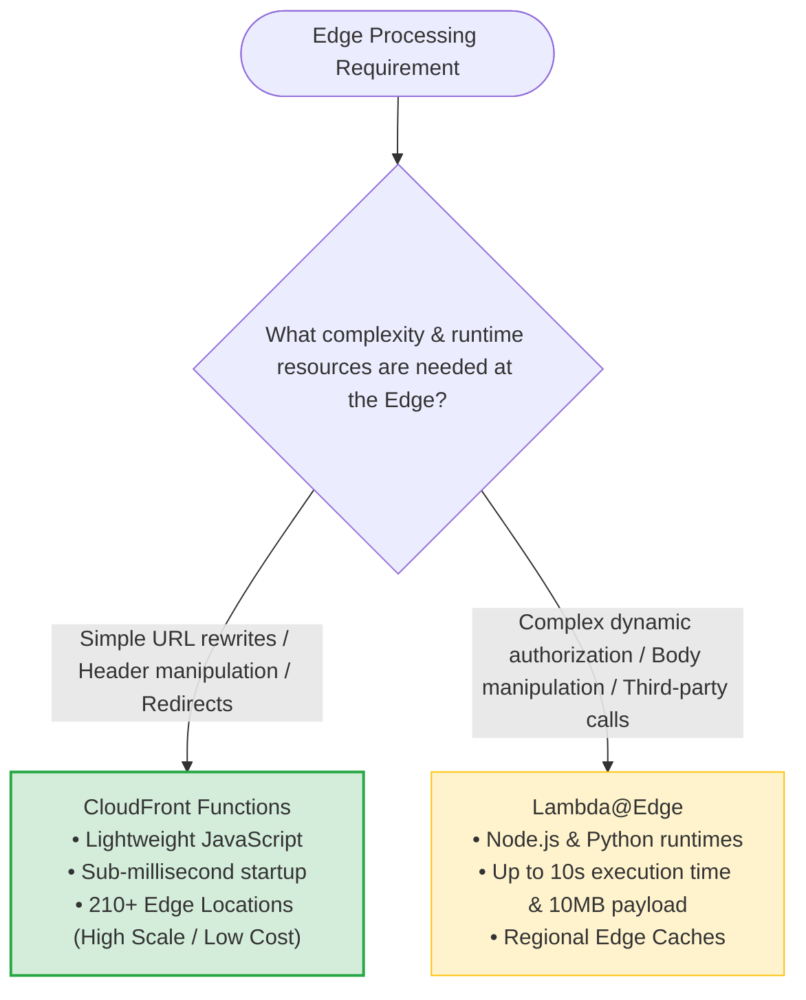
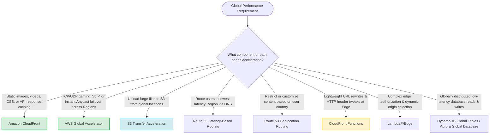

# Task 3.3: Determine a Strategy to Improve Performance — Global Service Offerings

> [!NOTE]
> **Exam Mindset**: For the AWS Solutions Architect Professional (SAP-C02) and AI Practitioner (AIP-C01) exams, global service offerings optimize user experience by moving traffic, content, compute, or data closer to global users:
> **User Location** $\rightarrow$ **Bottleneck Analysis (Network Latency / Caching / DNS Caching / Uploads)** $\rightarrow$ **Global Service Selection** $\rightarrow$ **Cost & Operational Overhead Optimization**.

---

## 1. AWS Global Network & Acceleration Architecture



---

## 2. CloudFront vs. AWS Global Accelerator Traffic Flow Comparison



---

## 3. Global Acceleration Services Breakdown Matrix

| Global Service | Traffic Protocol | Caching Capability | Key Architectural Benefit | Key Exam Keyword Trigger |
| :--- | :--- | :--- | :--- | :--- |
| **Amazon CloudFront** | HTTP / HTTPS | **Yes (Edge Caching)** | Caches static/dynamic web content near users | *"Cache static content / Reduce origin load / CDN"* |
| **AWS Global Accelerator** | TCP / UDP / HTTP | **No** | Static Anycast IPs; instant failover over AWS backbone | *"TCP/UDP acceleration / Static IP / Avoid DNS caching delays"* |
| **S3 Transfer Acceleration** | HTTP / HTTPS (S3) | **No** | Accelerates global file uploads to S3 via Edge PoPs | *"Upload large files to S3 globally / Long-distance transfer"* |
| **Route 53 Latency Routing**| DNS | **No** | Routes users to the AWS Region with lowest network latency | *"Route users to nearest Region based on network latency"* |
| **Route 53 Geolocation Routing**| DNS | **No** | Routes users based on geographic country or continent | *"Route users based on country / Content localization / Compliance"* |

---

## 4. Edge Computing Decision Matrix (CloudFront Functions vs. Lambda@Edge)



> [!IMPORTANT]
> **Bypassing Client DNS Caching Delays via Global Accelerator**:
> When an application requires **rapid failover or traffic shifting (blue/green)** between AWS Regions, standard Route 53 DNS weighted routing can be delayed by client DNS caching (TTL). **AWS Global Accelerator** provides **2 static Anycast IP addresses** and routes traffic inside the AWS global network backbone, performing endpoint health checks and traffic shifting within seconds without relying on client DNS cache expiration.

---

## 5. CloudFront Functions vs. Lambda@Edge Feature Comparison

| Feature / Capability | CloudFront Functions | Lambda@Edge |
| :--- | :--- | :--- |
| **Primary Use Case** | Simple URL rewrites, header tweaks, redirects | Complex authorization, body manipulation, origin selection |
| **Runtime Support** | Lightweight JavaScript (ECMAScript 5.1+) | Node.js, Python |
| **Execution Location** | 210+ CloudFront Edge Locations | Regional Edge Caches |
| **Execution Time Limit** | Sub-millisecond (< 1 ms) | Up to 5 seconds (Viewer) / 30 seconds (Origin) |
| **Network & File Access** | No network access, no body access | Full network access, body access allowed |
| **Cost & Scale** | Extremely low cost, high scale | Standard Lambda pricing tier |

---

## 6. Route 53 Latency Routing vs. Geolocation Routing

> [!TIP]
> **Latency vs. Geolocation Distinction**:
> - **Latency-Based Routing**: Sends the user to the AWS Region that provides the **lowest network latency** (measured via real-time latency probes).
> - **Geolocation Routing**: Sends the user to a specific endpoint based on their **geographic location (country, continent, or state)** regardless of latency. Use Geolocation for content licensing, language localization, or regulatory compliance.

---

## 7. SAP-C02 Global Service Offerings Master Selection Decision Engine



---

## 8. SAP-C02 Exam Keyword Cheat Sheet

```
"Cache static web content close to users"            ──> Amazon CloudFront
"Reduce origin load and bandwidth costs"            ──> Amazon CloudFront
"Non-HTTP / TCP / UDP traffic acceleration"         ──> AWS Global Accelerator
"Static Anycast IP addresses for multi-Region app"   ──> AWS Global Accelerator
"Rapid blue/green traffic shifting bypassing DNS"   ──> AWS Global Accelerator (Traffic Dials)
"Upload large files to S3 from global users"         ──> S3 Transfer Acceleration
"Route to nearest Region based on network latency"   ──> Route 53 Latency-Based Routing
"Route users based on country / legal compliance"    ──> Route 53 Geolocation Routing
"Lightweight URL rewrites at CloudFront Edge"        ──> CloudFront Functions
"Complex authorization & origin selection at Edge"   ──> Lambda@Edge
```

---

## 9. Common SAP-C02 Exam Traps

1. **Trap 1: Choosing Geolocation Routing when Lowest Latency is Requested**: Geolocation routes based on country boundaries, which may not always be the lowest latency path. For network latency, select **Latency-Based Routing**.
2. **Trap 2: Selecting Global Accelerator for Caching Static Web Content**: Global Accelerator does not cache content; it accelerates TCP/UDP network paths. For web caching, select **Amazon CloudFront**.
3. **Trap 3: Using Global Accelerator for S3 File Uploads**: For accelerating long-distance file transfers specifically to S3 buckets, select **S3 Transfer Acceleration**.
4. **Trap 4: Selecting Lambda@Edge for Simple Header Manipulation**: Lambda@Edge carries higher latency and cost. For simple header tweaks, URL rewrites, or redirects, select **CloudFront Functions**.

---

## 10. Final Mental Model

`Route (Route 53) ➔ Cache Content (CloudFront) ➔ Accelerate IP Network (Global Accelerator) ➔ Accelerate S3 Uploads (Transfer Acceleration) ➔ Process at Edge (CloudFront Functions / Lambda@Edge)`