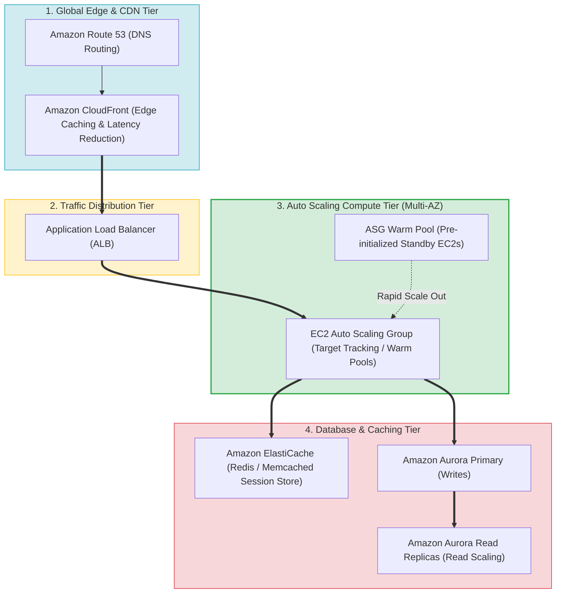
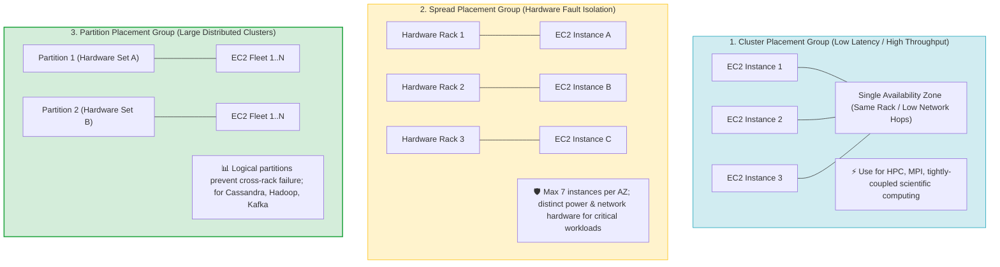
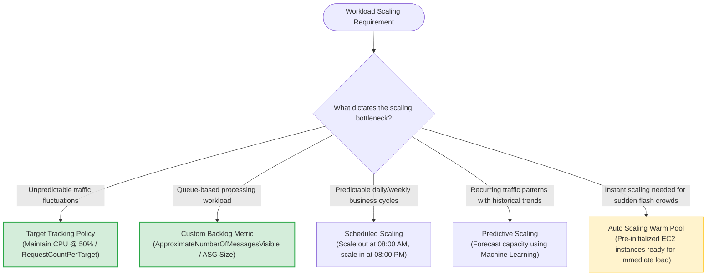
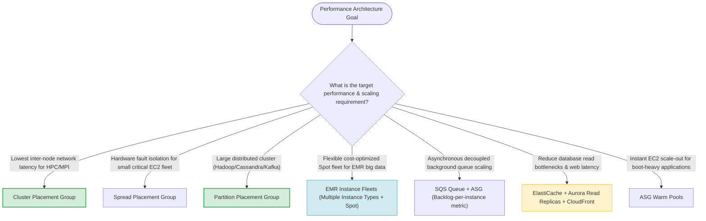

> [!NOTE]
> **Exam Mindset**: For the AWS Solutions Architect Professional (SAP-C02) and AI Practitioner (AIP-C01) exams, high-performing systems architectures optimize capacity, placement, and compute models to match actual workload bottlenecks:
> **Workload Pattern** $\rightarrow$ **Bottleneck Analysis (Compute / Latency / Database / Queue)** $\rightarrow$ **Scaling Mechanism** $\rightarrow$ **Physical Placement / Compute Type** $\rightarrow$ **Cost Efficiency**.

---

## 1. Multi-Tier Elastic Application & Caching Topology



---

## 2. EC2 Placement Groups Physical Positioning Matrix



---

## 3. Placement Groups Feature & Use Case Comparison Matrix

| Placement Group Type | Physical Hardware Placement | Primary Architectural Purpose | Ideal Workload Use Case | Key Exam Trigger Keyword |
| :--- | :--- | :--- | :--- | :--- |
| **Cluster Placement Group** | Packed tightly inside a single AZ (Same Rack) | **Lowest inter-node latency & highest throughput** | HPC, MPI, high-performance distributed simulations | *"Low network latency between instances / HPC / MPI"* |
| **Spread Placement Group** | Placed on distinct physical hardware racks | **Strict hardware fault isolation (Max 7 per AZ)** | Critical small EC2 fleet (master nodes, firewalls) | *"Critical instances must not share underlying hardware"* |
| **Partition Placement Group**| Grouped into logical hardware partitions | **Prevents cross-partition hardware failures at scale**| Large distributed workloads (Hadoop, Cassandra, Kafka) | *"Large distributed application / HDFS / Cassandra"* |

---

## 4. Auto Scaling Policy & Metric Selection Engine



> [!IMPORTANT]
> **Queue-Based Scaling Rule (SQS Backlog Metric)**:
> For asynchronous worker fleets consuming from Amazon SQS, scaling based solely on **CPU utilization is an anti-pattern**. Instead, scale the Auto Scaling Group using a custom CloudWatch metric: **Backlog Per Instance** $\left(\frac{\text{ApproximateNumberOfMessagesVisible}}{\text{ASG Capacity}}\right)$ to maintain consistent processing SLAs.

---

## 5. Auto Scaling Policy Types Breakdown

| Policy Type | Operational Behavior | Target Use Case |
| :--- | :--- | :--- |
| **Target Tracking Scaling** | Automatically adjusts capacity to maintain metric target (e.g., 50% CPU) | General web applications with variable load |
| **Step Scaling** | Scales capacity in steps based on predefined threshold breaches | Sudden, severe traffic spikes requiring scaled responses |
| **Scheduled Scaling** | Scales capacity at specific dates/times based on predictable schedules | Known business cycles (e.g. 9 AM start of business) |
| **Predictive Scaling** | Uses Machine Learning on historical trends to scale out proactively before load arrives | Recurring daily or weekly traffic cycles |
| **Warm Pools** | Keeps pre-initialized EC2 instances in Stopped/Running state | Applications with long boot/initialization times |

---

## 6. Instance Fleets & Spot Optimization for EMR & Big Data

> [!TIP]
> **EMR Instance Fleets for Maximum Capacity & Cost Efficiency**:
> For Amazon EMR big data clusters, use **Instance Fleets** rather than uniform instance groups. Instance Fleets allow specifying up to **5 instance types per node type** across On-Demand and Spot instances, maximizing capacity availability and reducing Spot interruption risks.

---

## 7. SAP-C02 High-Performance Architecture Master Selection Decision Engine



---

## 8. SAP-C02 Exam Keyword Cheat Sheet

```
"Lowest network latency between instances"           ──> Cluster Placement Group
"High network throughput for HPC / MPI"              ──> Cluster Placement Group
"Critical instances must not share underlying hardware"──> Spread Placement Group (Max 7 per AZ)
"Large distributed application (Hadoop / Cassandra)" ──> Partition Placement Group
"Predictable traffic spike every morning at 8 AM"    ──> Scheduled Scaling
"Predict capacity using historical ML patterns"      ──> Predictive Scaling
"Scale workers based on SQS queue size"             ──> Custom Metric: Backlog Per Instance
"Reduce application boot/startup latency during scale"──> Auto Scaling Warm Pools
"Flexible capacity across multiple instance types"   ──> EMR Instance Fleets / ASG Mixed Instances Policy
```

---

## 9. Common SAP-C02 Exam Traps

1. **Trap 1: Confusing Cluster Placement Groups with Spread Placement Groups**: Cluster groups pack instances *together* for low network latency; Spread groups push instances *apart* onto distinct hardware for fault isolation.
2. **Trap 2: Using CPU Utilization for SQS Queue Worker Scaling**: When scaling worker fleets processing queue messages, CPU does not reflect queue depth. Always scale using **Backlog Per Instance**.
3. **Trap 3: Attempting to Deploy Spread Placement Groups for Hundreds of Instances**: Spread placement groups are limited to **7 instances per AZ**. For large distributed fleets, use **Partition Placement Groups**.
4. **Trap 4: Scaling Up (Vertical) Instead of Scaling Out (Horizontal) for Web Fleets**: Scaling up a single EC2 instance creates a single point of failure and hard limits. For stateless web workloads, always **scale out horizontally**.

---

## 10. Final Mental Model

`Identify Bottleneck (Compute/Latency/Queue) ➔ Choose Placement (Cluster/Spread/Partition) ➔ Choose Policy (Target/Scheduled/Warm Pool) ➔ Scale Out`