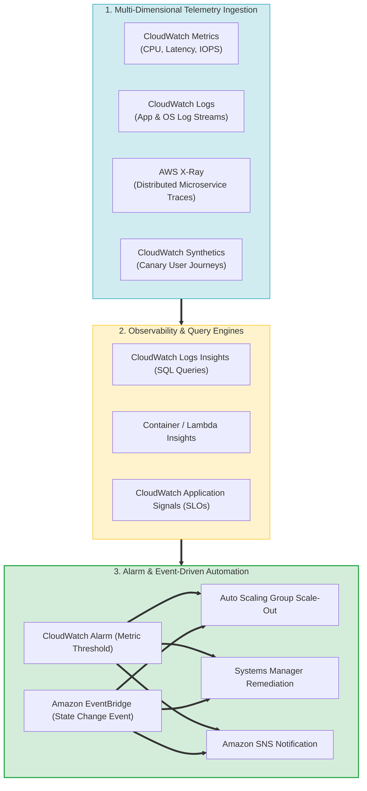
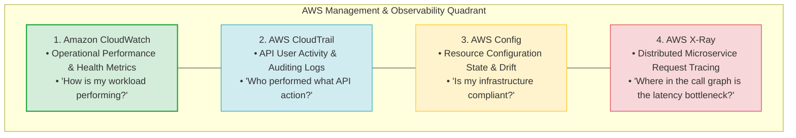
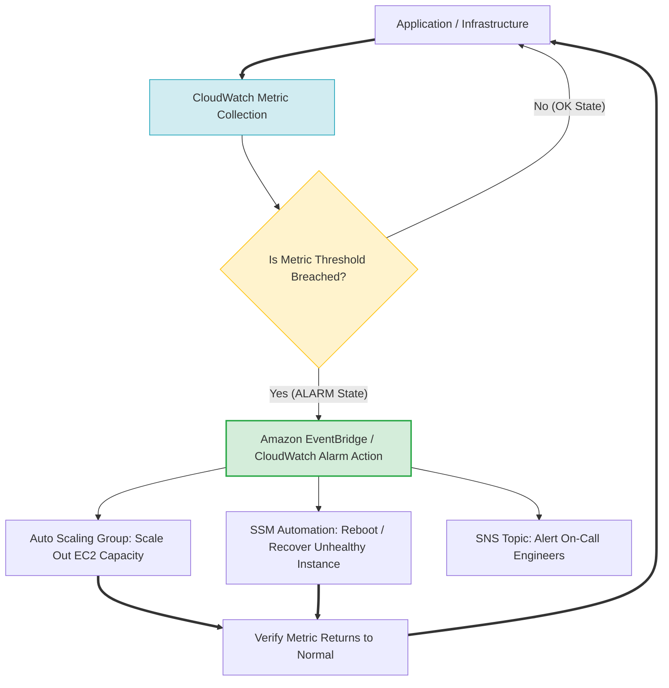
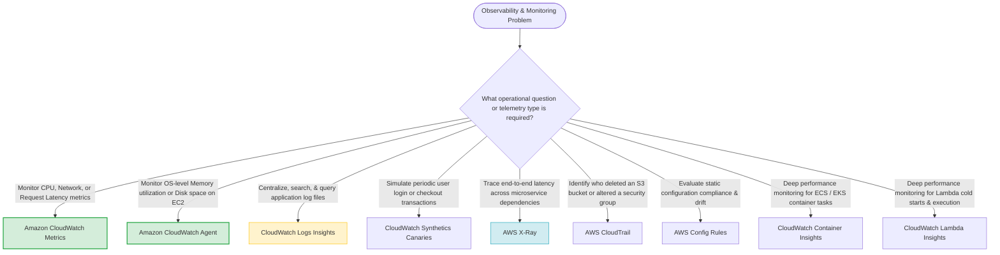

# Task 3.3: Determine a Strategy to Improve Performance — Monitoring Tool Sets and Services

> [!NOTE]
> **Exam Mindset**: For the AWS Solutions Architect Professional (SAP-C02) and AI Practitioner (AIP-C01) exams, monitoring is a continuous feedback loop:
> **Observe (CloudWatch Metrics / Logs / Traces)** $\rightarrow$ **Detect (CloudWatch Alarms / EventBridge)** $\rightarrow$ **Diagnose (Logs Insights / X-Ray)** $\rightarrow$ **Remediate (Auto Scaling / Systems Manager Automation)**.

---

## 1. End-to-End Enterprise Observability & Response Architecture



---

## 2. CloudWatch vs. CloudTrail vs. AWS Config vs. X-Ray Matrix



---

## 3. Observability & Management Service Comparison Matrix

| Service | Primary Observability Domain | Operational Question Answered | Key Exam Trigger Keyword |
| :--- | :--- | :--- | :--- |
| **Amazon CloudWatch** | Operational Performance & Metrics | *"How is my workload performing & saturation level?"* | *"CPU utilization / Memory agent / Application logs"* |
| **AWS CloudTrail** | API User Activity & Identity Audit | *"Who called what AWS API action & from where?"* | *"Audit API calls / Who deleted the resource"* |
| **AWS Config** | Configuration Compliance & Drift | *"Is resource configuration compliant with policy?"* | *"Configuration drift / Encrypted volume check"* |
| **AWS X-Ray** | Distributed Request Tracing | *"Where in the microservice call graph is the latency bottleneck?"*| *"Trace microservices / End-to-end request latency"* |
| **CloudWatch Synthetics**| Synthetic Canary Monitoring | *"Can a user successfully log in and complete a purchase?"*| *"Simulate user behavior / Canary / User journey"* |

---

## 4. Automated Monitoring & Self-Healing Feedback Loop Topology



> [!IMPORTANT]
> **EC2 Default Metrics vs. CloudWatch Agent**:
> Standard EC2 metrics gathered by AWS hypervisors include **CPU utilization, disk I/O, and network throughput**. Hypervisors **cannot observe OS-level Memory utilization or OS swap space**.
> To collect **Memory Utilization or Disk Space Used** from an EC2 instance, you must install and configure the **Amazon CloudWatch Agent**.

---

## 5. Specialized CloudWatch Feature Capabilities

| Specialized Sub-Service | Core Functionality | Primary Workload Focus |
| :--- | :--- | :--- |
| **CloudWatch Logs Insights** | Fast, interactive SQL-like log query & analytics engine | Searching millions of log events for HTTP 500 errors |
| **Container Insights** | Deep metric collection & diagnostic telemetry | Amazon ECS tasks, Amazon EKS pods, Kubernetes clusters |
| **Lambda Insights** | Detailed execution telemetry (cold starts, memory, CPU) | AWS Lambda serverless function optimization |
| **CloudWatch Synthetics** | Scripted Canaries (Node.js/Python) running 24/7 | Testing UI user journeys and API endpoint SLAs |
| **Application Signals** | Automated Service Level Objectives (SLOs) & dependency maps | Tracking application health against business SLAs |

---

## 6. CloudWatch Alarms vs. Amazon EventBridge Triggers

> [!TIP]
> **Metric Alarms vs. Event Triggers**:
> - **CloudWatch Alarms**: Triggered when a **numerical metric breaches a threshold over time** (e.g., `CPUUtilization > 80%` for 5 consecutive minutes).
> - **Amazon EventBridge Rules**: Triggered by **state-change events** occurring in near-real-time (e.g., `EC2 Instance State-change Notification` to `terminated` or `AWS GuardDuty Finding`).

---

## 7. SAP-C02 Observability & Monitoring Master Selection Decision Engine



---

## 8. SAP-C02 Exam Keyword Cheat Sheet

```
"Monitor EC2 memory or disk utilization"            ──> CloudWatch Agent
"Query and analyze millions of log lines"           ──> CloudWatch Logs Insights
"Simulate user login or checkout flow"               ──> CloudWatch Synthetics Canaries
"Trace request latency across microservices"        ──> AWS X-Ray
"Audit API calls and discover who deleted a resource"──> AWS CloudTrail
"Check if resources comply with security rules"     ──> AWS Config Rules
"Monitor ECS tasks or EKS pod performance"          ──> CloudWatch Container Insights
"Monitor Lambda cold starts and execution memory"   ──> CloudWatch Lambda Insights
"Trigger action when metric breaches threshold"     ──> CloudWatch Alarm
"Trigger action when AWS service state changes"     ──> Amazon EventBridge Rule
```

---

## 9. Common SAP-C02 Exam Traps

1. **Trap 1: Confusing CloudWatch with CloudTrail**: CloudWatch monitors *operational health and performance metrics*; CloudTrail logs *API activity and identity audit trails* (*Who called what API*).
2. **Trap 2: Expecting EC2 Default Metrics to Provide Memory Usage**: Hypervisors cannot inspect OS RAM. To monitor memory utilization, install the **CloudWatch Agent**.
3. **Trap 3: Using CloudWatch to Trace Microservice Bottlenecks**: CloudWatch measures aggregate service metrics; it cannot pinpoint which specific downstream API call delayed a request. Use **AWS X-Ray** for distributed tracing.
4. **Trap 4: Confusing CloudWatch Alarms with EventBridge Rules**: CloudWatch Alarms evaluate *metric threshold over time*; EventBridge reacts to *near-real-time state events*.

---

## 10. Final Mental Model

`Observe Metrics/Logs (CloudWatch) ➔ Trace Latency (X-Ray) ➔ Audit API Calls (CloudTrail) ➔ Check Drift (Config) ➔ Alarm & Act (EventBridge/SSM)`