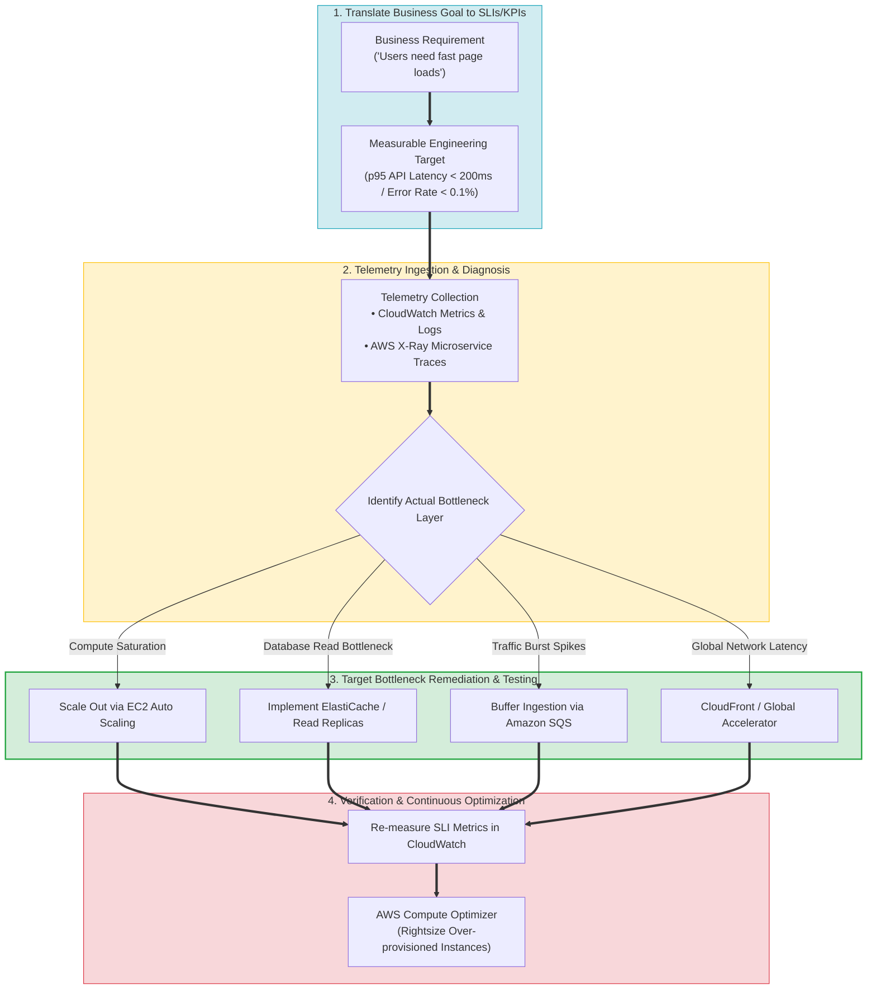
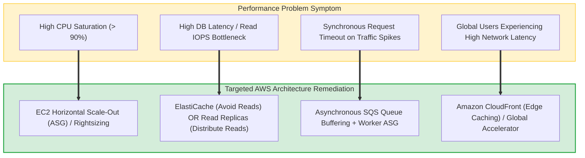
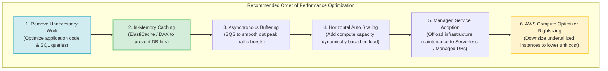
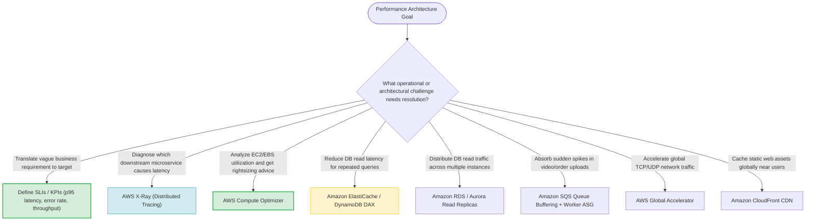

# Domain 3.3 Skills: Determine a Strategy to Improve Performance — Comprehensive Review & Synthesis

> [!NOTE]
> **Exam Mindset**: For the AWS Solutions Architect Professional (SAP-C02) and AI Practitioner (AIP-C01) exams, Domain 3.3 performance optimization follows a strict analytical workflow:
> **Business Requirement** $\rightarrow$ **Measurable Target (SLIs/KPIs)** $\rightarrow$ **Bottleneck Analysis (CloudWatch / X-Ray)** $\rightarrow$ **Targeted Remediation (Scale / Cache / Buffer)** $\rightarrow$ **Benchmarking & Testing** $\rightarrow$ **Compute Optimizer Rightsizing**.

---

## 1. End-to-End Performance Measurement & Optimization Lifecycle



---

## 2. Performance Bottleneck Identification & Remediation Matrix



---

## 3. Core Domain 3.3 Performance Architecture Comparison Breakdown

| Performance Strategy | Architectural Mechanism | Primary Bottleneck Solved | Key Exam Keyword Trigger |
| :--- | :--- | :--- | :--- |
| **In-Memory Caching** | **Amazon ElastiCache / DAX** | Database read latency & query saturation | *"Repeated database reads / Sub-millisecond latency"* |
| **Read Replication** | **RDS / Aurora Read Replicas** | High database read volume across multiple nodes | *"Distribute database read traffic / Read throughput"* |
| **Asynchronous Buffering** | **Amazon SQS + Worker ASG** | Traffic spikes overwhelming synchronous processing | *"Sudden traffic bursts / Decouple ingestion from processing"* |
| **Horizontal Auto Scaling** | **EC2 Auto Scaling / Warm Pools** | Compute capacity limits & variable demand | *"Elastic capacity / Unpredictable traffic"* |
| **Global Network Acceleration**| **AWS Global Accelerator / CloudFront**| High network latency for globally distributed users | *"Global users / Static Anycast IP / Edge caching"* |
| **Workload Rightsizing** | **AWS Compute Optimizer** | Over-provisioned compute/storage wasting cost | *"Analyze utilization & recommend optimal instance type"* |

---

## 4. Cost-Effective Architectural Optimization Hierarchy



> [!IMPORTANT]
> **Measure First - Never Guess Bottlenecks**:
> Never resolve a performance issue by blindly increasing EC2 instance sizes. Always measure the architecture first using **CloudWatch Metrics** and **AWS X-Ray**. If the bottleneck is database read latency, increasing EC2 instance size will add cost without improving performance.

---

## 5. Caching vs. Read Replicas: ElastiCache vs. RDS Read Replicas

| Feature / Metric | Amazon ElastiCache (Redis/Memcached) | Amazon RDS / Aurora Read Replicas |
| :--- | :--- | :--- |
| **Primary Mechanism** | In-memory key-value cache (avoids DB hits) | Additional database instances (distributes DB read query load) |
| **Latency Profile** | Sub-millisecond response time | Millisecond query response time |
| **Data Invalidation** | Requires application cache eviction logic | Asynchronous replication from primary DB |
| **Best Used For** | Frequently accessed session data, static lookup tables | Complex relational queries, analytical reporting |

---

## 6. SAP-C02 Domain 3.3 Performance Skills Master Selection Decision Engine



---

## 7. SAP-C02 Exam Keyword Cheat Sheet

```
"Translate business goals into technical metrics"    ──> Define p95/p99 Latency, Error Rate, & Throughput KPIs
"Diagnose microservice dependency latency"           ──> AWS X-Ray Distributed Tracing
"Analyze EC2/EBS utilization & recommend right size" ──> AWS Compute Optimizer
"Sub-millisecond latency for repeated database reads"──> Amazon ElastiCache / DynamoDB DAX
"Scale database read capacity across instances"      ──> Amazon RDS / Aurora Read Replicas
"Buffer sudden traffic spikes without dropping data" ──> Amazon SQS Queue Buffering + Worker ASG
"Accelerate global TCP/UDP network traffic"          ──> AWS Global Accelerator
"Cache web assets at Edge near global users"         ──> Amazon CloudFront CDN
"Horizontal scale out over vertical scale up"       ──> EC2 Auto Scaling Group for Stateless Apps
```

---

## 8. Common SAP-C02 Exam Traps

1. **Trap 1: Scaling Up EC2 Instances to Fix Database Latency**: Increasing EC2 instance size does not resolve database query bottlenecks. Use **ElastiCache, Read Replicas, or Query Optimization**.
2. **Trap 2: Confusing ElastiCache with RDS Read Replicas**: ElastiCache *prevents queries from hitting the database*; Read Replicas *distribute query execution across additional DB nodes*.
3. **Trap 3: Scaling SQS Queue Workers Based on CPU Utilization**: SQS queue workers should be scaled based on the **Backlog Per Instance metric** (`ApproximateNumberOfMessagesVisible`), not CPU.
4. **Trap 4: Using Average Latency Instead of p95/p99**: Average latency hides performance outliers. Evaluate performance against **p95 and p99 latency metrics**.

---

## 9. Final Mental Model

`Define Target (p95 Latency/KPIs) ➔ Measure Bottleneck (CloudWatch/X-Ray) ➔ Optimize (Cache/Buffer/Scale) ➔ Rightsize (Compute Optimizer)`