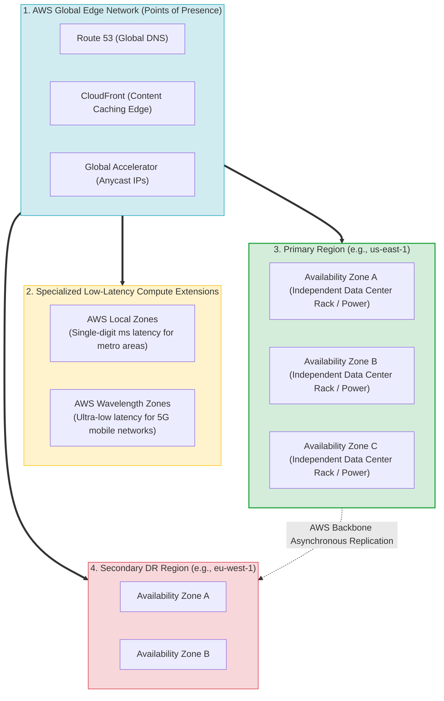
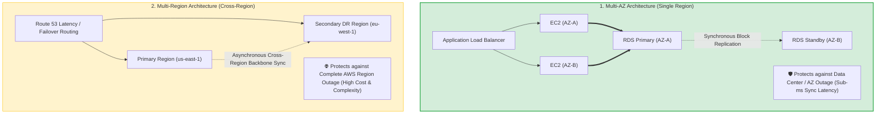
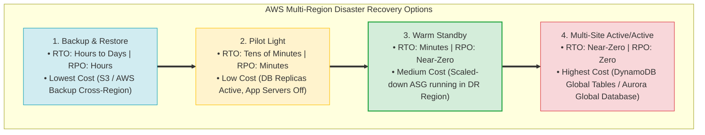
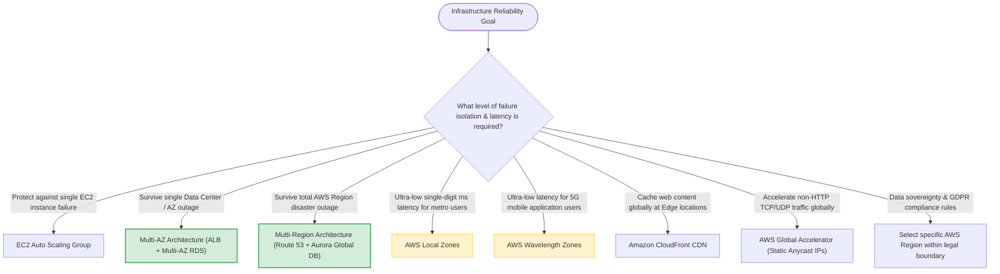

# Task 3.4: Determine a Strategy to Improve Reliability — AWS Global Infrastructure

> [!NOTE]
> **Exam Mindset**: For the AWS Solutions Architect Professional (SAP-C02) and AI Practitioner (AIP-C01) exams, AWS Global Infrastructure represents physical failure domain boundaries:
> **Failure Boundary Analysis (Instance $\rightarrow$ AZ $\rightarrow$ Region $\rightarrow$ Global Network)** $\rightarrow$ **RTO / RPO Business Targets** $\rightarrow$ **Failure Resiliency Design** $\rightarrow$ **Cost & Compliance Balancing**.

---

## 1. AWS Global Infrastructure Hierarchy & Failure Domains



---

## 2. Multi-AZ Availability vs. Multi-Region Resiliency Matrix



---

## 3. AWS Infrastructure Components Comparison Breakdown

| Infrastructure Component | Physical Scope & Design | Key Architectural Purpose | Ideal Workload Use Case | Key Exam Trigger Keyword |
| :--- | :--- | :--- | :--- | :--- |
| **AWS Region** | Separate physical geography with $\ge 3$ AZs | **Regional disaster isolation & data sovereignty** | Base deployment for all enterprise application workloads | *"Survive complete Region failure / Data residency"* |
| **Availability Zone (AZ)**| 1+ discrete data centers with independent power | **High availability & data center fault isolation** | Multi-AZ load balancing, EC2 ASG, Multi-AZ RDS | *"Survive data center failure / Single AZ outage"* |
| **Edge Location / PoP** | Global network entry points for AWS backbone | **Low-latency content delivery & network entry** | CloudFront CDN, Route 53 DNS, S3 Transfer Acceleration | *"Cache content close to users / CDN"* |
| **AWS Local Zone** | AWS compute/storage placed in major metro areas | **Single-digit ms latency for local metro workloads** | Real-time gaming, media rendering, local desktop apps | *"Single-digit millisecond latency in specific metro area"* |
| **AWS Wavelength** | AWS infrastructure embedded in 5G telco networks| **Ultra-low latency for 5G mobile applications** | Connected vehicles, mobile AR/VR, smart factory IoT | *"5G network ultra-low latency"* |

---

## 4. Disaster Recovery Strategy Spectrum (RTO/RPO vs. Cost)



> [!IMPORTANT]
> **Data Residency & Compliance Overrides Latency**:
> Selecting an AWS Region is governed first by **legal compliance, data sovereignty, and regulatory requirements** (e.g., GDPR requiring customer data to remain within the EU). Never choose a secondary DR Region outside legal boundaries purely for lower network latency.

---

## 5. Multi-AZ vs. Multi-Region Architectural Trade-Off Matrix

| Metric / Dimension | Multi-AZ Architecture (Single Region) | Multi-Region Architecture (Cross-Region) |
| :--- | :--- | :--- |
| **Failure Protection** | Physical Data Center / Availability Zone failure | Complete AWS Region disaster or outage |
| **Replication Latency** | Synchronous sub-millisecond block/database sync | Asynchronous cross-region network sync |
| **Operational Overhead** | Low to Moderate (handled automatically by AWS) | High (requires cross-region state & failover logic) |
| **Data Consistency** | Strong consistency supported | Eventual consistency / replication lag handling required |
| **Relative Infrastructure Cost** | Moderate | High (duplicate capacity & cross-region data transfer) |

---

## 6. Route 53 Latency Routing vs. Geolocation Routing

> [!TIP]
> **Routing Policy Distinction**:
> - **Route 53 Latency-Based Routing**: Directs users to the AWS Region that offers the **lowest network latency** based on real-time latency probes.
> - **Route 53 Geolocation Routing**: Directs users based on their **geographic origin (country/continent)** for content localization or legal compliance, regardless of latency.

---

## 7. SAP-C02 Global Infrastructure Master Selection Decision Engine



---

## 8. SAP-C02 Exam Keyword Cheat Sheet

```
"Survive single data center failure"                ──> Multi-AZ Architecture (ALB + ASG + Multi-AZ RDS)
"Survive complete AWS Region disaster"              ──> Multi-Region Architecture (Route 53 + Cross-Region Replication)
"Single-digit millisecond latency in specific city"  ──> AWS Local Zones
"Ultra-low latency for 5G mobile applications"      ──> AWS Wavelength Zones
"Cache static web content globally near users"       ──> Amazon CloudFront Edge Locations
"Accelerate TCP/UDP traffic with static Anycast IP"  ──> AWS Global Accelerator
"Route users to nearest Region based on latency"     ──> Route 53 Latency-Based Routing
"Route users based on geographic country/compliance" ──> Route 53 Geolocation Routing
"Lowest-cost disaster recovery strategy"             ──> Backup & Restore (AWS Backup / S3 CRR)
"Near-zero downtime disaster recovery strategy"     ──> Multi-Site Active/Active (DynamoDB Global Tables)
```

---

## 9. Common SAP-C02 Exam Traps

1. **Trap 1: Believing Multi-AZ Protects Against Regional Outages**: Multi-AZ only protects against data center failure within a single Region. For regional disasters, select **Multi-Region**.
2. **Trap 2: Confusing Edge Locations with AWS Local Zones**: Edge Locations cache CDN content; **Local Zones** run EC2/EBS compute workloads in metro areas.
3. **Trap 3: Assuming Geolocation Routing Always Provides Lowest Latency**: Geolocation routes by country boundaries. For lowest network latency, select **Latency-Based Routing**.
4. **Trap 4: Selecting Active/Active Multi-Region for High RTO/RPO Targets**: If the business accepts hours of downtime (high RTO), Active/Active adds unnecessary cost. Select **Backup & Restore or Pilot Light**.

---

## 10. Final Mental Model

`Define Failure Domain (Instance ➔ AZ ➔ Region) ➔ Match RTO/RPO Targets ➔ Balance Latency vs Compliance ➔ Optimize Infrastructure Cost`