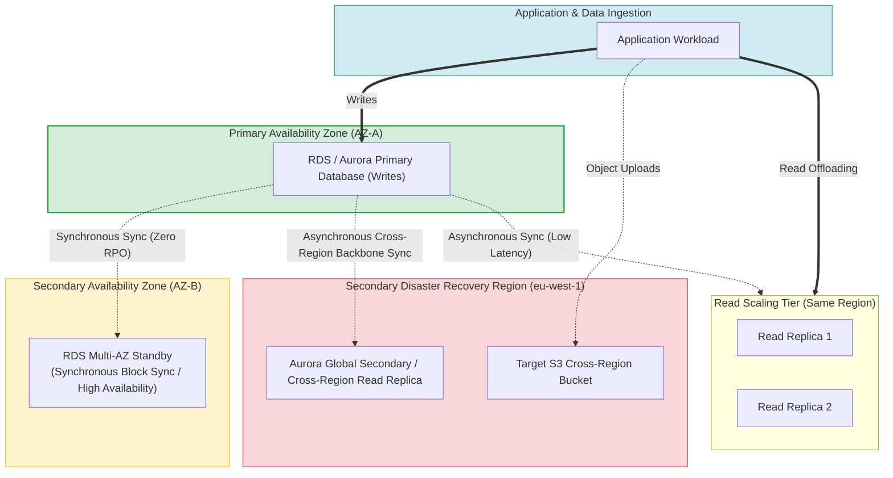
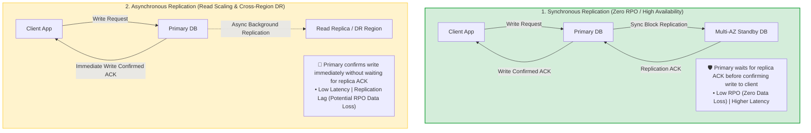
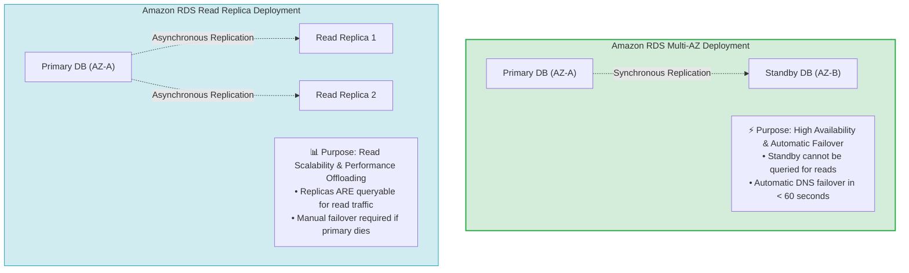
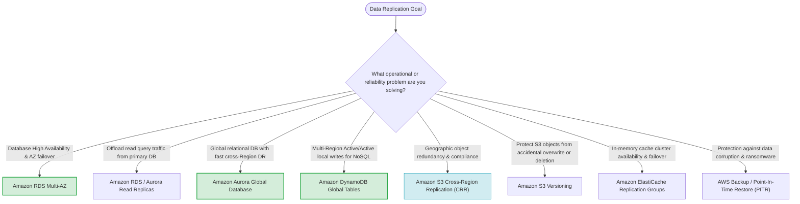

# Task 3.4: Determine a Strategy to Improve Reliability — Data Replication Methods

> [!NOTE]
> **Exam Mindset**: For the AWS Solutions Architect Professional (SAP-C02) and AI Practitioner (AIP-C01) exams, data replication is a reliability decision first, and a database feature second:
> **Target Requirement (Read Scaling vs. HA vs. DR)** $\rightarrow$ **Replication Synchronization Mode (Synchronous vs. Asynchronous)** $\rightarrow$ **AWS Service Mechanism** $\rightarrow$ **Cost & Lag Trade-off**.

---

## 1. Data Replication Topology & Service Architecture



---

## 2. Synchronous vs. Asynchronous Replication Comparison



---

## 3. Replication Requirement & AWS Service Selection Matrix

| Architectural Goal | Target Replication Mode | Recommended AWS Service | Key Exam Keyword Trigger |
| :--- | :--- | :--- | :--- |
| **Availability Zone High Availability** | **Synchronous Replication** | Amazon RDS Multi-AZ / Aurora Storage | *"Survive AZ failure / Automatic DB failover"* |
| **Read Scalability & Query Offload** | **Asynchronous Replication** | RDS Read Replicas / Aurora Replicas | *"Improve database read performance / Read-heavy"* |
| **Global Relational DR & Reads** | **Asynchronous Cross-Region**| Amazon Aurora Global Database | *"Global relational database / Cross-Region DR"* |
| **Multi-Region Active/Active Writes** | **Multi-Master Asynchronous**| Amazon DynamoDB Global Tables | *"Local writes in multiple Regions / Multi-active"* |
| **Geographic Object Redundancy** | **Asynchronous Object Sync** | Amazon S3 Cross-Region Replication | *"Replicate S3 bucket objects to another Region"* |
| **Protection Against Accidental Deletion**| **Versioning / Point-in-Time** | S3 Versioning / AWS Backup PITR | *"Protect against accidental deletion or corruption"* |

---

## 4. Multi-AZ (Availability) vs. Read Replicas (Scalability) Spectrum



> [!IMPORTANT]
> **Replication vs. Backups Distinction**:
> **Replication** protects against *hardware or infrastructure availability failures* by maintaining live copies.
> **Backups** protect against *logical data corruption, accidental deletion, and ransomware* by maintaining isolated point-in-time snapshots. Replication will immediately replicate corrupted or deleted data to standby copies.

---

## 5. Amazon RDS Multi-AZ vs. Read Replicas Feature Comparison

| Feature / Dimension | Amazon RDS Multi-AZ | Amazon RDS Read Replicas |
| :--- | :--- | :--- |
| **Primary Architectural Purpose** | High Availability & AZ Disaster Recovery | Read Scalability & Read Query Offloading |
| **Synchronization Type** | Synchronous block-level replication | Asynchronous database engine replication |
| **Query Capability** | Standby instance **CANNOT** accept read traffic | Replicas **CAN** accept read queries |
| **Failover Behavior** | Automatic DNS endpoint failover (< 60s) | Manual promotion required to become primary |
| **Region Scope** | Strictly Single-Region (Across 2 AZs) | Same-Region or Cross-Region supported |

---

## 6. Global Database Architecture: Aurora Global DB vs. DynamoDB Global Tables

> [!TIP]
> **Global Database Selection Rule**:
> - **Amazon Aurora Global Database**: Relational database (SQL) with a single primary write Region and up to 5 read-only secondary Regions (sub-second cross-region replication lag).
> - **Amazon DynamoDB Global Tables**: NoSQL database supporting **multi-region active-active writes**, allowing clients anywhere in the world to perform local low-latency reads and writes.

---

## 7. SAP-C02 Data Replication Master Selection Decision Engine



---

## 8. SAP-C02 Exam Keyword Cheat Sheet

```
"Automatic database failover during AZ outage"      ──> Amazon RDS Multi-AZ
"Offload read traffic from primary database"        ──> Amazon RDS / Aurora Read Replicas
"Global relational database with fast DR"           ──> Amazon Aurora Global Database
"Multi-Region active-active writes for NoSQL"       ──> Amazon DynamoDB Global Tables
"Replicate S3 objects to a secondary Region"        ──> Amazon S3 Cross-Region Replication (CRR)
"Protect S3 objects against accidental deletion"    ──> Amazon S3 Versioning + S3 Object Lock
"Low-cost DR option with higher RTO"               ──> AWS Backup / S3 Backup & Restore
"Sub-millisecond read latency for repeated queries"  ──> Amazon ElastiCache (Redis / Memcached)
```

---

## 9. Common SAP-C02 Exam Traps

1. **Trap 1: Attempting to Direct Read Queries to RDS Multi-AZ Standby**: Multi-AZ standby DB instances are non-queryable. For read scaling, deploy **Read Replicas**.
2. **Trap 2: Expecting Replication to Recover Accidental Data Deletion**: Replication instantly syncs deletions to standby nodes. Use **Backups, Point-in-Time Recovery, or S3 Versioning**.
3. **Trap 3: Using Synchronous Replication Across Regions**: Synchronous cross-region replication introduces severe network latency. Cross-Region replication is **Asynchronous**.
4. **Trap 4: Selecting Aurora Global Database for Multi-Region Active Writes**: Aurora Global Database has a single primary write Region. For multi-region writes, select **DynamoDB Global Tables**.

---

## 10. Final Mental Model

`Identify Goal (HA vs Read Scaling vs DR) ➔ Choose Sync Mode (Sync vs Async) ➔ Select Service (RDS Multi-AZ / Replicas / Global DB) ➔ Supplement with Backups`