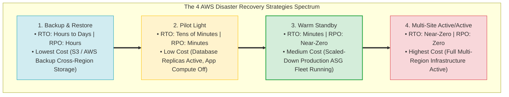
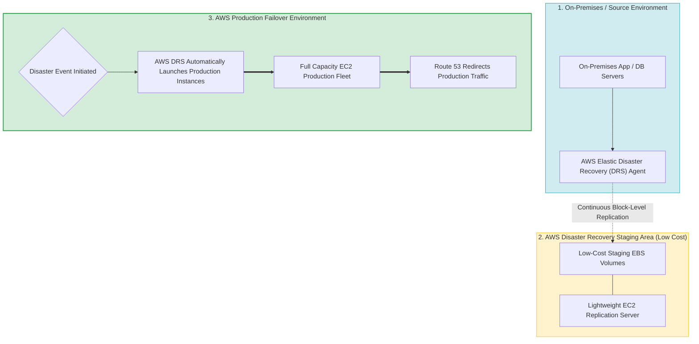
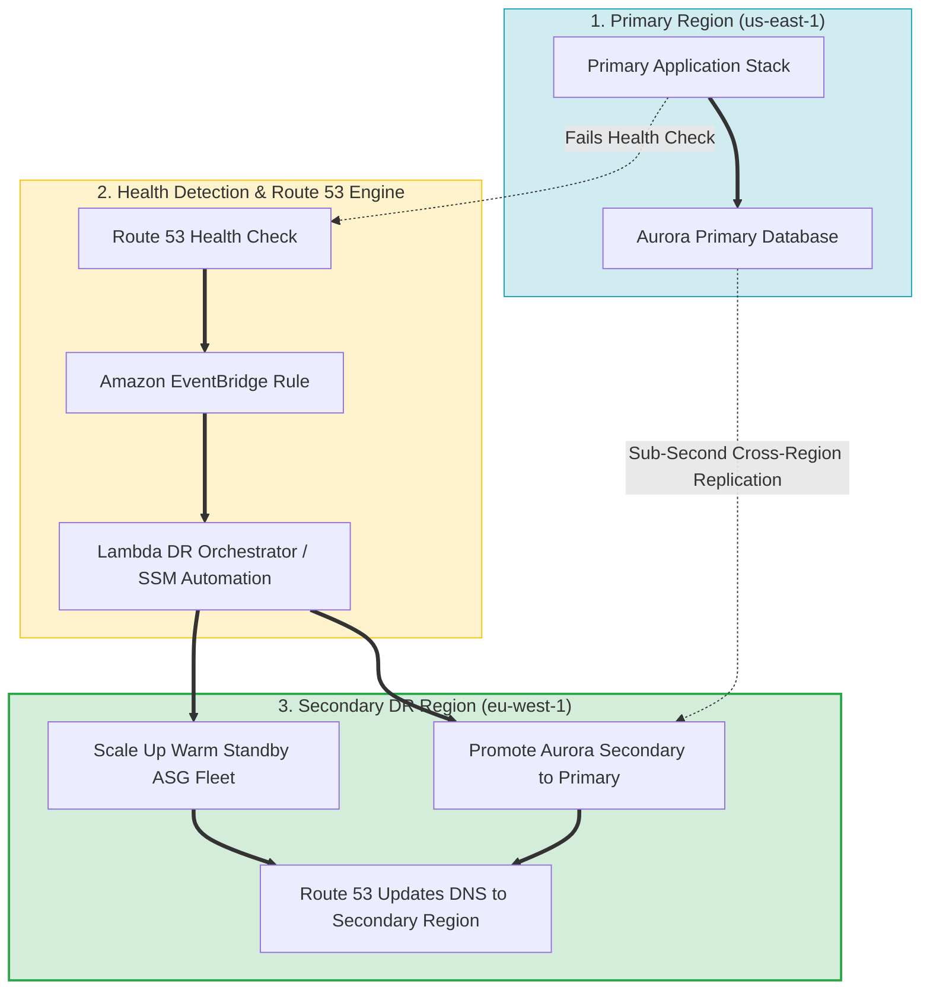
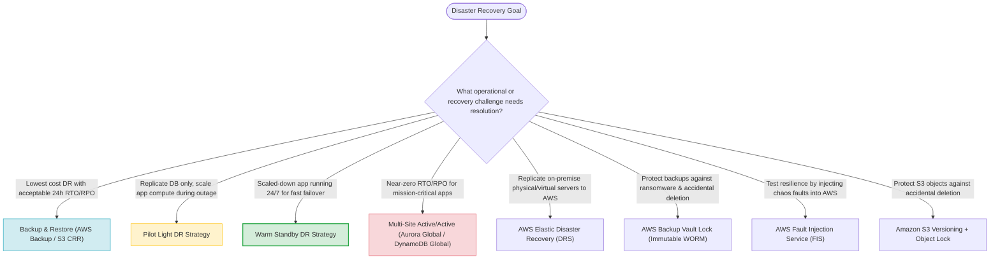

# Task 3.4: Determine a Strategy to Improve Reliability — Disaster Recovery Methods and Tools

> [!NOTE]
> **Exam Mindset**: For the AWS Solutions Architect Professional (SAP-C02) and AI Practitioner (AIP-C01) exams, Disaster Recovery (DR) balances business recovery targets against infrastructure cost:
> **RTO & RPO Business Targets** $\rightarrow$ **DR Strategy Selection (Backup & Restore $\rightarrow$ Pilot Light $\rightarrow$ Warm Standby $\rightarrow$ Active/Active)** $\rightarrow$ **AWS DR Tooling** $\rightarrow$ **Automated Failover & Testing**.

---

## 1. The 4 Classic AWS Disaster Recovery Strategies Spectrum



---

## 2. On-Premises to AWS Disaster Recovery Topology via AWS DRS



---

## 3. The 4 AWS Disaster Recovery Strategies Comparison Matrix

| DR Strategy | Target RTO Target | Target RPO Target | Relative Infrastructure Cost | Primary Architectural Characteristic |
| :--- | :--- | :--- | :--- | :--- |
| **Backup & Restore** | Hours to Days | Hours | **Lowest Cost** | Data backed up to S3/Vault; infrastructure created upon disaster |
| **Pilot Light** | Tens of Minutes | Minutes | **Low Cost** | Data layer continuously replicated; app compute launched during DR |
| **Warm Standby** | Minutes | Seconds to Minutes | **Medium / High Cost** | Scaled-down production environment running 24/7 in secondary Region |
| **Multi-Site Active/Active**| Near-Zero | Zero / Sub-second | **Highest Cost** | Full active production environments running concurrently in both Regions |

---

## 4. Automated Event-Driven Multi-Region DR Failover Topology



> [!IMPORTANT]
> **AWS Elastic Disaster Recovery (DRS) vs. AWS Backup**:
> - **AWS Elastic Disaster Recovery (DRS)**: Provides **continuous block-level replication** for physical or virtual servers (on-premises or cloud-to-cloud) into a low-cost staging area for rapid EC2 failover (Low RTO/RPO).
> - **AWS Backup**: Provides **centralized snapshot management** for native AWS services (EBS, RDS, DynamoDB, EFS) for scheduled point-in-time recovery and compliance.

---

## 5. Specialized AWS Disaster Recovery & Resiliency Tooling

| AWS Tool / Service | Core DR Capability | Primary Target Workload |
| :--- | :--- | :--- |
| **AWS Elastic Disaster Recovery (DRS)** | Continuous block-level server replication into AWS | On-premises servers, EC2 lift-and-shift DR |
| **AWS Backup Vault Lock** | Immutable WORM (Write Once Read Many) backup protection | Compliance, ransomware protection, prevention of backup deletion |
| **AWS Fault Injection Service (FIS)** | Managed chaos engineering & fault injection testing | Stress-testing application resiliency & DR failover procedures |
| **AWS CloudFormation / CDK** | Infrastructure as Code (IaC) template deployment | Recreating secondary DR environments automatically on demand |

---

## 6. Ransomware Protection via AWS Backup Vault Lock

> [!TIP]
> **Immutable WORM Protection**:
> To protect critical backup archives against ransomware encryption or malicious deletion (even by AWS root users), configure **AWS Backup Vault Lock** in **Compliance Mode**. Once locked, backup retention periods cannot be shortened, and backups cannot be deleted by any user or IAM role.

---

## 7. SAP-C02 Disaster Recovery Master Selection Decision Engine



---

## 8. SAP-C02 Exam Keyword Cheat Sheet

```
"Lowest cost disaster recovery option"               ──> Backup & Restore Strategy
"Minimal infrastructure continuously running in DR"   ──> Pilot Light DR Strategy
"Scaled-down application running in secondary Region" ──> Warm Standby DR Strategy
"Near-zero RTO and zero data loss multi-Region"      ──> Multi-Site Active/Active (Aurora Global / DynamoDB Global)
"Replicate on-premises servers into AWS staging area"──> AWS Elastic Disaster Recovery (DRS)
"Prevent deletion of backups by ransomware or root"  ──> AWS Backup Vault Lock (Compliance Mode)
"Intentionally inject faults to test DR readiness"   ──> AWS Fault Injection Service (FIS)
"Automate infrastructure creation in secondary DR"   ──> AWS CloudFormation / IaC
"Automatic DNS failover when primary Region dies"    ──> Amazon Route 53 Failover Routing
```

---

## 9. Common SAP-C02 Exam Traps

1. **Trap 1: Selecting Active/Active Multi-Region when 24h RTO is Allowed**: Active/Active carries massive infrastructure and data transfer costs. If 24h RTO is acceptable, choose **Backup & Restore**.
2. **Trap 2: Confusing Multi-AZ Availability with Disaster Recovery**: Multi-AZ only protects against data center failure in a single Region. For Regional disasters, select **Cross-Region DR**.
3. **Trap 3: Assuming Successful Backups Equal Successful Disaster Recovery**: Backup validation requires **automated restore testing**. A backup file alone does not prove the system can recover.
4. **Trap 4: Rebuilding Servers Manually for On-Premises DR**: Manually recreating on-premise servers in AWS increases RTO. Use **AWS Elastic Disaster Recovery (DRS)** for continuous block-level server replication.

---

## 10. Final Mental Model

`Define RTO & RPO Targets ➔ Select Strategy (Backup ➔ Pilot Light ➔ Warm Standby ➔ Active/Active) ➔ Automate Failover (Route 53 + IaC) ➔ Test via FIS`