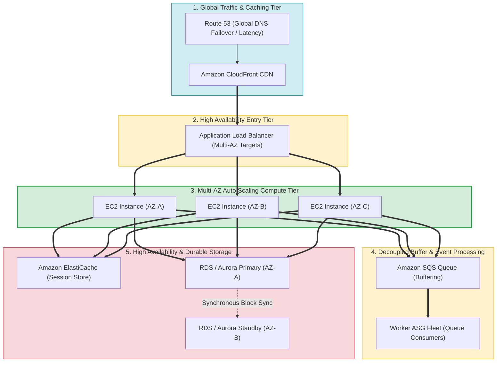
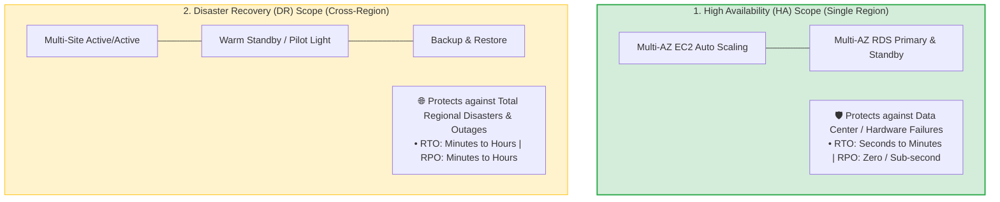
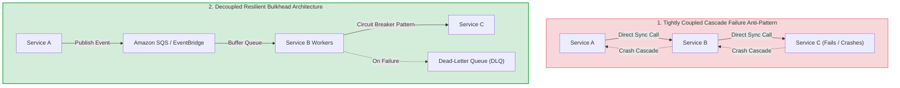
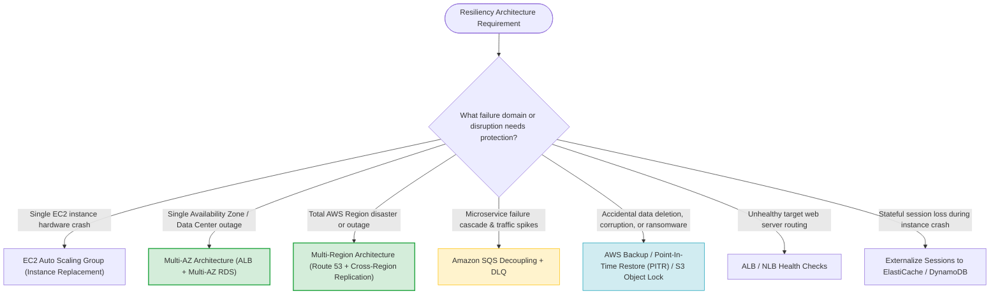

# Task 3.4: Determine a Strategy to Improve Reliability — High Availability and Resiliency

> [!NOTE]
> **Exam Mindset**: For the AWS Solutions Architect Professional (SAP-C02) and AI Practitioner (AIP-C01) exams, High Availability and Resiliency are architectural patterns:
> **Failure Analysis (Instance $\rightarrow$ AZ $\rightarrow$ Region $\rightarrow$ Dependency)** $\rightarrow$ **Detection & Isolation** $\rightarrow$ **Automated Failover & Decoupling** $\rightarrow$ **Self-Healing Recovery**.

---

## 1. End-to-End Resilient Multi-AZ Architecture Topology



---

## 2. High Availability (HA) vs. Disaster Recovery (DR) Spectrum



---

## 3. High Availability Service Selection & Failure Protection Matrix

| Component | Failure Protection Scope | Recommended AWS Service | Key Exam Keyword Trigger |
| :--- | :--- | :--- | :--- |
| **Compute Tier** | Instance failure & AZ outages | EC2 Auto Scaling across $\ge 2$ AZs | *"Automatically replace failed instances / Multi-AZ"* |
| **Traffic Entry Tier** | Unhealthy targets & node failures | ALB / NLB with Health Checks | *"Route traffic only to healthy instances"* |
| **Database Tier** | AZ data center outage | RDS Multi-AZ / Aurora Storage Engine | *"Automatic DB failover / Sub-minute DB recovery"* |
| **Messaging Tier** | Microservice crash cascades | Amazon SQS + Dead-Letter Queue (DLQ) | *"Buffer workload / Decouple services / DLQ"* |
| **Session Tier** | Stateful server loss | Amazon ElastiCache / DynamoDB | *"Stateless web app / Externalize session state"* |
| **Storage Tier** | Object & File System durability | Amazon S3 / Amazon EFS | *"Durable multi-AZ storage / Shared file system"* |

---

## 4. Microservice Decoupling & Failure Isolation (Bulkhead & Circuit Breaker)



> [!IMPORTANT]
> **Backups Are NOT High Availability**:
> **Backups** provide point-in-time data recovery after corruption or accidental deletion (RTO = hours).
> **High Availability** maintains redundant live infrastructure operating continuously (RTO = seconds to minutes). Backup alone will NOT meet a low-RTO uptime SLA requirement.

---

## 5. High Availability (HA) vs. Disaster Recovery (DR) Feature Comparison

| Metric / Dimension | High Availability (HA) | Disaster Recovery (DR) |
| :--- | :--- | :--- |
| **Primary Goal** | Minimize downtime during component failures | Restore operational functionality after major disaster |
| **Target Failure Domain**| Individual EC2 instance, disk, or AZ outage | Entire AWS Region failure or catastrophic disaster |
| **Standard Mechanism** | Multi-AZ ALB, EC2 ASG, Multi-AZ RDS | Cross-Region Replication, Pilot Light, Active/Active |
| **RTO / RPO Profile** | RTO: Seconds to Minutes \| RPO: Sub-second | RTO: Minutes to Hours \| RPO: Minutes to Hours |
| **Architecture Scope** | Single Region (across $\ge 2$ Availability Zones) | Multi-Region (Cross-Region deployment) |

---

## 6. Loose Coupling & Asynchronous Buffering

> [!TIP]
> **Decoupling Prevents Cascading Outages**:
> Avoid direct synchronous HTTP calls between microservices (`Service A -> Service B -> Service C`). If Service C crashes, Service B and A will fail. Place **Amazon SQS** queues or **Amazon EventBridge** between services so messages are buffered safely during downstream outages.

---

## 7. SAP-C02 High Availability & Resiliency Master Selection Decision Engine



---

## 8. SAP-C02 Exam Keyword Cheat Sheet

```
"Automatically replace failed EC2 instances"        ──> EC2 Auto Scaling Group (ASG)
"Route traffic only to healthy instances"            ──> Load Balancer Target Health Checks
"Automatic database failover during AZ outage"      ──> RDS Multi-AZ / Aurora Storage Engine
"Decouple microservices and buffer traffic"          ──> Amazon SQS Queue
"Store session state outside EC2 web instances"      ──> Amazon ElastiCache / DynamoDB
"Shared regional filesystem across multiple AZs"    ──> Amazon EFS
"Recover accidentally deleted or corrupted data"     ──> AWS Backup / Point-In-Time Recovery (PITR)
"DNS failover between active and standby Regions"    ──> Route 53 Failover Routing
```

---

## 9. Common SAP-C02 Exam Traps

1. **Trap 1: Relying Only on Backups for High Availability**: Restoring backups requires rebuilding infrastructure and taking hours. For high availability, deploy **Multi-AZ ALB + EC2 ASG + Multi-AZ RDS**.
2. **Trap 2: Assuming Single-AZ Auto Scaling Provides High Availability**: An ASG operating in a single AZ cannot survive an Availability Zone outage. Always configure ASGs to span **multiple AZs**.
3. **Trap 3: Storing User Session Data Locally on EC2 Instance Storage**: If an instance crashes, local session state is lost. Always **externalize session state to ElastiCache or DynamoDB**.
4. **Trap 4: Confusing RDS Multi-AZ Standby with Read Scaling**: Multi-AZ standby databases are strictly for failover and cannot be queried for reads. For read scaling, deploy **Read Replicas**.

---

## 10. Final Mental Model

`Identify Failure Domain (Instance ➔ AZ ➔ Region) ➔ Externalize State ➔ Decouple via Queues ➔ Automate Multi-AZ Failover & Recovery`