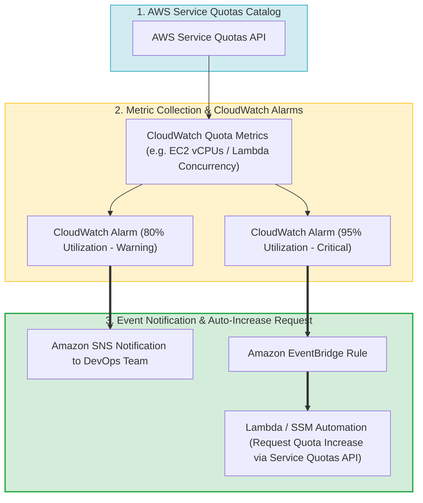
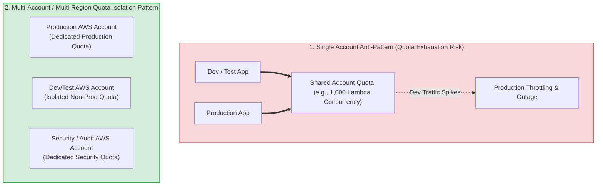
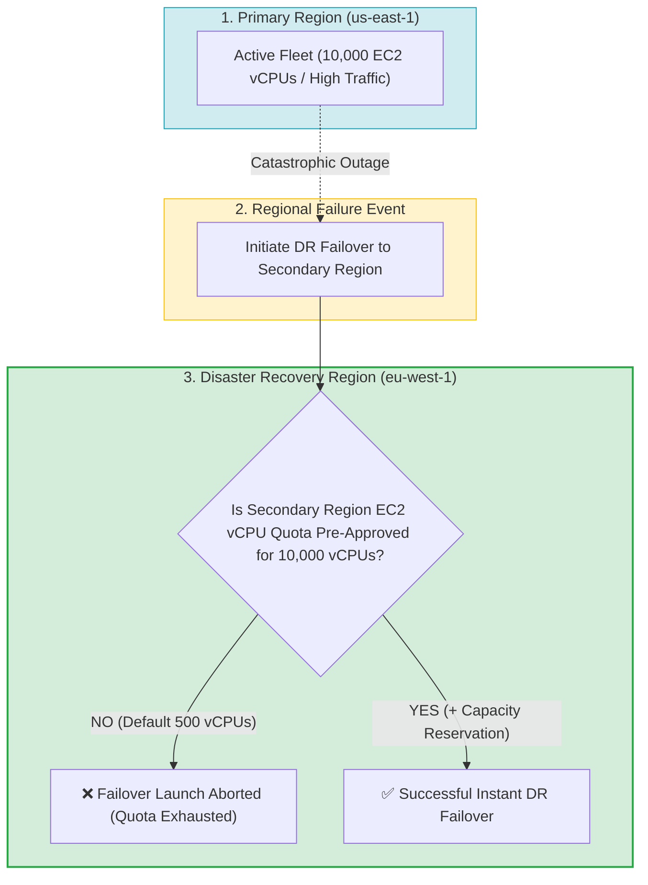
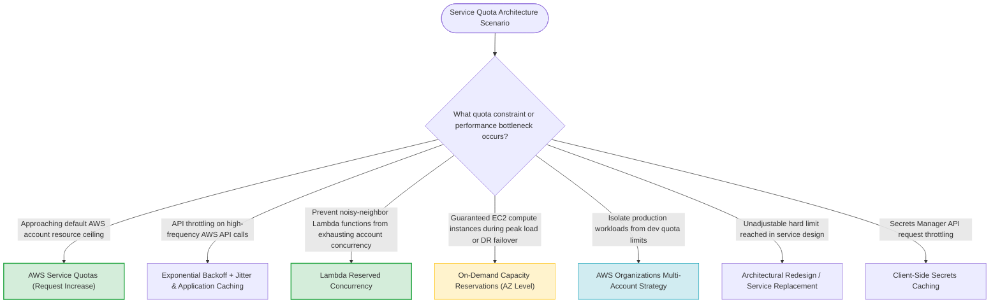

# Task 3.4: Determine a Strategy to Improve Reliability — Service Quotas and Limits

> [!NOTE]
> **Exam Mindset**: For the AWS Solutions Architect Professional (SAP-C02) and AI Practitioner (AIP-C01) exams, service quotas define the absolute physical capacity ceiling of an architecture:
> **Workload Scale Requirements** $\rightarrow$ **Service Quota Evaluation (Account / Regional / API Rate Limits)** $\rightarrow$ **Adjustable vs. Hard Limit Analysis** $\rightarrow$ **Proactive Monitoring & Capacity Assurance**.

---

## 1. AWS Service Quotas Monitoring & Automated Alerting Topology



---

## 2. Account & Regional Quota Isolation in AWS Organizations



---

## 3. High-Impact AWS Service Quotas Breakdown Matrix

| Service Domain | Key Service Quota / Limit | Quota Scope | Adjustable? | Impact of Exhaustion |
| :--- | :--- | :--- | :--- | :--- |
| **Amazon EC2** | vCPU Limits (On-Demand / Spot per instance family) | Regional / Account | **Yes (Adjustable)** | EC2 Auto Scaling fails to launch new compute capacity |
| **AWS Lambda** | Concurrent Executions (Default 1,000) | Regional / Account | **Yes (Adjustable)** | Excess requests throttled (`429 Too Many Requests`) |
| **Amazon VPC** | VPCs per Region / Security Groups per ENI | Regional / Account | **Yes / Hard** | Network infrastructure provisioning fails |
| **Amazon API Gateway**| Rate & Burst Limits (Default 10,000 RPS) | Regional / Account | **Yes (Adjustable)** | API client request throttling |
| **Amazon S3** | Request Rates (5,500 GET, 3,500 PUT/POST per prefix/sec) | Bucket Prefix | **Hard Limit** | S3 `503 Slow Down` throttling errors |

---

## 4. Disaster Recovery Capacity & Quota Failover Bottleneck Pipeline



> [!IMPORTANT]
> **Quota Increase vs. On-Demand Capacity Reservations**:
> - **Service Quota Increase**: Authorizes your account to create more resources (increases permission ceiling), but does **NOT** guarantee physical hardware availability in AWS data centers.
> - **On-Demand Capacity Reservations**: Reserves actual physical EC2 compute capacity in a specific Availability Zone, guaranteeing immediate launch capability for critical workloads and DR failover.

---

## 5. Quota vs. Capacity vs. Reservation Comparison Matrix

| Concept / Mechanism | Core Definition | Primary Architectural Purpose | Guaranteed Hardware Capacity? |
| :--- | :--- | :--- | :--- |
| **AWS Service Quota** | Permitted maximum resource creation limit | Account guardrail & governance ceiling | ❌ **No** (Only increases allowed limit) |
| **On-Demand Capacity Reservation** | Physically reserved EC2 capacity in a specific AZ | Guaranteed EC2 launch capability for HA / DR | ✅ **Yes** (Guarantees physical compute) |
| **Savings Plans / Reserved Instances**| Billing discount contract commitment | Cost optimization for steady-state workloads | ❌ **No** (Pricing mechanism only) |

---

## 6. Lambda Blast-Radius Isolation via Reserved Concurrency

> [!TIP]
> **Isolating Critical Workloads with Reserved Concurrency**:
> To prevent non-critical background processes (or dev functions) from consuming the unreserved account concurrency pool and throttling production API functions, set **Reserved Concurrency** on production functions. This guarantees dedicated execution capacity while capping the blast radius of runaway functions.

---

## 7. SAP-C02 Service Quotas Master Selection Decision Engine



---

## 8. SAP-C02 Exam Keyword Cheat Sheet

```
"Approaching AWS account service limit"             ──> AWS Service Quotas / CloudWatch Alarms
"Auto Scaling Group fails to launch additional EC2s" ──> Check EC2 vCPU Service Quota
"API requests returning 429 Too Many Requests"      ──> Throttling / Request Quota Increase / Exponential Backoff
"Guarantee EC2 capacity in DR Region during failover"──> On-Demand Capacity Reservations
"Prevent dev Lambda functions from throttling production"──> Lambda Reserved Concurrency
"Separate quota boundaries between departments"      ──> AWS Organizations Multi-Account Strategy
"Reduce high-frequency API calls to Secrets Manager" ──> Client-Side Secret Caching
"Avoid retry storms during API throttling"          ──> Exponential Backoff with Jitter
```

---

## 9. Common SAP-C02 Exam Traps

1. **Trap 1: Assuming Auto Scaling Groups Bypass Service Quotas**: ASGs operate within account service quotas. If the EC2 vCPU quota is reached, ASG instance scaling launches will fail.
2. **Trap 2: Requesting Quota Increases for Unadjustable Hard Limits**: Certain limits (e.g., S3 5,500 GET requests/sec per prefix) are fixed. Hard limits require **architectural redesign** (e.g., hash prefixes, S3 CloudFront caching).
3. **Trap 3: Believing a Service Quota Increase Guarantees Physical Capacity**: Increasing a quota raises your account's execution ceiling but does not reserve hardware. For guaranteed capacity, deploy **On-Demand Capacity Reservations**.
4. **Trap 4: Forgetting Quota Verification in Secondary DR Regions**: DR failover will fail if the standby Region's service quotas are left at default limits. Always **pre-approve quotas in the DR Region**.

---

## 10. Final Mental Model

`Identify Bottleneck (Quota vs Hardware vs Throttling) ➔ Request Quota Increase or Redesign ➔ Secure Capacity via Reservations ➔ Monitor via Service Quotas + CloudWatch`