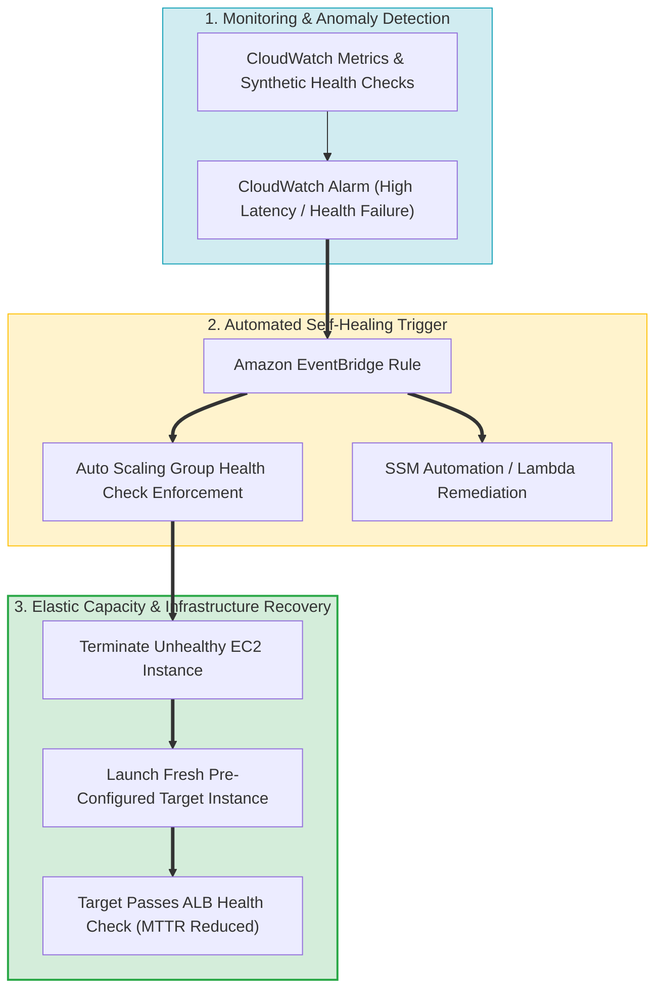
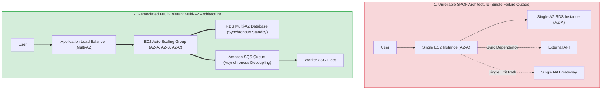
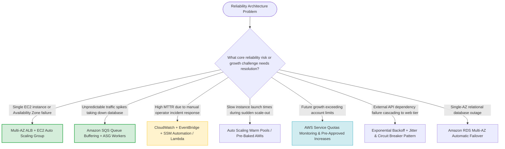

# Task 3.4: Determine a Strategy to Improve Reliability — Core Skills & Architectural Patterns

> [!NOTE]
> **Exam Mindset**: For the AWS Solutions Architect Professional (SAP-C02) and AI Practitioner (AIP-C01) exams, Domain 3.4 evaluates your ability to evaluate architectures for reliability risks, eliminate single points of failure (SPOFs), enable self-healing, and scale dynamically:
> **Growth & Usage Trend Analysis** $\rightarrow$ **SPOF & Capacity Weakness Identification** $\rightarrow$ **Decoupling & Data Replication** $\rightarrow$ **Elastic Self-Healing Automation**.

---

## 1. End-to-End Self-Healing & Elastic Resiliency Lifecycle



---

## 2. Single Point of Failure (SPOF) Remediation Transformation



---

## 3. Operational Overhead & Architectural Resiliency Comparison Matrix

| Architectural Pattern | Uptime Resiliency | Relative Infrastructure Cost | Operational Overhead | Primary Recovery Mechanism |
| :--- | :--- | :--- | :--- | :--- |
| **Single EC2 / Single-AZ DB** | Low (Vulnerable to SPOF) | **Lowest** | Low (Manual recovery) | Manual operator rebuild |
| **ALB + Multi-AZ EC2 ASG** | High (Survives AZ failure) | Medium | **Low (Managed)** | Automatic instance replacement via ASG |
| **RDS Multi-AZ Database** | High (Survives AZ failure) | Medium | **Low (Managed)** | Automatic synchronous storage failover (< 60s) |
| **Multi-Region Active/Passive**| Very High (Survives Region disaster)| High | Medium / High | Route 53 DNS failover to standby Region |
| **Multi-Region Active/Active** | Highest (Continuous availability)| **Highest** | **High** | Dual-Region active traffic handling |

---

## 4. Cost-Effective Reliability & Resiliency Hierarchy

```mermaid
flowchart TD
    subgraph Hierarchy ["Cost-Effective AWS Reliability Optimization Pyramid"]
        Level1["1. AWS Managed Services (RDS, S3, SQS, DynamoDB)<br/>• Lowest Operational Overhead"]
        Level2["2. Multi-AZ Compute & Database Topology<br/>• Standard High Availability Baseline"]
        Level3["3. Auto Scaling Elasticity & Health Checks<br/>• Elastic Capacity Matching Demand"]
        Level4["4. Asynchronous Queue Decoupling (SQS / SNS)<br/>• Smooths Traffic Spikes & Isolates Failures"]
        Level5["5. Automated Remediation (SSM Automation / Lambda)<br/>• Minimizes MTTR without Human Intervention"]
        Level6["6. Multi-Region Active/Active Deployment<br/>• Highest Cost & Complexity (Use Only when Business Requires)"]
    end

    Level1 ==> Level2 ==> Level3 ==> Level4 ==> Level5 ==> Level6

    style Level1 fill:#d1ecf1,stroke:#17a2b8,stroke-width:1px
    style Level2 fill:#d4edda,stroke:#28a745,stroke-width:2px
    style Level3 fill:#d4edda,stroke:#28a745,stroke-width:2px
    style Level4 fill:#fff3cd,stroke:#ffc107,stroke-width:1px
    style Level5 fill:#fff3cd,stroke:#ffc107,stroke-width:1px
    style Level6 fill:#f8d7da,stroke:#dc3545,stroke-width:1px
```



> [!IMPORTANT]
> **Self-Healing vs. High Availability**:
> - **High Availability (HA)**: Ensures redundant live instances are available across multiple Availability Zones to handle current traffic.
> - **Self-Healing**: Automatically detects failed infrastructure components and triggers automated replacement or remediation actions (reducing MTTR to minutes without operator intervention).

---

## 5. Domain 3.4 Key AWS Reliability Services Breakdown

| Service Category | AWS Service | Reliability & Resiliency Role | Key Exam Keyword Trigger |
| :--- | :--- | :--- | :--- |
| **Monitoring & Detection** | Amazon CloudWatch | Metric tracking, anomaly detection, threshold alarms | *"Monitor latency, error rate, queue depth"* |
| **Compute Elasticity** | EC2 Auto Scaling | Self-healing capacity, dynamic scale-out/scale-in | *"Automatically replace failed instances / Elasticity"* |
| **Traffic Distribution** | Application Load Balancer (ALB) | Multi-AZ traffic routing, target health checks | *"Route traffic only to healthy instances"* |
| **Data Redundancy** | RDS Multi-AZ / Aurora Global DB | Multi-AZ DB failover & sub-second cross-Region replication | *"Automatic DB failover / Low RPO global database"* |
| **Asynchronous Decoupling**| Amazon SQS / EventBridge | Workload buffering, failure blast-radius isolation | *"Buffer unpredictable spikes / Decouple microservices"* |

---

## 6. Reducing MTTR via Automated Remediation

> [!TIP]
> **Minimizing MTTR (Mean Time to Repair)**:
> Manual operator intervention during an incident typically results in MTTR of 30+ minutes. By connecting **CloudWatch Alarms** $\rightarrow$ **Amazon EventBridge** $\rightarrow$ **AWS Systems Manager Automation** or **AWS Lambda**, recovery actions execute in seconds to minutes automatically, drastically improving operational resilience.

---

## 7. SAP-C02 Domain 3.4 Reliability Skills Master Selection Decision Engine



---

## 8. SAP-C02 Exam Keyword Cheat Sheet

```
"Single point of failure (SPOF)"                    ──> Introduce Multi-AZ redundancy & ELB health checks
"Automatically replace unhealthy instances"        ──> EC2 Auto Scaling Group (ASG)
"Reduce MTTR without human intervention"            ──> EventBridge + Systems Manager Automation / Lambda
"Buffer unpredictable traffic spikes"               ──> Amazon SQS Queue + Worker ASG
"Protect database from high read query load"        ──> Amazon ElastiCache / Read Replicas
"Prevent external API failure from crashing app"    ──> Exponential Backoff with Jitter + Circuit Breaker
"Evaluate future growth against account ceilings"   ──> AWS Service Quotas + CloudWatch Alarms
"Zero-downtime database failover within a Region"   ──> Amazon RDS Multi-AZ / Aurora Storage Engine
```

---

## 9. Common SAP-C02 Exam Traps

1. **Trap 1: Deploying Multi-Region Active/Active when Multi-AZ Meets Requirements**: Multi-Region active/active introduces massive cost and complexity. If requirements only specify surviving an AZ failure, choose **Multi-AZ ALB + ASG + Multi-AZ RDS**.
2. **Trap 2: Using Read Replicas as the Primary High Availability Solution**: Read Replicas are for read scalability, not automatic failover. For database HA, deploy **RDS Multi-AZ**.
3. **Trap 3: Relying on Manual Operations Runbooks for Resiliency**: Manual runbooks lead to high MTTR. Use **EventBridge + SSM Automation / Lambda** for automated self-healing.
4. **Trap 4: Scaling Web Compute Instances to Resolve Database Bottlenecks**: Scaling web servers increases database connection pressure. Decouple via **SQS** or offload reads to **ElastiCache**.

---

## 10. Final Mental Model

`Identify Growth & SPOF Weaknesses ➔ Decoupling & Elastic Redundancy ➔ Automate Self-Healing (EventBridge + SSM) ➔ Match Reliability to Business Budget`