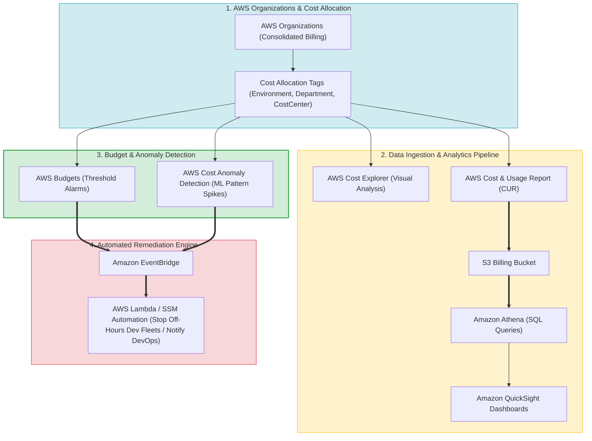
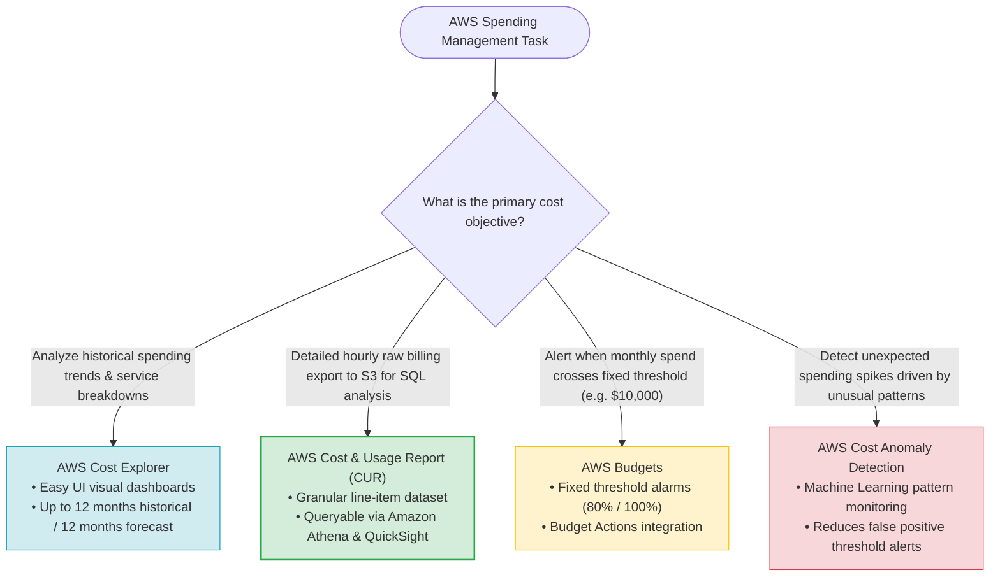
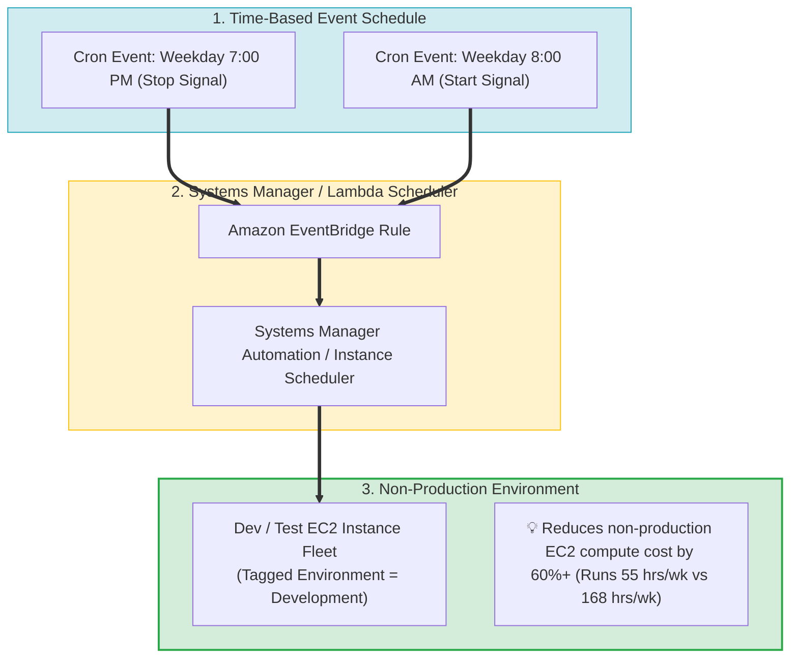
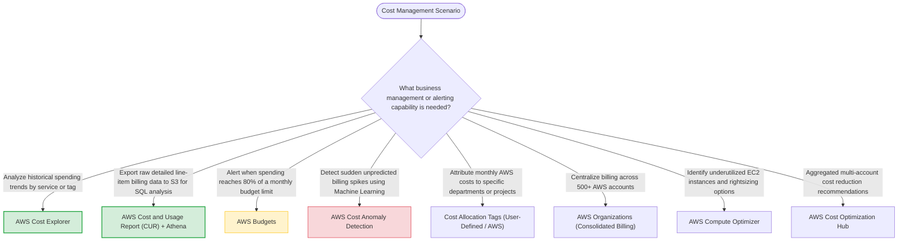

# Task 3.5: Identify Opportunities for Cost Optimizations — Cost Management, Alerting, and Reporting

> [!NOTE]
> **Exam Mindset**: For the AWS Solutions Architect Professional (SAP-C02) and AI Practitioner (AIP-C01) exams, cost management provides the governance framework to track, alert, analyze, and optimize AWS spending:
> **Visibility (Tags / Organizations)** $\rightarrow$ **Analysis (Cost Explorer / CUR)** $\rightarrow$ **Monitoring & Alerting (AWS Budgets / Anomaly Detection)** $\rightarrow$ **Automated Remediation (SSM / Lambda)**.

---

## 1. End-to-End Enterprise Cost Governance & Remediation Architecture



---

## 2. Cost Analysis Tooling Spectrum (Cost Explorer vs. CUR vs. Budgets vs. Anomaly Detection)



---

## 3. Core AWS Cost Management Toolset Feature Comparison Breakdown

| AWS Service / Tool | Primary Purpose | Data Granularity & Scope | Notification / Output Method | Primary Exam Keyword Trigger |
| :--- | :--- | :--- | :--- | :--- |
| **AWS Cost Explorer** | Visual historical cost trend & usage analysis | Service, Region, Tag, Account level | Custom UI charts & forecasts | *"Analyze spending trends / Historical cost analysis"* |
| **AWS Cost & Usage Report (CUR)**| Detailed raw line-item billing export | Granular resource-level hourly usage | Exported to Amazon S3 (Queryable via Athena) | *"Detailed billing data in S3 / Query using Athena"* |
| **AWS Budgets** | Proactive threshold monitoring & alerts | Account, Service, Tag, RI/Savings Plan | Email, SNS, Budget Actions (SSM/IAM) | *"Alert when spending reaches threshold / Set budget limit"* |
| **AWS Cost Anomaly Detection**| Machine Learning spend spike detection | Pattern-based anomaly evaluation | Email, SNS, EventBridge alerts | *"Detect unexpected spending spikes / Abnormal spend"* |
| **Cost Allocation Tags** | Cost attribution & departmental chargeback | User-defined metadata (e.g., `CostCenter`) | Filters in Cost Explorer & CUR | *"Attribute costs to departments / Chargeback & showback"* |

---

## 4. Automated Off-Hours EC2 Instance Scheduler Architecture



> [!IMPORTANT]
> **Cost Explorer vs. CUR vs. AWS Budgets**:
> - **Cost Explorer**: Used for **visual historical trend analysis** and forecasting in the AWS Console.
> - **AWS Cost and Usage Report (CUR)**: Exports **raw line-item billing datasets** to Amazon S3 for custom SQL queries with Amazon Athena.
> - **AWS Budgets**: Used for **proactive threshold-based alerts** (e.g., notify when spend reaches 80% of budget).

---

## 5. Cost Allocation Tags & Chargeback Governance

> [!TIP]
> **Departmental Chargeback via Tags**:
> To assign accountability for AWS spending across business units, mandate **Cost Allocation Tags** (e.g., `Environment=Production`, `Department=Finance`, `CostCenter=1001`). Cost Explorer and CUR use these active tags to generate detailed chargeback and showback reports.

---

## 6. Machine Learning Cost Anomaly Detection vs. Fixed Budgets

> [!NOTE]
> **Pattern-Based vs. Threshold-Based Alerts**:
> Fixed **AWS Budgets** only trigger when spend crosses a predetermined numeric limit. **AWS Cost Anomaly Detection** uses machine learning to identify sudden, unexpected spend spikes *before* monthly budget limits are breached, suppressing false positives for predictable traffic cycles.

---

## 7. SAP-C02 Cost Management Master Selection Decision Engine



---

## 8. SAP-C02 Exam Keyword Cheat Sheet

```
"Analyze historical cost trends and forecast future spend" ──> AWS Cost Explorer
"Export detailed line-item billing data to S3"           ──> AWS Cost and Usage Report (CUR)
"Query raw billing data using SQL"                       ──> CUR + Amazon Athena
"Notify when monthly spend reaches 80% of threshold"     ──> AWS Budgets
"Detect unexpected spending spikes using machine learning"──> AWS Cost Anomaly Detection
"Attribute costs to departments or cost centers"        ──> Cost Allocation Tags
"Consolidate payments across multiple AWS accounts"       ──> AWS Organizations Consolidated Billing
"Automatically stop non-production instances off-hours" ──> Amazon EventBridge + SSM Automation / Instance Scheduler
```

---

## 9. Common SAP-C02 Exam Traps

1. **Trap 1: Using CloudWatch Alarms as the Primary AWS Billing Alert Engine**: CloudWatch alarms monitor operational metrics. For proactive spending alerts, select **AWS Budgets** or **AWS Cost Anomaly Detection**.
2. **Trap 2: Expecting Cost Explorer to Export Raw SQL Datasets**: Cost Explorer provides visual charts. For raw, granular billing dataset exports to S3 for SQL analysis via Athena, select **AWS Cost and Usage Report (CUR)**.
3. **Trap 3: Believing Service Control Policies (SCPs) Directly Reduce Billing**: SCPs enforce governance guardrails (e.g., blocking region access). They do not analyze bills. Use **Cost Explorer / Budgets** for spending control.
4. **Trap 4: Manually Stopping Dev/Test Instances Each Night**: Manual operational tasks increase MTTR and human error. Use **Amazon EventBridge + Systems Manager Automation** for automated off-hours instance scheduling.

---

## 10. Final Mental Model

`Organize Accounts (Organizations) ➔ Tag Resources (Chargeback) ➔ Analyze Costs (Cost Explorer / CUR) ➔ Alert Proactively (Budgets / Anomaly) ➔ Automate Remediation (SSM / EventBridge)`