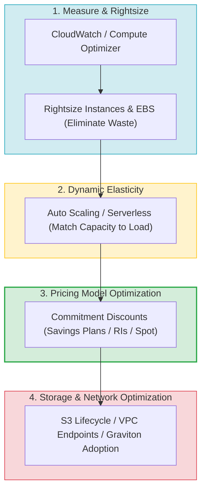
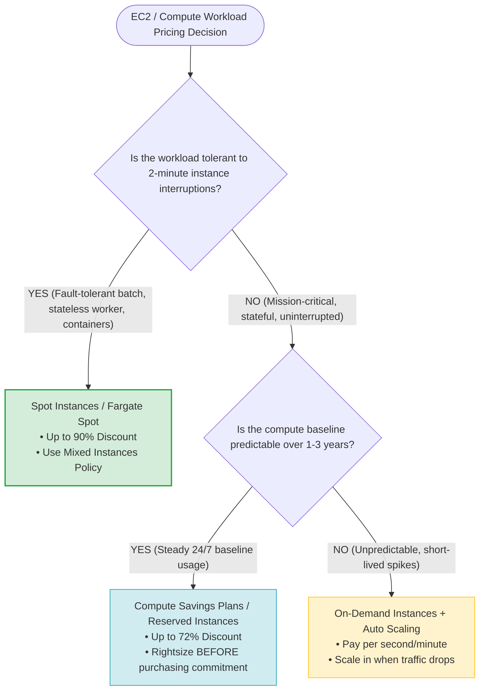
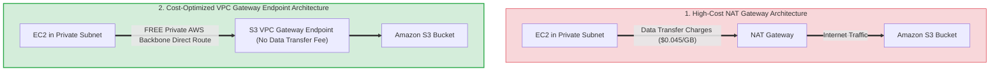
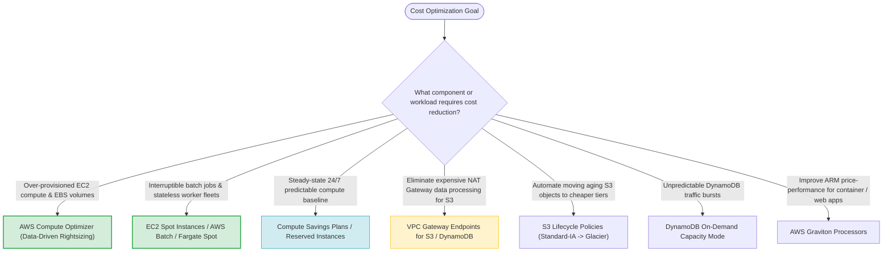

# Task 3.5: Identify Opportunities for Cost Optimizations — Cost-Conscious Architecture Choices

> [!NOTE]
> **Exam Mindset**: For the AWS Solutions Architect Professional (SAP-C02) and AI Practitioner (AIP-C01) exams, cost optimization balances business performance, security, and availability against expense:
> **Workload Requirements** $\rightarrow$ **Rightsizing & Waste Removal** $\rightarrow$ **Dynamic Elasticity (Auto Scaling / Serverless)** $\rightarrow$ **Optimal Pricing Model (Spot / Savings Plans / RIs)** $\rightarrow$ **Storage & Network Optimization**.

---

## 1. The 4-Pillar AWS Cost Optimization Framework & Order of Operations



---

## 2. EC2 Capacity & Pricing Model Decision Strategy (Spot vs. Savings Plans vs. On-Demand)



---

## 3. Workload Characteristic vs. Cost Strategy Selection Matrix

| Workload Characteristic | Recommended AWS Cost Strategy | Key Service / Feature | Exam Clue Keyword Trigger |
| :--- | :--- | :--- | :--- |
| **Fault-Tolerant & Interruptible** | Spot Instances / Fargate Spot | ASG Mixed Instances Policy | *"Batch jobs / Fault-tolerant / Lowest compute cost"* |
| **Predictable 24/7 Baseline Usage** | Compute Savings Plans / Reserved Instances | Savings Plans / RIs | *"Steady long-running compute / 1-year commitment"* |
| **Unpredictable Web Spikes** | Dynamic Auto Scaling / Serverless | Target Tracking ASG / Lambda | *"Variable demand / Pay for actual utilization"* |
| **Over-Provisioned Resources** | Data-Driven Rightsizing | AWS Compute Optimizer | *"Underutilized CPU/Memory / Recommend size"* |
| **Infrequently Accessed S3 Data** | S3 Storage Tiering | S3 Lifecycle Policies | *"Archive aging objects / Reduce storage cost"* |
| **High S3 Traffic from Private VPC**| Eliminate NAT Processing Charges | S3 Gateway Endpoint | *"High data volume to S3 / NAT Gateway cost"* |

---

## 4. Network & Storage Data Transfer Cost Reduction Architecture



> [!IMPORTANT]
> **Always Rightsize BEFORE Purchasing Commitment Discounts**:
> Purchasing a 3-year Savings Plan or Reserved Instance for an over-provisioned instance locks in unnecessary spending.
> **Correct Sequence**: **Measure & Rightsize First** $\rightarrow$ **Establish Actual Baseline** $\rightarrow$ **Purchase Savings Plans / RIs**.

---

## 5. Pricing Model Feature Comparison Breakdown

| Pricing Model | Cost Discount | Interruption Risk? | Flexibility Scope | Ideal Use Case |
| :--- | :--- | :--- | :--- | :--- |
| **Spot Instances** | Up to 90% off On-Demand | ⚠️ **Yes** (2-minute warning) | EC2, ECS, EKS, Batch | Batch processing, stateless microservices |
| **Compute Savings Plans** | Up to 72% off On-Demand | ❌ **No** | EC2, Fargate, Lambda | Flexible multi-service steady compute |
| **EC2 Instance Savings Plans**| Up to 72% off On-Demand | ❌ **No** | Specific EC2 Family | Deep discount on single instance family |
| **Reserved Instances (RIs)** | Up to 72% off On-Demand | ❌ **No** | RDS, OpenSearch, ElastiCache | Non-EC2 steady-state database instances |
| **On-Demand Instances** | Baseline rate (0% discount) | ❌ **No** | Full flexibility | Unpredictable, short-duration workloads |

---

## 6. Eliminating NAT Gateway Processing Charges via Gateway Endpoints

> [!TIP]
> **Free S3 & DynamoDB Access via Gateway Endpoints**:
> NAT Gateways charge both an hourly rate and a per-GB data processing fee ($0.045/GB). For workloads transferring terabytes of data from private EC2 subnets to **Amazon S3** or **Amazon DynamoDB**, creating a **VPC Gateway Endpoint** routes traffic over the free internal AWS backbone, completely eliminating NAT processing costs.

---

## 7. SAP-C02 Domain 3.5 Cost-Conscious Architecture Master Selection Decision Engine



---

## 8. SAP-C02 Exam Keyword Cheat Sheet

```
"Identify underutilized EC2 instances and EBS volumes"──> AWS Compute Optimizer
"Lowest cost compute for fault-tolerant batch"       ──> EC2 Spot Instances / Fargate Spot
"Predictable 24/7 baseline compute across services"  ──> Compute Savings Plans
"Steady-state database running 24/7 for 3 years"     ──> Amazon RDS Reserved Instances
"Reduce data transfer costs to S3 from private VPC"  ──> VPC Gateway Endpoint for S3
"Automatically transition aging S3 objects"         ──> S3 Lifecycle Policies
"Best price-performance for ARM-compatible apps"    ──> AWS Graviton Processors
"Unpredictable database traffic without capacity planning"──> DynamoDB On-Demand Capacity Mode
```

---

## 9. Common SAP-C02 Exam Traps

1. **Trap 1: Choosing Spot Instances for Mission-Critical Stateful Databases**: Spot instances can be reclaimed with a 2-minute notice. Never use Spot for non-fault-tolerant production databases.
2. **Trap 2: Purchasing Savings Plans Before Rightsizing Infrastructure**: Buying a Savings Plan for an oversized EC2 instance locks in waste. Always **Rightsize First** using **AWS Compute Optimizer**.
3. **Trap 3: Selecting S3 Standard-IA for Frequently Accessed Small Files**: Standard-IA charges retrieval fees per GB and minimum storage durations (30 days). For small, frequently read objects, Standard-IA may increase costs.
4. **Trap 4: Using Multi-Region Active/Active solely to Reduce Global Latency without Cost Justification**: Multi-Region active/active doubles infrastructure and cross-region replication costs. Use **Amazon CloudFront** edge caching first to reduce latency cost-effectively.

---

## 10. Final Mental Model

`Measure & Rightsize First ➔ Automate Elasticity (Auto Scaling / Serverless) ➔ Apply Commitment Discounts (Savings Plans / RIs / Spot) ➔ Eliminate Data Transfer Waste`