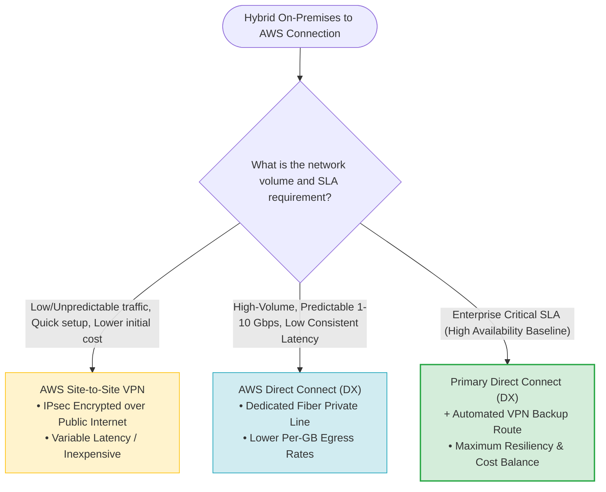
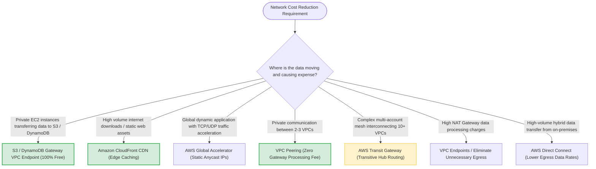

# Task 3.5: Identify Opportunities for Cost Optimizations — Networking and Data Transfer Costs

> [!NOTE]
> **Exam Mindset**: For the AWS Solutions Architect Professional (SAP-C02) and AI Practitioner (AIP-C01) exams, network cost optimization requires evaluating data movement across physical boundaries:
> **Boundary Identification (AZ $\rightarrow$ Region $\rightarrow$ Internet $\rightarrow$ VPC)** $\rightarrow$ **Traffic Volume & Frequency Analysis** $\rightarrow$ **Architectural Path Optimization (Gateway Endpoints / CloudFront / Peering)** $\rightarrow$ **Cost Reduction**.

---

## 1. Data Transfer Cost Boundaries Across AWS Infrastructure

```mermaid
flowchart TD
    subgraph Data_Boundaries ["AWS Data Transfer Boundary Costs & Paths"]
        DirectRoute["1. Same AZ (Same VPC)<br/>• Free $0.00/GB"]
        GatewayEP["2. S3 / DynamoDB Gateway Endpoint<br/>• Free $0.00/GB (Bypasses NAT Gateway)"]
        CrossAZ["3. Inter-AZ (Cross-AZ inside same Region)<br/>• Charged $0.01/GB in each direction"]
        CrossRegion["4. Inter-Region (Cross-Region Backbone Sync)<br/>• Charged $0.02/GB (e.g. S3 CRR / DB Replicas)"]
        NAT_Processing["5. NAT Gateway Processing<br/>• Charged $0.045/GB + Hourly Rate"]
        InternetEgress["6. Internet Egress (Data Out to Public Internet)<br/>• Charged ~$0.09/GB (CloudFront reduces this)"]
    end

    DirectRoute --- GatewayEP --- CrossAZ --- CrossRegion --- NAT_Processing --- InternetEgress

    style DirectRoute fill:#d4edda,stroke:#28a745,stroke-width:2px
    style GatewayEP fill:#d4edda,stroke:#28a745,stroke-width:2px
    style CrossAZ fill:#fff3cd,stroke:#ffc107,stroke-width:1px
    style CrossRegion fill:#fff3cd,stroke:#ffc107,stroke-width:1px
    style NAT_Processing fill:#f8d7da,stroke:#dc3545,stroke-width:1px
    style InternetEgress fill:#f8d7da,stroke:#dc3545,stroke-width:1px
```



---

## 2. VPC Connectivity Cost Comparison (VPC Peering vs. Transit Gateway)

```mermaid
flowchart TD
    subgraph Mesh_Peering ["1. Direct VPC Peering (2-5 VPCs)"]
        VPCA1["VPC A"] <==|"Free Peering Route (No Hourly / Processing Fee)"| VPCB1["VPC B"]
        VPCB1 <==|"Direct Point-to-Point"| VPCC1["VPC C"]
        PeeringNote["💡 Lowest Cost for few VPCs | Non-Transitive Mesh Topology"]
    end

    subgraph Centralized_TGW ["2. AWS Transit Gateway (10+ Multi-Account VPCs)"]
        VPCA2["VPC A"] & VPCB2["VPC B"] & VPCC2["VPC C"] ==> TGW["AWS Transit Gateway Hub"]
        TGW ==> VPCD2["VPC D"] & VPCE2["VPC E"]
        TGWNote["⚙️ Centralized Transitive Routing | Charges Hourly Attachment + $0.02/GB Data Processing"]
    end

    style Mesh_Peering fill:#d4edda,stroke:#28a745,stroke-width:2px
    style Centralized_TGW fill:#fff3cd,stroke:#ffc107,stroke-width:1px
```

---

## 3. Network Component Cost & Connection Breakdown Matrix

| Network Component / Path | Data Processing Fee | Hourly Component Cost | Transitive Routing? | Primary Cost Optimization Scenario |
| :--- | :--- | :--- | :--- | :--- |
| **S3 / DynamoDB Gateway Endpoint**| **FREE ($0.00 / GB)** | **FREE ($0.00 / hr)** | N/A | Bypasses NAT Gateway for S3 & DynamoDB traffic |
| **VPC Peering** | **FREE ($0.00 / GB)** | **FREE ($0.00 / hr)** | ❌ **No** | Point-to-point VPC traffic (Low cost for few VPCs) |
| **AWS PrivateLink (Interface EP)** | ~$0.01 / GB | Hourly per ENI per AZ | ❌ **No** | Private access to 3rd-party SaaS or AWS services |
| **AWS Transit Gateway (TGW)** | ~$0.02 / GB | Hourly per attachment | ✅ **Yes** | Scalable hub-and-spoke routing for 10+ VPCs |
| **NAT Gateway** | ~$0.045 / GB | Hourly per NAT Gateway | ❌ **No** | Outbound internet access for private subnet instances |

---

## 4. Hybrid Connectivity Decision Engine (AWS Direct Connect vs. Site-to-Site VPN)



> [!IMPORTANT]
> **NAT Gateway vs. S3/DynamoDB Gateway Endpoints**:
> Accessing Amazon S3 or DynamoDB through a NAT Gateway incurs both **NAT Gateway hourly fees** AND **$0.045/GB data processing fees**.
> Replacing NAT Gateway routes to S3/DynamoDB with a **Gateway VPC Endpoint** routes traffic over the free internal AWS backbone, eliminating data processing costs completely.

---

## 5. Amazon CloudFront vs. AWS Global Accelerator Cost & Routing Comparison

| Dimension / Feature | Amazon CloudFront | AWS Global Accelerator |
| :--- | :--- | :--- |
| **Primary Architectural Function**| Edge content caching & CDN | Anycast IP network routing acceleration |
| **Protocol Support** | HTTP, HTTPS, WebSocket | TCP, UDP, HTTP, HTTPS |
| **Content Caching Capability** | ✅ **Yes** (Caches static/dynamic web assets) | ❌ **No** (Traffic proxy acceleration only) |
| **Static IP Address Support** | Custom CNAME / CloudFront Domain | 2 Static Anycast IPv4 Addresses |
| **Cost Optimization Benefit** | Reduces origin server bandwidth & egress fees | Reduces packet loss & internet routing hops |

---

## 6. Centralized Single NAT vs. Multi-AZ NAT Gateway Trade-off

> [!TIP]
> **Availability vs. Cross-AZ Cost Balancing**:
> Deploying a single NAT Gateway in AZ-A for instances across AZ-A, AZ-B, and AZ-C reduces hourly NAT fees, but introduces **cross-AZ data transfer fees ($0.01/GB)** and a single point of failure (SPOF). For production workloads, deploy **one NAT Gateway per AZ**.

---

## 7. SAP-C02 Networking & Data Transfer Cost Master Selection Decision Engine



---

## 8. SAP-C02 Exam Keyword Cheat Sheet

```
"Private EC2 accessing S3 without internet charges"  ──> S3 Gateway VPC Endpoint (Free)
"Private EC2 accessing DynamoDB without NAT"         ──> DynamoDB Gateway VPC Endpoint (Free)
"Reduce internet data egress for static web assets" ──> Amazon CloudFront Edge Caching
"Accelerate global TCP/UDP non-HTTP traffic"        ──> AWS Global Accelerator
"Connect 2-3 VPCs with no additional routing fees"   ──> VPC Peering
"Connect 10+ multi-account VPCs transitively"       ──> AWS Transit Gateway
"High volume hybrid bandwidth with lower egress rate"──> AWS Direct Connect (DX)
"Backup connectivity for Direct Connect"             ──> AWS Site-to-Site VPN
```

---

## 9. Common SAP-C02 Exam Traps

1. **Trap 1: Routing Terabytes of S3 Traffic Through NAT Gateway**: NAT Gateway charges $0.045/GB data processing fees. Always use **S3 Gateway VPC Endpoints** (100% free).
2. **Trap 2: Selecting Transit Gateway for 2 VPCs to Improve Performance**: Transit Gateway adds hourly attachment costs and $0.02/GB processing fees. For 2-3 VPCs, **VPC Peering** is cheaper and has zero processing fees.
3. **Trap 3: Removing Multi-AZ NAT Gateways Purely to Save Hourly Costs**: Using 1 NAT Gateway across multiple AZs causes cross-AZ data transfer fees ($0.01/GB) and creates an AZ single point of failure.
4. **Trap 4: Using AWS Global Accelerator for Static Web Content Caching**: Global Accelerator does not cache content. For caching static assets and reducing origin bandwidth, select **Amazon CloudFront**.

---

## 10. Final Mental Model

`Analyze Data Movement Path ➔ Bypass NAT Gateway via Free Gateway Endpoints ➔ Cache at Edge via CloudFront ➔ Match Network Topology (Peering vs TGW / DX vs VPN)`