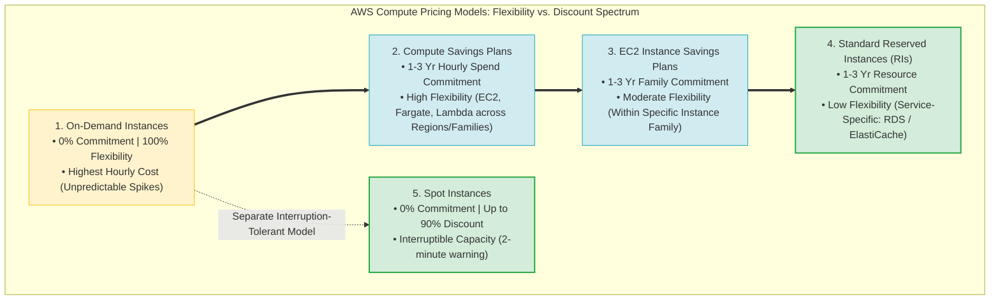
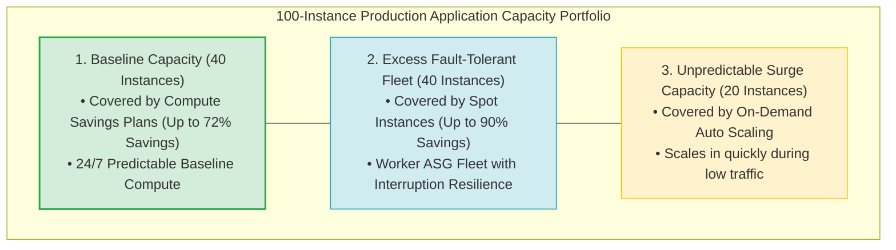
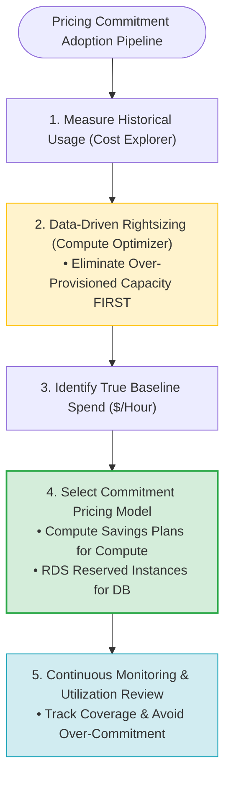
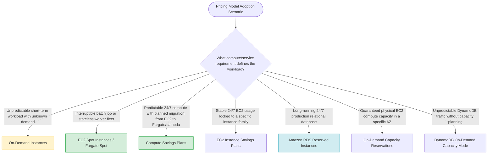

# Task 3.5: Identify Opportunities for Cost Optimizations — Pricing Model Adoptions

> [!NOTE]
> **Exam Mindset**: For the AWS Solutions Architect Professional (SAP-C02) and AI Practitioner (AIP-C01) exams, pricing model adoption represents a trade-off between usage certainty and commitment flexibility:
> **Workload Predictability & Interruption Tolerance** $\rightarrow$ **Resource Rightsizing First** $\rightarrow$ **Optimal Model Selection (Spot / Savings Plans / RIs / On-Demand)** $\rightarrow$ **Coverage & Utilization Monitoring**.

---

## 1. Pricing Model Flexibility vs. Commitment Spectrum



---

## 2. Hybrid Multi-Model Compute Portfolio Architecture



---

## 3. Compute Pricing Models Comparison Breakdown Matrix

| Pricing Model | Commitment Required | Discount Savings | Interruption Risk? | Flexibility Across Services | Primary Exam Keyword Trigger |
| :--- | :--- | :--- | :--- | :--- | :--- |
| **On-Demand** | None | 0% (Baseline) | ❌ **No** | Full Flexibility | *"Unpredictable / Short-term / Unknown demand"* |
| **Compute Savings Plans**| 1 or 3 Years ($/hr) | Up to 72% | ❌ **No** | EC2, Fargate, Lambda across Regions | *"Flexible commitment across EC2, Fargate, Lambda"* |
| **EC2 Instance Savings Plans**| 1 or 3 Years ($/hr) | Up to 72% | ❌ **No** | Specific EC2 Family in a Region | *"Commitment locked to specific EC2 instance family"* |
| **Standard RIs** | 1 or 3 Years | Up to 72% | ❌ **No** | Locked to specific service / type | *"RDS database running 24x7 continuously for 3 years"* |
| **Spot Instances** | None | Up to 90% | ⚠️ **Yes** (2-min notice)| Compute diversification | *"Fault-tolerant / Batch processing / Interruptible"* |

---

## 4. Pricing Commitment Adoption Sequence (Rightsize First Pipeline)



> [!IMPORTANT]
> **Savings Plans vs. Reserved Instances Scope**:
> - **Compute Savings Plans**: Covers **EC2, AWS Fargate, and AWS Lambda** automatically regardless of Region, OS, instance family, or architecture migration.
> - **RDS Reserved Instances**: Required for relational databases. Compute Savings Plans do **NOT** cover Amazon RDS, Amazon ElastiCache, or Amazon OpenSearch Service.

---

## 5. Pricing Commitment vs. Capacity Guarantee Distinction

| Feature / Dimension | Discount Pricing Commitment (Savings Plans / RIs) | On-Demand Capacity Reservations |
| :--- | :--- | :--- |
| **Primary Purpose** | Billing discount on steady compute usage | Guarantee physical EC2 capacity in a specific AZ |
| **Hardware Reservation**| ❌ **No** (Only billing discount applied) | ✅ **Yes** (Reserves physical EC2 hardware slot) |
| **Use Case Trigger** | *"Lower cost for 24/7 predictable baseline"* | *"Guaranteed EC2 capacity for DR failover in AZ-B"* |

---

## 6. Avoiding Overcommitment in Savings Plans

> [!TIP]
> **Commit to Baseline, Not Peak Load**:
> If an application scales between 10 instances (baseline) and 50 instances (peak), purchase a Savings Plan for the 10 baseline instances only. Let the remaining 40 instances run under **Auto Scaling** using **Spot Instances** (if fault-tolerant) or **On-Demand**. Committing to 50 instances results in paying for unused capacity during off-peak hours.

---

## 7. SAP-C02 Pricing Model Adoption Master Selection Decision Engine



---

## 8. SAP-C02 Exam Keyword Cheat Sheet

```
"Flexible commitment across EC2, Fargate, and Lambda"  ──> Compute Savings Plans
"Commitment locked to specific EC2 instance family"   ──> EC2 Instance Savings Plans
"Continuous long-running 24/7 RDS database"           ──> Amazon RDS Reserved Instances
"Guarantee EC2 launch capacity in specific AZ"        ──> On-Demand Capacity Reservations
"Fault-tolerant interruptible batch processing"       ──> EC2 Spot Instances / Fargate Spot
"Unpredictable short-duration new workload"           ──> On-Demand Instances
"Analyze historical usage before purchasing plans"   ──> AWS Cost Explorer
"Monitor Savings Plans coverage and utilization"     ──> AWS Cost Management / Savings Plans Dashboard
```

---

## 9. Common SAP-C02 Exam Traps

1. **Trap 1: Assuming Compute Savings Plans Apply to Amazon RDS**: Compute Savings Plans apply only to EC2, Fargate, and Lambda. For RDS databases, purchase **RDS Reserved Instances**.
2. **Trap 2: Purchasing Commitments Before Rightsizing Instances**: Committing to an oversized instance locks in wasted spend for 1 to 3 years. Always **Rightsize First** using **AWS Compute Optimizer**.
3. **Trap 3: Purchasing Savings Plans for 100% of Peak Workload**: Reserving peak capacity causes massive waste during low-traffic periods. Commit only to the **predictable 24/7 baseline**.
4. **Trap 4: Confusing Billing Commitments with Capacity Reservations**: Reserved Instances or Savings Plans do not guarantee that EC2 instances will launch if an AZ suffers capacity limits. For guaranteed capacity, deploy **On-Demand Capacity Reservations**.

---

## 10. Final Mental Model

`Rightsize First ➔ Identify 24/7 Baseline (Compute Savings Plans / RIs) ➔ Use Spot for Fault-Tolerant Workloads ➔ Use On-Demand for Unpredictable Peaks`