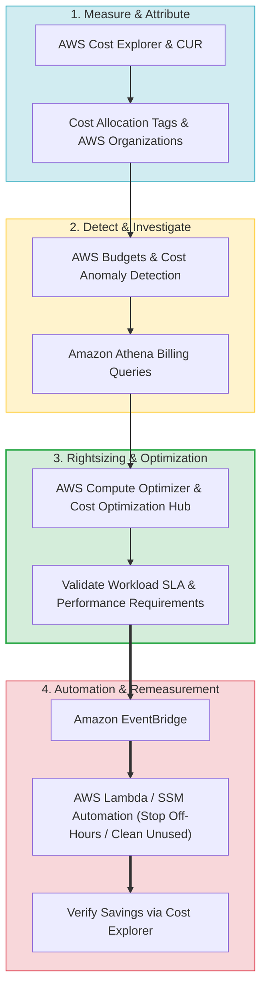
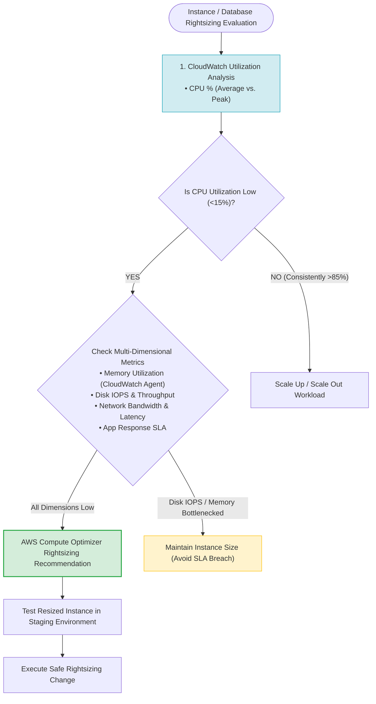
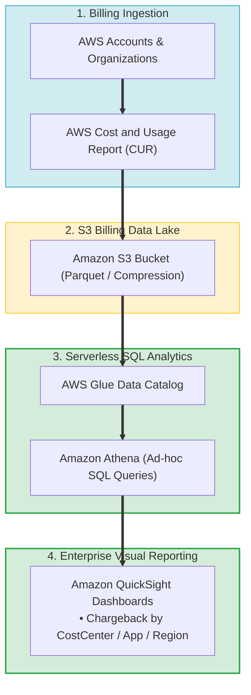
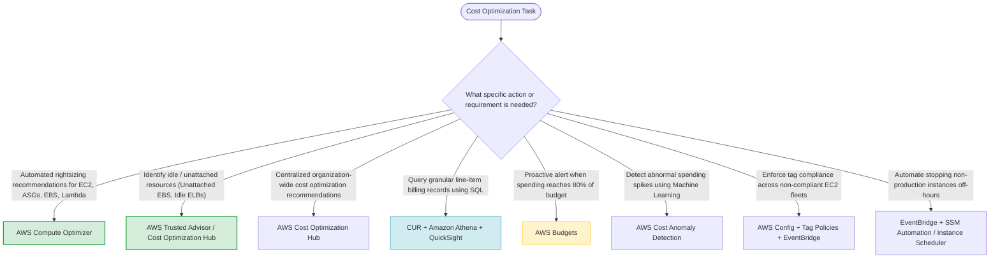

# Task 3.5: Identify Opportunities for Cost Optimizations — Core Skills & Architectural Patterns

> [!NOTE]
> **Exam Mindset**: For the AWS Solutions Architect Professional (SAP-C02) and AI Practitioner (AIP-C01) exams, Domain 3.5 Skills evaluates your ability to establish continuous cost optimization control loops, perform multi-dimensional rightsizing, clean unused resources, and automate cost governance:
> **Measure (Cost Explorer / CUR)** $\rightarrow$ **Attribute (Tags / Orgs)** $\rightarrow$ **Detect (Budgets / Anomaly)** $\rightarrow$ **Rightsizing & Validation** $\rightarrow$ **Automate Remediation (SSM / EventBridge)**.

---

## 1. End-to-End Continuous Cost Optimization Control Loop Architecture



---

## 2. Multi-Dimensional Rightsizing Decision & Validation Pipeline



---

## 3. Resource Metric Analysis Breakdown for Rightsizing

| Resource Layer | Primary Metrics to Analyze | AWS Tool / Recommendation Engine | Exam Clue / Optimization Action |
| :--- | :--- | :--- | :--- |
| **Compute (EC2 / ASG / Lambda)** | CPU, Memory (Agent), Disk IOPS, Network | AWS Compute Optimizer | *"Underutilized EC2 / Over-provisioned vCPU"* |
| **Databases (RDS / Aurora)** | CPU, Connections, IOPS, Latency, Storage | Amazon RDS Performance Insights | *"High CPU / Low IOPS -> Rightsize DB class"* |
| **Storage (EBS / S3)** | Storage volume, Access frequency, Object age | S3 Storage Class Analysis | *"Unattached EBS volumes / Transition to S3 IA"* |
| **Networking (NAT / Egress)** | NAT processing volume, Cross-AZ traffic | VPC Flow Logs / Cost Explorer | *"High NAT processing charges -> S3 Gateway Endpoint"* |

---

## 4. Enterprise CUR & Granular Analytics Data Pipeline



> [!IMPORTANT]
> **Multi-Dimensional Rightsizing Rule**:
> Never downsize an instance based on **CPU utilization alone**. An instance with 5% average CPU might have **95% peak memory utilization** or high disk IOPS requirement. Downsizing without multi-dimensional validation will violate application performance SLAs.

---

## 5. Chargeback vs. Showback Governance

> [!TIP]
> **Accountability vs. Financial Reporting**:
> - **Chargeback**: Directly bills AWS infrastructure costs back to department budgets using Cost Allocation Tags (e.g., `CostCenter=1001`).
> - **Showback**: Reports usage and spending to business units to increase cost awareness without executing internal financial transactions.

---

## 6. Identifying & Automating Unused Resource Cleanup

> [!CAUTION]
> **Validate Business Purpose Before Deletion**:
> Before terminating idle EC2 instances or deleting unattached EBS volumes, verify ownership via tags and check for **Disaster Recovery (DR)**, compliance, or backup retention policies. Never delete resources automatically without validation.

---

## 7. SAP-C02 Domain 3.5 Skills Master Selection Decision Engine



---

## 8. SAP-C02 Exam Keyword Cheat Sheet

```
"Automated EC2 rightsizing recommendations"          ──> AWS Compute Optimizer
"Find idle load balancers and unattached EBS volumes" ──> AWS Trusted Advisor / Cost Optimization Hub
"Centralized cost optimization recommendations"       ──> AWS Cost Optimization Hub
"Query detailed billing data with SQL"                ──> CUR + Amazon Athena
"Enforce tag policies across organization"           ──> Tag Policies + AWS Config
"Automated off-hours instance shutdown"              ──> Amazon EventBridge + SSM Automation / Instance Scheduler
"Attribute costs for chargeback / showback"           ──> Cost Allocation Tags
```

---

## 9. Common SAP-C02 Exam Traps

1. **Trap 1: Downsizing EC2 Instances Based Only on Average CPU**: Low average CPU might mask 95% peak spikes or high memory/IOPS usage. Always conduct **multi-dimensional metric analysis** before rightsizing.
2. **Trap 2: Using CloudWatch Instead of Compute Optimizer for Rightsizing Recommendations**: CloudWatch collects raw metrics. **AWS Compute Optimizer** analyzes those metrics using ML to deliver actionable instance family recommendations.
3. **Trap 3: Blindly Terminating Unused Resources Without Business Validation**: Resources with zero traffic might be warm disaster recovery standby nodes. Always check ownership and DR policies before deletion.
4. **Trap 4: Building Custom Billing Platforms When Cost Explorer & CUR Exist**: Never write custom billing log harvesters. Use **CUR exported to S3** and query directly with **Amazon Athena**.

---

## 10. Final Mental Model

`Measure (Cost Explorer / CUR) ➔ Attribute (Tags / Orgs) ➔ Detect (Budgets / Anomaly) ➔ Multi-Dimensional Rightsizing ➔ Automate Remediation ➔ Re-measure`