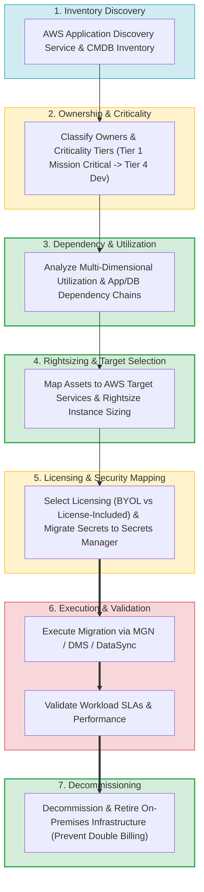
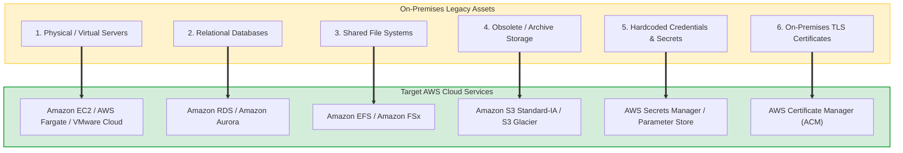
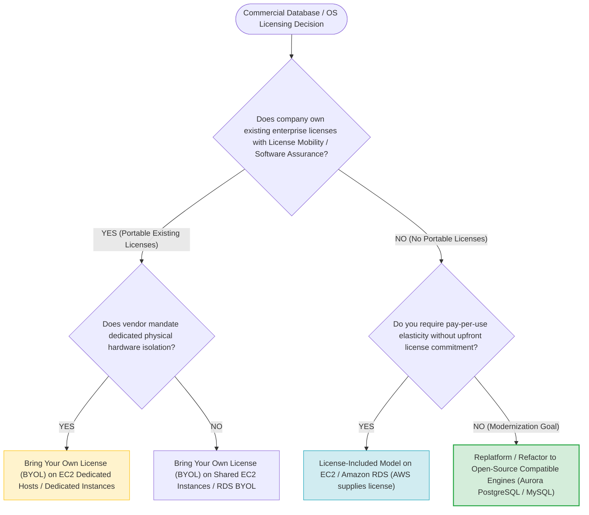
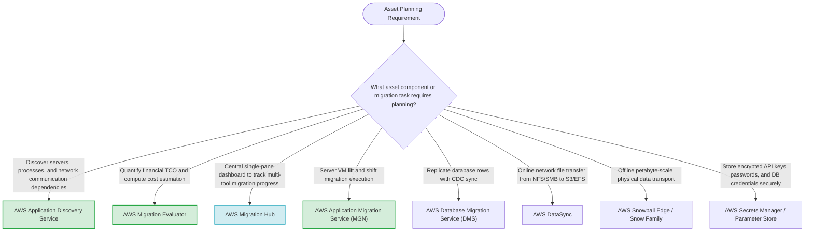

# Task 4.1: Select Existing Workloads and Processes for Potential Migration — Asset Planning

> [!NOTE]
> **Exam Mindset**: For the AWS Solutions Architect Professional (SAP-C02) and AI Practitioner (AIP-C01) exams, asset planning is the resource-level inventory and specification framework that follows high-level portfolio assessment:
> **Portfolio Strategy** $\rightarrow$ **Resource Inventory & Telemetry (Discovery Service)** $\rightarrow$ **Dependency Chain Mapping** $\rightarrow$ **Rightsizing & Licensing Selection** $\rightarrow$ **Migration Execution** $\rightarrow$ **Legacy Decommissioning**.

---

## 1. End-to-End Asset Planning & Decommissioning Lifecycle



---

## 2. Workload Asset Mapping & AWS Target Service Matrix



---

## 3. Portfolio Assessment vs. Asset Planning Responsibility Matrix

| Dimension / Aspect | Portfolio Assessment | Asset Planning |
| :--- | :--- | :--- |
| **Primary Scope** | Application / Workload macro-level strategy | Specific infrastructure resource micro-level planning |
| **Core Question Asked** | *"Which applications should migrate and why?"* | *"What exact servers, databases, files, and licenses exist?"* |
| **Typical Artifact** | Application catalog mapped to 7 Rs strategies | Detailed asset inventory, dependency chain, and rightsizing spec |
| **Target AWS Tools** | AWS Migration Hub Strategy Recommendations | AWS Application Discovery Service, CMDB, AWS Systems Manager |
| **Output Goal** | Prioritized migration wave schedule | Specific AWS target configuration, secrets, and cutover plan |

---

## 4. Licensing Model Decision Tree (BYOL vs. License-Included)



> [!IMPORTANT]
> **Decommissioning Legacy Infrastructure is Critical for Cost Reduction**:
> Migrating 100 servers to AWS without shutting down the legacy on-premises servers results in **paying twice for infrastructure**. Asset planning must explicitly incorporate post-cutover **decommissioning and retirement stages** to capture projected cost savings.

---

## 5. Migrating Configuration Secrets & Security Assets

> [!TIP]
> **Replace Hardcoded Configuration Secrets During Migration**:
> On-premises assets often store hardcoded database passwords, TLS certificates, and API keys in local config files. During asset planning, mandate migrating credentials to **AWS Secrets Manager** or **AWS Systems Manager Parameter Store**, and TLS certificates to **AWS Certificate Manager (ACM)**.

---

## 6. Storage Workload Asset Mapping

> [!NOTE]
> **Storage Asset Optimization Beyond Simple EBS Volumes**:
> Do not automatically convert an on-premises 100 TB file server into a massive 100 TB Amazon EBS volume. Analyze file access patterns during asset planning:
> - **Shared POSIX file access**: Map to **Amazon EFS**.
> - **Windows SMB shares / Active Directory**: Map to **Amazon FSx for Windows File Server**.
> - **Rarely accessed archival files**: Map to **Amazon S3 Standard-IA / S3 Glacier**.

---

## 7. SAP-C02 Domain 4.1 Asset Planning Master Selection Decision Engine



---

## 8. SAP-C02 Exam Keyword Cheat Sheet

```
"Inventory detailed servers, databases, files, and service accounts" ──> Asset Planning Framework
"Discover server telemetry and map inter-process dependencies"      ──> AWS Application Discovery Service
"Decommission on-premises infrastructure post-cutover"               ──> Asset Decommissioning (Eliminate Double Billing)
"Commercial DB licensing tied to physical cores"                     ──> BYOL on EC2 Dedicated Hosts
"Secure migration of database passwords and API keys"                ──> AWS Secrets Manager / Parameter Store
"Migrate Windows SMB file shares with Active Directory integration"  ──> Amazon FSx for Windows File Server
"Migrate POSIX Linux file shares accessible across multiple EC2s"    ──> Amazon EFS
```

---

## 9. Common SAP-C02 Exam Traps

1. **Trap 1: Migrating On-Premises Servers Without Rightsizing Target Compute**: Migrating a 32-vCPU server running at 10% utilization to an identical 32-vCPU EC2 instance locks in waste. Always **Rightsize Target Infrastructure** during asset planning.
2. **Trap 2: Forgetting Legacy Infrastructure Decommissioning**: Failing to schedule legacy server shutdown results in running parallel infrastructure and doubling operational costs.
3. **Trap 3: Transporting Hardcoded Passwords in Application Config Files**: Plaintext credentials violate AWS security baselines. Migrate all secrets to **AWS Secrets Manager** during asset planning.
4. **Trap 4: Selecting Shared EC2 for Databases with Core-Based Host Licensing Restrictions**: Enterprise vendors (e.g., Oracle) require physical core licensing. Select **EC2 Dedicated Hosts** to comply with core-based licensing rules.

---

## 10. Final Mental Model

`Inventory Telemetry ➔ Map Dependencies ➔ Rightsize Target Compute ➔ Map Security & Secrets ➔ Migrate ➔ Decommission Legacy Assets`