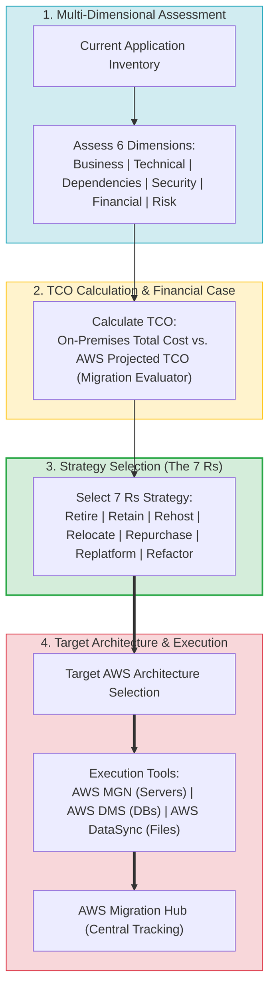
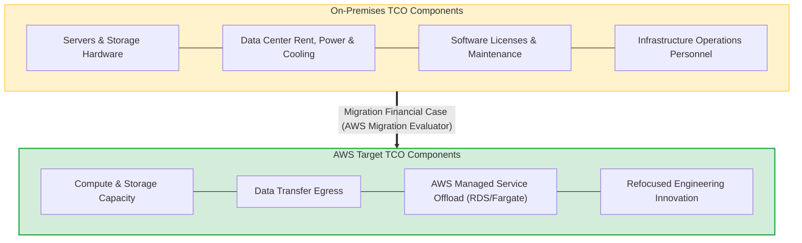
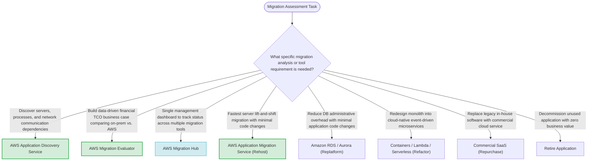

# Task 4.1: Select Existing Workloads and Processes for Potential Migration — Core Skills & Architectural Patterns

> [!NOTE]
> **Exam Mindset**: For the AWS Solutions Architect Professional (SAP-C02) and AI Practitioner (AIP-C01) exams, Domain 4.1 Skills evaluates your ability to execute the complete migration decision chain:
> **Multi-Dimensional Assessment (Discovery Service)** $\rightarrow$ **Financial TCO Modeling (Migration Evaluator)** $\rightarrow$ **The 7 Rs Strategy Selection** $\rightarrow$ **Target AWS Architecture Design** $\rightarrow$ **Migration Execution & Tracking (Migration Hub)**.

---

## 1. End-to-End Migration Decision & Execution Pipeline



---

## 2. The 7 Rs Strategy Cost, Effort, & Modernization Spectrum

```mermaid
flowchart TD
    subgraph Spectrum ["The 7 Rs Migration Strategy Spectrum"]
        Retire["1. Retire<br/>• $0 Migration Cost | Zero Effort<br/>• Maximum Instant Savings (Decommission)"]
        Retain["2. Retain<br/>• $0 Migration Cost | Keep On-Prem<br/>• On-Prem Operating Costs Continue"]
        Rehost["3. Rehost (Lift & Shift)<br/>• Low Migration Effort | Fast Timeline<br/>• AWS Application Migration Service (MGN)"]
        Relocate["4. Relocate<br/>• Low/Medium Effort | Infrastructure Move<br/>• VMware Cloud on AWS"]
        Repurchase["5. Repurchase (SaaS)<br/>• Medium Effort | Replace Product<br/>• Move to Commercial SaaS (e.g. Salesforce)"]
        Replatform["6. Replatform (Lift & Tinker)<br/>• Medium Effort | Managed Services<br/>• Move to Amazon RDS / Aurora"]
        Refactor["7. Refactor (Re-architect)<br/>• High Initial Effort & Cost | Highest Long-Term Value<br/>• Redesign into Serverless / Containers"]
    end

    Retire --- Retain --- Rehost --- Relocate --- Repurchase --- Replatform --- Refactor

    style Retire fill:#f8d7da,stroke:#dc3545,stroke-width:1px
    style Rehost fill:#d4edda,stroke:#28a745,stroke-width:2px
    style Replatform fill:#d1ecf1,stroke:#17a2b8,stroke-width:1px
    style Refactor fill:#fff3cd,stroke:#ffc107,stroke-width:1px
```



---

## 3. The 7 Rs Strategy Decision Breakdown Matrix

| 7 R Migration Strategy | Modification Level | Migration Speed | Migration Effort | Primary Exam Trigger / Workload Reason |
| :--- | :--- | :--- | :--- | :--- |
| **1. Retire** | Decommission | Highest | Lowest | *"Application is obsolete / Unused / Zero business value"* |
| **2. Retain** | None | N/A | None | *"Regulatory restriction / Legacy hardware constraint"* |
| **3. Rehost** | Minimal (Lift & Shift)| High | Low | *"Fastest migration speed with minimal application code change"* |
| **4. Relocate** | Minimal (VMware) | High | Low / Medium | *"Move entire VMware environment to VMware Cloud on AWS"* |
| **5. Repurchase** | Product Replace | Medium | Medium | *"Replace internal legacy software with commercial SaaS product"* |
| **6. Replatform** | Limited (Lift & Tinker)| Medium | Medium | *"Reduce DB administrative overhead by moving to Amazon RDS/Aurora"* |
| **7. Refactor** | Redesign Code | Low | High | *"Cloud-native modernization into microservices/serverless"* |

---

## 4. Total Cost of Ownership (TCO) vs. Price Comprehensive Model



> [!IMPORTANT]
> **TCO Includes Operational & Personnel Costs — Not Just Compute Price**:
> Comparing the price of an EC2 instance directly against an on-premises physical server is incomplete. **Total Cost of Ownership (TCO)** incorporates hardware maintenance, data center power/cooling, software licenses, database administration personnel, backups, and disaster recovery.

---

## 5. Assessment Tooling Roles & Distinctions

> [!TIP]
> **Application Discovery Service vs. Migration Evaluator vs. Migration Hub**:
> - **AWS Application Discovery Service**: Discovers **technical infrastructure telemetry** (servers, process maps, dependencies).
> - **AWS Migration Evaluator**: Quantifies the **financial TCO business case** (comparing on-prem vs. AWS costs).
> - **AWS Migration Hub**: Tracks **multi-tool migration progress** across execution tools.

---

## 6. Rehost vs. Replatform vs. Refactor Trade-off

> [!NOTE]
> **Selecting the Right Transformation Level**:
> - **Rehost (Lift & Shift)**: Lowest migration effort and fastest timeline, but retains legacy architecture and operating overhead.
> - **Replatform (Lift & Tinker)**: Moderate migration effort that reduces administrative overhead by adopting managed AWS services (e.g., Amazon RDS).
> - **Refactor (Re-architect)**: Highest initial engineering effort and cost, but unlocks maximum long-term elasticity, performance, and cloud-native cost savings.

---

## 7. SAP-C02 Domain 4.1 Skills Master Selection Decision Engine



---

## 8. SAP-C02 Exam Keyword Cheat Sheet

```
"Map server telemetry and inter-process network dependencies"      ──> AWS Application Discovery Service
"Financial business case comparing on-premise TCO to AWS"          ──> AWS Migration Evaluator
"Centralized progress tracking dashboard across migration tools"   ──> AWS Migration Hub
"Fastest migration speed with minimal application code changes"    ──> Rehost (AWS Application Migration Service)
"Reduce database patching and operational overhead"               ──> Replatform (Amazon RDS / Aurora)
"Redesign monolith into cloud-native microservices or serverless"  ──> Refactor
"Replace internal legacy application with commercial SaaS product"──> Repurchase
"Application has zero business value or is obsolete"              ──> Retire (Decommission immediately)
```

---

## 9. Common SAP-C02 Exam Traps

1. **Trap 1: Evaluating Migration Options Based Only on EC2 Instance Price**: Ignoring operational labor, database patching, power/cooling, and licensing leads to incorrect decisions. Always calculate **Total Cost of Ownership (TCO)** using **AWS Migration Evaluator**.
2. **Trap 2: Choosing Refactoring When the Goal is Urgent Data Center Exit**: Refactoring requires extensive software redesign and testing. If urgent migration speed is required, choose **Rehosting (AWS MGN)** or **Relocating (VMware Cloud on AWS)**.
3. **Trap 3: Confusing AWS Migration Hub with a Server Migration Engine**: Migration Hub provides central status tracking; it does not perform block replication. Use **AWS MGN** to migrate servers.
4. **Trap 4: Blindly Rehosting Commercial Databases without Evaluating Managed Options**: Rehosting self-managed databases to EC2 retains database patching and backup burdens. Evaluate **Replatforming to Amazon RDS/Aurora** to lower operational overhead.

---

## 10. Final Mental Model

`Discover Telemetry (Discovery Service) ➔ Model TCO (Migration Evaluator) ➔ Select 7 Rs Strategy ➔ Design Target AWS Architecture ➔ Migrate & Track (Migration Hub)`