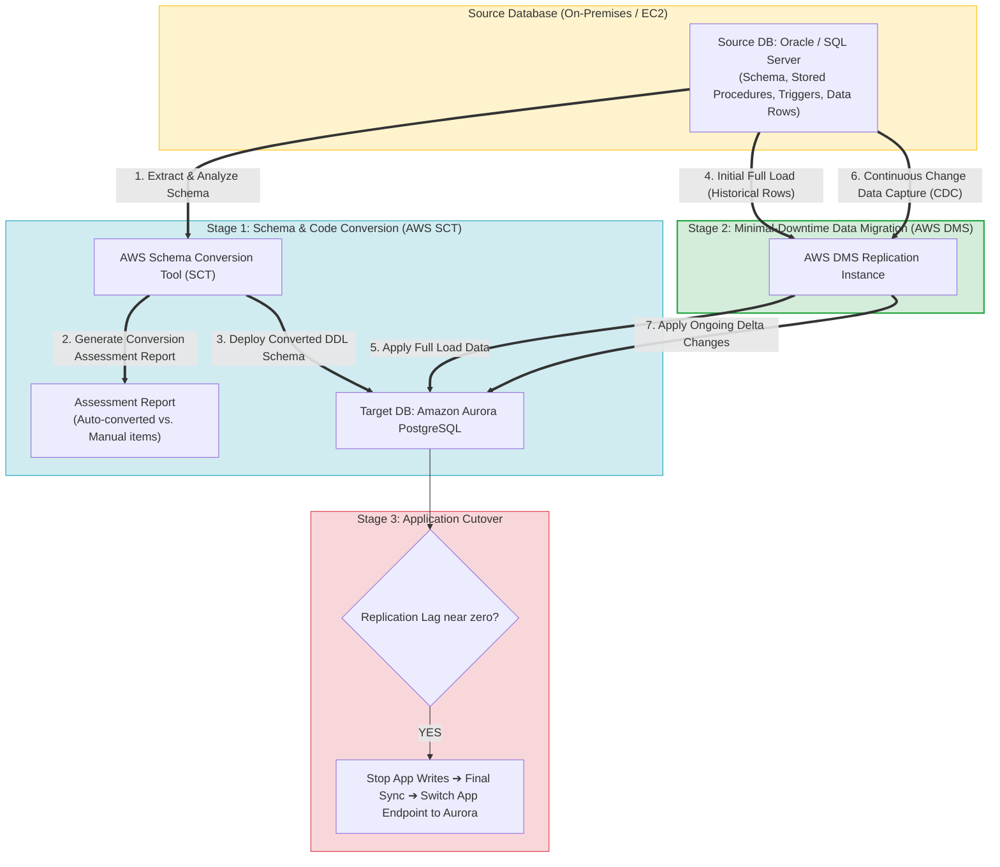
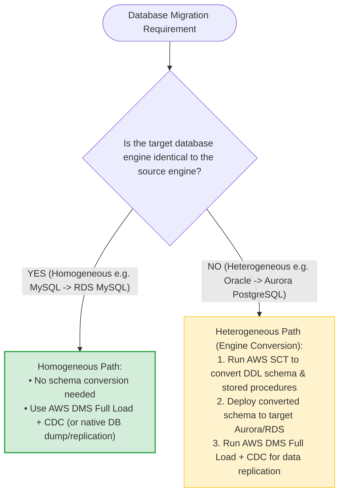
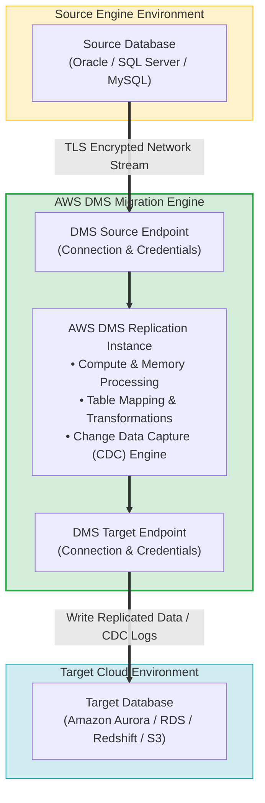
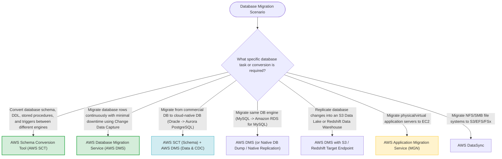

# Task 4.2: Determine the Optimal Migration Approach for Existing Workloads — Database Migration Tools

> [!NOTE]
> **Exam Mindset**: For the AWS Solutions Architect Professional (SAP-C02) and AI Practitioner (AIP-C01) exams, remember the golden rule separating database migration tooling:
> **AWS Schema Conversion Tool (AWS SCT)** = *"Converts database structure, DDL schema, and stored code"*
> **AWS Database Migration Service (AWS DMS)** = *"Migrates data rows and continuously replicates changes with CDC"*.

---

## 1. Heterogeneous Database Migration Pipeline Architecture (SCT + DMS CDC)



---

## 2. Homogeneous vs. Heterogeneous Database Migration Decision Matrix



---

## 3. Database Migration Tooling Responsibility Matrix

| Feature / Capability | AWS Schema Conversion Tool (AWS SCT) | AWS Database Migration Service (AWS DMS) |
| :--- | :--- | :--- |
| **Primary Responsibility** | Converts database schema, DDL, stored procedures, & functions | Migrates data records, historical rows, and ongoing CDC deltas |
| **Data Replication Scope** | None (Schema & code structure conversion only) | Full Load (initial copy) + Change Data Capture (CDC sync) |
| **Migration Type Focus** | Required for **Heterogeneous** migrations | Used for both **Homogeneous** and **Heterogeneous** migrations |
| **Key Output Artifact** | Converted target DDL script & Assessment Report | Synchronized Target Database (Amazon RDS / Aurora / Redshift) |
| **Downtime Impact** | Used before migration begins (Zero downtime impact) | Enables minimal-downtime cutover via continuous CDC |

---

## 4. AWS DMS Replication Instance & Endpoints Architecture



> [!IMPORTANT]
> **Heterogeneous Migrations Require BOTH AWS SCT and AWS DMS**:
> When migrating across different database engines (e.g., Oracle $\rightarrow$ Amazon Aurora PostgreSQL):
> 1. Use **AWS SCT** to convert DDL schemas, stored procedures, triggers, and functions.
> 2. Use **AWS DMS** to perform the initial **Full Load** data migration and enable continuous **Change Data Capture (CDC)**.

---

## 5. Homogeneous Migration Does NOT Require AWS SCT

> [!NOTE]
> **Same Engine Migration Simplification**:
> If migrating between the same engine (e.g., on-premises PostgreSQL $\rightarrow$ Amazon RDS for PostgreSQL), **AWS SCT is not required**. The target database uses native schema structure. Migrate data directly using **AWS DMS** or native engine tools (`pg_dump` / `mysqldump`).

---

## 6. Minimal Downtime Cutover via Change Data Capture (CDC)

> [!TIP]
> **Achieving Zero/Minimal Application Downtime**:
> To minimize cutover downtime during database migration:
> 1. Launch DMS **Full Load** while the source database remains live and fully operational.
> 2. Enable **CDC (Change Data Capture)** to continuously capture ongoing transaction logs.
> 3. Monitor **Replication Lag** in CloudWatch. When lag approaches zero, perform a brief cutover window, freeze source writes, perform final delta sync, and point the application to the new AWS database endpoint.

---

## 7. SAP-C02 Domain 4.2 Database Migration Master Selection Decision Engine



---

## 8. SAP-C02 Exam Keyword Cheat Sheet

```
"Convert DDL schemas, PL/SQL, and stored procedures between different engines"──> AWS Schema Conversion Tool (AWS SCT)
"Generate conversion complexity assessment report"                     ──> AWS SCT Assessment Report
"Migrate database data with minimal downtime using Change Data Capture"  ──> AWS DMS with CDC
"Oracle or SQL Server to Amazon Aurora PostgreSQL migration"           ──> AWS SCT (Schema) + AWS DMS (Data & CDC)
"Replicate live operational database changes to Amazon S3 data lake"   ──> AWS DMS with S3 Target Endpoint
```

---

## 9. Common SAP-C02 Exam Traps

1. **Trap 1: Choosing AWS DMS Alone for Heterogeneous Migrations**: DMS replicates data rows, but does not automatically rewrite incompatible PL/SQL stored procedures or proprietary SQL syntax. Always combine **AWS SCT + AWS DMS**.
2. **Trap 2: Using AWS SCT for Homogeneous Same-Engine Migrations**: Adding SCT to a PostgreSQL-to-PostgreSQL migration adds unnecessary complexity. Homogeneous migrations do not require schema conversion.
3. **Trap 3: Selecting AWS Application Migration Service (MGN) for Managed DB Replatforming**: MGN rehosts entire server VMs. To move database contents to Amazon RDS/Aurora managed database engines, choose **AWS DMS**.
4. **Trap 4: Selecting AWS DataSync for Relational Database Replication**: DataSync moves file systems and object storage. To migrate relational databases with transaction logs, choose **AWS DMS**.

---

## 10. Final Mental Model

`Heterogeneous Migration ➔ SCT (Schema & Code) ➔ DMS Full Load (Data Rows) ➔ DMS CDC (Continuous Replication) ➔ Minimal Downtime Cutover`