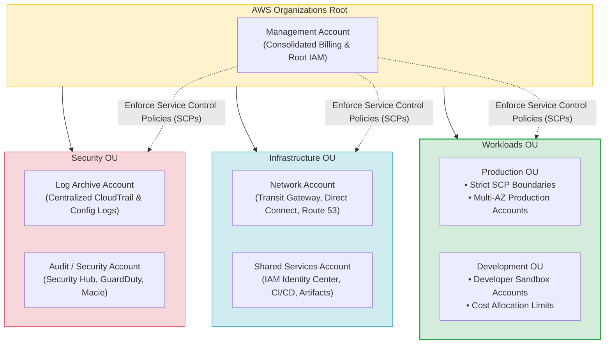
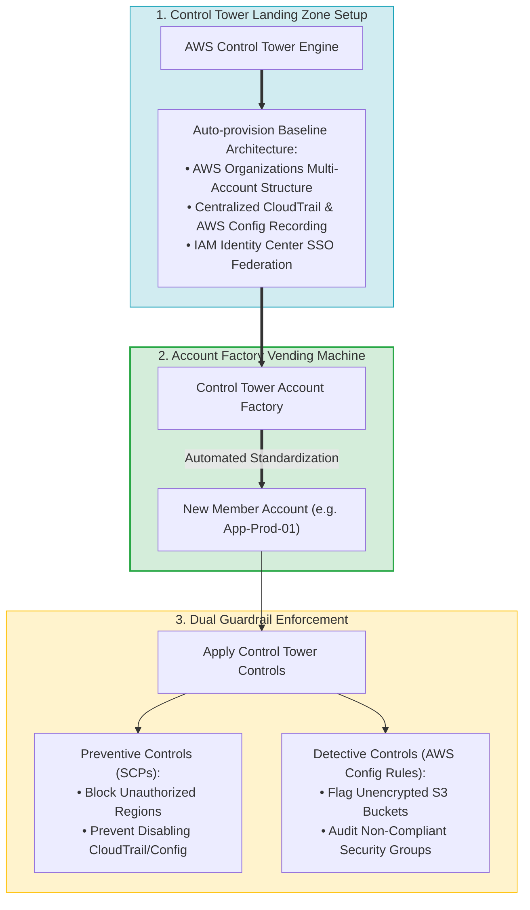
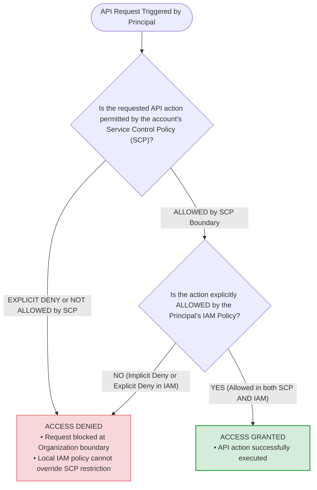
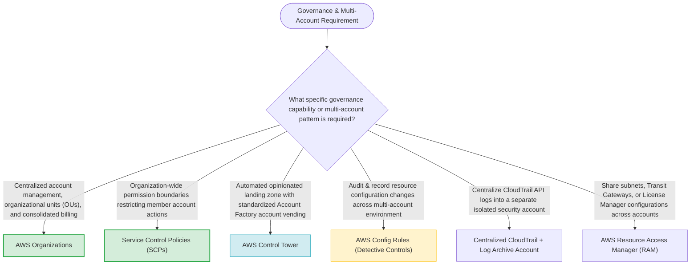

# Task 4.2: Determine the Optimal Migration Approach for Existing Workloads — Governance Tools

> [!NOTE]
> **Exam Mindset**: For the AWS Solutions Architect Professional (SAP-C02) and AI Practitioner (AIP-C01) exams, multi-account governance relies on understanding two distinct layers:
> **AWS Organizations** = *"Multi-account foundation, OU hierarchy, consolidated billing, and SCP boundaries"*
> **AWS Control Tower** = *"Opinionated landing zone automation, Account Factory vending, and managed guardrails"*.

---

## 1. Multi-Account Landing Zone & Governance Hierarchy



---

## 2. Control Tower Account Factory & Guardrail Execution Engine



---

## 3. AWS Organizations vs. AWS Control Tower Comparison Breakdown

| Feature / Dimension | AWS Organizations | AWS Control Tower |
| :--- | :--- | :--- |
| **Primary Scope** | Multi-account foundation layer | Opinionated landing zone & account vending orchestration layer |
| **Core Capabilities** | Account creation, OUs, Service Control Policies (SCPs), Consolidated Billing | Automated landing zone setup, Account Factory, Managed Guardrails, Dashboard |
| **Account Provisioning** | Manual account creation or API scripts | Account Factory (standardized automated vending machine) |
| **Guardrail Management** | Manual creation and attachment of SCPs to OUs/accounts | Built-in mandatory, strongly recommended, and elective controls |
| **Underlying Tech Stack** | Native standalone multi-account service | Built on top of AWS Organizations, Config, CloudTrail, SSO, & CloudFormation |

---

## 4. SCP vs. IAM Policy Permission Evaluation Flow



> [!IMPORTANT]
> **Service Control Policies (SCPs) Set Maximum Permission Boundaries ONLY**:
> An SCP filters and restricts the maximum available permissions for member accounts, but **SCPs DO NOT grant any permissions**. A user or role must still be granted explicit permissions via an **IAM Policy** to perform any AWS API action.

---

## 5. Establish Governance BEFORE Executing Workload Migrations

> [!TIP]
> **Landing Zone Readiness Prior to Migration**:
> Before migrating 100 enterprise applications to AWS:
> 1. Set up an automated **Landing Zone** using **AWS Control Tower**.
> 2. Create standardized **Organizational Units (OUs)** for Security, Infrastructure, and Workloads.
> 3. Enforce **Preventive Controls (SCPs)** (e.g., blocking unauthorized AWS Regions) and **Detective Controls (AWS Config)**.
> 4. Provision target accounts via **Control Tower Account Factory** to ensure baseline compliance.

---

## 6. Preventive Guardrails (SCPs) vs. Detective Guardrails (AWS Config)

> [!NOTE]
> **Preventive vs. Detective Enforcement**:
> - **Preventive Guardrails (SCPs)**: Intercept API calls and **prevent non-compliant actions from occurring** (e.g., blocking `ec2:RunInstances` in unapproved AWS Regions).
> - **Detective Guardrails (AWS Config Rules)**: Allow resource creation but **audit and flag non-compliant configurations** (e.g., detecting an S3 bucket that was created without default encryption).

---

## 7. SAP-C02 Domain 4.2 Governance Master Selection Decision Engine



---

## 8. SAP-C02 Exam Keyword Cheat Sheet

```
"Centralized multi-account structure and consolidated billing"        ──> AWS Organizations
"Organization-wide permission guardrails blocking member account actions"──> Service Control Policies (SCPs)
"Automated landing zone setup with standardized Account Factory"       ──> AWS Control Tower
"Standardized provisioning of governed AWS accounts"                   ──> Control Tower Account Factory
"Block member account users from launching resources in unapproved Regions"──> SCP Region Restriction
"Audit and detect non-compliant S3 bucket configuration across accounts" ──> AWS Config Rules (Detective)
"Share VPC subnets or Transit Gateways across AWS accounts"            ──> AWS Resource Access Manager (RAM)
```

---

## 9. Common SAP-C02 Exam Traps

1. **Trap 1: Assuming SCPs Grant Access Permissions**: SCPs specify maximum permission boundaries. An SCP allowing S3 access does not grant permissions until an **IAM Policy** explicitly permits it.
2. **Trap 2: Creating a Single AWS Account for All Enterprise Migration Workloads**: Placing production, testing, and shared services in one account increases blast radius and service quota limits. Deploy a **Multi-Account Landing Zone** via Control Tower.
3. **Trap 3: Using AWS Config to Prevent Prohibited API Actions**: AWS Config audits and detects violations after creation. To **prevent** prohibited actions from running, deploy **SCPs**.
4. **Trap 4: Storing Central Audit Logs in Individual Workload Accounts**: Storing CloudTrail logs inside member accounts allows local administrators to tamper with logs. Always stream CloudTrail logs to a central **Log Archive Account** protected by S3 object lock and restrictive bucket policies.

---

## 10. Final Mental Model

`Multi-Account Foundation (Organizations) ➔ Automated Landing Zone (Control Tower) ➔ Standardized Vending (Account Factory) ➔ Preventive Guardrails (SCPs) ➔ Detective Auditing (Config)`