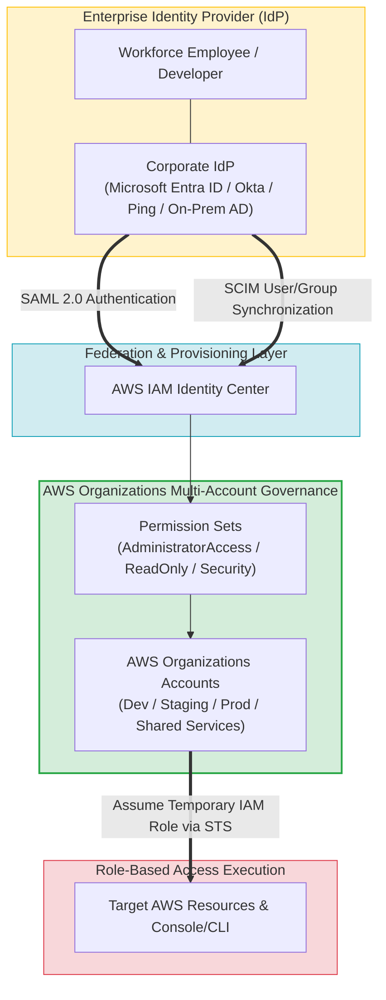
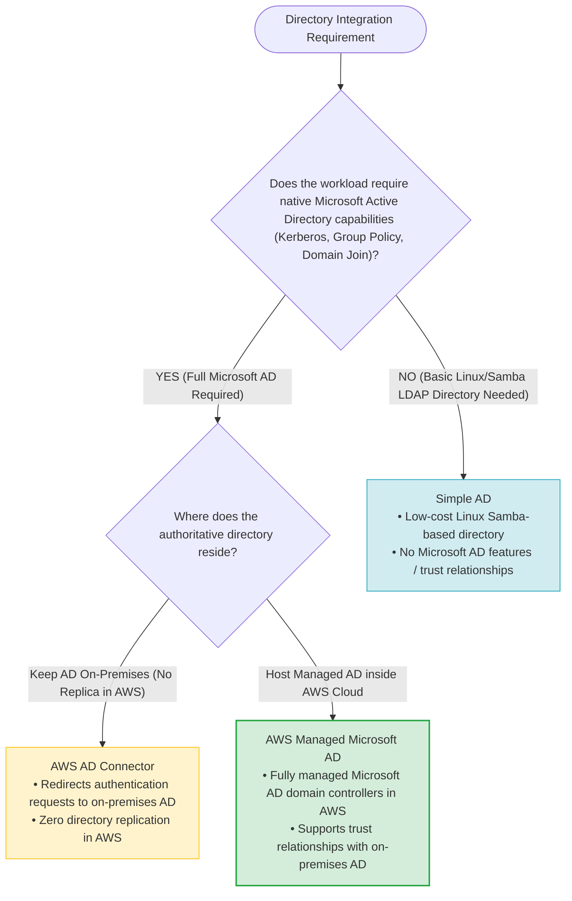
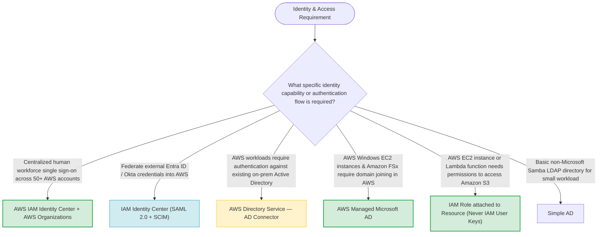

# Task 4.2: Determine the Optimal Migration Approach for Existing Workloads — Identity Services

> [!NOTE]
> **Exam Mindset**: For the AWS Solutions Architect Professional (SAP-C02) and AI Practitioner (AIP-C01) exams, identity services must be split into two fundamental architecture domains:
> **AWS IAM Identity Center** = *"Centralized human workforce access to AWS accounts and applications"*
> **AWS Directory Service** = *"Managed Microsoft Active Directory infrastructure and hybrid AD integration"*.

---

## 1. End-to-End Enterprise Identity & Workforce Access Architecture



---

## 2. AWS Directory Service Strategy Selection (Managed AD vs. AD Connector vs. Simple AD)



---

## 3. AWS Directory Service Options Feature Breakdown

| Directory Service Option | Underlying Infrastructure | Primary Protocol / Feature | Typical Use Case | Key Architecture Advantage |
| :--- | :--- | :--- | :--- | :--- |
| **AWS Managed Microsoft AD** | Actual Windows Server Domain Controllers managed by AWS | Kerberos, LDAP, Group Policy, Schema Extensions | Windows workloads, Amazon FSx, SQL Server, Domain Join | Full Microsoft AD compatibility with trust relationships |
| **AWS AD Connector** | Directory Gateway / Proxy (No local directory data stored) | Redirects LDAP/Kerberos queries over VPN/Direct Connect | Connect AWS apps (WorkSpaces, QuickSight) to On-Prem AD | Eliminates directory replication & data synchronization |
| **Simple AD** | Managed Linux Samba 4 Active Directory compatible controller | Basic LDAP, Kerberos | Small Linux workloads needing basic LDAP authentication | Low-cost basic directory (Does NOT support trust relationships) |

---

## 4. Identity Separation Framework (Human Workforce Access vs. Machine Workload Permissions)

```mermaid
flowchart TD
    subgraph Human_Workforce ["Human Workforce Access Pattern"]
        Human["Developer / Engineer / Admin"] ==> SSO_Human["AWS IAM Identity Center"]
        SSO_Human ==> PermSets_Human["Permission Sets & Account Assignment"]
        PermSets_Human ==> STS_Human["AWS STS (Temporary Console/CLI Credentials)"]
    end

    subgraph Machine_Workload ["Machine Workload Permission Pattern"]
        Workload["EC2 Instance / Lambda / ECS Task"] ==> IAMRole["IAM Role Attached to Workload"]
        IAMRole ==> InstanceProfile["Instance Profile / Task Role"]
        InstanceProfile ==> STS_Machine["AWS STS (Short-Lived API Keys)"]
    end

    style Human_Workforce fill:#d1ecf1,stroke:#17a2b8,stroke-width:1px
    style Machine_Workload fill:#d4edda,stroke:#28a745,stroke-width:2px
```



> [!IMPORTANT]
> **Human Workforce vs. Machine Workload Access**:
> - **Human Workforce Access**: Use **AWS IAM Identity Center** combined with **AWS Organizations** to grant employees centralized, federated access across AWS accounts using **Permission Sets**. Never create individual IAM users in each account.
> - **Machine Workload Access**: Use **IAM Roles** attached to EC2 instances, Lambda functions, or ECS tasks via instance profiles or task roles. Never hardcode IAM access keys inside application code.

---

## 5. SAML 2.0 Federation & SCIM Automatic Provisioning

> [!TIP]
> **Integrate Corporate Identity Providers Instead of Duplicating Users**:
> If an enterprise uses **Microsoft Entra ID (Azure AD)**, **Okta**, or **Ping Identity**, federate with **AWS IAM Identity Center** via **SAML 2.0** for authentication and enable **SCIM (System for Cross-domain Identity Management)** for automatic user/group provisioning and deprovisioning.

---

## 6. AWS Managed Microsoft AD vs. AD Connector Trade-off

> [!NOTE]
> **Replication vs. Proxy Trade-off**:
> - **AD Connector**: Lowers cost and eliminates directory replication by proxying authentication back to on-premises domain controllers, but creates a hard dependency on **VPN/Direct Connect availability**.
> - **AWS Managed Microsoft AD**: Deploys domain controllers directly in AWS VPCs. Increases directory availability for AWS workloads and removes dependency on the hybrid link during authentication.

---

## 7. SAP-C02 Domain 4.2 Identity Services Master Selection Decision Engine



---

## 8. SAP-C02 Exam Keyword Cheat Sheet

```
"Centralized workforce single sign-on across multiple AWS accounts" ──> AWS IAM Identity Center
"Assign role-based access across accounts using permission sets"     ──> IAM Identity Center Permission Sets
"Automate user/group provisioning from external IdP (Entra/Okta)"   ──> SCIM Protocol Integration
"Proxy authentication requests to existing on-premises Active Directory"──> AWS Directory Service — AD Connector
"Deploy managed Microsoft Active Directory in AWS for Windows domain join"──> AWS Managed Microsoft AD
"Grant an EC2 instance access to Amazon S3 without hardcoded keys"  ──> IAM Role attached to EC2 Instance Profile
```

---

## 9. Common SAP-C02 Exam Traps

1. **Trap 1: Creating Individual IAM Users in Every AWS Account**: Manually managing IAM users across multi-account environments creates huge administrative overhead. Always deploy **AWS IAM Identity Center** integrated with **AWS Organizations**.
2. **Trap 2: Using IAM Identity Center for Application/Machine Authentication**: IAM Identity Center manages human workforce logins. For applications, EC2 instances, and microservices needing AWS API permissions, use **IAM Roles**.
3. **Trap 3: Deploying Managed Microsoft AD When Simple Console SSO is Required**: If employees only need AWS Console access, do not deploy expensive Active Directory domain controllers. Use **IAM Identity Center**.
4. **Trap 4: Replicating On-Premises AD When AD Connector Meets Requirements**: If applications only need basic authentication against existing on-premises AD, deploy **AD Connector** to avoid directory synchronization complexity.

---

## 10. Final Mental Model

`Human Workforce SSO (Identity Center) ➔ External IdP Sync (SAML/SCIM) ➔ Machine Access (IAM Roles) ➔ Enterprise Directory Integration (AD Connector / Managed AD)`