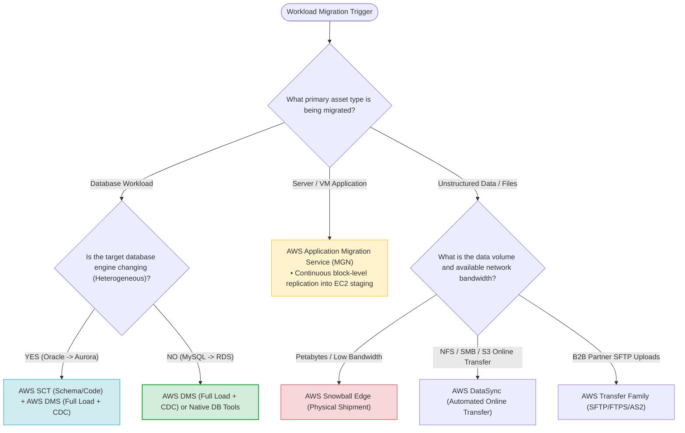
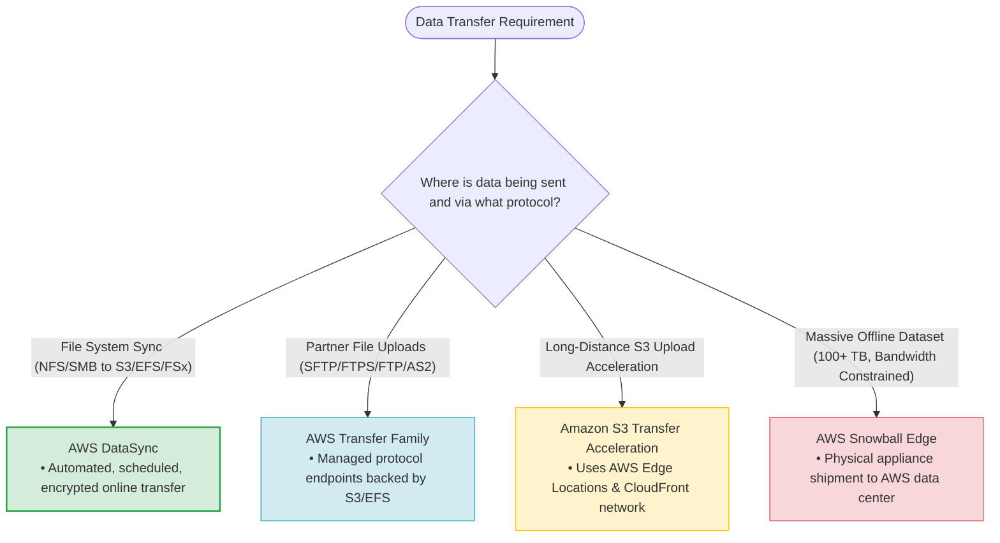
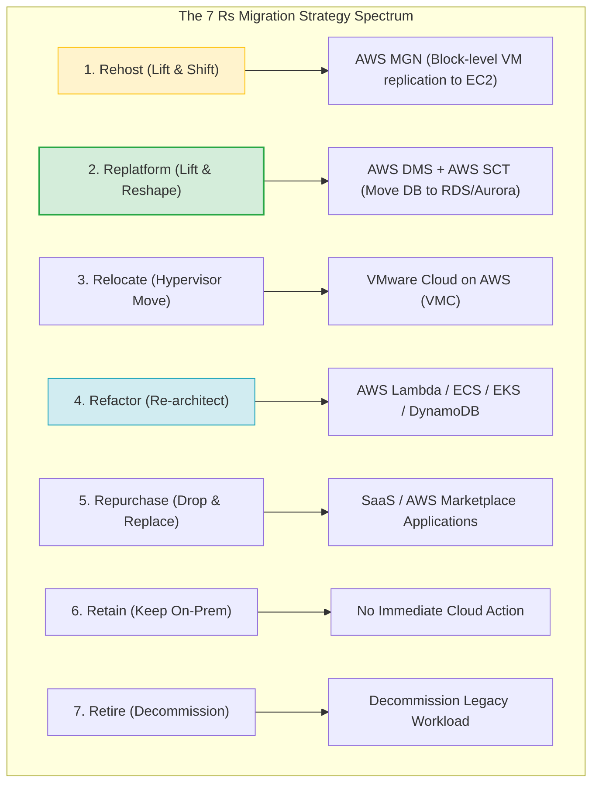
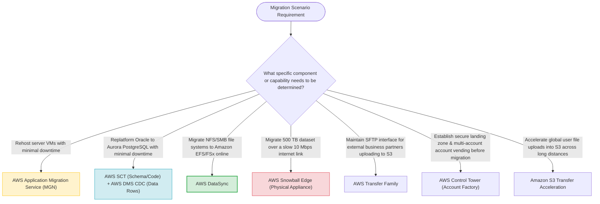

# Task 4.2: Determine the Optimal Migration Approach for Existing Workloads — Core Exam Skills & Tooling Master Blueprint

> [!NOTE]
> **Exam Mindset**: For the AWS Solutions Architect Professional (SAP-C02) and AI Practitioner (AIP-C01) exams, Domain 4.2 requires selecting the narrowest, most cost-effective AWS service based on scenario constraints:
> **Database Data & CDC** $\rightarrow$ **AWS DMS** | **Database Schema Conversion** $\rightarrow$ **AWS SCT** | **Server/VM Rehost** $\rightarrow$ **AWS MGN** | **File/Object Sync** $\rightarrow$ **AWS DataSync** | **Petabyte Offline Data** $\rightarrow$ **AWS Snowball Edge** | **Partner SFTP** $\rightarrow$ **AWS Transfer Family** | **Governed Landing Zone** $\rightarrow$ **AWS Control Tower**.

---

## 1. End-to-End Workload Migration Selection Decision Pipeline



---

## 2. Data Transfer Mechanism Selection Tree (Data Volume vs. Bandwidth vs. Protocol)



---

## 3. Migration Tooling Master Selection Breakdown Matrix

| Workload Component | Target AWS Service | Key Functional Mechanics | Primary Exam Scenario Trigger |
| :--- | :--- | :--- | :--- |
| **Server / VM Rehost** | **AWS Application Migration Service (MGN)** | Continuous block-level replication into EC2 staging subnet | *"Lift-and-shift 200 VMware VMs to EC2 with minimal cutover downtime"* |
| **Heterogeneous Database** | **AWS SCT + AWS DMS (Full Load + CDC)** | SCT converts DDL/code; DMS replicates data rows continuously | *"Migrate commercial Oracle database to Amazon Aurora PostgreSQL"* |
| **Homogeneous Database** | **AWS DMS (or Native DB Tools)** | Continuous Change Data Capture (CDC) replication | *"Migrate on-premises MySQL to Amazon RDS for MySQL with minimal downtime"* |
| **File System Sync** | **AWS DataSync** | Automated, scheduled NFS/SMB/S3 data transfer agent | *"Synchronize on-premises NFS share to Amazon EFS or S3"* |
| **Petabyte Offline Data** | **AWS Snowball Edge** | Physical appliance shipment to bypass network bandwidth limits | *"Migrate 500 TB dataset over a saturated 10 Mbps internet link"* |
| **B2B File Transfer** | **AWS Transfer Family** | Managed SFTP, FTPS, FTP, & AS2 endpoints backed by S3/EFS | *"Maintain SFTP endpoint for external partner file uploads into S3"* |
| **S3 Upload Acceleration**| **Amazon S3 Transfer Acceleration** | Uses AWS Edge Locations and CloudFront global backbone | *"Accelerate long-distance international client uploads into S3"* |

---

## 4. The 7 Rs Migration Strategy & AWS Tooling Alignment



> [!IMPORTANT]
> **Establish Landing Zone & Governance BEFORE Migration Execution**:
> A critical SAP-C02 architectural principle: **Never migrate workloads into unmanaged AWS accounts**. Always set up an automated Landing Zone using **AWS Control Tower** and **AWS Organizations** to establish SCP guardrails, IAM Identity Center SSO, and centralized logging *before* launching migration replication jobs.

---

## 5. Post-Migration Cost Optimization & Cleanup

> [!TIP]
> **Decommission Temporary Migration Infrastructure**:
> Migration tools introduce temporary operational costs. Immediately after successful cutover:
> 1. Terminate **AWS DMS Replication Instances** and staging databases.
> 2. Terminate **AWS MGN Replication Servers** in the staging subnet.
> 3. Decommission temporary **AWS DataSync Agents** and **VPN connections**.
> 4. Right-size target EC2 instances and RDS database instances based on actual CloudWatch utilization.

---

## 6. Security Defense-in-Depth During Workload Migration

> [!NOTE]
> **Maintain Security Standards During Migration**:
> Do not relax security controls for temporary migration paths:
> - **Encryption in Transit**: Enforce TLS encryption for DMS, DataSync, and VPN/Direct Connect streams.
> - **Encryption at Rest**: Encrypt staging EBS volumes and target S3/RDS storage using **AWS KMS**.
> - **Credential Protection**: Store database endpoints and credentials in **AWS Secrets Manager**, avoiding hardcoded scripts.
> - **Audit Trail**: Record all migration API calls via **AWS CloudTrail** streaming to a central **Log Archive Account**.

---

## 7. SAP-C02 Domain 4.2 Skills Master Selection Decision Engine



---

## 8. SAP-C02 Exam Keyword Cheat Sheet

```
"Rehost physical or virtual servers with block-level replication" ──> AWS Application Migration Service (MGN)
"Heterogeneous database migration with continuous change capture"──> AWS SCT (Schema) + AWS DMS (CDC Data)
"Automated online transfer of NFS/SMB shares to EFS/FSx/S3"       ──> AWS DataSync
"Migrate petabytes of data offline when network transfer takes months"──> AWS Snowball Edge
"Migrate business partner file uploads without altering SFTP tools"──> AWS AWS Transfer Family
"Accelerate long-distance user uploads to S3 buckets"            ──> Amazon S3 Transfer Acceleration
"Automated landing zone setup with Account Factory account vending"──> AWS Control Tower
```

---

## 9. Common SAP-C02 Exam Traps

1. **Trap 1: Choosing AWS DMS to Move Application Server VMs**: DMS is strictly for database data movement. To rehost server VMs to EC2, use **AWS Application Migration Service (MGN)**.
2. **Trap 2: Choosing AWS DataSync for Relational Database Replication**: DataSync synchronizes files and objects (NFS, SMB, S3). For database transaction log replication, use **AWS DMS**.
3. **Trap 3: Using AWS SCT for Homogeneous Database Migrations**: Homogeneous migrations (e.g., MySQL to RDS MySQL) share the same engine structure and do not require schema conversion via **AWS SCT**.
4. **Trap 4: Forgetting Post-Cutover Resource Cleanup**: Leaving DMS replication instances or MGN staging servers active after cutover generates unnecessary charges. Always decommission temporary migration infrastructure.

---

## 10. Final Mental Model

`Establish Landing Zone (Control Tower) ➔ Rehost Servers (MGN) ➔ Replatform Databases (SCT + DMS CDC) ➔ Sync Files (DataSync) ➔ Ship Offline Petabytes (Snowball) ➔ Cleanup Staging Resources`