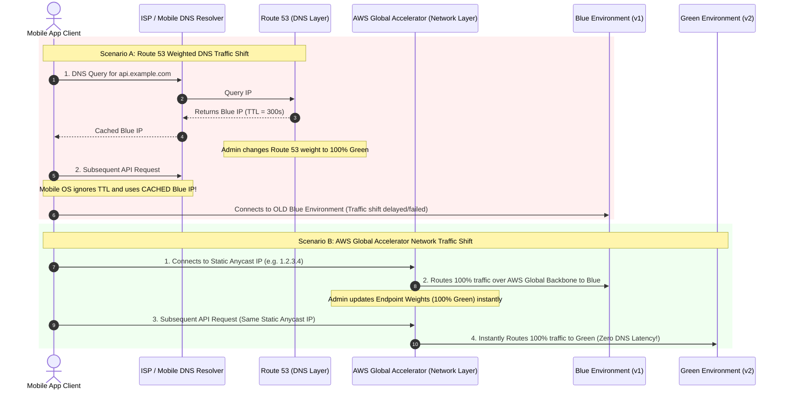
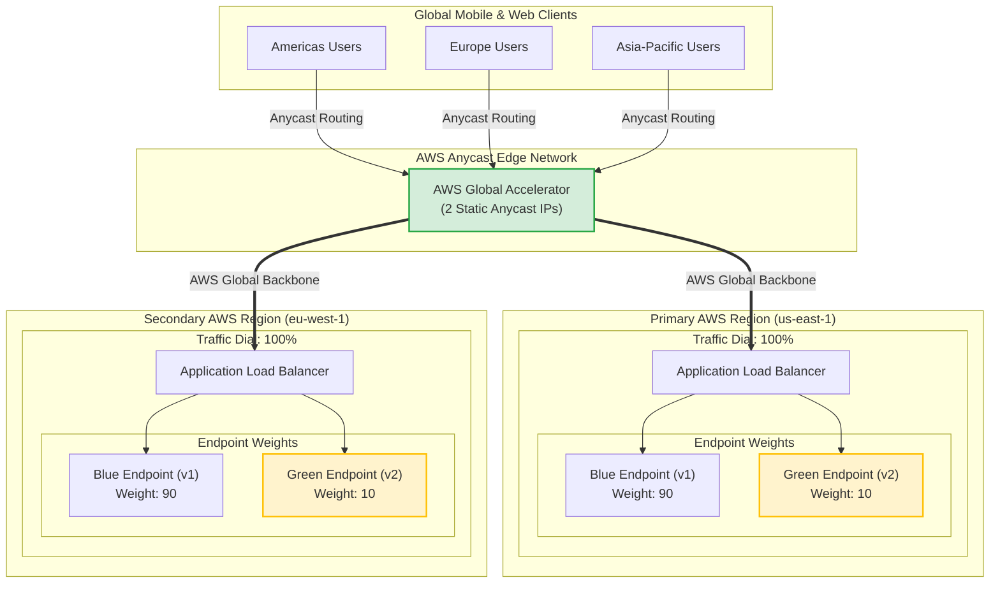
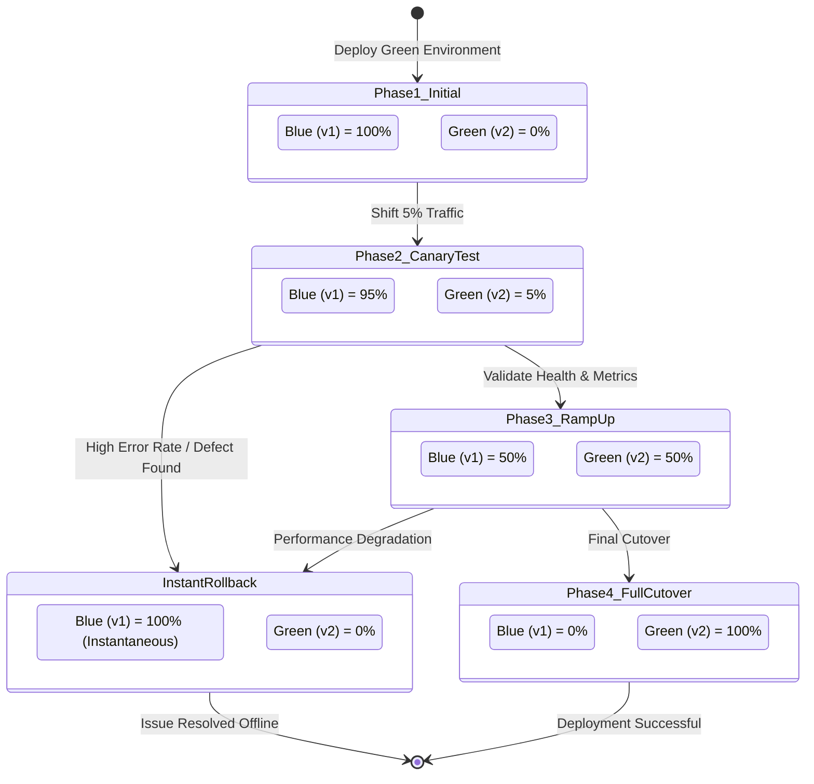
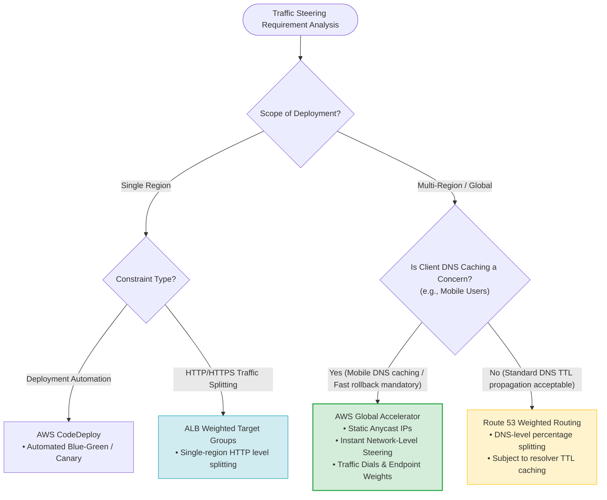

# Global Blue-Green Deployments with AWS Global Accelerator

> [!NOTE]
> **Core Exam Concept**: When performing a **global multi-region blue-green deployment** for mobile or web applications where **client-side DNS caching** presents a risk, **Route 53 Weighted Routing is INSUFFICIENT**. The correct architectural solution is **AWS Global Accelerator**, which executes instant percentage-based traffic shifting at the **network layer** using **Static Anycast IPs**, bypassing DNS propagation delays entirely.

---

## 1. Problem Statement & Scenario Analysis

### Scenario Prerequisites & Requirements

| Requirement                  | Architectural Implication                                      | Key AWS Feature / Service                                           |
| :--------------------------- | :------------------------------------------------------------- | :------------------------------------------------------------------ |
| **Blue-Green Deployment**    | Two distinct production environments (Blue = v1, Green = v2)   | Traffic shifting between endpoint groups                            |
| **Global User Base**         | Multi-Region traffic management over AWS backbone              | AWS Global Accelerator                                              |
| **Mobile App Clients**       | Severe vulnerability to persistent client-side **DNS Caching** | Network-layer traffic steering via Static Anycast IPs               |
| **Tight Time Constraints**   | Only 2 days to test and execute cutover before major sale      | Rapid, zero-TTL traffic control                                     |
| **Controlled Risk Exposure** | Test on a small fraction of users before full cutover          | Gradual percentage-based traffic shifting (Traffic Dials & Weights) |
| **Instant Rollback**         | Must revert 100% of traffic to Blue instantly if Green fails   | Zero-delay network failover                                         |

### Key Exam Trigger Phrase
```
"Global application + Mobile users + DNS Caching concern + Fast blue-green traffic shift"
      │
      ├──> AWS Global Accelerator (Static Anycast IPs)
      ├──> Traffic Dials (Per-Region percentage)
      ├──> Endpoint Weights (Per-Environment percentage)
      └──> Bypass DNS TTL Propagation Delays
```

---

## 2. Anycast Network Layer vs. DNS Layer Traffic Shifting

### Why Route 53 Weighted Routing Fails with Mobile Clients
Mobile operating systems, ISPs, and recursive DNS resolvers frequently ignore DNS TTL (Time-To-Live) settings and cache IP addresses for hours or days. Changing Route 53 DNS weights does **NOT** guarantee that mobile clients will immediately receive the new IP address.

### Comparison Sequence



---

## 3. Global Blue-Green Multi-Region Architecture



---

## 4. Traffic Dials vs. Endpoint Weights

AWS Global Accelerator provides two distinct levels of traffic control:

```
┌────────────────────────────────────────────────────────────────────────┐
│ Global Accelerator Traffic Steering Controls                           │
├───────────────────────────────────┬────────────────────────────────────┤
│ Traffic Dials (Regional Control)  │ Endpoint Weights (Resource Control)│
├───────────────────────────────────┼────────────────────────────────────┤
│ • Applied per Endpoint Group       │ • Applied per Endpoint within      │
│   (AWS Region).                   │   an Endpoint Group.               │
│ • Controls % of overall traffic    │ • Controls relative distribution   │
│   routed to a specific Region.    │   between Blue and Green ALBs.     │
│ • Range: 0% to 100%               │ • Range: 0 to 255                  │
└───────────────────────────────────┴────────────────────────────────────┘
```

### Example Blue-Green Configuration
To shift 10% of global traffic to the new Green environment in `us-east-1`:
- **Traffic Dial for `us-east-1`**: Set to `100%`.
- **Blue Endpoint Weight**: Set to `90`.
- **Green Endpoint Weight**: Set to `10`.

---

## 5. Gradual Canary Rollout & Instant Rollback Workflow



### Step-by-Step Two-Day Execution Plan
1. **Day 1 (Initial Setup & Canary Shift)**:
   - Deploy Green environment (v2) alongside Blue (v1).
   - Configure Global Accelerator endpoint weights: Blue = 95, Green = 5.
   - Monitor CloudWatch metrics (HTTP 5xx errors, latency, conversion rate).
2. **Day 1 Evening (Ramp-Up)**:
   - Increase Green weight to 25, then 50 if healthy.
3. **Day 2 (Full Cutover)**:
   - Increase Green weight to 100 (Blue weight = 0). Decommission Blue after validation.
4. **Emergency Rollback**:
   - If Green returns errors at any phase, instantly set Green weight = 0, Blue weight = 100. Traffic reverts in **< 1 second**.

---

## 6. Distractor Analysis (Why Other Answers Are Incorrect)



### 1. Why Not Route 53 Weighted Routing?
> [!WARNING]
> Route 53 Weighted Routing operates at the **DNS layer**. Because mobile devices and ISPs aggressively cache DNS responses, traffic changes take time to propagate. Route 53 cannot guarantee fast rollback or immediate user traffic shifting when DNS caching is present.

### 2. Why Not ALB Weighted Target Groups?
> [!NOTE]
> ALB Weighted Target Groups excel at blue-green traffic shifting **within a single AWS Region**. However, they cannot steer traffic across multiple AWS Regions or manage entry endpoints globally.

### 3. Why Not AWS CodeDeploy?
> [!CAUTION]
> AWS CodeDeploy automates the application deployment lifecycle (e.g., EC2/ECS/Lambda code updates). It does **NOT** provide a global, network-level entry point or multi-region traffic steering across independent application environments.

---

## 7. Comparative Technology Matrix

| AWS Feature / Option | Traffic Steering Layer | Cross-Region Scope | Immune to DNS Caching | Instant Rollback | Best Use Case |
| :--- | :--- | :--- | :--- | :--- | :--- |
| **AWS Global Accelerator** | **Network Layer (IP)** | **Yes (Multi-Region)** | **Yes (Static Anycast)** | **Yes (< 1 sec)** | **Global Blue-Green with Mobile Clients** |
| **Route 53 Weighted** | Application Layer (DNS) | Yes (Multi-Region) | No (Subject to TTL) | No (DNS Lag) | Global Blue-Green without DNS caching risk |
| **ALB Weighted Target Groups**| HTTP Layer (Application) | No (Single Region) | Yes (HTTP Level) | Yes | In-Region Blue-Green deployment |
| **AWS CodeDeploy** | Deployment Orchestration | No (Regional agent) | N/A | Yes | Automated application deployment pipelines |

---

## 8. Exam Memory Cheat Sheet & Keyword Rules

```
Global Application + Mobile DNS Caching Risk  ──> AWS Global Accelerator
Regional Percentage Traffic Control          ──> Global Accelerator Traffic Dial
Endpoint Level Traffic Distribution          ──> Global Accelerator Endpoint Weights
Single-Region HTTP Target Shifting           ──> ALB Weighted Target Groups
DNS-Based Percentage Routing                 ──> Route 53 Weighted Routing
Deployment Lifecycle Automation              ──> AWS CodeDeploy
Static Ingress IP Requirement                ──> AWS Global Accelerator (2 Anycast IPs)
```

---

## 9. Final Exam Mental Model

```
                    [ Global Mobile & Web Clients ]
                                  │
                                  ▼
                [ 2 Static Anycast IPs (Global Accelerator) ]
                                  │
                  (Traffic Steering at Network Layer)
                                  │
        ┌─────────────────────────┴─────────────────────────┐
        ▼                                                   ▼
  [ Blue Environment (v1) ]                           [ Green Environment (v2) ]
  • ALB + EC2/ECS/Lambda                              • ALB + EC2/ECS/Lambda
  • Weight: 90                                        • Weight: 10
```

- **Route 53 changes DNS records.**
- **Global Accelerator changes network routing paths behind fixed Static Anycast IPs.**
- **When mobile DNS caching threatens a rapid blue-green cutover, choose Global Accelerator.**