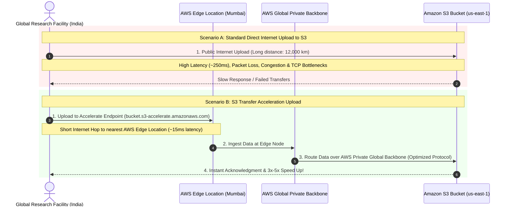
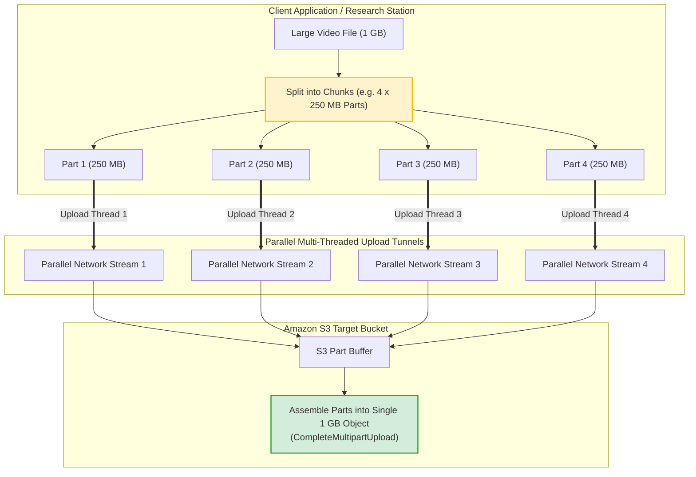
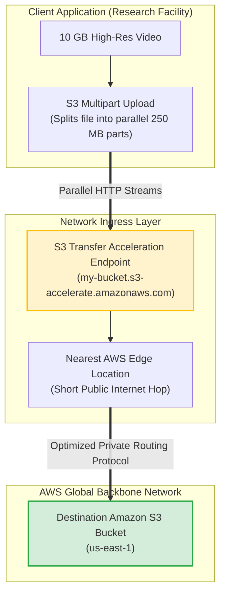
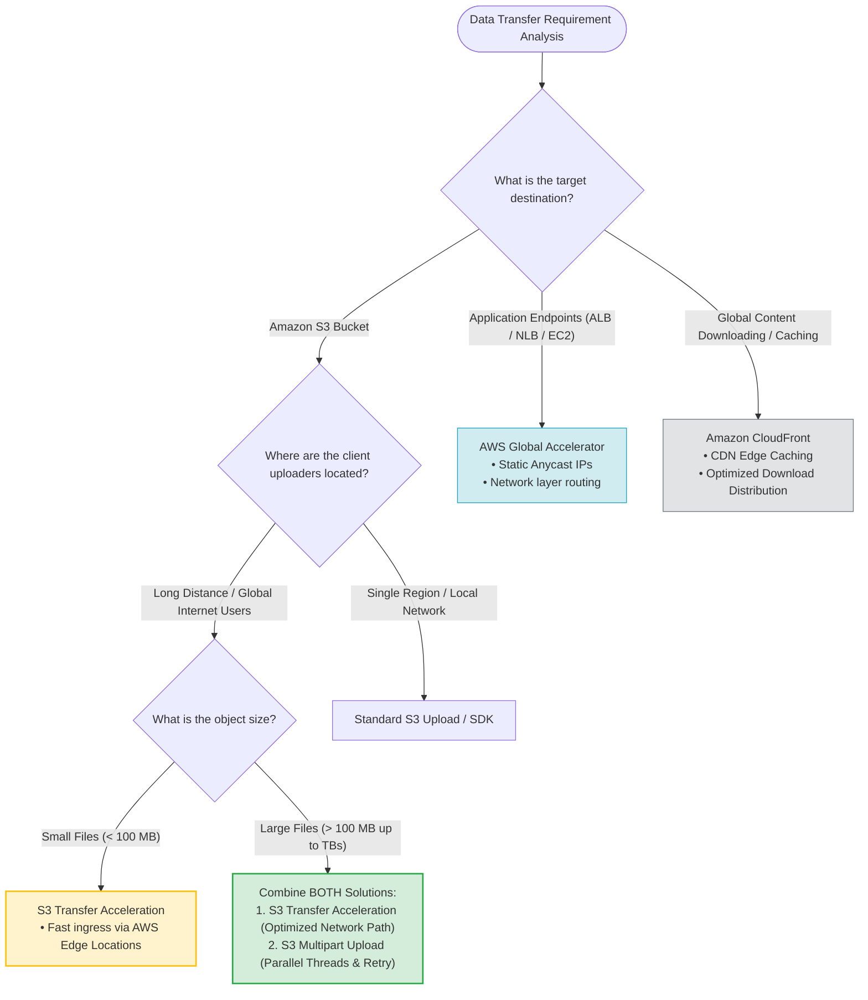

# Amazon S3 Transfer Acceleration & Multipart Uploads: AWS SAP-C02 & AIP-C01 Exam Guide

> [!NOTE]
> **Core Exam Concept**: Amazon S3 Transfer Acceleration is a bucket-level feature that enables **fast, easy, and secure transfers of files over long distances** between your clients and an S3 bucket by routing traffic through globally distributed **AWS Edge Locations** over the optimized AWS private network backbone. When transferring large objects globally, combining **S3 Transfer Acceleration** (network path optimization) with **S3 Multipart Upload** (parallel upload throughput & retry optimization) delivers the most cost-effective and highest-performance solution.

---

## 1. Problem Statement & Scenario Analysis

### Scenario Prerequisites
- **Client Topology**: Global research facilities operating on-premises across multiple continents (e.g., India, Europe, Asia-Pacific).
- **Workload Type**: Uploading large high-resolution video files (gigabytes to terabytes) to a centralized Amazon S3 bucket located in a distant region (e.g., `us-east-1`).
- **Symptoms**: Standard public Internet uploads are extremely slow, prone to timeouts, packet loss, and connection failures.
- **Business Requirement**: Provide the **MOST cost-effective and high-performance** solution with minimal operational overhead.

### Key Exam Clues
```
"Global research facilities" ──> Long-distance network path
"Large video files"          ──> High throughput requirement (Multipart Upload)
"Upload to S3 is slow"       ──> Network path bottleneck (Transfer Acceleration)
"Most cost-effective"        ──> Avoid dedicated infrastructure like Direct Connect
```

---

## 2. Network Path Optimization: Standard Upload vs. Transfer Acceleration

### The Long-Distance Public Internet Bottleneck
Standard S3 uploads route data entirely over the public Internet, exposing traffic to variable latency, ISP congestion, BGP routing inefficiencies, and packet loss.



---

## 3. How Amazon S3 Transfer Acceleration Works

S3 Transfer Acceleration utilizes the same global network of 600+ **AWS Edge Locations** used by Amazon CloudFront.

```
Client ──> [ Short Internet Hop ] ──> Nearest AWS Edge Location ──> [ AWS Private Fiber Backbone ] ──> S3 Bucket
```

### Endpoint Architecture
When enabled on a bucket, client applications route requests to a special acceleration endpoint:
```
Standard Endpoint:   https://my-bucket.s3.us-east-1.amazonaws.com
Accelerate Endpoint: https://my-bucket.s3-accelerate.amazonaws.com
```

> [!TIP]
> **No Pay If No Speedup**: AWS automatically evaluates whether Transfer Acceleration improves performance for each upload. If AWS determines Transfer Acceleration is not faster than a standard upload for a specific request, you are **not charged** for Transfer Acceleration on that transfer.

---

## 4. Object Upload Optimization: S3 Multipart Upload

While Transfer Acceleration optimizes the **network path**, S3 Multipart Upload optimizes **file transfer mechanics**.

### Parallel Upload Mechanics



### Key Advantages of Multipart Upload
1. **Higher Throughput**: Uploads parts in parallel using multi-threaded client connections.
2. **Quick Error Recovery**: If an individual part transfer fails due to network glitch, **only that specific part is retransmitted**, rather than restarting the entire gigabyte/terabyte file upload.
3. **Mandatory Rule**: AWS strongly recommends Multipart Upload for files larger than **100 MB**, and requires it for objects greater than **5 GB** (up to 5 TB total object size).

---

## 5. Synergistic Architecture: Transfer Acceleration + Multipart Upload



> [!IMPORTANT]
> **The Winning Exam Pair**: Combining **S3 Transfer Acceleration** with **S3 Multipart Upload** addresses both network latency and file transfer efficiency simultaneously.

---

## 6. Distractor Analysis (Why Other Options Fail)

### 1. Why Not AWS Direct Connect?
> [!WARNING]
> AWS Direct Connect establishes a dedicated physical fiber connection between an on-premises data center and AWS. It requires months to provision, costs thousands of dollars monthly, and is designed for long-term private hybrid networking—**NOT** as a quick, cost-effective solution for ad-hoc global file uploads.

### 2. Why Not Multiple Site-to-Site VPNs?
> [!CAUTION]
> IPsec VPN tunnels encrypt traffic over the public Internet, but do **NOT** eliminate long-distance network latency, packet loss, or TCP windowing bottlenecks. Adding more VPNs introduces configuration complexity without accelerating S3 uploads.

### 3. Why Not AWS Global Accelerator?
> [!NOTE]
> **Global Accelerator vs. S3 Transfer Acceleration**:
> - **AWS Global Accelerator**: Provides Static Anycast IPs for non-S3 application endpoints (ALBs, NLBs, EC2 instances).
> - **S3 Transfer Acceleration**: Purpose-built specifically for **Amazon S3 data transfer**.

### 4. Why Not Amazon CloudFront?
> [!NOTE]
> CloudFront is a Content Delivery Network (CDN) primarily engineered for **global content downloads and caching**. For global data **uploads directly into S3**, S3 Transfer Acceleration is the target feature.

---

## 7. Comparative Technology Matrix

| AWS Service / Feature | Target Destination | Acceleration Layer | Best For | Cost Profile |
| :--- | :--- | :--- | :--- | :--- |
| **S3 Transfer Acceleration** | **Amazon S3 Bucket** | **AWS Edge Locations** | Global uploads/downloads to S3 over distance | Low (Pay per GB transferred) |
| **S3 Multipart Upload** | **Amazon S3 Bucket** | **Parallel Application Threads** | Files > 100 MB, reliable partial retries | Free feature of S3 SDK |
| **AWS Global Accelerator** | ALB / NLB / EC2 | AWS Edge Locations (Anycast) | Non-S3 TCP/UDP application endpoints | Hourly rate + Data transfer fee |
| **Amazon CloudFront** | S3 / Web Origins | Edge Caching Nodes | Global content delivery (Downloads) | Pay per GB / requests |
| **AWS Direct Connect** | VPC / AWS Services | Dedicated Physical Fiber | High-volume continuous private hybrid link | High fixed monthly cost |

---

## 8. Data Ingress & Acceleration Decision Tree



---

## 9. Exam Memory Cheat Sheet & Keyword Rules

```
Global Clients + Slow S3 Uploads       ──> S3 Transfer Acceleration
Large Objects (> 100 MB)               ──> S3 Multipart Upload
Global Clients + Large S3 Files        ──> S3 Transfer Acceleration + S3 Multipart Upload
Non-S3 Application Acceleration (ALB) ──> AWS Global Accelerator
Global Content Caching & Downloads     ──> Amazon CloudFront
Dedicated Private Fiber Hybrid Link    ──> AWS Direct Connect
Transfer Acceleration Endpoint Format  ──> bucket-name.s3-accelerate.amazonaws.com
```

---

## 10. Final Exam Takeaway

1. **S3 Transfer Acceleration** fixes the **network path** (routing over AWS's private global fiber network via edge locations).
2. **S3 Multipart Upload** fixes the **upload mechanism** (parallelizing file chunks and enabling partial retries).
3. Select **BOTH** when asked to optimize long-distance, high-volume uploads to S3 in the most cost-effective manner.
