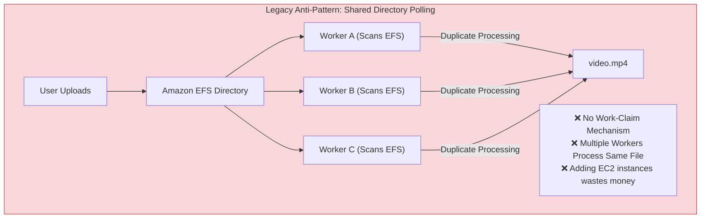
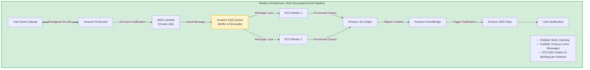
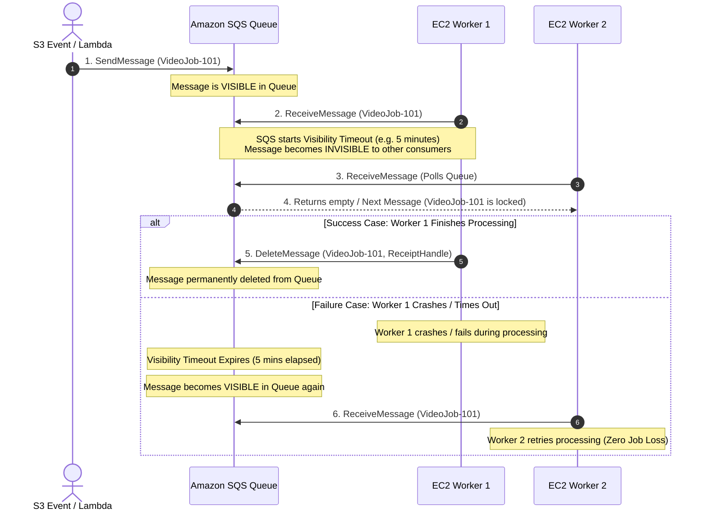
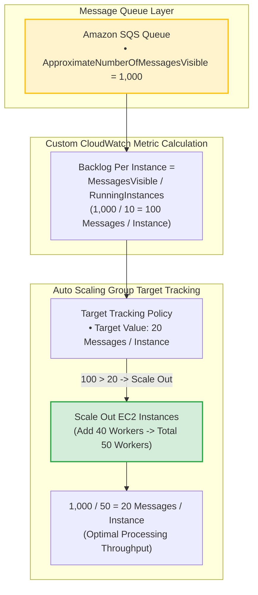
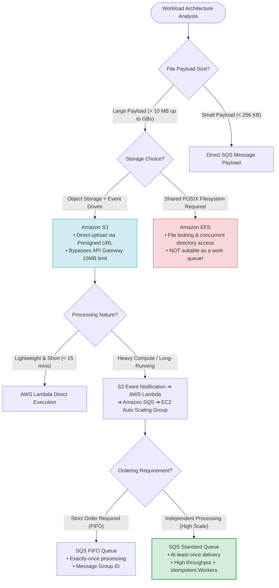

#ContinuousImprovementforExistingSolutions

Decoupled Event-Driven Architectures with Amazon SQS: AWS SAP-C02 & AIP-C01 Exam Guide

> [!NOTE]
> **Core Exam Concept**: Shared file systems (like **Amazon EFS**) are designed for shared POSIX file storage, **NOT for distributed work coordination**. Scanning an EFS directory from multiple compute workers causes **duplicate concurrent processing** and poor scaling. The optimal AWS pattern replaces directory polling with an event-driven queue pipeline: **S3 (Object Storage) $\rightarrow$ Lambda (Event Router) $\rightarrow$ SQS (Work Queue) $\rightarrow$ EC2 Auto Scaling Group (Decoupled Compute)**.

---

## 1. Problem Statement & Legacy Architecture Analysis

### Legacy Anti-Pattern Scenario
An enterprise video processing application uploads user video files to Amazon EFS. Multiple EC2 instances periodically scan the EFS directory to find and process unprocessed video files before writing output to Amazon S3.

```
Legacy Pipeline:
User Upload ──> EC2 Web Server ──> EFS Directory ──> EC2 Workers (Polling EFS) ──> Amazon S3
```

### Why Shared Storage Directory Polling Fails


- **No Work-Claim Mechanism**: When multiple worker instances scan EFS simultaneously, Worker A, Worker B, and Worker C all see `video-101.mp4` and initiate concurrent processing.
- **Duplicate Resource Consumption**: Multiple EC2 instances execute redundant encoding jobs on the exact same video file.
- **Ineffective Scaling**: Adding more EC2 instances to the Auto Scaling Group increases scanning contention and duplicate work rather than increasing system throughput.

---

## 2. Correct Architecture: Decoupled S3 + SQS Pipeline



---

## 3. SQS Message Lifecycle & Visibility Timeout Mechanics

The core mechanism preventing duplicate processing in Amazon SQS is the **Visibility Timeout**.



### Key Visibility Timeout Properties
1. **Exclusive Lock**: When a worker receives a message, SQS temporarily hides it from other consumers for the configured `VisibilityTimeout` duration.
2. **Delete On Completion**: Upon successful job completion, the worker sends a `DeleteMessage` call using the message's `ReceiptHandle`.
3. **Automatic Crash Recovery**: If a worker crashes or fails to process the job before the visibility timeout expires, SQS automatically makes the message visible again for another worker to retry.

> [!IMPORTANT]
> **Visibility Timeout Rule**: Set the `VisibilityTimeout` to a value **greater than the maximum expected processing time** of a single job (e.g., if video processing takes up to 15 minutes, set Visibility Timeout to 20 minutes or use `ChangeMessageVisibility` dynamically).

---

## 4. Scaling Strategy: Backlog Per Instance Metric

Standard Auto Scaling based on CPU utilization or Memory usage fails for asynchronous queue workers. The correct metric for scaling SQS worker fleets is **Target Backlog Per Instance**.



### Metric Calculation Formula
$$\text{Backlog Per Instance} = \frac{\text{ApproximateNumberOfMessagesVisible}}{\text{Unhealthy/Healthy Running Instance Count}}$$

> [!TIP]
> **Target Tracking Scaling**: Auto Scaling Group uses a custom metric tracking policy based on `Backlog Per Instance`. If each worker can process 20 videos/hour, setting the target backlog per instance to 20 ensures instances scale up during traffic spikes and scale down to zero when the queue empties.

---

## 5. Amazon SQS Queue Types: Standard vs. FIFO

```
┌────────────────────────────────────────────────────────────────────────┐
│ Amazon SQS Standard vs. FIFO Queues                                    │
├───────────────────────────────────┬────────────────────────────────────┤
│ SQS Standard Queue                │ SQS FIFO Queue                     │
├───────────────────────────────────┼────────────────────────────────────┤
│ • Unlimited Throughput (RPS)      │ • Up to 3,000 msg/sec with batch   │
│ • At-Least-Once Delivery          │ • Exactly-Once Processing          │
│ • Best-Effort Ordering            │ • Strict First-In-First-Out Order  │
│ • Idempotent Workers Required     │ • Message Group ID & Deduplication │
└───────────────────────────────────┴────────────────────────────────────┘
```

| Dimension | SQS Standard Queue | SQS FIFO Queue |
| :--- | :--- | :--- |
| **Throughput Capacity** | **Nearly Unlimited** | High (300 msg/sec, 3,000 with batching) |
| **Ordering Guarantee** | Best-effort (out of order possible) | **Strict FIFO ordering** |
| **Delivery Guarantee** | **At-least-once** (duplicate possible) | **Exactly-once** (deduplication ID) |
| **Use Case Fit** | Independent tasks (Video encoding, logs) | Financial transactions, inventory updates |

> [!NOTE]
> **Idempotent Processing**: For video processing where files are independent objects, **SQS Standard Queue** is the correct exam choice due to unlimited throughput capacity. Applications should be designed to be **idempotent** (checking if output already exists in S3 before processing).

---

## 6. Distractor Analysis & Common Exam Traps



### 1. Why Not API Gateway for Uploading 1 GB Videos?
> [!WARNING]
> API Gateway has a strict **10 MB payload size limit**. Uploading large binary files (like 1 GB videos) through API Gateway returns an HTTP 413 Payload Too Large error. Clients should upload directly to **Amazon S3 using a Presigned URL**.

### 2. Why Not AWS Lambda for Video Processing?
> [!CAUTION]
> AWS Lambda has a **15-minute maximum execution timeout** and limited disk/memory capacity. Heavy video processing or transcoding jobs taking longer than 15 minutes require compute environments like **Amazon EC2 Auto Scaling** or **AWS Batch**.

### 3. Why SQS Buffer is Essential (Shock Absorber)
> [!TIP]
> SQS acts as a **buffer (shock absorber)** between unpredictable upload bursts and processing capacity. If 1,000 users upload videos simultaneously, SQS holds the messages safely while the EC2 worker fleet scales out and processes jobs at its own controlled pace.

---

## 7. Comparative Technology Matrix

| Architecture Pattern | Scalability | Duplicate Work Risk | Failure Recovery | Cost Profile |
| :--- | :--- | :--- | :--- | :--- |
| **EFS Directory Polling (Legacy)** | Poor | **Extremely High** | Custom / Manual | High (Wasted EC2 compute) |
| **Direct Lambda Processing** | Limited (< 15 min limit) | Low | Retries (3 attempts) | High for heavy tasks |
| **S3 ➔ SQS ➔ EC2 ASG (Optimal)** | **Unlimited** | **Eliminated via SQS Lock** | **Visibility Timeout + DLQ** | **Lowest (Pay per usage & backlog)** |

---

## 8. Exam Memory Cheat Sheet & Keyword Matrix

```
Shared Storage Directory Polling       ──> ANTI-PATTERN (Replace with SQS Queue)
Multiple Workers Processing Same Job   ──> SQS Visibility Timeout
Unpredictable Traffic Burst Buffer     ──> Amazon SQS Queue (Shock Absorber)
Auto Scaling Queue Scaling Metric      ──> Custom Metric: Backlog Per Instance
Large Upload Payload (> 10 MB)         ──> Amazon S3 Presigned URL (Bypass API GW)
Long-Running Heavy Processing (>15 min)──> EC2 Auto Scaling Group / AWS Batch
Failed Message Isolation               ──> SQS Dead-Letter Queue (DLQ)
Event Fan-Out Notification             ──> Amazon EventBridge + Amazon SNS
```

---

## 9. Final Exam Mental Model

```
               [ User Upload via Presigned URL ]
                               │
                               ▼
                        [ Amazon S3 ]
                               │ (Object Created Event)
                               ▼
                        [ AWS Lambda ]
                               │ (Create Job)
                               ▼
                       [ Amazon SQS ] ◄── (Visibility Timeout Lock)
                               │
            ┌──────────────────┴──────────────────┐
            ▼                                     ▼
   [ EC2 Worker Instance 1 ]             [ EC2 Worker Instance 2 ]
   (Scales on Backlog/Instance)          (Scales on Backlog/Instance)
            │                                     │
            └──────────────────┬──────────────────┘
                               ▼
                    [ Amazon S3 Output ]
                               │
                               ▼
                    [ EventBridge ➔ SNS ]
```

- **S3 stores the objects.**
- **Lambda routes the events.**
- **SQS holds and locks the work items.**
- **EC2 Auto Scaling executes the heavy compute.**
- **EventBridge/SNS handles completion notifications.**