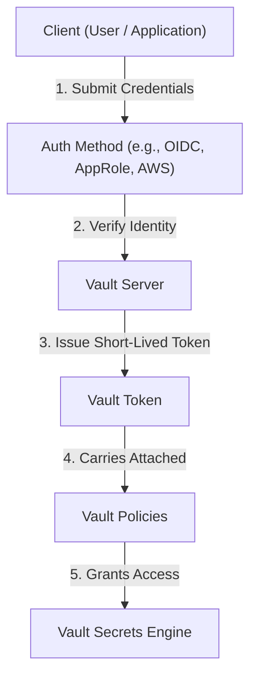
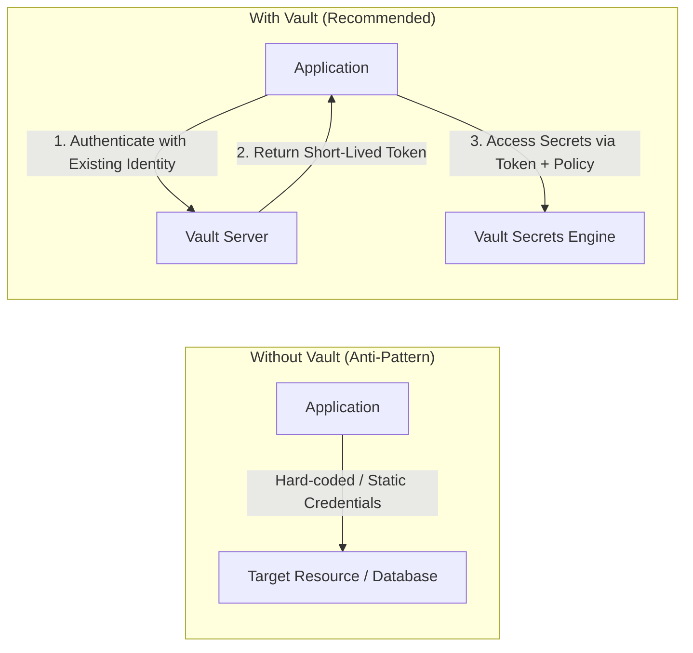
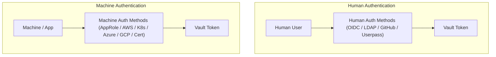
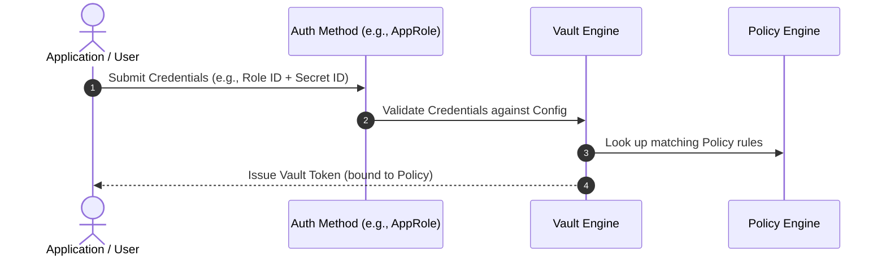
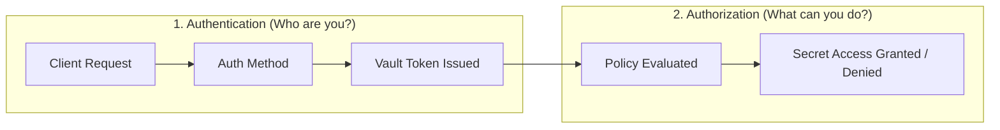
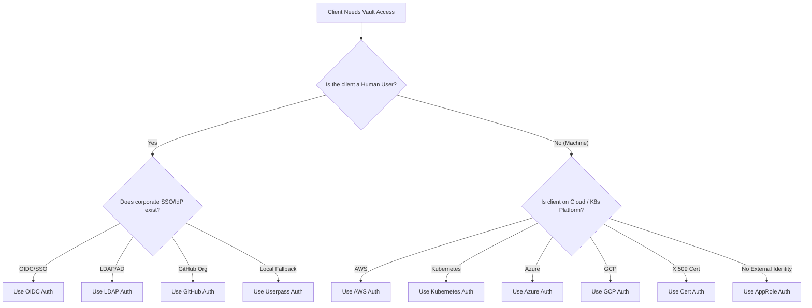

# Objective 1a: Purpose of Vault Authentication Methods

> [!NOTE]
> **Exam Context:** For the HashiCorp Security Automation / Vault Associate 003 Certification, Objective 1a specifically requires you to define the purpose of Vault authentication methods, understand why Vault supports multiple auth methods, know when to choose each one, and understand how authentication connects to identity, policies, and tokens.

**Official Documentation:**
- [HashiCorp Vault Security Automation Certification](https://developer.hashicorp.com/certifications/security-automation)
- [Vault Concepts: Authentication](https://developer.hashicorp.com/vault/docs/concepts/auth)
- [Vault Auth Methods Documentation](https://developer.hashicorp.com/vault/docs/auth)

---

## 1. Core Authentication Flow & Purpose

### What is an Authentication Method?
An **Authentication Method** is the component in Vault that verifies **who or what** is requesting access.

Vault requires all clients (humans or applications) to authenticate before interacting with Vault. Once an authentication method verifies the client's identity, Vault issues a **short-lived token** attached to specific **policies**.

### Core Flow Diagram



### The Identity Chain
$$\text{Authentication Method} \longrightarrow \text{Identity Verification} \longrightarrow \text{Vault Token} \longrightarrow \text{Policies} \longrightarrow \text{Access to Secrets}$$

---

## 2. Why Do Authentication Methods Exist?

The fundamental challenge Vault addresses is: **"How does Vault reliably know who is requesting a secret?"**

In modern infrastructure, clients come from diverse environments:
- **Developers & Operators** (Okta, Azure AD / Entra ID, GitHub, LDAP)
- **Applications & Microservices** (AppRole)
- **Containerized Workloads** (Kubernetes Pod Service Accounts)
- **Cloud Infrastructure** (AWS IAM, Azure Managed Identity, GCP Service Accounts)
- **Legacy / Bare-Metal Servers** (TLS Client Certificates)

> [!IMPORTANT]
> Vault supports different authentication mechanisms so clients can **use their existing identity system** rather than forcing every client to manage static username/password credentials inside Vault.

### Critical Exam Distinction
* **Authentication Method:** Verifies **identity** ("Who are you?").
* **Policy:** Determines **authorization** ("What are you allowed to do?").
* **Token:** Carries the resulting **access credential** for subsequent API calls.

---

## 3. Problem Solved: Eliminating Static Hard-Coded Credentials



### Problems Without Vault Auth Methods:
- Manual credential distribution and secret sprawl
- Complex credential rotation and revocation processes
- Lack of clear distinction between human and machine identities
- Difficulty integrating with enterprise Identity Providers (IdPs)

### Benefits With Vault Auth Methods:
- Applications authenticate using existing, native infrastructure identities.
- Vault returns short-lived, auto-expiring Vault tokens.
- Access is strictly governed by fine-grained policies.
- Reduced need to issue or manage long-lived Vault credentials.

---

## 4. Human vs. Machine Authentication

HashiCorp explicitly categorizes authentication methods based on whether they target **human users** or **automated machine workloads**.



### Breakdown Comparison

| Category | Primary Use Cases | Common Auth Methods | Key Characteristics |
| :--- | :--- | :--- | :--- |
| **Human** | Interactive users, developers, operators, security admins | **OIDC**, **LDAP**, **GitHub**, **Userpass** | Web browser logins, SSO redirection, MFA support, CLI browser login. |
| **Machine** | Applications, CI/CD pipelines, K8s Pods, EC2/VMs, microservices | **AppRole**, **AWS**, **Kubernetes**, **Azure**, **GCP**, **Cert** | Non-interactive, automated secret retrieval, automated token renewal. |

---

## 5. Selecting the Right Auth Method

Always choose the authentication method that matches the client's **existing identity provider**.

- **Corporate Employee (SSO):** Use **OIDC** (Okta, Entra ID, Auth0).
- **Enterprise Directory User:** Use **LDAP / Active Directory**.
- **Developer / GitHub Org Member:** Use **GitHub Auth**.
- **AWS EC2 / Lambda / ECS:** Use **AWS Auth** (IAM/EC2 identity).
- **Kubernetes Pod:** Use **Kubernetes Auth** (Service Account tokens).
- **GCP / Azure Workloads:** Use native **GCP** or **Azure Auth**.
- **Application without Cloud/Platform Identity:** Use **AppRole**.

---

## 6. Operational Overhead & Maintenance

Every enabled authentication method adds configuration and administrative overhead.

> [!TIP]
> **Exam Rule of Thumb:** Do not enable every auth method by default. Only enable the specific auth methods that match your environment's identity sources.

### Overhead Requirements by Method

- **OIDC:** IdP integration, redirect URIs, claim mappings, role bindings.
- **LDAP:** Directory server connectivity, service accounts, TLS certs, group mappings.
- **Kubernetes:** K8s API host configuration, JWT validation, service account role bindings.
- **AppRole:** Role ID & Secret ID lifecycle, delivery mechanism, TTL and rotation policies.
- **TLS Certificate:** CA trust chain management, certificate generation, revocation lists (CRL).

---

## 7. Minimal Requirements for Vault Authentication

To authenticate a client, Vault requires only:
1. **Vault Instance** running with at least **one enabled auth method**.
2. **Configuration** for the enabled auth method (e.g., IdP endpoints, roles).
3. **Vault Policy** defining access permissions.
4. **Client Credentials** matching the auth method.



---

## 8. Authentication vs. Authorization

Understanding this distinction is critical for the exam:



> [!IMPORTANT]
> An authentication method **never defines** secret permissions directly. The authentication method assigns policies to tokens, and the **policy defines authorization**.

---

## 9. Auth Method vs. Token

A common exam trick asks about credentials used after login.

* **Auth Method:** The identity mechanism used **only during initial authentication** (e.g., AppRole Role ID + Secret ID, AWS IAM signature).
* **Vault Token:** The resulting credential used for **all subsequent API requests** to Vault.

$$\text{AppRole Credentials} \neq \text{Vault Token}$$

---

## 10. Summary Matrix: Operational Overhead & Typical Users

| Method | Main Operational Overhead | Primary Target |
| :--- | :--- | :--- |
| **OIDC** | Identity Provider (IdP) configuration & claims mapping | Humans (SSO) |
| **LDAP** | Directory server connectivity, groups & TLS | Humans (Enterprise) |
| **GitHub** | Organization membership & Personal Access Token security | Humans (Developers) |
| **Userpass** | Local Vault user/password lifecycle management | Humans (Fallback/Local) |
| **AppRole** | Role ID and Secret ID delivery & rotation lifecycle | Machines (Custom Apps) |
| **AWS** | AWS IAM roles, instance identity documents, AWS API access | AWS Workloads |
| **Kubernetes**| Service Account Token Reviewer API & RBAC roles | K8s Pods |
| **Azure** | Entra ID / Azure Managed Identity configuration | Azure Workloads |
| **GCP** | GCP IAM service accounts & instance metadata validation | GCP Workloads |
| **Cert** | PKI infrastructure, CA trust chains & certificate revocation | Services / Servers |

---

## 11. Method Deep-Dive: Pros, Trade-Offs & Exam Clues

### OIDC (OpenID Connect)
* **Pros:** Centralized corporate SSO; seamless user login experience.
* **Trade-Off:** Requires external IdP availability.
* **Exam Clue:** *"Employees authenticate using corporate SSO / Okta / Entra ID."*

### LDAP
* **Pros:** Integrates with existing enterprise directory servers.
* **Trade-Off:** Vault depends on external LDAP availability and directory structure.
* **Exam Clue:** *"Authenticate against an existing Active Directory / LDAP server."*

### GitHub Auth
* **Pros:** Quick setup for development teams and GitHub organizations.
* **Trade-Off:** Uses GitHub Personal Access Tokens; stolen tokens present security risks.
* **Exam Clue:** *"Developers authenticate using their GitHub Organization membership."*

### AppRole
* **Pros:** Purpose-built for machines/applications without external cloud identity.
* **Trade-Off:** Requires a secure delivery mechanism for Secret IDs.
* **Best Practice:** Use native platform auth (AWS/K8s) when available before defaulting to AppRole.
* **Exam Clue:** *"Application running on-premises with no cloud or container identity system."*

### AWS Auth
* **Pros:** Native AWS identity validation via IAM or EC2 instance metadata; no static passwords.
* **Trade-Off:** Relies on correct AWS IAM configuration and Vault AWS auth setup.
* **Exam Clue:** *"EC2 instance or Lambda function needs Vault secrets."*

### Kubernetes Auth
* **Pros:** Native integration with Kubernetes Service Accounts.
* **Trade-Off:** Requires Vault to authenticate tokens with the Kubernetes API server.
* **Exam Clue:** *"Kubernetes Pod needs secret access without static credentials."*

### Certificate Auth (TLS Certs)
* **Pros:** Strong PKI-based machine identity; passwordless.
* **Trade-Off:** Requires PKI management, CA distribution, and certificate revocation tracking.
* **Exam Clue:** *"Client presents an X.509 client certificate to authenticate."*

---

## 12. Cost & Architectural Perspective

> [!NOTE]
> Authentication selection is driven by **operational efficiency**, not licensing costs (all built-in auth methods are included in Vault).

* **Existing Corporate SSO** $\rightarrow$ Use **OIDC** (avoids duplicating user credentials).
* **Existing AWS / K8s Workloads** $\rightarrow$ Use **AWS / K8s Auth** (avoids managing static app credentials).
* **No Platform Identity** $\rightarrow$ Use **AppRole**.

The most expensive operational mistake is introducing a brand-new identity system solely for Vault authentication.

---

## 13. Auth Method Mounting

Auth methods are mounted under the `auth/` path prefix in Vault.

```bash
# Example auth method mounts
auth/oidc
auth/ldap
auth/aws
auth/kubernetes
auth/approle
```

> [!IMPORTANT]
> Vault allows mounting the **same auth method type multiple times** under different paths.
> * Example: `auth/aws-dev` and `auth/aws-prod`

---

## 14. Exam Keyword Decision Matrix

| Exam Question Phrase | Target Authentication Method / Concept |
| :--- | :--- |
| **Employee / Human user login** | OIDC / LDAP / GitHub |
| **Corporate SSO / Okta / Azure AD** | OIDC |
| **Existing Directory Service** | LDAP |
| **GitHub Org Membership** | GitHub Auth |
| **Non-interactive Application** | Machine Auth (AppRole / AWS / K8s) |
| **AWS EC2 / Lambda / ECS** | AWS Auth |
| **Kubernetes Pod / Service Account** | Kubernetes Auth |
| **Azure VM / App Service** | Azure Auth |
| **GCP Compute Engine / GKE** | GCP Auth |
| **No Cloud / Container Identity** | AppRole |
| **X.509 Certificate / PKI** | Cert Auth |
| **"Who are you?"** | **Authentication** |
| **"What can you access?"** | **Policy (Authorization)** |
| **Credential issued after login** | **Vault Token** |
| **Mount path prefix** | `/auth/...` |

---

## 15. Exam Decision Tree



---

## 16. One-Line Exam Takeaway Summary

> [!IMPORTANT]
> **Summary Statement:** Authentication methods exist so Vault can verify diverse human and machine identities using existing native identity systems, issuing a short-lived **Vault Token** governed by **Policies** that control secret access.

### Key Exam Chains & Distinctions

1. **The Core Chain:**
   $$\text{Identity} \longrightarrow \text{Auth Method} \longrightarrow \text{Authentication} \longrightarrow \text{Token} \longrightarrow \text{Policy} \longrightarrow \text{Secret Access}$$

2. **Core Distinctions:**
   * **Authentication:** Who are you? *(Handled by Auth Method)*
   * **Authorization:** What can you do? *(Handled by Policy)*
   * **Token:** Active credential used after login. *(Handled by Token)*

---

## References

- [1] [Security Automation Certification | HashiCorp Developer](https://developer.hashicorp.com/certifications/security-automation)
- [2] [Authentication Concepts | HashiCorp Developer](https://developer.hashicorp.com/vault/docs/concepts/auth)
- [3] [Auth Methods Overview | HashiCorp Developer](https://developer.hashicorp.com/vault/docs/auth)
