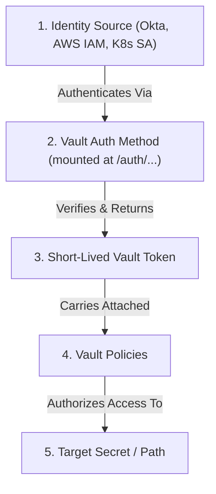
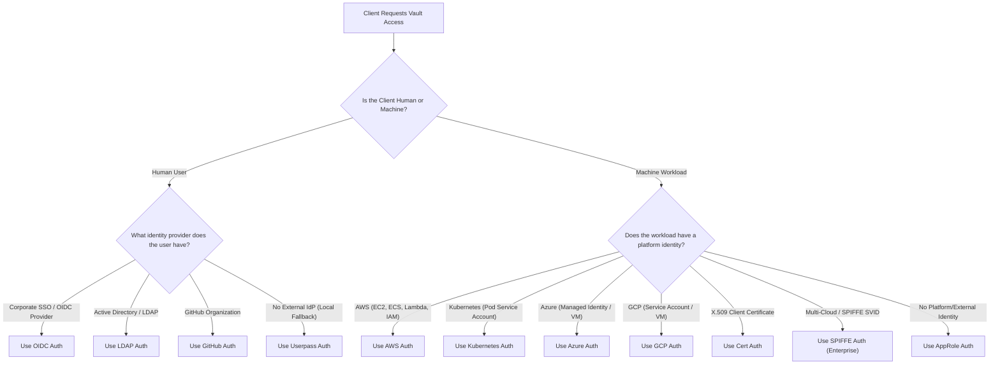
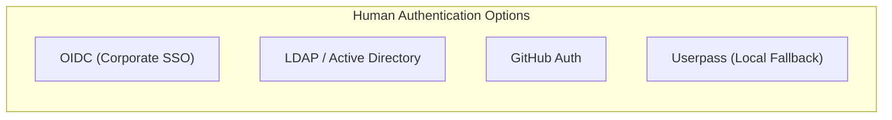
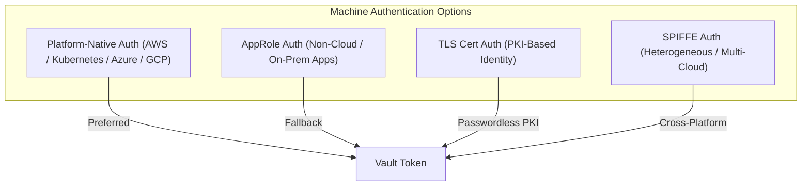
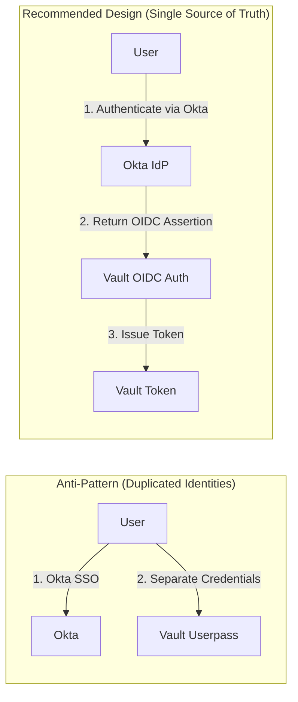
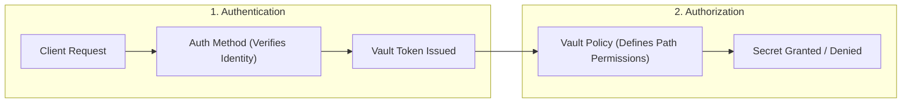

# Objective 1b: Choose an Authentication Method Based on Use Case

> [!NOTE]
> **Exam Context:** For the HashiCorp Vault Associate 003 Certification, Objective 1b is a practical decision-making objective. You will be presented with specific scenario descriptions (e.g., human users, cloud workloads, on-prem services) and asked to select the most appropriate Vault authentication method based on the client's existing identity source.

**Official Documentation & Learning Paths:**
- [HashiCorp Vault Security Automation Certification](https://developer.hashicorp.com/certifications/security-automation)
- [Vault Concepts: Authentication](https://developer.hashicorp.com/vault/docs/concepts/auth)
- [Vault Auth Methods Overview](https://developer.hashicorp.com/vault/docs/auth)
- [Vault Associate 003 Study Guide](https://developer.hashicorp.com/vault/tutorials/associate-cert-003/associate-study-003)

---

## 1. Core Rule & Decision Principle

> [!IMPORTANT]
> **The Golden Rule for Objective 1b:**
> **"Always use the identity source that already knows the client."**
> Never create a new user/password database inside Vault if the client already possesses an identity in an existing provider (IdP, Cloud, Kubernetes, or PKI).

### The Identity Pipeline

$$\text{Identity Source} \longrightarrow \text{Auth Method} \longrightarrow \text{Vault Token} \longrightarrow \text{Policies} \longrightarrow \text{Secret Access}$$

---

## 2. High-Level Exam Decision Flowchart

---

## 3. Human Authentication Methods

Human authentication applies when a person needs interactive access to Vault (via Web UI, CLI, or API).

### 3.1. OIDC (OpenID Connect)
* **Purpose:** Integrates Vault with centralized corporate Single Sign-On (SSO) systems.
* **Identity Providers:** Okta, Microsoft Entra ID (Azure AD), Auth0, Google Workspace, PingIdentity.
* **Why OIDC over Userpass?** Centralizes user lifecycle management. If an employee leaves the company, disabling their account in the corporate IdP immediately revokes future authentication to Vault.
* **Operational Overhead:** Medium (IdP configuration, redirect URIs, claims mapping).
* **Exam Keywords:** *"Corporate SSO"*, *"Existing identity provider"*, *"Employees authenticate using SSO"*, *"Okta"*, *"Entra ID"*.

### 3.2. LDAP / Active Directory
* **Purpose:** Authenticates users against an existing enterprise directory server.
* **Why LDAP?** Directly reuses corporate directory groups for Vault policy assignments without creating local Vault accounts.
* **Trade-Off:** Vault becomes dependent on external LDAP server availability and network connectivity.
* **Operational Overhead:** Medium (LDAP connection strings, TLS certs, bind credentials, group mapping).
* **Exam Keywords:** *"Active Directory"*, *"Enterprise LDAP directory"*, *"Authenticate against corporate directory"*, *"LDAP groups"*.

### 3.3. GitHub Auth
* **Purpose:** Authenticates developers and operators using their GitHub organization and team memberships.
* **Security Consideration:** Relies on GitHub Personal Access Tokens; stolen tokens present security risks.
* **Exam Keywords:** *"GitHub organization"*, *"GitHub teams"*, *"Developers authenticating via GitHub"*.

### 3.4. Userpass
* **Purpose:** Vault-managed username and password authentication.
* **When to Use:** Small lab environments, initial testing, or when **no external identity provider exists**.
* **Exam Trap:** **Do NOT select Userpass** if the question states that the organization already uses an external IdP (like Okta or Active Directory). Select OIDC or LDAP instead.
* **Exam Keywords:** *"Simple Vault-managed credentials"*, *"No external identity provider available"*.

---

## 4. Machine & Workload Authentication Methods

Machine authentication applies to automated applications, CI/CD pipelines, containerized pods, and cloud infrastructure.

### 4.1. AWS Auth Method
* **Mechanism:** Uses AWS IAM credentials or EC2 instance identity documents (PKCS7) to prove workload identity to Vault.
* **Use Cases:** AWS EC2 instances, AWS Lambda functions, ECS tasks, EKS workloads.
* **Why AWS over AppRole?** Reuses native AWS IAM roles; eliminates the need to generate, distribute, and rotate separate Vault Secret IDs.
* **Exam Keywords:** *"EC2 instance"*, *"Lambda function"*, *"AWS IAM role"*, *"AWS workload"*.

### 4.2. Kubernetes Auth Method
* **Mechanism:** Uses native Kubernetes Service Account JWT tokens. Vault validates the token via the Kubernetes TokenReviewer API.
* **Use Cases:** Applications running inside Kubernetes Pods (EKS, GKE, AKS, OpenShift).
* **Why Kubernetes over AppRole?** Avoids injecting static secrets into containers; identity is automatically provided by the Pod's Service Account.
* **Exam Keywords:** *"Kubernetes Pod"*, *"Service Account"*, *"EKS / GKE / AKS workload"*.

### 4.3. Azure & GCP Auth Methods
* **Azure Auth:** Uses Azure Managed Identities (System-Assigned or User-Assigned) or Azure AD Service Principals for Azure VMs and App Services.
* **GCP Auth:** Uses GCP IAM Service Account credentials or Google Compute Engine (GCE) instance identity tokens.
* **Exam Keywords:** *"Azure VM"*, *"Azure Managed Identity"*, *"GCP Service Account"*, *"GCE Instance"*.

### 4.4. AppRole Auth Method
* **Purpose:** Vault-native machine authentication mechanism designed for applications without native cloud or container platform identities.
* **Mechanism:** Uses a two-part credential: **Role ID** (equivalent to a username) and **Secret ID** (equivalent to a password/token).
* **Golden Rule:** **Always prefer platform-native auth (AWS, K8s, Azure, GCP) when available before defaulting to AppRole.**
* **Trade-Off:** Requires managing the lifecycle, secure delivery, rotation, and TTL of Secret IDs.
* **Exam Keywords:** *"Application with no cloud or container identity"*, *"Role ID and Secret ID"*, *"On-premises legacy application"*.

### 4.5. Certificate Auth (TLS Client Certs)
* **Mechanism:** Authenticates clients using X.509 TLS client certificates signed by a trusted Certificate Authority (CA).
* **Use Cases:** Bare-metal servers, legacy services, passwordless PKI infrastructure.
* **Exam Keywords:** *"X.509 client certificate"*, *"TLS certificate"*, *"PKI-based machine authentication"*.

### 4.6. SPIFFE Auth (Vault Enterprise)
* **Mechanism:** Authenticates workloads using SPIFFE Verifiable Identity Documents (SVIDs).
* **Use Cases:** Multi-cloud, cross-platform, or heterogeneous environments spanning bare metal, VMs, and multiple Kubernetes clusters.
* **Exam Keywords:** *"SPIFFE SVID"*, *"X.509-SVID"*, *"Heterogeneous multi-cloud workload identity"*.

---

## 5. Architectural Scenarios: Anti-Patterns vs. Recommended Designs

### Operational Cost Perspective
Authentication methods themselves incur **no extra licensing cost** in Vault. The true cost is **operational complexity**:
- **High Operational Cost:** Creating and managing static usernames/passwords or Secret IDs inside Vault when an external identity provider already exists.
- **Low Operational Cost:** Wiring Vault directly to existing enterprise identity systems (Okta, Active Directory, AWS IAM, K8s Service Accounts).

---

## 6. Important Exam Concepts & Common Traps

### 6.1. Auth Method vs. Policy (Authentication vs. Authorization)

> [!IMPORTANT]
> - **Authentication Method:** Answers **"Who are you?"** (Verifies identity and issues a token).
> - **Vault Policy:** Answers **"What are you allowed to do?"** (Grants or denies access to path prefixes).
> - An authentication method **never grants secret access directly**; it assigns policies to tokens.

### 6.2. Auth Method vs. Vault Token
- The authentication method credentials (e.g., AppRole Role ID + Secret ID, OIDC token, AWS IAM signature) are **only used during initial login**.
- After successful authentication, Vault returns a **dynamically generated Vault Token**.
- All subsequent Vault API requests use the **Vault Token**, not the original auth credentials.

### 6.3. External Identity Changes vs. Existing Tokens
- Vault communicates with external identity providers (e.g., LDAP, GitHub, OIDC) during **initial login** and **token renewal**.
- If a user is disabled in the external identity system, **existing active Vault tokens remain valid** until their TTL expires or they are explicitly revoked.

### 6.4. Multiple Auth Method Mounts
- Vault supports enabling **multiple authentication methods simultaneously**.
- Vault supports mounting the **same auth method type multiple times** under different paths (e.g., `auth/aws-dev` and `auth/aws-prod`).
- A client only needs to authenticate successfully through **one** method to receive a token.

---

## 7. Master Exam Decision Matrix

| Scenario / Scenario Clue | Best First Choice Auth Method | Target Client Category |
| :--- | :--- | :--- |
| **Employees using Corporate SSO (Okta, Entra ID, Auth0)** | **OIDC** | Human |
| **Existing Active Directory or LDAP server** | **LDAP** | Human |
| **Developers authenticating via GitHub Org** | **GitHub** | Human |
| **Lab environment with no external IdP** | **Userpass** | Human (Fallback) |
| **AWS EC2, ECS, Lambda, or IAM identity** | **AWS** | Machine (Cloud) |
| **Kubernetes Pod or Service Account** | **Kubernetes** | Machine (Container) |
| **Azure VM or Azure Managed Identity** | **Azure** | Machine (Cloud) |
| **GCP Compute Engine or Service Account** | **GCP** | Machine (Cloud) |
| **Application with NO cloud or container identity** | **AppRole** | Machine (Vault-Native) |
| **Legacy application with X.509 Certificate** | **Cert** | Machine (PKI) |
| **Heterogeneous multi-cloud workload identity** | **SPIFFE** | Machine (Enterprise) |

---

## 8. Summary Checklist for Objective 1b

1. **Rule #1:** Identify the client's existing identity system and match it directly to the Vault auth method.
2. **Human Default:** Prefer **OIDC** or **LDAP** for corporate environments; use **Userpass** only as a fallback.
3. **Machine Default:** Prefer **Platform-Native Auth** (AWS, K8s, Azure, GCP); use **AppRole** only when no platform identity exists.
4. **Auth vs. Policy:** Auth verifies **identity** $\rightarrow$ Vault issues a **token** $\rightarrow$ Policies define **authorization**.

---

## References

- [1] [HashiCorp Security Automation Certification](https://developer.hashicorp.com/certifications/security-automation)
- [2] [Vault Concepts: Authentication](https://developer.hashicorp.com/vault/docs/concepts/auth)
- [3] [Auth Methods Overview](https://developer.hashicorp.com/vault/docs/auth)
- [4] [Why Use Vault](https://developer.hashicorp.com/vault/tutorials/get-started/why-use-vault)
- [5] [Secure Workflows with OIDC Authentication](https://developer.hashicorp.com/vault/tutorials/auth-methods/oidc-auth)
- [6] [Authentication for People - Validated Designs](https://developer.hashicorp.com/validated-designs/vault/administration-guide/authentication-for-people)
- [7] [Vault AppRole Authentication](https://developer.hashicorp.com/vault/tutorials/auth-methods)
- [8] [TLS Certificates Auth Method](https://developer.hashicorp.com/vault/docs/auth/cert)
- [9] [SPIFFE Auth Method Overview](https://developer.hashicorp.com/vault/docs/auth/spiffe)
- [10] [How Vault Works](https://developer.hashicorp.com/vault/docs/about-vault/how-vault-works)
- [11] [Tokens in Vault](https://developer.hashicorp.com/vault/docs/concepts/tokens)
- [12] [Vault Associate 003 Study Guide](https://developer.hashicorp.com/vault/tutorials/associate-cert-003/associate-study-003)