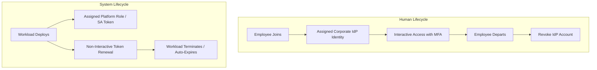
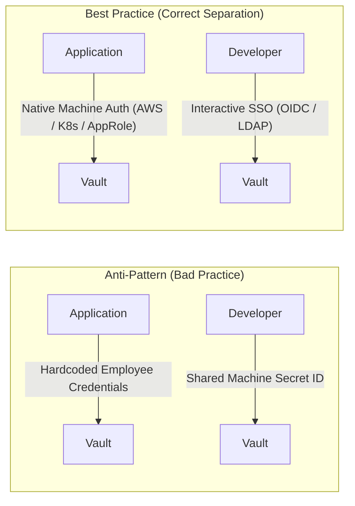
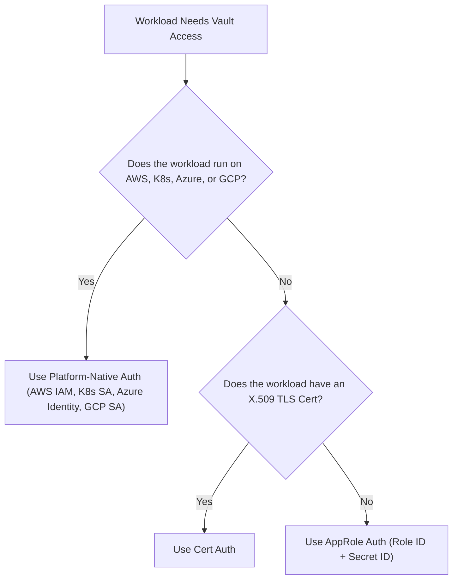
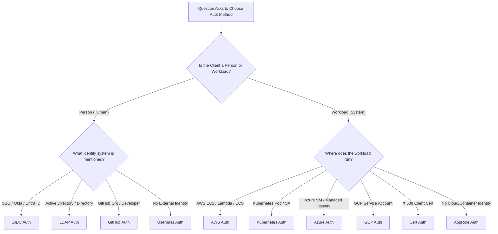

# Objective 1c: Differentiate Between Human vs. System Authentication Methods

> [!NOTE]
> **Exam Context:** For the HashiCorp Vault Associate 003 Certification, Objective 1c tests your understanding of the fundamental differences between **Human Authentication** (interactive, person-based) and **System/Machine Authentication** (non-interactive, workload-based), why Vault separates them, and how to select the right method without falling into exam traps.

**Official Documentation:**
- [HashiCorp Vault Security Automation Certification](https://developer.hashicorp.com/certifications/security-automation)
- [Vault Concepts: Authentication](https://developer.hashicorp.com/vault/docs/concepts/auth)
- [Vault Auth Methods Overview](https://developer.hashicorp.com/vault/docs/auth)

---

## 1. Core Distinction: Human vs. System Authentication

Vault strictly distinguishes between who or what is requesting access based on **identity lifecycles** and **interaction models**.

$$\text{Human Auth} = \text{Prove a Person's Identity (Interactive)}$$
$$\text{System Auth} = \text{Prove a Workload / Machine Identity (Automated)}$$

### Comparison Pipeline Diagram

```mermaid
graph TD
    subgraph HumanAuth ["Human Authentication (Interactive)"]
        Person["Person / User"] -->|"1. Web UI / CLI SSO Login"| IdP["Corporate IdP (Okta / Entra ID / LDAP / GitHub)"]
        IdP -->|"2. Verifies Person"| VaultH["Vault Server"]
        VaultH -->|"3. Short-Lived Token"| UserToken["User Vault Token"]
    end

    subgraph SystemAuth ["System Authentication (Non-Interactive)"]
        Workload["Application / Pod / VM"] -->|"1. Submit Machine Attestation"| Platform["Platform / PKI (AWS IAM / K8s SA / Cert)"]
        Platform -->|"2. Verifies Workload"| VaultS["Vault Server"]
        VaultS -->|"3. Automated Token"| AppToken["App Vault Token"]
    end
```

---

## 2. Why Does This Distinction Exist?

Human and machine identities have fundamentally different lifecycles, access patterns, and security risks.

---

## 3. Detailed Side-by-Side Comparison

| Feature / Dimension | Human Authentication | System / Machine Authentication |
| :--- | :--- | :--- |
| **Primary Target** | Individual persons (developers, admins, operators) | Applications, microservices, CI/CD, K8s Pods, VMs |
| **Interaction Model** | **Interactive** (Browser UI, OIDC redirect, CLI login) | **Non-Interactive** (Automated API calls, background daemon) |
| **Credential Type** | User credentials, passwords, TOTP, SAML/OIDC assertions | IAM roles, JWT service account tokens, Secret IDs, X.509 certs |
| **Multi-Factor Auth (MFA)** | Common & Recommended (Duo, Okta MFA, TOTP) | Rare / Not Applicable for automated workloads |
| **Identity Source** | Enterprise IdP (Okta, Entra ID, LDAP, GitHub) | Cloud provider, K8s cluster, PKI, or AppRole |
| **Lifecycle Event** | Tied to employee onboarding & offboarding | Tied to workload deployment, scaling, and container shutdown |
| **Common Auth Methods** | **OIDC**, **LDAP**, **GitHub**, **Userpass** | **AWS**, **Kubernetes**, **Azure**, **GCP**, **AppRole**, **Cert** |

---

## 4. Anti-Patterns & Common Exam Traps

> [!CAUTION]
> **Anti-Pattern 1: Using Human Credentials for Applications**
> Never hardcode an employee's Vault username/password inside an application. If the employee leaves or changes their password, the application breaks. Audit logs will also incorrectly attribute automated machine access to a human user.

> [!CAUTION]
> **Anti-Pattern 2: Using Machine Credentials for Human Access**
> Developers should not authenticate using an AWS IAM role or AppRole Secret ID for interactive CLI/UI access. This bypasses corporate MFA, obfuscates human identity in audit logs, and complicates user access revocation.

---

## 5. Decision Logic for Machine Auth: Platform-Native vs. AppRole

A frequent exam trick tests whether you know when to use **AppRole** versus **Cloud/Platform Auth**.

> [!IMPORTANT]
> **Exam Trap Rule:** "Machine authentication" does **NOT** automatically mean **AppRole**.
> - If the workload runs on AWS, Kubernetes, Azure, or GCP $\rightarrow$ **Use Platform-Native Auth (AWS/K8s/Azure/GCP)**.
> - Use **AppRole** only when the application runs in an environment with **no platform-native identity** (e.g., legacy on-prem VM).

---

## 6. Decision Logic for Human Auth: Enterprise IdP vs. Userpass

> [!IMPORTANT]
> **Exam Trap Rule:** "Human user" does **NOT** automatically mean **Userpass**.
> - If the user has corporate SSO / Okta / Entra ID $\rightarrow$ **Use OIDC**.
> - If the organization has Active Directory / Directory Server $\rightarrow$ **Use LDAP**.
> - If authenticating developers via GitHub Org $\rightarrow$ **Use GitHub Auth**.
> - Use **Userpass** only when **no external identity provider exists** (e.g., local lab).

---

## 7. Master Keyword Mapping for Objective 1c

| Exam Scenario Phrase | Target Category | Recommended Auth Method |
| :--- | :--- | :--- |
| *"Employee logs in via corporate SSO / Okta"* | **Human** | **OIDC** |
| *"User authenticates against Active Directory"* | **Human** | **LDAP** |
| *"Developer authenticates using GitHub Org"* | **Human** | **GitHub** |
| *"Vault-managed username and password"* | **Human** | **Userpass** |
| *"EC2 instance needs database password"* | **System** | **AWS** |
| *"Lambda function or ECS task access"* | **System** | **AWS** |
| *"Kubernetes Pod requesting secrets"* | **System** | **Kubernetes** |
| *"EKS / GKE / AKS workload"* | **System** | **Kubernetes** |
| *"Azure VM or Azure Managed Identity"* | **System** | **Azure** |
| *"GCP Service Account"* | **System** | **GCP** |
| *"Application with no cloud identity (Role ID/Secret ID)"* | **System** | **AppRole** |
| *"Service presenting X.509 client certificate"* | **System** | **Cert** |
| *"Multi-cloud SPIFFE SVID workload identity"* | **System** | **SPIFFE** |

---

## 8. Summary Flowchart for Exam Questions

---

## 9. Top 5 Key Takeaways for Objective 1c

1. **Human = Interactive** (SSO, Web Browser, MFA, IdP-based).
2. **System = Non-Interactive** (Automated secret retrieval, cloud/container IAM, PKI).
3. **Prefer Existing Identity Sources** (Do not duplicate user/machine accounts inside Vault).
4. **Platform First for Machines** (Prefer AWS/Kubernetes/Azure/GCP auth before falling back to AppRole).
5. **IdP First for Humans** (Prefer OIDC/LDAP before falling back to Userpass).

---

## References

- [1] [Security Automation Certification | HashiCorp Developer](https://developer.hashicorp.com/certifications/security-automation)
- [2] [Authentication Concepts | HashiCorp Developer](https://developer.hashicorp.com/vault/docs/concepts/auth)
- [3] [Auth Methods Overview | HashiCorp Developer](https://developer.hashicorp.com/vault/docs/auth)