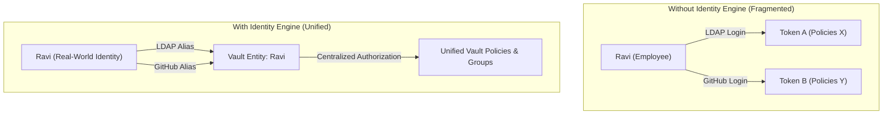
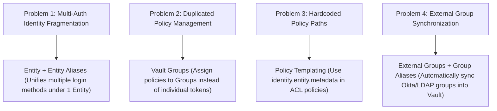
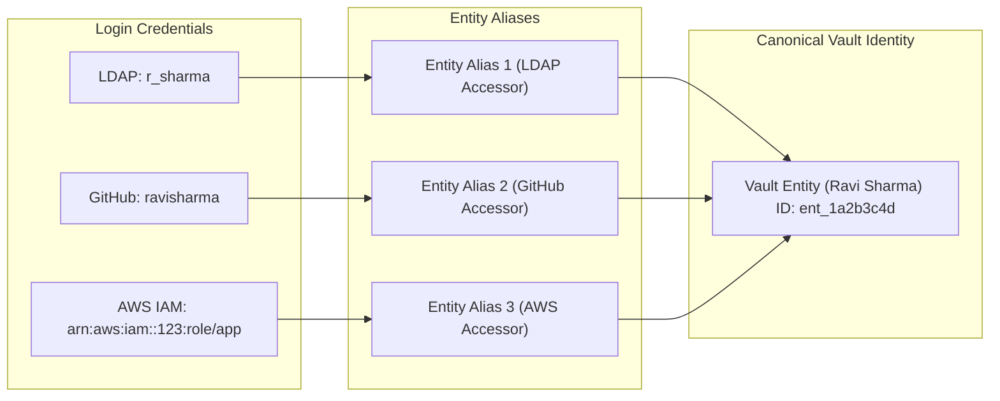
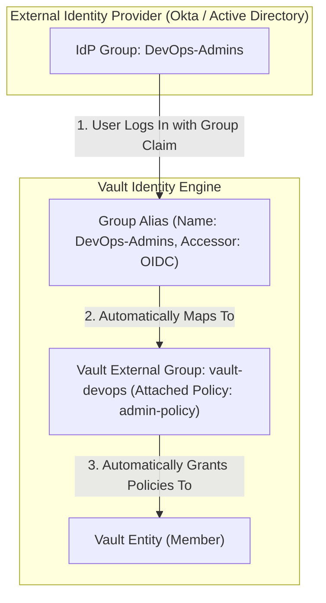
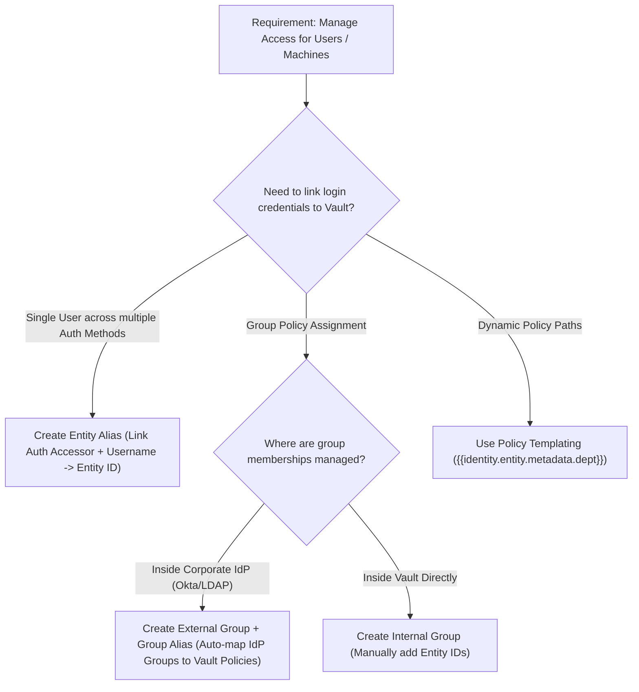

# Objective 1d: Purpose of Vault Identities and Groups (Entities & Groups)

> [!NOTE]
> **Exam Context:** For the HashiCorp Security Automation / Vault Associate 003 Certification, Objective 1d tests your understanding of Vault's **Identity System** (`identity/`). You must understand why Entities and Groups exist, how Entity Aliases link multiple auth methods to a single real-world identity, how External Groups map IdP groups to Vault policies, and how Policy Templating works.

**Official Documentation:**
- [HashiCorp Vault Security Automation Certification](https://developer.hashicorp.com/certifications/security-automation)
- [Vault Concepts: Identity - Entities & Groups](https://developer.hashicorp.com/vault/docs/concepts/identity)
- [Identity Secrets Engine Documentation](https://developer.hashicorp.com/vault/docs/secrets/identity)

---

## 1. Why Do Entities and Groups First Exist?

Before Vault introduced the Identity engine, every login through an authentication method resulted in an isolated Vault token with no connection to other tokens issued to the same user or machine.

For example, if a developer named **Ravi** authenticated via **LDAP** at work and via **GitHub** in CI/CD, Vault viewed them as two completely separate, unrelated clients.



### The Fundamental Purpose
Vault **Entities and Groups** provide a **centralized, canonical identity management layer** inside Vault that decouples real-world identity from specific authentication mechanisms.

---

## 2. What Problems Does the Identity System Solve?



### Problems Solved:
1. **Multi-Authentication Mapping:** Connects multiple login credentials (e.g., LDAP `r_sharma` + GitHub `ravisharma`) to a single Vault **Entity**.
2. **Centralized Policy Management:** Eliminates policy duplication by attaching policies directly to **Entities** or **Groups**, rather than configuring policies on every auth method role.
3. **Dynamic Access Control (Policy Templating):** Allows policies to dynamically evaluate client attributes (e.g., `identity.entity.metadata.department`).
4. **External Group Synchronization:** Allows enterprise directory groups (Okta, Active Directory, Azure AD) to automatically grant Vault permissions without manual user management.

---

## 3. Core Components: Entities, Aliases, and Groups

### 3.1. Entity
* **Definition:** A canonical representation of a single real-world actor (human or machine) in Vault.
* **Key Attribute:** Possesses a unique **Entity ID** (`id`), a name, metadata key-value pairs, and associated policies.

### 3.2. Entity Alias
* **Definition:** A mapping that ties a specific login credential from an auth method to a Vault Entity.
* **Mechanism:** Binds an `alias_name` (e.g., `user@company.com`) and an `auth_method_accessor` (e.g., `auth_oidc_12345`) to an `entity_id`.



### 3.3. Internal Groups vs. External Groups

| Group Type | Membership Management | Group Alias Needed? | Primary Use Case |
| :--- | :--- | :--- | :--- |
| **Internal Group** | Managed **manually** inside Vault (adding/removing Entity IDs). | No | Creating custom Vault-native teams or cross-functional groups. |
| **External Group** | Managed **automatically** via external IdP (Okta, LDAP, Entra ID). | **Yes** (Group Alias maps IdP group name to Vault group) | Reusing existing Active Directory / LDAP / SAML security groups. |



---

## 4. Policy Templating with Identity Metadata

Entities store custom key-value metadata (e.g., `department=engineering`, `team=payments`). Vault ACL policies can dynamically reference this metadata using **Policy Templating**.

### Example Templated Policy

```hcl
# Allow entities to access secrets under their own department path
path "secret/data/{{identity.entity.metadata.department}}/*" {
  capabilities = ["create", "read", "update", "delete", "list"]
}

# Allow entities to access their own private user directory
path "secret/data/users/{{identity.entity.name}}/*" {
  capabilities = ["create", "read", "update", "delete", "list"]
}
```

> [!TIP]
> **Exam Clue:** Instead of creating 50 separate policies for 50 teams, you write **one templated policy** using `identity.entity.metadata.<key>`!

---

## 5. Is it Operational Overhead?

* **Without Identity (High Overhead):** Administrators must manually manage and duplicate policy attachments across every auth method endpoint (`auth/ldap`, `auth/oidc`, `auth/approle`).
* **With Internal Groups (Medium Overhead):** Admins manually add/remove entities from Vault internal groups.
* **With External Groups (Low Overhead):** Admins map the external group once via a Group Alias. Group membership is dynamically evaluated at login time by Vault based on the IdP's group claims.

> [!NOTE]
> **Operational Overhead Verdict:** Using Vault's Identity engine with **External Groups** drastically **reduces** ongoing administrative overhead.

---

## 6. Minimal Requirements for Identity Setup

To use Vault Identity features, you need:
1. Vault instance running (the `identity/` engine is enabled by default).
2. At least **one enabled auth method** (e.g., `auth/oidc` or `auth/ldap`).
3. An **Entity** created automatically (Vault creates entities on first login if configured) or manually.
4. An **Entity Alias** linking the auth method accessor to the Entity ID.
5. (Optional) **Groups** and **Group Aliases** for group-based policy assignment.

---

## 7. Trade-Offs & Architectural Considerations

### Internal vs. External Groups Trade-off
* **Internal Groups:** Total control within Vault, but requires manual group membership management by Vault admins.
* **External Groups:** Automated synchronization with corporate directory, but depends on the external IdP passing correct group claims/attributes during authentication.

### Entity Lifecycles
* Vault tokens are short-lived, but **Entities and Entity Aliases persist** in storage.
* Deleting an Auth Method mount automatically cleans up associated Entity Aliases, but Entities remain until deleted or merged.

---

## 8. Cost Perspective

> [!NOTE]
> Like Auth Methods, the Identity Secrets Engine is a core built-in feature of Vault (no extra licensing fee).

* **Cost Savings Mechanism:** Reduces operational labor hours spent on manual policy creation and role mapping.
* **Compliance & Audit Cost Reduction:** Single Entity IDs produce unified audit logs (`entity_id` field in Vault audit logs), making compliance audits significantly faster and cheaper.

---

## 9. Why Use Identity Engine Over Other Approaches?

| Requirement | Traditional Auth-Only Approach | Vault Identity Engine Approach |
| :--- | :--- | :--- |
| **User logs in via OIDC & SSH** | 2 separate tokens with unlinked policies | 1 Vault Entity with unified policies |
| **Managing 100 IdP Groups** | Create 100 separate Vault roles on auth method | Create External Groups with Group Aliases |
| **Multi-Tenant User Paths** | Write individual policy files per user | Write 1 Templated Policy (`{{identity.entity.name}}`) |
| **Audit Log Tracking** | Track separate usernames across different auth logs | Track single canonical `entity_id` |

---

## 10. Exam Keywords & Clues to Memorize

| Exam Question Keyword / Scenario | Think |
| :--- | :--- |
| **Canonical representation of a user or machine** | **Entity** |
| **Link multiple login methods to one user** | **Entity Alias** |
| **Map Okta / Active Directory groups to Vault policies** | **External Group + Group Alias** |
| **Write single policy using user attributes** | **Policy Templating (`identity.entity.metadata`)** |
| **Assign policies to a collection of entities** | **Vault Group** |
| **Auth method accessor (`auth_oidc_1a2b3c`)** | **Entity Alias / Group Alias binding** |
| **Manually managed group inside Vault** | **Internal Group** |
| **Group claims from SAML / OIDC / LDAP** | **External Group** |

---

## 11. Objective 1d Exam Flowchart



---

## 12. One-Line Summary for Objective 1d

> [!IMPORTANT]
> **Summary Statement:** Vault **Entities** represent canonical real-world identities across multiple auth methods (via **Entity Aliases**), while **Groups** (Internal or External via **Group Aliases**) unify policy assignment and enable dynamic **Policy Templating**.

---

## References

- [1] [Security Automation Certification | HashiCorp Developer](https://developer.hashicorp.com/certifications/security-automation)
- [2] [Vault Concepts: Identity](https://developer.hashicorp.com/vault/docs/concepts/identity)
- [3] [Identity Secrets Engine Overview](https://developer.hashicorp.com/vault/docs/secrets/identity)
