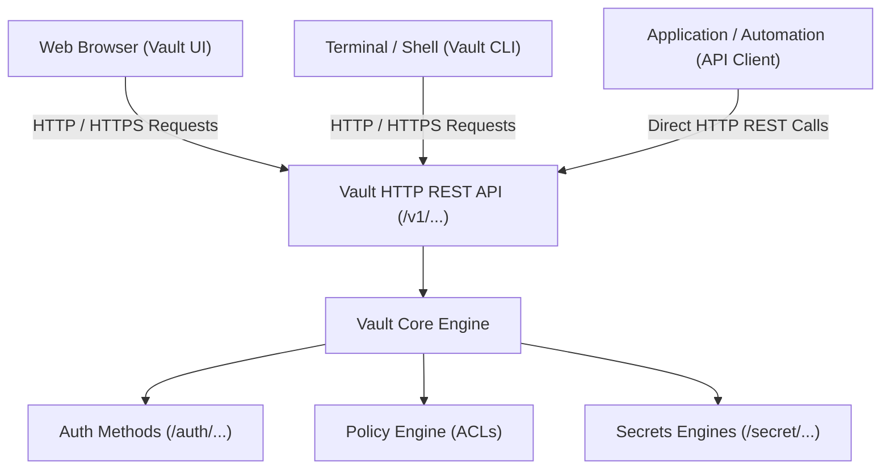
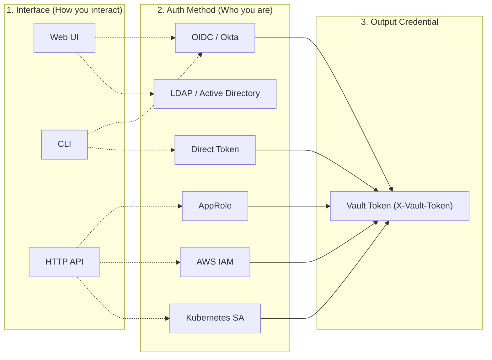
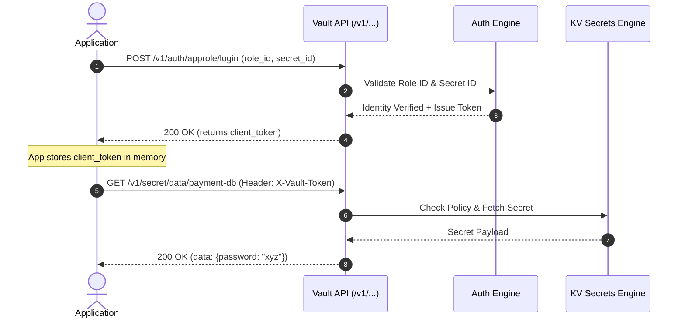
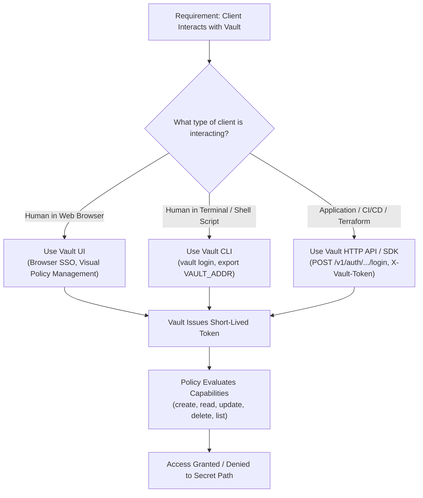

# Objective 1e: Authenticate to Vault via CLI, UI, and API

> [!NOTE]
> **Exam Context:** For the HashiCorp Security Automation / Vault Associate 003 Certification, Objective 1e focuses on the practical mechanisms of **how clients authenticate and interact with Vault**. The exam tests your understanding of the relationship between **Interfaces** (CLI, UI, API), **Authentication Methods**, **Vault Tokens**, and **Policies**.

**Official Documentation:**
- [HashiCorp Vault Security Automation Certification](https://developer.hashicorp.com/certifications/security-automation)
- [Vault Commands (CLI Documentation)](https://developer.hashicorp.com/vault/docs/commands)
- [Vault Web UI Overview](https://developer.hashicorp.com/vault/docs/concepts/dev-server)
- [Vault HTTP API Documentation](https://developer.hashicorp.com/vault/api-docs)

---

## 1. Core Architecture: All Interfaces Route to the HTTP API

Vault exposes a single unified HTTP REST API. The **Web UI** and **CLI** are client wrappers around this underlying API.



### The 5-Layer Vault Access Architecture
$$\text{Layer 1: Interface (UI/CLI/API)} \longrightarrow \text{Layer 2: Auth Method} \longrightarrow \text{Layer 3: Vault Token} \longrightarrow \text{Layer 4: Policy} \longrightarrow \text{Layer 5: Secret Access}$$

---

## 2. Fundamental Distinction: Interface $\neq$ Authentication Method

> [!IMPORTANT]
> **Critical Exam Rule:** Do not confuse **HOW you connect** (Interface) with **HOW you prove who you are** (Authentication Method). Any interface can be combined with appropriate authentication methods.



---

## 3. Detailed Interface Breakdown

### 3.1. Vault Command Line Interface (CLI)
* **Target Audience:** System administrators, platform engineers, developers, automation scripts.
* **Mechanism:** Binary CLI tool that translates commands into Vault HTTP API requests.
* **Key Configuration Variables:**
  * `VAULT_ADDR` $\rightarrow$ The network address of the Vault server (e.g., `https://vault.company.com:8200`).
  * `VAULT_TOKEN` $\rightarrow$ Environment variable holding an active token for authenticated commands.
  * `VAULT_CACERT` / `VAULT_CAPATH` $\rightarrow$ Path to CA certificates for TLS verification.

```bash
# Example CLI Login Workflows
export VAULT_ADDR="https://vault.company.com:8200"

# Interactive login via OIDC (opens browser)
vault login -method=oidc

# Userpass login
vault login -method=userpass username=ravi

# Directly supplying an existing token
vault login s.abcdef1234567890

# Reading secrets using token stored in ~/.vault-token
vault kv get secret/myapp/config
```

### 3.2. Vault Web User Interface (UI)
* **Target Audience:** Interactive human operators, security auditors, administrators.
* **Mechanism:** Single-page web application served directly by the Vault daemon (requires no external web server).
* **Key Capabilities:**
  * Visual secret browsing, creation, and metadata inspection.
  * Policy editor and syntax validator.
  * Auth method and secrets engine mounting and configuration.
  * System health, HA cluster status, and replication monitoring.
* **Exam Clue:** *"Administrator inspects cluster status or creates a policy using a web browser."*

### 3.3. Vault HTTP REST API
* **Target Audience:** Applications, microservices, container workloads, CI/CD pipelines, Terraform.
* **Mechanism:** Programmatic JSON payloads sent via standard HTTP methods (`GET`, `POST`, `PUT`, `DELETE`, `LIST`).
* **Authentication Header:** `X-Vault-Token: <token_value>`.



---

## 4. API Endpoints: Auth Endpoint vs. Secret Endpoint

Understanding API path conventions is essential for the exam:

| Step / Purpose | HTTP Method & Path Pattern | Request Header / Body | Response Payload |
| :--- | :--- | :--- | :--- |
| **1. Authentication** | `POST /v1/auth/<method>/login` | Method credentials in JSON body | Returns `auth.client_token`, `policies`, `ttl`, `accessor` |
| **2. Secret Operation** | `GET /v1/secret/data/<path>` | `X-Vault-Token: <token>` | Returns JSON payload with secret data |
| **3. Token Lifecycle** | `POST /v1/auth/token/renew-self` | `X-Vault-Token: <token>` | Returns updated TTL for active token |
| **4. Token Revocation** | `POST /v1/auth/token/revoke-self` | `X-Vault-Token: <token>` | Destroys token and invalidates access |

---

## 5. Side-by-Side Comparison: CLI vs. UI vs. API

| Dimension | Vault CLI | Vault Web UI | Vault HTTP API |
| :--- | :--- | :--- | :--- |
| **Primary User** | Operators, Admins, Scripts | Human Administrators, Auditors | Automated Apps, Microservices, CI/CD |
| **Interaction Type** | Terminal commands | Visual browser interface | Programmatic REST requests |
| **Token Handling** | Saved to `~/.vault-token` or `VAULT_TOKEN` | Stored in browser session storage | Stored in application memory / client SDK |
| **Best For** | Fast troubleshooting, admin scripts | Visual inspection, policy drafting | Scalable microservice secret retrieval |
| **Automation Suitability** | Moderate (shell scripting) | None (Anti-pattern for automation) | **Highest** (production standard) |

---

## 6. Trade-Offs & Anti-Patterns

### Anti-Pattern 1: Scraping CLI output in Application Code
* **Bad Practice:** Spawning a subprocess to run `vault kv get -format=json` inside a production Java/Python application.
* **Why It Fails:** Fragile error handling, process overhead, CLI version dependencies, and token exposure in process trees.
* **Solution:** Use native HTTP REST calls or official Vault SDKs (e.g., Spring Cloud Vault, HVAC for Python, HashiCorp Go SDK).

### Anti-Pattern 2: Manual UI Automation
* **Bad Practice:** Attempting to automate infrastructure deployments or secret provisioning by clicking buttons in the UI.
* **Solution:** Use Terraform, Vault API, or the Vault CLI in automated CI/CD pipelines.

---

## 7. Security & Audit Logging Principles

> [!IMPORTANT]
> The interface itself does **NOT** grant permissions or bypass security policies.
> - **Authentication** verifies identity.
> - **Policies** govern access control regardless of whether the request originated from the CLI, UI, or API.
> - **Audit Devices** log every single request (method, path, entity ID, client IP) regardless of interface.

---

## 8. Master Exam Keyword Mapping

| Scenario / Exam Question Clue | Target Concept / Interface |
| :--- | :--- |
| *"Administrator accesses Vault through a web browser"* | **Vault UI** |
| *"Command-line administration and shell scripts"* | **Vault CLI** |
| *"Programmatic access from microservices or CI/CD"* | **Vault API** |
| *"Header used to pass Vault token in HTTP requests"* | **`X-Vault-Token`** |
| *"Environment variable specifying Vault server address"* | **`VAULT_ADDR`** |
| *"Environment variable storing active client token"* | **`VAULT_TOKEN`** |
| *"Endpoint used to obtain initial Vault token"* | **`/v1/auth/<method>/login`** |
| *"Interactive CLI login triggering OIDC redirect"* | **`vault login -method=oidc`** |
| *"Application authenticates using Role ID and Secret ID"* | **API + AppRole** |
| *"Workload authenticates using Kubernetes Service Account"* | **API + Kubernetes Auth** |

---

## 9. Objective 1e Summary Decision Flowchart



---

## 10. Top 5 Key Takeaways for Objective 1e

1. **All Interfaces Target the HTTP API:** The UI and CLI are convenience wrappers around Vault's REST API.
2. **Interface $\neq$ Auth Method:** An interface is *how you talk to Vault*; an auth method is *how Vault verifies your identity*.
3. **`X-Vault-Token` is Universal:** Programmatic API requests authenticate by passing the token in the `X-Vault-Token` HTTP header.
4. **`VAULT_ADDR` vs. `VAULT_TOKEN`:** `VAULT_ADDR` tells the client *where* Vault is; `VAULT_TOKEN` tells Vault *who* is asking.
5. **Policies Rule Authorization:** The interface never determines access permissions—permissions are strictly enforced by Vault policies bound to the issued token.

---

## References

- [1] [Security Automation Certification | HashiCorp Developer](https://developer.hashicorp.com/certifications/security-automation)
- [2] [Vault CLI Commands Reference](https://developer.hashicorp.com/vault/docs/commands)
- [3] [Vault HTTP API Overview](https://developer.hashicorp.com/vault/api-docs)
