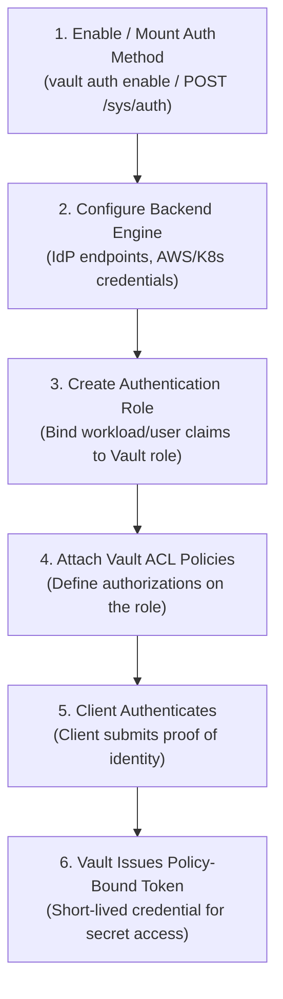
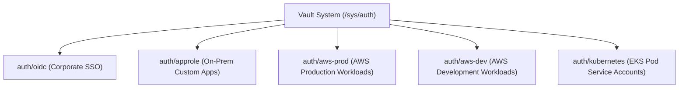
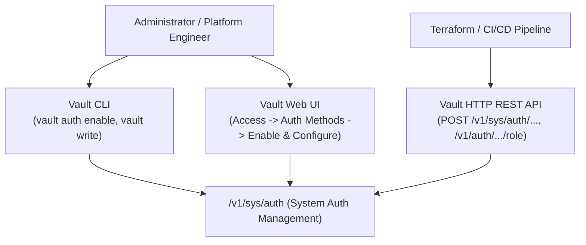
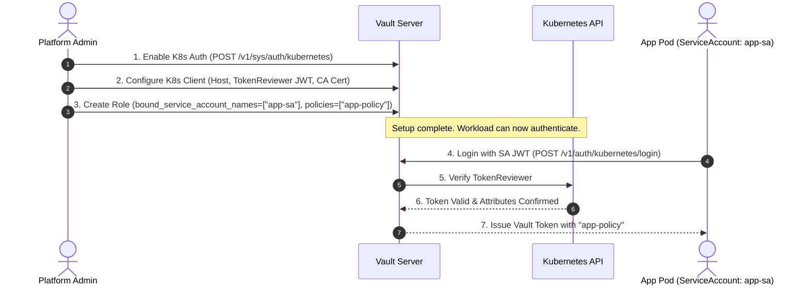
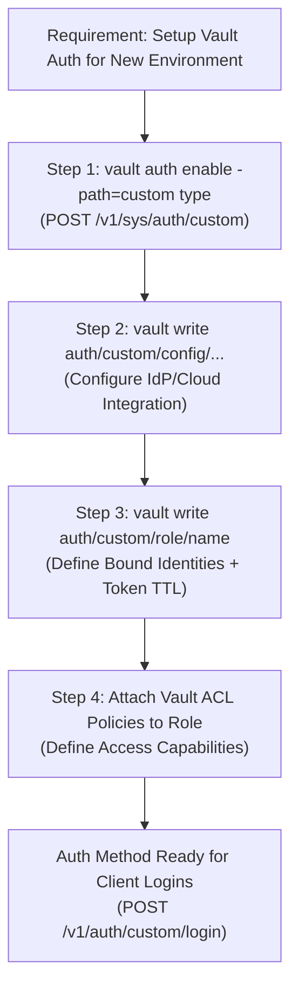

# Objective 1f: Configure Authentication Methods via CLI, UI, and API

> [!NOTE]
> **Exam Context:** For the HashiCorp Security Automation / Vault Associate 003 Certification, Objective 1f tests your knowledge of **administrative configuration and lifecycle management of authentication methods**. While Objective 1e tests *how clients log in*, Objective 1f tests *how administrators and automation enable, tune, configure, role-map, and disable auth methods*.

**Official Documentation:**
- [HashiCorp Vault Security Automation Certification](https://developer.hashicorp.com/certifications/security-automation)
- [Vault Auth Commands (CLI Documentation)](https://developer.hashicorp.com/vault/docs/commands/auth)
- [System Auth API Documentation (/sys/auth)](https://developer.hashicorp.com/vault/api-docs/system/auth)
- [Terraform Vault Provider Auth Resources](https://registry.terraform.io/providers/hashicorp/vault/latest/docs)

---

## 1. The Core Lifecycle: 6 Steps to Auth Configuration

Setting up an authentication method follows a strict, repeatable lifecycle:



$$\text{Enable Mount} \longrightarrow \text{Configure Backend} \longrightarrow \text{Create Role} \longrightarrow \text{Attach Policy} \longrightarrow \text{Client Login} \longrightarrow \text{Token Issued}$$

---

## 2. Fundamental Distinction: Objective 1e vs. Objective 1f

| Dimension | Objective 1e (Authentication / Consumption) | Objective 1f (Configuration / Administration) |
| :--- | :--- | :--- |
| **Core Question** | *"HOW does a client prove identity and get a token?"* | *"HOW does an admin/automation enable and configure the auth method?"* |
| **Actor** | End users, developers, automated workloads | Security administrators, platform engineers, CI/CD, Terraform |
| **Primary Endpoints** | `POST /v1/auth/<path>/login` | `POST /v1/sys/auth/<path>`, `POST /v1/auth/<path>/config`, `.../role` |
| **CLI Commands** | `vault login -method=...`, `vault kv get` | `vault auth enable`, `vault auth list`, `vault write auth/...` |

---

## 3. Auth Method Mounts & Custom Paths

All authentication methods in Vault are mounted under the `auth/` path prefix.



### Why Custom Mount Paths? (`-path=...`)
Vault allows mounting the **same auth method type multiple times** using distinct paths.
- **Environment Isolation:** Separate configuration and credentials for `auth/aws-dev` vs. `auth/aws-prod`.
- **Multi-Tenancy:** Dedicated endpoints for distinct teams or cloud accounts within the same Vault cluster.

---

## 4. Multi-Interface Configuration Breakdown



### 4.1. CLI Configuration Commands
* **List Auth Methods:** `vault auth list`
* **Enable Auth Method (Default Path):** `vault auth enable approle`
* **Enable Auth Method (Custom Path):** `vault auth enable -path=aws-prod aws`
* **Tune Auth Method (TTL settings):** `vault auth tune -default-lease-ttl=1h -max-lease-ttl=24h aws-prod/`
* **Configure Engine Backend:** `vault write auth/aws-prod/config/client ...`
* **Create Auth Role:** `vault write auth/aws-prod/role/payment-service auth_type=iam bound_iam_role_arn=... policies=payment-prod`
* **Disable Auth Method:** `vault auth disable aws-prod`

### 4.2. Web UI Configuration
* Navigate to **Access** $\rightarrow$ **Auth Methods** $\rightarrow$ **Enable new method**.
* Select method type (e.g., OIDC, Kubernetes, AppRole), specify path, and fill in configuration forms.
* Best for visual validation and initial proof-of-concept testing.

### 4.3. HTTP REST API Configuration
* **Enable Endpoint:** `POST /v1/sys/auth/<mount_path>` with JSON payload `{"type": "aws", "description": "AWS Prod"}`.
* **List Endpoint:** `GET /v1/sys/auth`
* **Disable Endpoint:** `DELETE /v1/sys/auth/<mount_path>`
* **Configure Endpoint:** `POST /v1/auth/<mount_path>/config/...`
* **Role Endpoint:** `POST /v1/auth/<mount_path>/role/<role_name>`

### 4.4. Infrastructure as Code (Terraform)
In production security automation, auth methods should be managed via the **Terraform Vault Provider**:

```hcl
# Enable AWS Auth Method
resource "vault_auth_backend" "aws_prod" {
  type = "aws"
  path = "aws-prod"
  tune {
    default_lease_ttl = "1h"
    max_lease_ttl     = "24h"
  }
}

# Create Auth Role bound to IAM Role and Vault Policy
resource "vault_aws_auth_backend_role" "payment_role" {
  backend                  = vault_auth_backend.aws_prod.path
  role                     = "payment-role"
  auth_type                = "iam"
  bound_iam_role_arn       = "arn:aws:iam::123456789012:role/payment-app"
  token_policies           = ["payment-policy"]
  token_ttl                = 3600
}
```

---

## 5. End-to-End Concrete Configuration Examples

### Example A: Kubernetes Workload Authentication Setup


### Example B: AppRole Authentication Setup
1. **Enable Mount:** `vault auth enable approle`
2. **Create Role:** `vault write auth/approle/role/order-processor token_policies="order-policy" token_ttl=1h token_max_ttl=4h`
3. **Fetch Role ID:** `vault read auth/approle/role/order-processor/role-id`
4. **Generate Secret ID:** `vault write -f auth/approle/role/order-processor/secret-id`
5. **Client Login:** App submits Role ID + Secret ID $\rightarrow$ Receives token with `order-policy`.

---

## 6. Operational Overhead, Security & Cost Principles

### Operational Principles:
* **Principle of Minimal Attack Surface:** Only enable auth methods that are actively required. Every enabled auth method introduces maintenance and configuration oversight.
* **Disable Unused Mounts:** Run `vault auth disable <path>` when decommissioning legacy workloads to prevent orphaned access.
* **Tuning TTLs:** Use `vault auth tune` or API tune endpoints to enforce reasonable `default_lease_ttl` and `max_lease_ttl`.

### Cost Perspective:
* Auth method configuration incurs **no licensing cost** (all standard auth methods are built into Vault).
* Significant cost savings come from **GitOps automation (Terraform/API)** by eliminating manual click-based configuration and configuration drift across staging and production clusters.

---

## 7. Master Exam Keyword Mapping

| Exam Question Clue / Requirement | Target Action / Concept |
| :--- | :--- |
| *"Enable a new authentication method"* | `vault auth enable <type>` / `POST /v1/sys/auth/<path>` |
| *"List all currently enabled authentication backends"* | `vault auth list` / `GET /v1/sys/auth` |
| *"Remove or disable an authentication mount"* | `vault auth disable <path>` / `DELETE /v1/sys/auth/<path>` |
| *"Mount the same auth method at a custom path"* | `-path=<custom-name>` |
| *"Tune default or maximum token lease TTLs on an auth mount"* | `vault auth tune` / `POST /v1/sys/auth/<path>/tune` |
| *"API endpoint prefix for managing auth mounts"* | `/v1/sys/auth` |
| *"API endpoint prefix for configuring specific auth roles"* | `/v1/auth/<mount-path>/role/...` |
| *"Map external cloud/IdP identity to Vault policies"* | **Vault Auth Role (`.../role/...`)** |
| *"Infrastructure as Code management of auth backends"* | **Terraform Vault Provider (`vault_auth_backend`)** |

---

## 8. Objective 1f Summary Flowchart



---

## 9. Top 5 Key Takeaways for Objective 1f

1. **Enable $\neq$ Configure $\neq$ Authenticate:** Enabling mounts the backend, configuring sets up connection parameters, and roles bind identity attributes to Vault policies.
2. **Mount Path Convention:** Authentication methods are managed via `/v1/sys/auth` and consumed/configured via `/v1/auth/<mount_path>`.
3. **Custom Mounts Enable Isolation:** The same auth method (e.g., AWS) can be mounted at multiple distinct paths (e.g., `auth/aws-dev`, `auth/aws-prod`).
4. **Roles Connect Identity to Policies:** The Vault Auth Role is the central bridge mapping external attributes (IAM ARN, K8s ServiceAccount, OIDC Group) to Vault ACL policies.
5. **Automate with Terraform/API:** Production auth configuration should be automated using Terraform or the HTTP API rather than manual UI clicks.

---

## References

- [1] [Security Automation Certification | HashiCorp Developer](https://developer.hashicorp.com/certifications/security-automation)
- [2] [Vault Auth CLI Commands Reference](https://developer.hashicorp.com/vault/docs/commands/auth)
- [3] [System Auth API Overview](https://developer.hashicorp.com/vault/api-docs/system/auth)