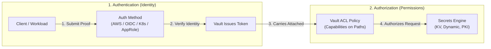
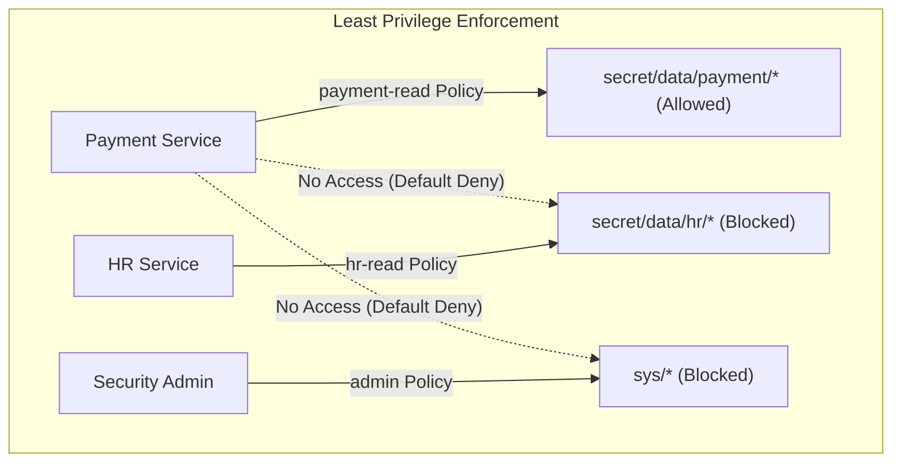
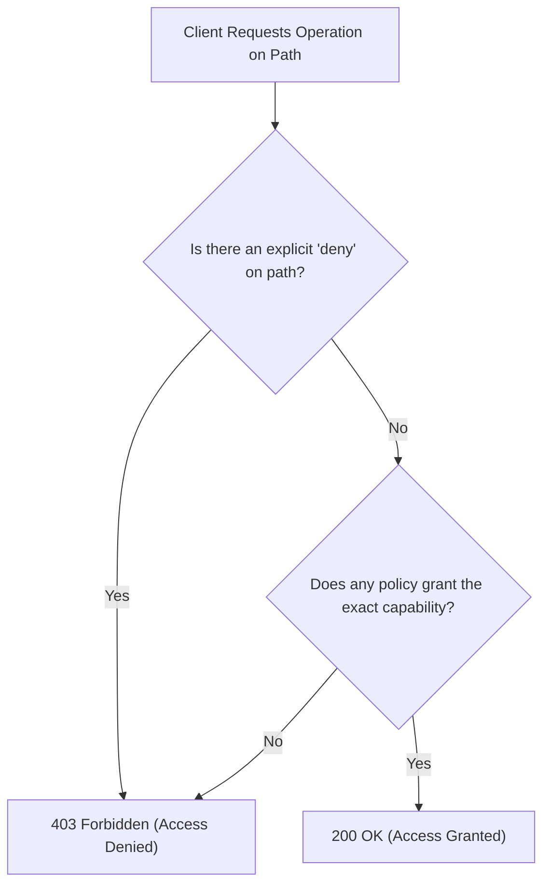
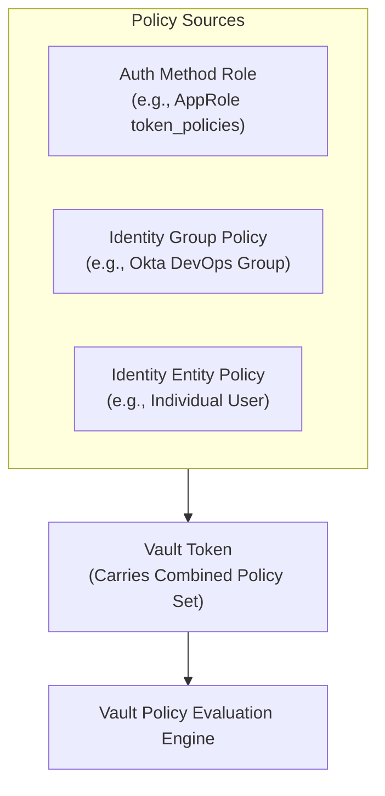
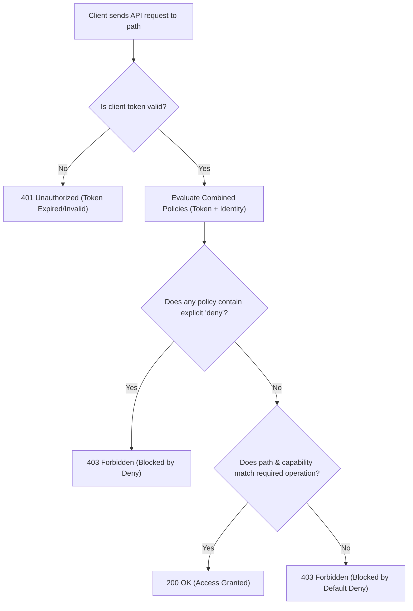

# Objective 2a: Explain the Value of Vault Policies

> [!NOTE]
> **Exam Context:** For the HashiCorp Security Automation / Vault Associate 003 Certification, Objective 2a covers the foundational purpose and value of **Vault Policies**. The exam tests your understanding of the distinction between **Authentication** (identity) and **Authorization** (policies), policy capabilities, path syntax, rule evaluation, and the **Principle of Least Privilege (PoLP)**.

**Official Documentation:**
- [HashiCorp Vault Security Automation Certification](https://developer.hashicorp.com/certifications/security-automation)
- [Vault Policies Concepts](https://developer.hashicorp.com/vault/docs/concepts/policies)
- [Vault Policy Capabilities & Path Syntax](https://developer.hashicorp.com/vault/docs/concepts/policies#capabilities)

---

## 1. Core Concept: Authentication vs. Authorization

The most fundamental concept in Vault security is the separation of identity verification from permission management:

$$\text{Authentication (AuthN)} = \text{“Who are you?” (Proves Identity via Auth Methods)}$$
$$\text{Authorization (AuthZ)} = \text{“What are you allowed to do?” (Enforces Permissions via Policies)}$$



---

## 2. Why Do Vault Policies Exist? (Problem Solved)

### Without Policies (All-or-Nothing Anti-Pattern)
If every authenticated client had unrestricted access, compromising a single microservice (e.g., a frontend app) would give an attacker access to database passwords, payment keys, and root administrative credentials across the entire organization.

### With Policies (Least-Privilege Isolation)
Vault enforces **Least Privilege**: every client receives only the minimum permissions required to perform its specific task, dramatically shrinking the blast radius of any security breach.



---

## 3. Basic Policy Anatomy & HCL Syntax

Vault policies are written in **HashiCorp Configuration Language (HCL)** or JSON. A policy specifies one or more **paths** and a list of allowed **capabilities**.

```hcl
# Allow reading database credentials for payment service
path "secret/data/payment/database" {
  capabilities = ["read"]
}

# Allow full lifecycle management for CI/CD staging secrets
path "secret/data/staging/*" {
  capabilities = ["create", "read", "update", "delete", "list"]
}

# Explicitly block access to high-security production keys
path "secret/data/staging/prod-keys" {
  capabilities = ["deny"]
}
```

---

## 4. Policy Capabilities Breakdown

Vault provides 8 specific capabilities for path access control:

| Capability | Definition & Purpose | Key Exam Distinction |
| :--- | :--- | :--- |
| **`create`** | Allows creating new data at a path. | Distinct from `update` (writing to non-existent vs existing resource). |
| **`read`** | Allows retrieving data from a path. | **`read` does NOT grant `list`** (cannot enumerate folder contents). |
| **`update`** | Allows modifying existing data at a path. | Required for modifying existing secrets or updating settings. |
| **`delete`** | Allows deleting data or marking secret versions deleted. | In KV v2, soft-deletes a version; does not purge unless `destroy`. |
| **`list`** | Allows enumerating child paths/keys under a prefix. | **`list` does NOT grant `read`** (can view names without secret contents). |
| **`patch`** | Allows partial updates to JSON/KV payloads. | Replaces only specified fields rather than whole payload. |
| **`sudo`** | Grants access to elevated root/admin operations. | Required for dangerous system endpoints (e.g., mounting engines, unseal). |
| **`deny`** | Explicitly prohibits access to a path. | **Always takes precedence** over permissive capabilities. |

---

## 5. Critical Exam Distinctions

### 5.1. `read` vs. `list` (Information Disclosure Control)
* **`read` without `list`:** A service can fetch `secret/data/payment/db` if it knows the exact path, but cannot browse or discover what other secrets exist in `secret/data/payment/`.
* **`list` without `read`:** An auditor can inspect which applications have folders in Vault without reading the actual secret passwords inside them.

### 5.2. `deny` Takes Precedence
Vault evaluates policies using a **default-deny** model:
1. If any policy attached to the token contains `deny` on the target path, **access is blocked immediately**.
2. If no policy explicitly grants the required capability, **access is denied by default**.
3. Specific path matches override wildcard (`*` or `+`) rules.



### 5.3. Special Policies: `default` vs. `root`

| Policy Name | Description | Best Practice & Rules |
| :--- | :--- | :--- |
| **`default`** | Built-in policy automatically attached to almost all tokens. Provides basic self-service abilities (token renewal, lookup, cubbyhole). | Can be modified or explicitly omitted with `-no-default-policy`. |
| **`root`** | Built-in superuser policy with unrestricted access to every path and capability. | **Never assign to applications.** Revoke initial root token after production setup! |

---

## 6. KV v2 Path Conventions in Policies

In KV Version 2 (versioned secrets engine mounted at `secret/`), paths are separated into API endpoints:

| Endpoint Subpath | Purpose | Policy Path Pattern |
| :--- | :--- | :--- |
| **`data/`** | Reading, writing, and soft-deleting secret versions. | `path "secret/data/app/*"` |
| **`metadata/`** | Viewing versions, setting max-versions, or deleting all versions. | `path "secret/metadata/app/*"` |
| **`destroy/`** | Permanently purging secret versions from storage. | `path "secret/destroy/app/*"` |
| **`undelete/`** | Restoring soft-deleted versions. | `path "secret/undelete/app/*"` |

> [!WARNING]
> **Exam Trap:** Giving permissions to `secret/payment/*` does **NOT** grant read access in KV v2. You must specify the `data/` subpath: `secret/data/payment/*`.

---

## 7. Policy Attachment Architecture: Tokens & Identities



* **Multiple Policies Combine:** If a token carries `common-read` and `payment-read`, Vault calculates the **union of all capabilities** across all attached policies (unless overridden by `deny`).
* **Policy $\neq$ Token TTL:** The policy determines **what** the token can access; the token TTL determines **how long** the token remains valid.

---

## 8. Management Workflows: CLI, API, UI, and Terraform

### 8.1. CLI Policy Commands
```bash
# List all policies
vault policy list

# View policy rules
vault policy read payment-read

# Write/update a policy from a file
vault policy write payment-read payment-policy.hcl

# Delete an obsolete policy
vault policy delete legacy-policy
```

### 8.2. Infrastructure as Code (Policy-as-Code via Terraform)
In enterprise production, policies are managed in Git and deployed through Terraform:

```hcl
resource "vault_policy" "payment_read" {
  name = "payment-read"

  policy = <<EOT
path "secret/data/payment/*" {
  capabilities = ["read"]
}
EOT
}
```

---

## 9. Operational Overhead vs. Security Matrix

| Policy Granularity Model | Operational Complexity | Security & Blast Radius | Best Use Case |
| :--- | :---: | :---: | :--- |
| **One Broad Policy (`secret/*`)** | Extremely Low | **Extremely Poor** | Local lab sandbox only. |
| **Per-Team Policy (`secret/data/team/*`)** | Low to Medium | Moderate | Small environments / shared team vaults. |
| **Per-Application Policy** | Medium | **High (Recommended)** | Production microservices & Kubernetes pods. |
| **Micro-Granular Path + Attribute** | High | Highest | High-compliance financial & payment systems. |

---

## 10. Master Exam Keyword & Clue Matrix

| Exam Question Phrase | Target Capability / Concept |
| :--- | :--- |
| *"Retrieve secret value without directory browsing"* | **`read` capability (without `list`)** |
| *"Browse/discover available secret paths"* | **`list` capability** |
| *"Modify an existing secret value"* | **`update` capability** |
| *"Permanently remove a KV v2 secret version"* | **`destroy` capability on `/destroy/` path** |
| *"Operations requiring elevated administrative power"* | **`sudo` capability** |
| *"Explicitly forbid access even if granted elsewhere"* | **`deny` capability** |
| *"Superuser policy with unrestricted access"* | **`root` policy** |
| *"Policy automatically attached to all standard tokens"* | **`default` policy** |
| *"Authorization definition in Vault"* | **ACL Policy** |
| *"Where does the policy control access?"* | **Path prefix (`path "..."`)** |

---

## 11. Objective 2a Summary Flowchart



---

## 12. Top 5 Key Takeaways for Objective 2a

1. **AuthN vs. AuthZ:** Authentication verifies *who you are*; policies dictate *what you can do*.
2. **Default Deny Posture:** Everything is forbidden unless explicitly permitted by an attached policy.
3. **`read` $\neq$ `list`:** Knowing a secret path and reading it does not allow enumerating other paths in that directory.
4. **`deny` Overrides All:** An explicit `deny` takes precedence over any permissive capability on matching paths.
5. **Never Use Root for Workloads:** Always create small, purpose-built policies conforming to the Principle of Least Privilege.

---

## References

- [1] [Security Automation Certification | HashiCorp Developer](https://developer.hashicorp.com/certifications/security-automation)
- [2] [Vault Policies Documentation](https://developer.hashicorp.com/vault/docs/concepts/policies)
- [3] [Vault Capabilities Reference](https://developer.hashicorp.com/vault/docs/concepts/policies#capabilities)