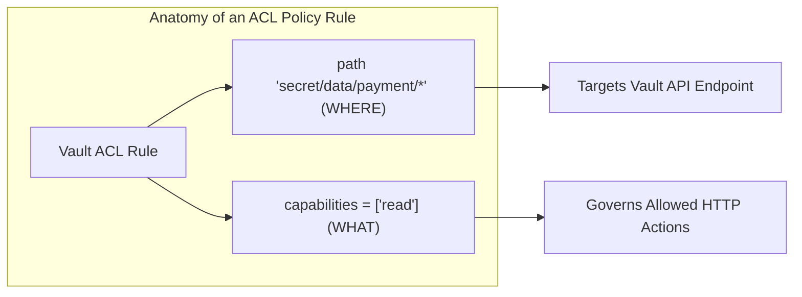
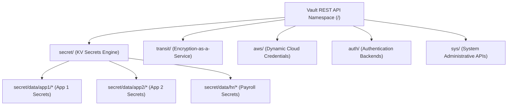
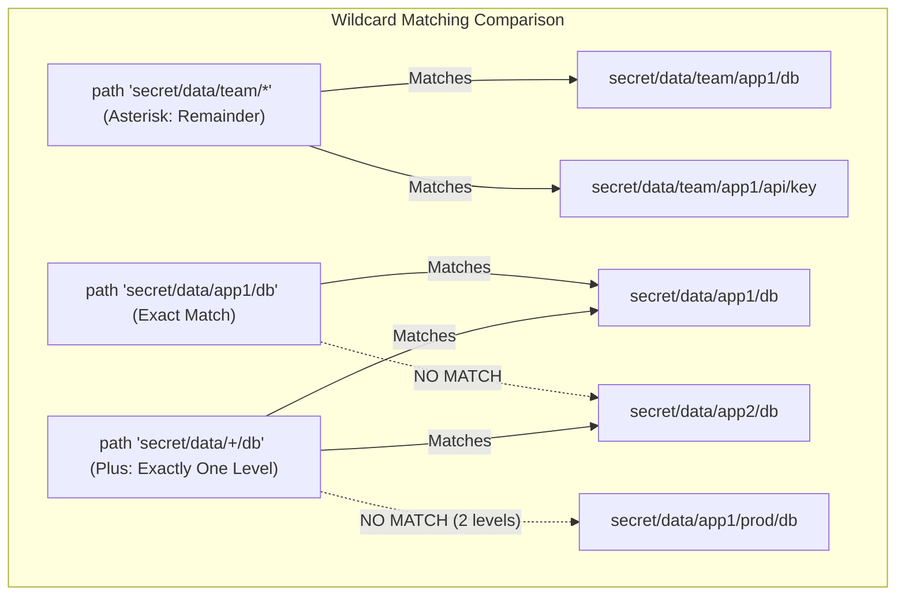
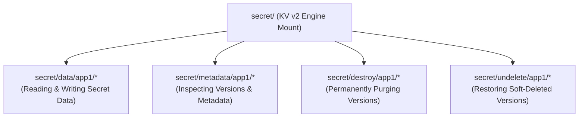
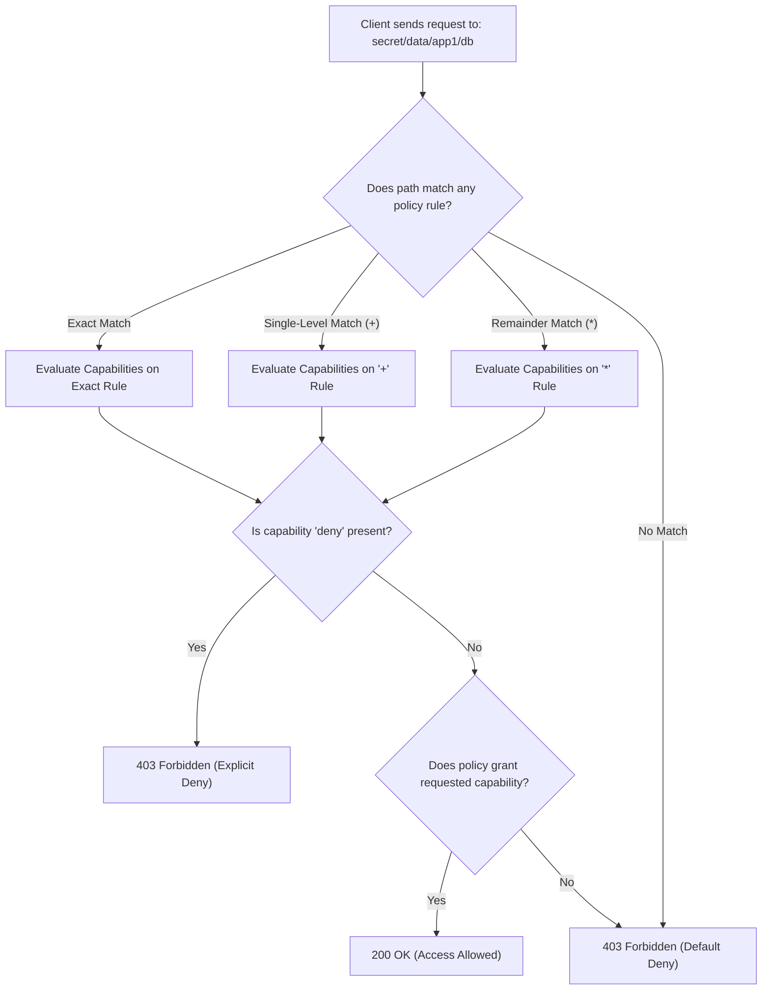

# Objective 2b: Describe Vault Policy - `path`

> [!NOTE]
> **Exam Context:** For the HashiCorp Security Automation / Vault Associate 003 Certification, Objective 2b focuses specifically on the **`path`** component of Vault ACL policies. The exam tests how paths target Vault REST endpoints, the behavior of exact matches vs. wildcards (`*` and `+`), KV v2 path conventions, and how granular paths enforce the **Principle of Least Privilege (PoLP)**.

**Official Documentation:**
- [HashiCorp Vault Security Automation Certification](https://developer.hashicorp.com/certifications/security-automation)
- [Vault Policy Concepts](https://developer.hashicorp.com/vault/docs/concepts/policies)
- [Write a Policy Using API Docs](https://developer.hashicorp.com/vault/tutorials/policies/write-a-policy-using-api-docs)

---

## 1. The Core Mental Model: `path` vs. `capabilities`

Every Vault ACL rule consists of two fundamental pillars:

$$\text{path} = \text{WHERE access is granted (Resource / API Endpoint)}$$
$$\text{capabilities} = \text{WHAT operations are allowed (create, read, update, delete, list, sudo, deny)}$$



---

## 2. Why Does `path` Exist? (Problem Solved)

Vault organizes all cryptographic functions, secrets engines, authentication backends, and system utilities into a **unified hierarchical URL path structure**.



### Problem Solved:
Without `path`-level granularity, authorization would be an all-or-nothing proposition. By binding capabilities to specific paths, Vault ensures that `app1` can read `secret/data/app1/*` while being completely blocked from viewing `secret/data/app2/*` or `secret/data/hr/*`.

---

## 3. Path Matching Types: Exact vs. `*` vs. `+`

A critical component of Objective 2b is knowing how Vault parses wildcard operators in policy paths.

| Match Type | Syntax Example | What It Matches | Scope / Limitation |
| :--- | :--- | :--- | :--- |
| **Exact Path** | `path "secret/data/app/db"` | Exactly `secret/data/app/db` only. | Will **not** match child paths, sibling keys, or folders. |
| **Multi-Level Wildcard (`*`)** | `path "secret/data/app/*"` | Any path and sub-paths following the prefix (e.g., `.../db`, `.../db/user`, `.../api/v1/key`). | Matches the **entire remainder** of the path hierarchy. |
| **Single-Segment Wildcard (`+`)** | `path "secret/data/+/db"` | Matches **exactly one directory level** between segments (e.g., `.../app1/db`, `.../app2/db`). | Will **not** match multiple nested segments (e.g., will not match `.../app1/prod/db`). |



---

## 4. Critical KV v2 Path Traps

Vault's Key-Value Version 2 (KV v2) engine abstracts versioning by using **API sub-paths**. A common exam failure occurs when candidates treat KV v2 paths like simple filesystem paths.



> [!WARNING]
> **Exam Trap:**
> - Writing `path "secret/app1/*"` will **FAIL** to grant secret read access in KV v2!
> - In KV v2, the data payload lives under the `data/` subpath:
>   ```hcl
>   # Correct KV v2 Policy Rule:
>   path "secret/data/app1/*" {
>     capabilities = ["read"]
>   }
>   ```

---

## 5. Important Path Architecture Concepts

### 5.1. Vault Path $\neq$ Linux Filesystem
Vault paths resemble Unix file paths, but they represent **REST API Endpoints**:
* `transit/keys/payment` $\rightarrow$ Targets the Transit Encryption API endpoint, not a file on disk.
* `aws/creds/deploy-role` $\rightarrow$ Generates dynamic AWS IAM credentials on demand.
* `sys/auth` $\rightarrow$ System administrative endpoint for authentication mount management.

### 5.2. Prefix Rule: Mount Path Determines Rule Root
When a secrets engine is enabled at a custom path (e.g., `vault secrets enable -path=custom-keys kv-v2`), all policy paths targeting that engine **must start with the custom mount path**:
```hcl
# Must match the mount path
path "custom-keys/data/myapp/*" {
  capabilities = ["read"]
}
```

---

## 6. Granularity Trade-Off: Broad vs. Narrow Paths

| Policy Path Design | Security Posture | Administrative Overhead | Recommendation |
| :--- | :--- | :--- | :--- |
| **`path "secret/*"`** | **Extremely Dangerous** (Violates PoLP; full secret read across teams). | Low (one rule for all). | Sandbox/lab only. |
| **`path "secret/data/+/db"`** | **Moderate** (Applies common DB rule across single tier). | Low to Medium. | Standardized database services. |
| **`path "secret/data/team-a/*"`** | **Good** (Isolates team boundaries). | Medium. | Standard departmental vaults. |
| **`path "secret/data/payment/db"`** | **Highest** (Exact least privilege, minimal blast radius). | High (Requires dedicated policy rules). | Production financial/PII workloads. |

---

## 7. Master Exam Keyword & Clue Matrix

| Exam Question Phrase | Target Concept / Path Syntax |
| :--- | :--- |
| *"Where does the policy rule apply?"* | **`path "<path_prefix>"`** |
| *"Match all paths and nested sub-directories below a prefix"* | **`*` (Asterisk wildcard)** |
| *"Match exactly one directory level between path segments"* | **`+` (Plus wildcard)** |
| *"Target only a single specific secret and no other keys"* | **Exact path (no wildcards)** |
| *"Reading secret values in Key-Value Version 2"* | **`path "<mount>/data/<key>"`** |
| *"Managing versions or soft-deleting in KV v2"* | **`path "<mount>/metadata/<key>"`** |
| *"Discover available paths and endpoints for an engine"* | **`vault path-help <path>`** |
| *"Enforce Principle of Least Privilege (PoLP)"* | **Narrow, specific path prefix** |

---

## 8. Objective 2b Policy Path Evaluation Flowchart



---

## 9. Top 5 Key Takeaways for Objective 2b

1. **Path = WHERE; Capability = WHAT:** Paths specify the exact REST resource being controlled.
2. **`*` vs. `+` Wildcards:** `*` matches the entire remainder of a path hierarchy; `+` matches exactly one directory segment.
3. **KV v2 Requires `data/`:** Secret payload read/write policies in KV v2 must include the `data/` subpath.
4. **API Endpoint Representation:** Vault paths represent REST API endpoints, not Linux files on a physical drive.
5. **Least Privilege Enforced by Paths:** Keep path definitions as narrow as possible to minimize the blast radius of compromised credentials.

---

## References

- [1] [Security Automation Certification | HashiCorp Developer](https://developer.hashicorp.com/certifications/security-automation)
- [2] [Vault Policy Path Syntax & Concepts](https://developer.hashicorp.com/vault/docs/concepts/policies)
- [3] [API Path Helper Command Documentation](https://developer.hashicorp.com/vault/docs/commands/path-help)