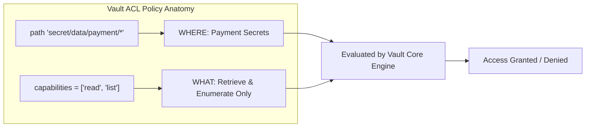
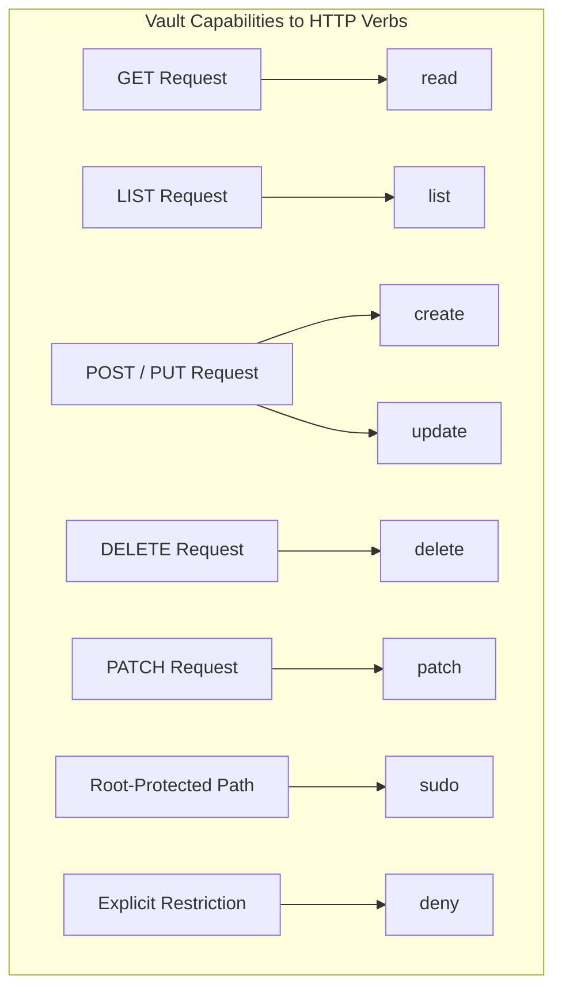
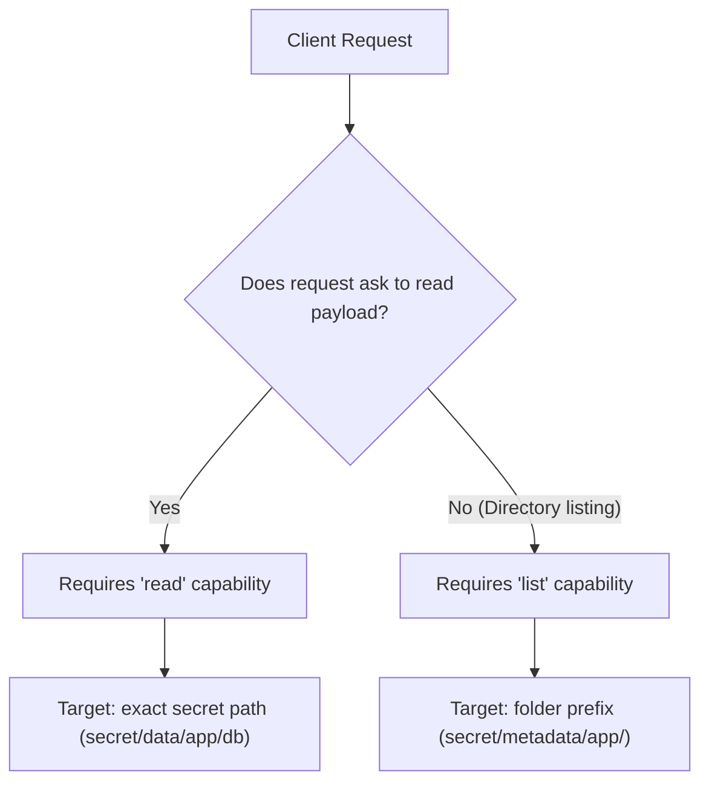
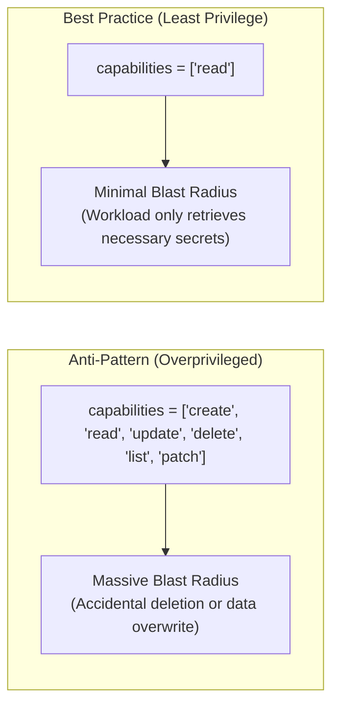

# Objective 2c: Describe Vault Policy - `capabilities`

> [!NOTE]
> **Exam Context:** For the HashiCorp Security Automation / Vault Associate 003 Certification, Objective 2c focuses on the **`capabilities`** attribute of Vault ACL policies. While Objective 2b defines *WHERE* access applies (`path`), Objective 2c defines *WHAT* operations an authenticated client can execute on that path.

**Official Documentation:**
- [HashiCorp Vault Security Automation Certification](https://developer.hashicorp.com/certifications/security-automation)
- [Vault Policy Capabilities Documentation](https://developer.hashicorp.com/vault/docs/concepts/policies#capabilities)
- [System Capabilities API (/sys/capabilities)](https://developer.hashicorp.com/vault/api-docs/system/capabilities)

---

## 1. Core Architecture: `path` (WHERE) vs. `capabilities` (WHAT)

Every Vault policy rule links a target API path to an explicit array of permitted operations:

$$\text{path} = \text{WHERE (Target Resource / Endpoint)}$$
$$\text{capabilities} = \text{WHAT (Allowed Operations on that Resource)}$$



---

## 2. Complete Capabilities Reference & HTTP Verb Mapping

Vault provides **8 distinct capabilities**. Vault maps these capabilities directly to standard HTTP REST methods:

| Capability | HTTP Verb Mapping | Operational Definition | Exam Key Takeaway |
| :--- | :--- | :--- | :--- |
| **`create`** | `POST` / `PUT` | Allows writing new data to an unpopulated path. | Often paired with `update` because many Vault endpoints treat write as both. |
| **`read`** | `GET` | Allows retrieving the value of a secret or configuration. | **`read` does NOT allow `list`** (cannot discover sibling keys). |
| **`update`** | `POST` / `PUT` | Allows modifying existing data at a path. | Required for changing secret values or updating existing roles. |
| **`delete`** | `DELETE` | Allows deleting data or soft-deleting KV v2 versions. | In KV v2, soft-deletes a version; does not purge storage unless `destroy`. |
| **`list`** | `LIST` (or `GET ?list=true`) | Allows enumerating child keys/prefixes. | **`list` does NOT allow `read`** (cannot view secret payload contents). |
| **`patch`** | `PATCH` | Allows partial updates to JSON/KV fields. | Modifies only specified keys without overwriting the entire payload. |
| **`sudo`** | *(Special Attribute)* | Grants access to root-protected endpoints. | Required for sensitive operations (e.g., mounting engines, raw storage). |
| **`deny`** | *(Special Attribute)* | Explicitly forbids access to a path. | **Always takes absolute precedence** over any allow rules. |



---

## 3. Critical Exam Distinctions & High-Value Scenarios

### 3.1. `read` vs. `list` (Information Disclosure vs. Enumeration)
* **`read` without `list`:** The application can fetch `secret/data/payment/db` directly if it knows the exact path, but calling `vault kv list secret/data/payment/` will be rejected with a `403 Forbidden`.
* **`list` without `read`:** An administrative auditor or dashboard can view key names under `secret/metadata/payment/` to check inventory without possessing access to view the actual passwords or tokens.



### 3.2. `deny` Takes Absolute Precedence
When multiple policies attach to a single token (e.g., via identity groups, roles, and default policies), capabilities are additive (union), **except when `deny` is encountered**:

```hcl
# Policy A (Broad allow)
path "secret/data/*" {
  capabilities = ["read", "list"]
}

# Policy B (Strict restriction)
path "secret/data/restricted/admin" {
  capabilities = ["deny"]
}
```
* **Result for `secret/data/app1`:** `read` and `list` are **ALLOWED**.
* **Result for `secret/data/restricted/admin`:** Access is **DENIED immediately**, even though Policy A granted `read`.

### 3.3. `sudo` Capability
* **What it is:** Some Vault endpoints are marked as root-protected because they perform dangerous system operations (e.g., managing root CA certificates, unsealing, mounting plugins).
* **What it is NOT:** `sudo` does **not** grant universal superuser access to every path like the `root` policy. It only unlocks paths that specifically demand the `sudo` capability flag.

---

## 4. Querying & Testing Capabilities: `/sys/capabilities`

Vault provides administrative APIs to determine what capabilities a token possesses against given paths:

| API Endpoint | CLI / Mechanism | Purpose |
| :--- | :--- | :--- |
| **`/sys/capabilities`** | `POST /v1/sys/capabilities` | Evaluates what capabilities an arbitrary specified token has on a list of paths. |
| **`/sys/capabilities-self`** | `POST /v1/sys/capabilities-self` | Evaluates what capabilities the **calling client's token** has on specified paths. |

```bash
# Example CLI query using token capabilities self check
vault token capabilities secret/data/payment/database
# Output: read
```

---

## 5. Token Policy Immutability Trap

> [!IMPORTANT]
> **Exam Concept:** When a policy definition is modified in Vault:
> - **Existing active tokens do NOT dynamically inherit policy modifications!**
> - Tokens snapshot their policy bindings at the time of authentication.
> - To enforce modified policies, the client must re-authenticate to receive a newly issued token.

---

## 6. Granularity Comparison & Least Privilege



---

## 7. Master Exam Keyword & Clue Matrix

| Exam Question Clue | Target Capability / Concept |
| :--- | :--- |
| *"Fetch or retrieve secret data value"* | **`read`** |
| *"Browse key names or folder hierarchy without reading values"* | **`list`** |
| *"Modify or overwrite an existing secret"* | **`update`** |
| *"Write a brand new secret to an empty path"* | **`create`** |
| *"Remove a secret key or delete a version"* | **`delete`** |
| *"Update only specific JSON fields within a secret payload"* | **`patch`** |
| *"Access a root-protected administrative endpoint"* | **`sudo`** |
| *"Explicitly override permissions and block access"* | **`deny`** |
| *"Check what capabilities my active token possesses"* | **`/sys/capabilities-self`** |
| *"Check what capabilities another token has"* | **`/sys/capabilities`** |
| *"Default behavior when no policy grants access"* | **Deny by default (403 Forbidden)** |

---

## 8. Objective 2c Decision Flowchart

```mermaid
flowchart TD
    Req["Incoming Client HTTP Request"] --> MethodCheck{"Identify HTTP Method / Action"}

    MethodCheck -->|GET| NeedRead["Checks 'read' capability"]
    MethodCheck -->|LIST / ?list=true| NeedList["Checks 'list' capability"]
    MethodCheck -->|POST / PUT (New)| NeedCreate["Checks 'create' capability"]
    MethodCheck -->|POST / PUT (Existing)| NeedUpdate["Checks 'update' capability"]
    MethodCheck -->|DELETE| NeedDelete["Checks 'delete' capability"]
    MethodCheck -->|PATCH| NeedPatch["Checks 'patch' capability"]
    MethodCheck -->|Root-Protected API| NeedSudo["Checks 'sudo' capability"]

    NeedRead --> EvalDeny{"Is 'deny' present on path?"}
    NeedList --> EvalDeny
    NeedCreate --> EvalDeny
    NeedUpdate --> EvalDeny
    NeedDelete --> EvalDeny
    NeedPatch --> EvalDeny
    NeedSudo --> EvalDeny

    EvalDeny -- Yes --> Block["403 Forbidden (Explicit Deny)"]
    EvalDeny -- No --> CapMatch{"Is required capability listed in policy?"}
    CapMatch -- Yes --> Grant["200 OK (Operation Permitted)"]
    CapMatch -- No --> DefaultDeny["403 Forbidden (Deny by Default)"]
```

---

## 9. Top 5 Key Takeaways for Objective 2c

1. **WHERE vs. WHAT:** Path defines the resource (*WHERE*); capability defines the operation (*WHAT*).
2. **`read` $\neq$ `list`:** `read` retrieves secret data; `list` enumerates folder contents. Granting one does not grant the other.
3. **`deny` Overrides Everything:** An explicit `deny` takes precedence over any permissive capability across all attached policies.
4. **`sudo` is Not Root:** `sudo` only unlocks specific endpoints tagged as root-protected; it is not a blanket administrator grant.
5. **Deny by Default:** Vault denies all actions unless an attached policy explicitly includes the required capability.

---

## References

- [1] [Security Automation Certification | HashiCorp Developer](https://developer.hashicorp.com/certifications/security-automation)
- [2] [Vault Policy Capabilities Concepts](https://developer.hashicorp.com/vault/docs/concepts/policies#capabilities)
- [3] [System Capabilities API Overview](https://developer.hashicorp.com/vault/api-docs/system/capabilities)