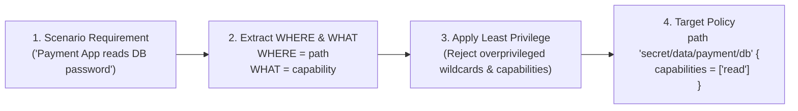
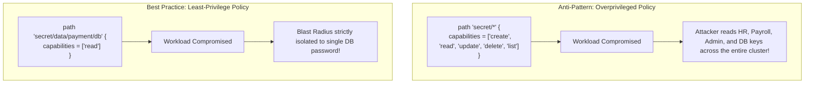
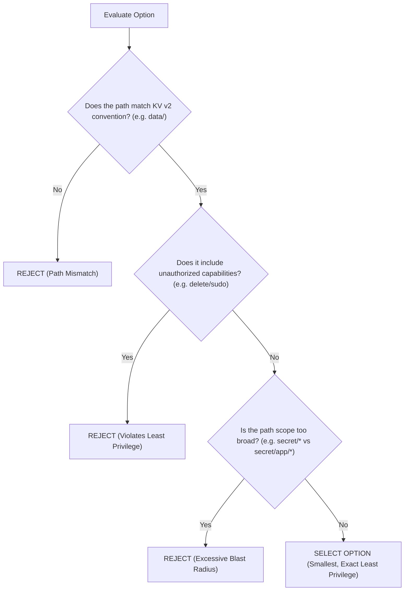

# Objective 2d: Choose a Vault Policy Based on Requirements

> [!NOTE]
> **Exam Context:** For the HashiCorp Security Automation / Vault Associate 003 Certification, Objective 2d is an applied scenario-based objective. You are given a business or operational requirement (e.g., a CI/CD pipeline, an application workload, or an auditor) and must select the exact, **least-privilege Vault policy** that satisfies the requirement without granting excessive access.

**Official Documentation:**
- [HashiCorp Vault Security Automation Certification](https://developer.hashicorp.com/certifications/security-automation)
- [Vault Policy Concepts & Capabilities](https://developer.hashicorp.com/vault/docs/concepts/policies)
- [Access Controls with Vault Policies Tutorial](https://developer.hashicorp.com/vault/tutorials/policies/policies)

---

## 1. The Core 3-Step Selection Framework

Every policy selection question on the exam can be solved using this systematic formula:



$$\text{Business Requirement} \longrightarrow \text{Identify WHERE (Path)} + \text{WHAT (Capability)} \longrightarrow \text{Filter by Least Privilege}$$

---

## 2. Decision Rules: Translating Scenario Verbs to Capabilities

| Requirement Verb in Question | Allowed Vault Capability | Disallowed / Unnecessary Capabilities |
| :--- | :--- | :--- |
| *"Fetch, read, or retrieve secret data"* | **`read`** | Do **NOT** grant `list`, `delete`, or `sudo`. |
| *"Browse key names / discover directory contents"* | **`list`** | Do **NOT** grant `read` (protects secret payload). |
| *"Write a brand new secret to empty path"* | **`create`** | Do **NOT** grant `delete` unless requested. |
| *"Modify or rotate an existing secret"* | **`update`** | Often combined with `create` on KV engines. |
| *"Remove or decommission a secret"* | **`delete`** | Never grant by default to read-only workloads. |
| *"Partially update specific fields in a JSON secret"* | **`patch`** | Preserves other unedited keys. |
| *"Execute root-protected administrative operation"* | **`sudo`** | Only applies to specific endpoints requiring it. |
| *"Explicitly block or blacklist a sub-directory"* | **`deny`** | Overrides all permissive capabilities on path. |

---

## 3. High-Frequency Exam Scenarios & Policy Blueprints

### Scenario 1: Workload Needs Known Database Password (No Discovery)
* **Requirement:** *"Payment microservice needs to fetch its database password from Vault. It knows the exact path and must not browse other keys."*
* **Analysis:**
  * WHERE: `secret/data/payment/database` (KV v2 path)
  * WHAT: `read` only. **No `list`**.
* **Correct Policy:**
  ```hcl
  path "secret/data/payment/database" {
    capabilities = ["read"]
  }
  ```

### Scenario 2: Security Auditor Inventory Inspection
* **Requirement:** *"Security auditor needs to discover which application secrets exist under `secret/`, but must not read secret values."*
* **Analysis:**
  * WHERE: `secret/metadata/*` (KV v2 folder listing)
  * WHAT: `list` only. **No `read`**.
* **Correct Policy:**
  ```hcl
  path "secret/metadata/*" {
    capabilities = ["list"]
  }
  ```

### Scenario 3: CI/CD Deployment Pipeline
* **Requirement:** *"CI/CD pipeline builds new environments by writing new secrets, reading them during deployment, and updating existing configurations."*
* **Analysis:**
  * WHERE: `secret/data/apps/*`
  * WHAT: `create`, `read`, `update`. **Do NOT grant `delete`** unless explicitly specified.
* **Correct Policy:**
  ```hcl
  path "secret/data/apps/*" {
    capabilities = ["create", "read", "update"]
  }
  ```

### Scenario 4: Blacklisting Sensitive Keys within a Broad Folder
* **Requirement:** *"Developers can read all development secrets under `secret/data/dev/*`, but must be strictly blocked from viewing `secret/data/dev/master-token`."*
* **Analysis:**
  * Multi-rule policy: broad `read` + explicit `deny`.
* **Correct Policy:**
  ```hcl
  path "secret/data/dev/*" {
    capabilities = ["read", "list"]
  }

  # Explicit deny overrides the wildcard allow above
  path "secret/data/dev/master-token" {
    capabilities = ["deny"]
  }
  ```

### Scenario 5: Multi-Tier Architecture with Single-Level Wildcards (`+`)
* **Requirement:** *"Service needs to read database credentials across all applications (`app1`, `app2`, `app3`) without accessing nested subdirectories."*
* **Analysis:**
  * Use `+` for exactly one directory level rather than `*` (which matches arbitrarily deep).
* **Correct Policy:**
  ```hcl
  path "secret/data/+/database" {
    capabilities = ["read"]
  }
  ```

---

## 4. Comparing Blast Radius: Broad vs. Least Privilege



---

## 5. KV v2 Path Translation Trap

> [!WARNING]
> **Exam Trap:** When reading scenarios that mention Key-Value Version 2:
> - The prompt may mention the logical secret: `"payment/database"`.
> - If KV v2 is mounted at `secret/`, the policy path **MUST** include the `data/` subpath:
>   - **Wrong:** `path "secret/payment/database" { ... }`
>   - **Correct:** `path "secret/data/payment/database" { ... }`

---

## 6. Multiple Choice Elimination Strategy for Objective 2d

When faced with 4 policy options on the exam:



---

## 7. Master Exam Keyword & Scenario Decision Matrix

| Exam Scenario Requirement | Target Capabilities | Path Scope Pattern |
| :--- | :--- | :--- |
| *"Read only a known secret"* | `["read"]` | Exact path (`secret/data/app/db`) |
| *"Browse key names without reading secrets"* | `["list"]` | Prefix (`secret/metadata/app/*`) |
| *"Read and update existing configuration"* | `["read", "update"]` | Specific path (`secret/data/app/config`) |
| *"Provision new secrets and read them back"* | `["create", "read"]` | App folder (`secret/data/app/*`) |
| *"Modify specific fields in JSON payload"* | `["patch"]` | Target path (`secret/data/app/config`) |
| *"Access root-protected administrative APIs"* | `["sudo"]` (with relevant CRUD) | System endpoint (`sys/...`) |
| *"Strictly prevent access despite wildcard grants"* | `["deny"]` | Sensitive path (`secret/data/app/admin`) |
| *"One directory segment across multiple apps"* | Required verb (`read`) | Single-level wildcard (`secret/data/+/db`) |

---

## 8. Summary Checklist for Objective 2d

1. **Extract WHERE & WHAT:** Always identify the target path and required HTTP action before looking at options.
2. **Reject Overprivileged Options:** Never choose an option containing `delete`, `sudo`, or wildcard `*` unless the question explicitly requires it.
3. **KV v2 Requires `data/`:** Ensure the path points to `secret/data/...` for secret read/write operations.
4. **Deny Overrides Everything:** An explicit `deny` takes precedence over broader wildcard allow rules.
5. **Least Privilege is King:** The correct exam answer is always the **smallest, most narrowly scoped policy** that fulfills the requirement.

---

## References

- [1] [Security Automation Certification | HashiCorp Developer](https://developer.hashicorp.com/certifications/security-automation)
- [2] [Vault Policies Concepts & Syntax](https://developer.hashicorp.com/vault/docs/concepts/policies)
- [3] [Access Controls with Vault Policies](https://developer.hashicorp.com/vault/tutorials/policies/policies)