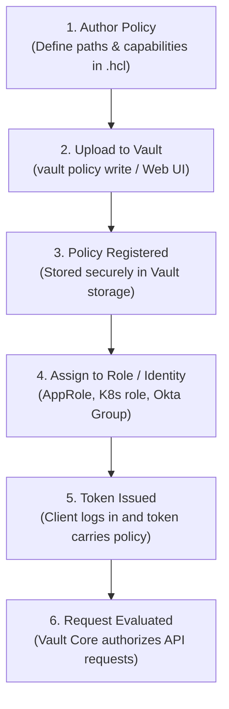
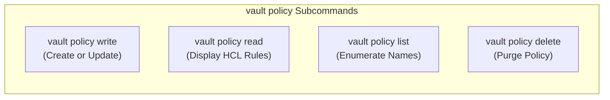
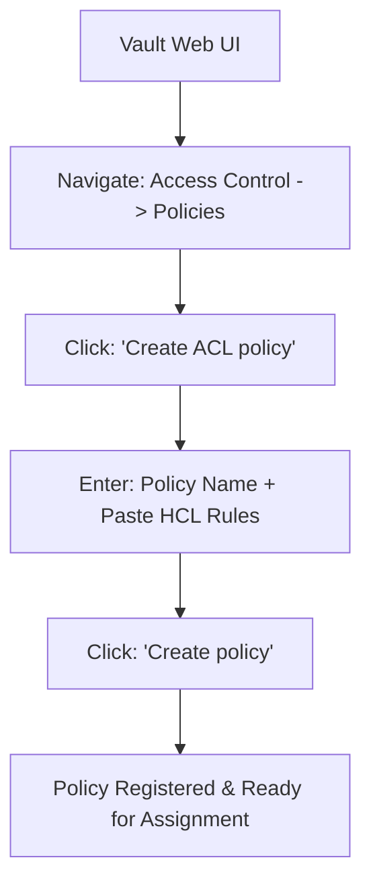
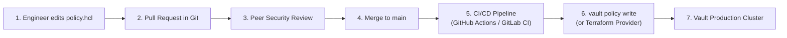
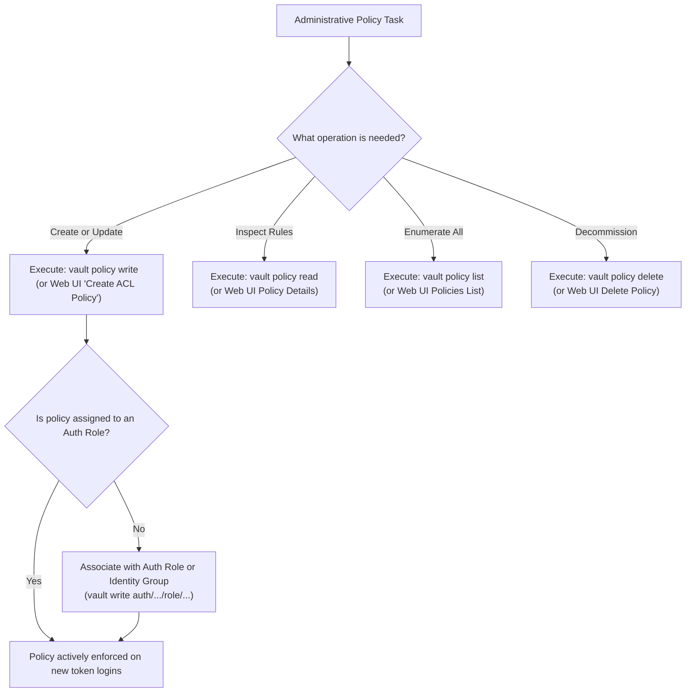

# Objective 2e: Configure Vault Policies Using the UI and CLI

> [!NOTE]
> **Exam Context:** For the HashiCorp Security Automation / Vault Associate 003 Certification, Objective 2e moves from policy design to **operational execution and administrative management**. The exam tests your practical mastery of creating, reading, listing, updating, and deleting Vault ACL policies using the **Vault CLI** and the **Vault Web UI**, as well as understanding Policy-as-Code workflows.

**Official Documentation:**
- [HashiCorp Vault Security Automation Certification](https://developer.hashicorp.com/certifications/security-automation)
- [Vault CLI policy Command Reference](https://developer.hashicorp.com/vault/docs/commands/policy)
- [System Policy HTTP REST API (/sys/policies/acl)](https://developer.hashicorp.com/vault/api-docs/system/policies)

---

## 1. The Core Policy Management Lifecycle

Writing an HCL policy file on a local computer does not protect any Vault resources until it is uploaded and registered with the Vault server:



$$\text{Author HCL} \longrightarrow \text{Upload via CLI/UI} \longrightarrow \text{Assign to Role/Group} \longrightarrow \text{Token Issued} \longrightarrow \text{Enforce Permissions}$$

---

## 2. Vault CLI Policy Command Suite

Vault provides four primary CLI subcommands under `vault policy`:

| CLI Command | Operation | Description & Behavior |
| :--- | :--- | :--- |
| **`vault policy write <name> <file>`** | **Create / Update** | Uploads and registers a policy in Vault. **If the policy already exists, it updates it.** |
| **`vault policy read <name>`** | **Inspect / View** | Displays the HCL rules of an existing registered policy. |
| **`vault policy list`** | **Enumerate** | Lists all policy names stored in the Vault cluster / namespace. |
| **`vault policy delete <name>`** | **Remove / Purge** | Deletes a policy from Vault. |



### 2.1. `vault policy write` Variations
* **Writing from a file:**
  ```bash
  vault policy write payment-read payment-policy.hcl
  ```
* **Writing via stdin using `-`:**
  ```bash
  cat policy.hcl | vault policy write payment-read -
  ```
* **Writing inline with a HereDoc:**
  ```bash
  vault policy write payment-read - <<EOF
  path "secret/data/payment/*" {
    capabilities = ["read"]
  }
  EOF
  ```

---

## 3. Web UI Policy Management Workflow

The Vault Web UI provides an interactive graphical interface for administrative operations:



* **Best used for:** Visual inspection, exploratory policy testing, and manual troubleshooting.
* **Limitations:** Not reproducible, lacks peer review, and prone to human configuration drift.

---

## 4. CLI vs. Web UI Comparison Matrix

| Dimension | Vault CLI | Vault Web UI |
| :--- | :--- | :--- |
| **Interface** | Terminal / Command Line | Web Browser |
| **Primary Actor** | Operators, Platform Engineers, Scripts | Security Administrators, Auditors |
| **Automation Suitability** | **High** (Easily scriptable in CI/CD) | None (Manual interaction required) |
| **Repeatability** | **High** (Declarative files in Git) | Low (Click-based) |
| **Auditability** | High (Trackable via Git commits & CI/CD logs) | Medium (Audit log records request only) |
| **Best Fit** | Enterprise production & automated pipelines | Ad-hoc inspection & sandbox learning |

---

## 5. Enterprise Best Practice: GitOps & Policy-as-Code

In enterprise security automation, policies should never be hand-crafted in the Web UI. Instead, manage policies through **Policy-as-Code**:



### Advantages:
1. **Audit Trail:** Complete historical record of who changed which permissions and why.
2. **Peer Review:** Security teams can approve or reject changes before they enter production.
3. **Automated Rollback:** Revert git commits to immediately restore previous policy definitions.

---

## 6. Critical Exam Distinctions & Traps

### 6.1. Policy Creation $\neq$ Policy Assignment
* Running `vault policy write payment-read ...` **only defines** the policy inside Vault.
* It does **NOT** grant any user or workload access until the policy is explicitly associated with an **Auth Role**, an **Identity Group**, or a **Token**:
  ```bash
  # Example: Attaching the policy to an AppRole role
  vault write auth/approle/role/payment-role token_policies="payment-read"
  ```

### 6.2. `vault policy write` is Idempotent
* If `payment-read` does not exist, `vault policy write` **creates** it.
* If `payment-read` already exists, `vault policy write` **overwrites/updates** it.

### 6.3. Token Policy Snapshotting (Immutability)
* Modifying a policy does not dynamically push changes to already-issued active tokens.
* Tokens snapshot policy bindings upon issuance. To apply modified permissions, clients must re-authenticate.

### 6.4. Day-to-Day Administration Without Root
* Routine policy administration should be conducted using a token with delegated policy management privileges, **not the initial root token**.

---

## 7. Master Exam Keyword & Command Matrix

| Exam Question Phrase | Target Command / Concept |
| :--- | :--- |
| *"Create a new policy using the command line"* | **`vault policy write <name> <file>`** |
| *"Update an existing policy using the CLI"* | **`vault policy write <name> <file>`** |
| *"Supply policy HCL content via standard input"* | **`vault policy write <name> -`** |
| *"Inspect or print the HCL content of a policy"* | **`vault policy read <name>`** |
| *"View all policy names currently in Vault"* | **`vault policy list`** |
| *"Remove an obsolete policy from Vault"* | **`vault policy delete <name>`** |
| *"Manage policies through a graphical browser"* | **Vault Web UI** |
| *"API endpoint prefix for managing ACL policies"* | **`/v1/sys/policies/acl`** |
| *"Connect a policy to an authenticated workload"* | **Auth Role / Token assignment** |
| *"Automated, auditable policy management"* | **Git + CI/CD / Terraform (Policy-as-Code)** |

---

## 8. Objective 2e Administrative Decision Flowchart



---

## 9. Top 5 Key Takeaways for Objective 2e

1. **The Core 4 Commands:** `vault policy write`, `vault policy read`, `vault policy list`, and `vault policy delete`.
2. **`write` Handles Both Creates & Updates:** An existing policy is updated in place when re-running `vault policy write`.
3. **Stdin Support via `-`:** Use `-` to stream policy definitions directly from pipelines or HereDocs without temporary disk files.
4. **Creation $\neq$ Assignment:** Creating a policy does not grant permissions; it must be assigned to an Auth Role, Identity Group, or Token.
5. **Policy-as-Code:** Store HCL policies in Git and deploy via CI/CD or Terraform for auditable production governance.

---

## References

- [1] [Security Automation Certification | HashiCorp Developer](https://developer.hashicorp.com/certifications/security-automation)
- [2] [Vault CLI Policy Documentation](https://developer.hashicorp.com/vault/docs/commands/policy)
- [3] [System Policies ACL API Documentation](https://developer.hashicorp.com/vault/api-docs/system/policies)