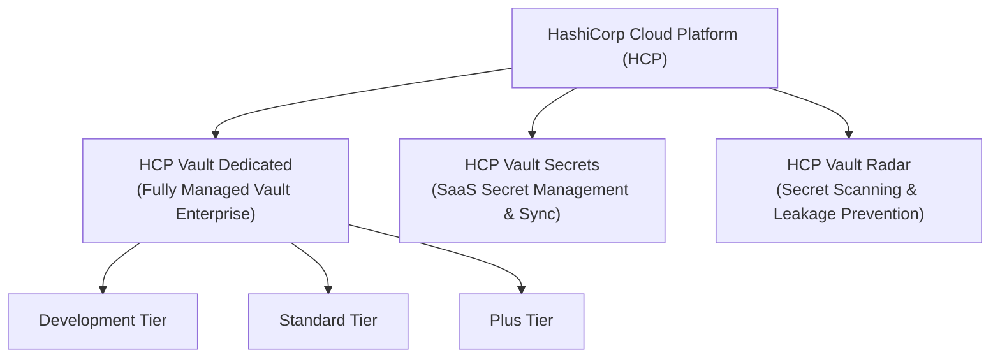
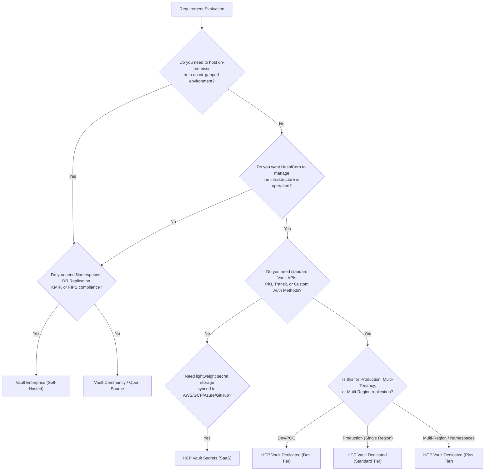

# HCP Vault Versions and Comparison Matrix

> [!NOTE]
> **Exam & Architecture Context:** Understanding HashiCorp Cloud Platform (HCP) Vault offerings, tiers, and how HCP Vault compares to self-hosted Vault (Open Source and Enterprise) is critical for architectural decision-making, security compliance, and HashiCorp Certification exams (Vault Associate & Vault Operations Professional).

**Official Documentation:**
- [HashiCorp Cloud Platform (HCP) Vault Documentation](https://developer.hashicorp.com/hcp/docs/vault)
- [HCP Vault Dedicated Pricing & Tiers](https://www.hashicorp.com/products/vault/pricing)
- [HCP Vault Secrets Documentation](https://developer.hashicorp.com/hcp/docs/vault-secrets)
- [Vault Enterprise vs Community Feature Matrix](https://www.hashicorp.com/products/vault/enterprise)

---

## 1. Overview of HCP Vault Ecosystem

HashiCorp Cloud Platform (HCP) offers managed security services designed to reduce operational burden while delivering enterprise-grade secrets management, data encryption, and threat prevention. The HCP Vault portfolio consists of three distinct products:

### The Architectural Equation
$$\text{Vault Solution} = \text{Deployment Model (Self-Hosted vs. Managed)} + \text{Feature Tier (Community vs. Enterprise vs. SaaS)}$$

---

## 2. Deep Dive: HCP Vault Product Portfolio

### 1. HCP Vault Dedicated
**HCP Vault Dedicated** is a fully managed, push-button HashiCorp Vault Enterprise cluster deployed inside HashiCorp's managed cloud infrastructure (AWS or Azure).

- **Core Value:** Provides the full power of Vault Enterprise (Secret engines, Auth methods, PKI, Transit encryption) without requiring operators to manage infrastructure, Raft consensus, upgrades, auto-unseal keys, or backups.
- **Connectivity:** Connects to customer workloads securely using **HashiCorp Virtual Network (HVN)** via VPC/VNet Peering, AWS Transit Gateway, or Azure Virtual Network Peering.
- **Operational SLA:** HashiCorp handles 24/7 monitoring, automated patching, zero-downtime version updates, and snapshot backups.

---

### 2. HCP Vault Secrets
**HCP Vault Secrets** is a lightweight, SaaS-based zero-infrastructure secrets management service built for rapid application development and multi-cloud secret synchronization.

- **Core Value:** Requires zero cluster configuration. Developers can store secrets centrally in HCP and automatically sync them to native cloud secret stores and developer platforms.
- **Key Sync Targets:** AWS Secrets Manager, GCP Secret Manager, Azure Key Vault, GitHub Secrets, Vercel, and Kubernetes Secrets.
- **Target Use Case:** Early-stage apps, microservices, serverless workloads, CI/CD pipelines, and teams needing instant secrets management without managing cluster instances.

---

### 3. HCP Vault Radar
**HCP Vault Radar** is an automated security scanner that continuously monitors codebases, chat platforms, and cloud storage to identify leaked secrets and sensitive data.

- **Core Value:** Proactive risk mitigation. Detects hardcoded API keys, tokens, passwords, and private keys before or after code is committed.
- **Supported Integrations:** GitHub, GitLab, Bitbucket, Slack, Jira, Confluence, AWS S3 buckets.
- **Key Feature:** Historical scanning of commit histories, real-time alerting, and automated remediation workflows.

---

## 3. HCP Vault Dedicated Tier Comparison

HCP Vault Dedicated is available in three deployment tiers to match workload criticality, SLA requirements, and scaling needs:

| Feature / Capability | Development (Dev) Tier | Standard Tier | Plus Tier |
| :--- | :--- | :--- | :--- |
| **Primary Purpose** | Testing, POC, & Evaluation | Production Workloads | Global / Multi-Region Enterprise |
| **High Availability (HA)** | ❌ Single node (No HA) | ✅ Multi-AZ 3-Node Cluster | ✅ Multi-AZ HA + Secondary Clusters |
| **SLA Guarantee** | ❌ No Uptime SLA | ✅ 99.9% Uptime SLA | ✅ 99.9% Uptime SLA |
| **HVN Connectivity** | 1 HVN Connection | Multiple HVNs / VPC Peering | Advanced Transit Gateway / Peering |
| **Automatic Backups** | ❌ Manual snapshot only | ✅ Daily Snapshot & Restore | ✅ Continuous / Custom Snapshots |
| **Multi-Tenancy (Namespaces)** | ❌ Not Included | ❌ Not Included | ✅ Full Vault Namespaces Support |
| **Replication Capabilities** | ❌ None | ❌ None | ✅ Performance & DR Replication |
| **Advanced Data Protection (ADP)** | ❌ Basic Engines Only | ❌ Basic Engines Only | ✅ KMIP, Transform, Entropy |
| **Sentinel / Governance** | ❌ Not Supported | ❌ Not Supported | ✅ Sentinel Policy Enforcement |
| **Performance Scaling** | Small instances | Small, Medium, Large | Large, Extra Large |

---

## 4. Comprehensive Comparison: Vault Offerings Matrix

The table below contrasts all four deployment paradigms for HashiCorp Vault:

| Dimension | Vault Open Source (OSS) | Vault Enterprise (Self-Hosted) | HCP Vault Dedicated | HCP Vault Secrets |
| :--- | :--- | :--- | :--- | :--- |
| **Hosting Model** | Self-Hosted (On-Prem / Cloud) | Self-Hosted (On-Prem / Cloud) | Fully Managed Cloud (AWS/Azure) | SaaS Service |
| **Management Burden** | High (OS, Storage, Upgrades) | High (OS, Storage, Upgrades) | Low (HashiCorp Managed) | Zero (SaaS Engine) |
| **Auto-Unseal** | Manual (or Cloud KMS integration) | Cloud KMS / HSM Auto-Unseal | Fully Automated | Not Applicable |
| **Multi-Tenancy** | Single Root Namespace | Unlimited Namespaces | Namespaces (Plus Tier only) | App/Project Scopes |
| **Disaster Recovery** | Manual Backup/Restore | DR Secondary Clusters | DR Clusters (Plus Tier only) | Provider Managed |
| **Performance Replication** | ❌ Not Supported | ✅ Multi-Region Read Scaling | ✅ Multi-Region (Plus Tier) | Global SaaS Edge |
| **Compliance & FIPS** | Standard Security | FIPS 140-2 / HSM Support | SOC2, ISO 27001, PCI-DSS | SOC2 Compliant |
| **Secret Sync Engines** | Custom Code / Controllers | Custom Code / Sync Controllers | Integrated Sync Engines | Native Multi-Cloud Sync |
| **Enterprise Engines** | Standard (KV, PKI, Transit) | Transform, KMIP, ADP | Transform, KMIP (Plus Tier) | KV & App Secrets |
| **Target Audience** | Devs, Small Teams, Homelabs | Regulated Enterprises, On-Prem | Cloud-Native Enterprises | Dev Teams, CI/CD, Serverless |

---

## 5. Architectural Decision Framework

Use this flowchart to select the correct Vault offering for your application architecture and organizational requirements:

---

## 6. Key Exam & Architectural Traps

> [!WARNING]
> **Common Exam Traps for Vault Certification & Design Interviews:**

1. **HCP Vault Dedicated vs. HCP Vault Secrets:**
   - **HCP Vault Dedicated** runs the full Vault Enterprise binary engine with standard CLI/API, KV, PKI, Transit, and Auth methods.
   - **HCP Vault Secrets** is a simplified SaaS secret store designed for syncing secrets to external providers (it does not provide full Vault KV/Transit/PKI API parity).

2. **Namespaces on HCP Vault Dedicated:**
   - Namespaces are **NOT** available on HCP Dedicated Dev or Standard tiers. You must upgrade to **HCP Vault Dedicated Plus Tier** to unlock Namespaces.

3. **High Availability (HA) on Dev Tier:**
   - HCP Vault Dedicated **Development Tier** does NOT have High Availability. If the underlying node fails, there is temporary downtime. Never select Dev Tier for production scenarios.

4. **Multi-Region Peering (HVN):**
   - HCP Virtual Networks (HVNs) must have non-overlapping CIDR blocks to peer with cloud VPCs/VNets.

---

## 7. Summary Comparison Cheat Sheet

$$\text{HCP Vault Dedicated Dev} \xrightarrow{+\text{HA, SLA, Backups}} \text{Standard} \xrightarrow{+\text{Namespaces, Replication, ADP}} \text{Plus}$$

- Choose **Vault Open Source** for self-managed, single-cluster, low-cost projects.
- Choose **Vault Enterprise (Self-Hosted)** for strict compliance, air-gapped environments, on-prem datacenters, or custom HSM requirements.
- Choose **HCP Vault Dedicated (Standard/Plus)** for managed cloud infrastructure with full Vault Enterprise capability.
- Choose **HCP Vault Secrets** for quick, SaaS secret sync across clouds without managing Vault clusters.
- Choose **HCP Vault Radar** to audit and detect exposed secrets in git repos and collaboration channels.
