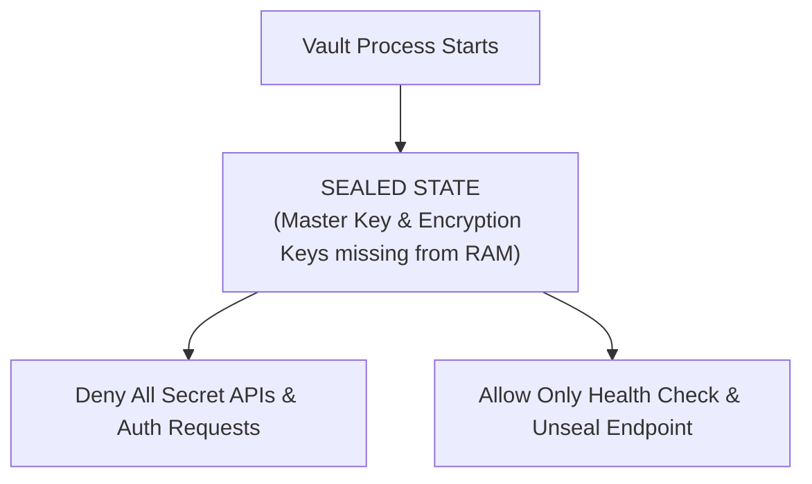
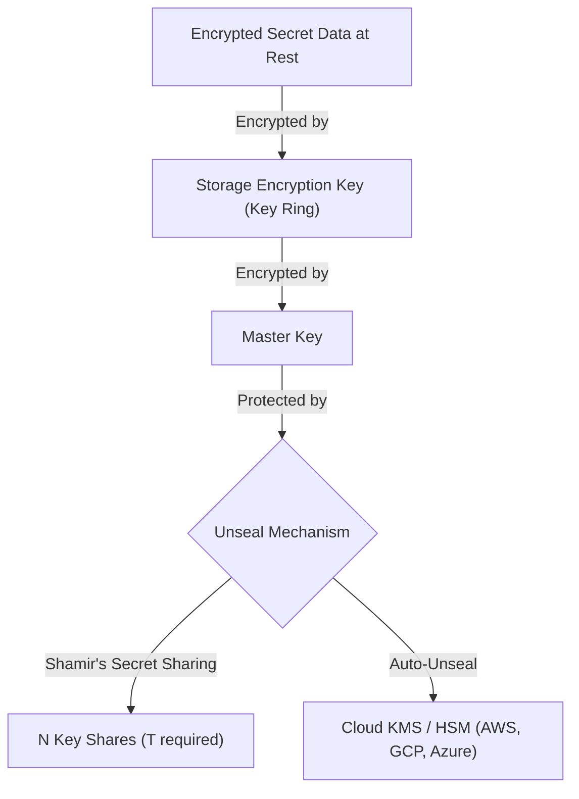
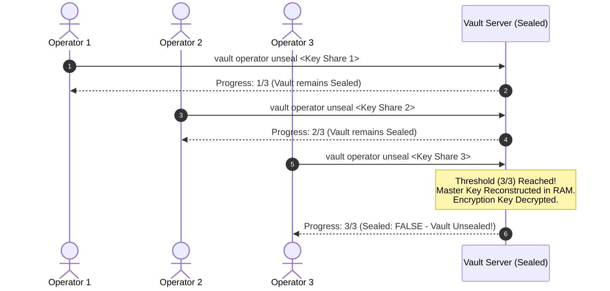

# Vault Initialization, Sealing, and Unsealing

> [!NOTE]
> **Exam & Concepts Context:** Vault's security model centers around cryptographic sealing and unsealing. Understanding the transition between Sealed and Unsealed states, Shamir's Secret Sharing, and Auto-Unseal using Cloud KMS is fundamental for HashiCorp Vault Associate and Professional certifications.

**Official Documentation:**
- [Vault Concepts: Seal and Unseal](https://developer.hashicorp.com/vault/docs/concepts/seal)
- [Vault Command: operator init](https://developer.hashicorp.com/vault/docs/commands/operator/init)
- [Vault Command: operator unseal](https://developer.hashicorp.com/vault/docs/commands/operator/unseal)
- [Auto-Unseal Configuration](https://developer.hashicorp.com/vault/docs/concepts/seal#auto-unseal)

---

## 1. What is Sealing in HashiCorp Vault?

Vault operates under a strict **"Seal by Default"** security philosophy.

### Sealed State (Default at Startup)
When a Vault server process starts up, it connects to its storage backend (such as Raft or Consul), but it **cannot read or write any secrets**.



In a **Sealed** state:
- Vault knows where the encrypted data lives in the storage backend.
- Vault **cannot decrypt** the data because it does not have the **Encryption Key** in RAM memory.
- Almost all API endpoints return HTTP `503 Service Unavailable` or `Vault is sealed` errors.
- The only permitted operations are checking server status (`vault status`) and submitting unseal keys (`vault operator unseal`).

---

## 2. Cryptographic Architecture: Key Hierarchy

Vault uses **Envelope Encryption** to secure data stored at rest.



1. **Storage Encryption Key (Key Ring):** Used to encrypt/decrypt secrets written to the storage backend (AES-256-GCM).
2. **Master Key:** Used to encrypt the Storage Encryption Key. The Master Key resides **only in Vault's RAM memory** while Vault is unsealed.
3. **Unseal Keys / Key Shares:** Created during initialization to protect and reconstruct the Master Key.

### Shamir's Secret Sharing Algorithm
By default, Vault uses **Shamir's Secret Sharing Scheme** to split the Master Key into $N$ distinct shares during initialization:

$$f(x) = a_0 + a_1 x + a_2 x^2 + \dots + a_{T-1} x^{T-1} \pmod p$$

- $a_0 = \text{Master Key}$
- $N = \text{Key Shares}$ (Total shares distributed to key holders, default: 5)
- $T = \text{Key Threshold}$ (Minimum shares required to unseal, default: 3)

Reconstruction of the Master Key uses **Lagrange Interpolation**:

$$\text{Master Key} = \sum_{i=1}^{T} y_i \prod_{j \neq i} \frac{-x_j}{x_i - x_j} \pmod p$$

---

## 3. Step-by-Step Manual Unsealing Flow

When Vault is initialized with Shamir's scheme (`vault operator init`), it outputs $N$ unseal key shares and an initial root token.



---

## 4. Auto-Unseal (Cloud KMS / HSM)

To eliminate manual human intervention when a server reboots or auto-scales, Vault supports **Auto-Unseal**.

### How Auto-Unseal Works
Instead of distributing Shamir key shares to human operators, Vault delegates Master Key encryption to an external Cloud Key Management Service (KMS) or Hardware Security Module (HSM).

- **Supported Auto-Unseal Providers:** AWS KMS, GCP KMS, Azure Key Vault, AliCloud KMS, PKCS#11 HSM.
- **Boot Flow:** On startup, Vault sends the encrypted Master Key to Cloud KMS $\rightarrow$ KMS decrypts it $\rightarrow$ Vault loads Master Key into RAM and transitions to Unsealed state automatically.

### Recovery Keys vs. Unseal Keys
> [!IMPORTANT]
> When Vault is initialized with **Auto-Unseal**, Vault generates **Recovery Keys** instead of Unseal Keys.
> - **Unseal Keys:** Used to unseal Vault manually.
> - **Recovery Keys:** Cannot unseal Vault. They are used for administrative actions like **Rekeying**, **Raft Quorum Recovery**, or generating a root token.

---

## 5. Explicitly Sealing Vault (`vault operator seal`)

An authorized administrator can seal Vault at any time using the CLI or API:

```bash
vault operator seal
```

### What Happens During Sealing?
1. Vault purges the Master Key and Storage Encryption Key from RAM memory.
2. Active connection pools and background routines are terminated.
3. Vault immediately transitions back to `Sealed: true`.

**Common Use Cases for Manual Sealing:**
- Emergency response to detected security breaches or server compromise.
- Maintenance or containment operations.

---

## 6. Feature Matrix: Manual Shamir Unseal vs. Auto-Unseal

| Feature | Manual Shamir Unseal | Auto-Unseal (Cloud KMS / HSM) |
| :--- | :--- | :--- |
| **Unseal Mechanism** | Threshold of human operators ($T$ of $N$) | Cloud KMS / HSM decrypts Master Key |
| **Reboot Behavior** | Requires human intervention to enter keys | Fully automated zero-downtime startup |
| **Initialization Result** | Unseal Keys + Root Token | Recovery Keys + Root Token |
| **Use Case** | Air-gapped, on-prem, homelab, compliance | Cloud-native clusters, auto-scaling groups |
| **Prerequisite** | None | Cloud IAM permissions & KMS key access |
