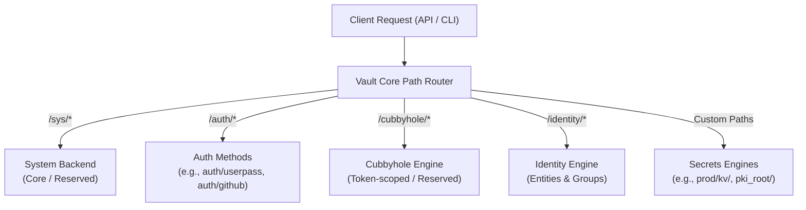

# Vault Paths, Custom Mounts, and Reserved Paths

> [!NOTE]
> **Exam & Architecture Context:** HashiCorp Vault uses a **path-based routing multiplexer**. All secrets engines, authentication methods, and system endpoints are mapped to URL paths. Understanding which paths can be customized with the `-path` flag and which paths are **strictly reserved** by the core system is an essential exam topic for HashiCorp Vault certifications.

**Official Documentation:**
- [Vault Architecture: Path-Based Routing](https://developer.hashicorp.com/vault/docs/internals/architecture)
- [Vault Secrets Engines Mounts](https://developer.hashicorp.com/vault/docs/secrets)
- [Vault Auth Methods Mounts](https://developer.hashicorp.com/vault/docs/auth)
- [Vault System Backend (/sys) API](https://developer.hashicorp.com/vault/api-docs/system)

---

## 1. Vault Path-Based Architecture & Custom Mounts

In Vault, **everything is addressed via a path**. When a client makes an HTTP/CLI request, Vault inspects the prefix of the path to route the request to the correct internal backend.



### The `-path` Flag
Vault components (secrets engines and authentication methods) **can be enabled at any custom path** of your choosing using the `-path` flag. If no `-path` is provided, Vault defaults to the type name of the engine or auth method.

- **Secrets Engines:**
  ```bash
  # Default mount: mounted at 'kv/' or 'kv-v2/'
  vault secrets enable kv-v2

  # Custom path: mounted at 'engineering/credentials/'
  vault secrets enable -path=engineering/credentials kv-v2

  # Custom path: multiple instances of same engine
  vault secrets enable -path=finance/secrets kv-v2
  vault secrets enable -path=cloud/aws aws
  ```

- **Authentication Methods:**
  ```bash
  # Default mount: mounted at 'auth/userpass'
  vault auth enable userpass

  # Custom path: mounted at 'auth/app-users' (automatically prefixed under auth/)
  vault auth enable -path=app-users userpass

  # Custom path: multiple instances for different environments
  vault auth enable -path=k8s-prod kubernetes
  vault auth enable -path=k8s-dev kubernetes
  ```

---

## 2. Relevant Reserved Paths in Vault

While Vault offers high flexibility to mount engines at custom paths, several paths and prefixes are **strictly reserved** by Vault's internal core system and **cannot** be used as arbitrary mount points.

### 1. `/sys/` (System Backend — Highly Reserved)
- **Purpose:** Vault's internal system control plane and core API.
- **Used for:**
  - Configuring policies (`/sys/policies/acl`)
  - Mounting/unmounting secrets engines (`/sys/mounts`)
  - Mounting/configuring auth methods (`/sys/auth`)
  - Health checks, metrics, seal/unseal, rekey, and leases (`/sys/health`, `/sys/seal`, `/sys/leases`)
  - Audit device management (`/sys/audit`)
- **Restrictions:**
  - **Cannot mount any secrets engine or auth method at or under `/sys/`.**
  - Requests starting with `/sys/` are intercepted by the core system backend.
  - ACL policies granting permissions on `/sys/` typically require elevated `sudo` capabilities.

### 2. `/auth/` (Authentication Methods Prefix)
- **Purpose:** Dedicated routing prefix for all authentication methods.
- **Restrictions:**
  - **Secrets engines cannot be mounted under `/auth/`.**
  - All auth methods are strictly constrained to live under `/auth/<mount_path>`.
  - Even if you specify `-path=myauth`, Vault mounts it at `/auth/myauth`.

### 3. `/cubbyhole/` (Built-in Token Private Storage)
- **Purpose:** Per-token private, ephemeral secret workspace.
- **Restrictions:**
  - Automatically mounted at initialization.
  - **Cannot be remounted, moved, or disabled.**
  - Accessible only by the token that writes to it; automatically destroyed when the token expires or is revoked.

### 4. `/identity/` (Identity System)
- **Purpose:** Vault's built-in Identity Management engine.
- **Used for:**
  - Entities (canonical users/workloads across multiple auth methods)
  - Entity Aliases (mapping auth credentials to entities)
  - Groups and Group Aliases (internal and external group memberships)
  - OIDC provider and tokens
- **Restrictions:**
  - Reserved for the Identity engine.
  - Cannot be repurposed as a custom secrets engine mount path.

### 5. `/secret/` (Standard / Historical Default)
- **Purpose:** Historically the default mount path for the KV secrets engine in dev servers and earlier Vault versions.
- **Note:** Unlike `/sys/` or `/cubbyhole/`, `/secret/` is not strictly hardcoded as an untouchable system namespace, but it is treated as a reserved convention in many default configurations and documentation examples.

---

## 3. Path Comparison & Mounting Rules Summary

| Path Prefix | Category | Can Mount Secrets Engine? | Can Mount Auth Method? | Removable / Disablable? | Notes |
| :--- | :--- | :---: | :---: | :---: | :--- |
| **`sys/`** | Core System Backend | ❌ No | ❌ No | ❌ No | Core management APIs, health, policies, mounts. Requires `sudo` capability for sensitive endpoints. |
| **`auth/`** | Auth Method Prefix | ❌ No | ✅ Yes (`auth/<path>`) | ❌ Prefix reserved | All auth engines live here. Custom paths append to `auth/` automatically. |
| **`cubbyhole/`** | Built-in Secrets Engine | ❌ Cannot overlap | ❌ No | ❌ Cannot disable | Token-scoped private storage. Pre-mounted by default. |
| **`identity/`** | Built-in Identity Engine | ❌ Cannot overlap | ❌ No | ❌ Cannot disable | Canonical entities and groups across authentication backends. |
| **Custom Paths** (e.g. `app/`, `kv/`, `pki/`) | User Mounts | ✅ Yes | ❌ (Must be under `auth/`) | ✅ Yes | Enabled using `-path=<custom-path>`. |

---

## 4. Key Rules & Constraints for Custom Paths

1. **No Mount Nesting ("Cannot mount under existing mount"):**
   - Vault does not allow mounting a backend inside another active mount path.
   - *Example:* If you mount KV at `finance/`, you cannot mount another engine at `finance/db/` or `finance/team/`.
2. **Path Collisions:**
   - Mount paths must be completely unique. Attempting to mount an engine to an existing path returns an error.
3. **Trailing Slashes Convention:**
   - In Vault API and ACL policies, path prefixes representing directories/namespaces end with a trailing slash (`/`) or wildcard (`/*`), whereas specific secret keys omit the trailing slash (e.g., `path "finance/data/app" { capabilities = ["read"] }`).
4. **Multiple Instances:**
   - The same backend type can be mounted an unlimited number of times at distinct paths (e.g., `kv-v2` at `stage/`, `prod/`, and `shared/`).