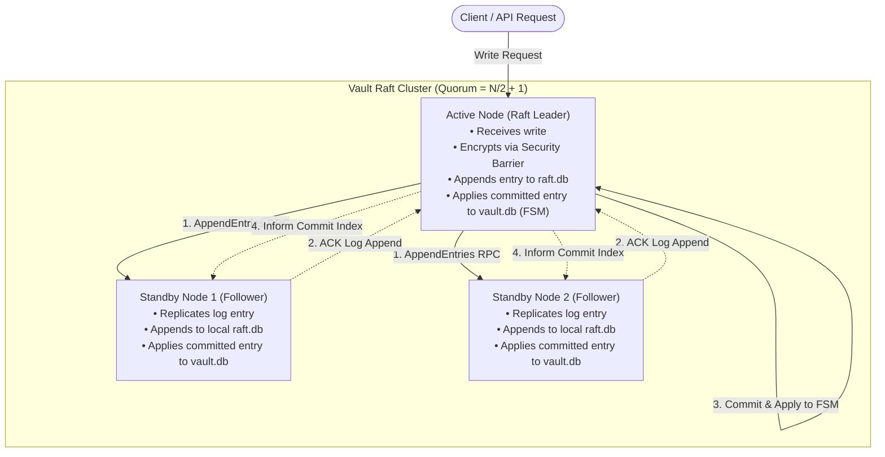
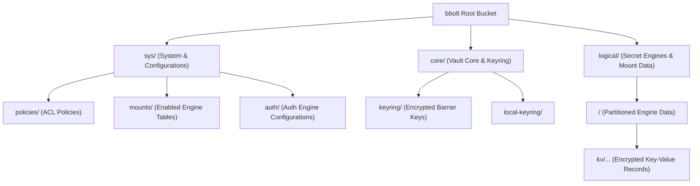

# HashiCorp Vault: Raft Integrated Storage & Database Internals

## 1. Overview of Raft in Vault

In HashiCorp Vault (and managed **HCP Vault**), **Raft** refers to Vault's **Integrated Storage** engine.

### Historical Context vs. Integrated Storage
* **Legacy External Storage (Consul / DB / Cloud Storage):**
  Historically, Vault was purely stateless at the compute layer and required an external backend (such as HashiCorp Consul, DynamoDB, PostgreSQL, or S3) to persist encrypted data and manage High Availability (HA) leader locks via distributed mutexes.
* **Integrated Storage (Raft):**
  Introduced in Vault 1.4, Vault embeds the **Raft Consensus Protocol** directly inside the Vault binary. Vault cluster nodes handle their own data replication, consensus, failure detection, and leader election natively without requiring external dependencies like Consul.
* **HCP Vault:**
  HashiCorp Cloud Platform (HCP) Vault runs on fully managed infrastructure that exclusively utilizes Raft Integrated Storage under the hood.

---

## 2. Raft Consensus Architecture in Vault

Raft is a state-machine replication algorithm designed for fault tolerance and strong consistency.



### Key Cluster Mechanics

1. **Leader Election & Heartbeats:**
   * One node is elected the **Active Leader**; all remaining nodes act as **Standby Followers** (or Performance Standbys in Enterprise).
   * The leader periodically sends heartbeats. If followers miss heartbeats within the randomized election timeout, an election is initiated.
2. **Quorum Calculation:**
   * Recommended configuration uses an odd number of voting nodes ($2F + 1$ to tolerate $F$ failures).
   * **Quorum Formula:** $\lfloor N / 2 \rfloor + 1$
     * **3-node cluster:** Quorum is 2 (tolerates 1 node failure).
     * **5-node cluster:** Quorum is 3 (tolerates 2 node failures).
3. **Write Pipeline & Forwarding:**
   * If an API write reaches a standby node, it is forwarded over mTLS to the active leader.
   * The leader packages the command into a Raft log entry and writes it to its local `raft.db`.
   * The leader replicates the entry to followers via `AppendEntries` RPC.
   * Once a majority (quorum) acknowledges the log entry, the leader commits it and applies it to the Finite State Machine (FSM) database (`vault.db`).

---

## 3. Underlying Database Engine: BoltDB (`bbolt`)

Vault's Raft engine does not use a client-server SQL database or RocksDB; it uses **`bbolt`** (an active Go fork of Ben Johnson's BoltDB).

### Characteristics of `bbolt`:
* **Single File Database:** All state machine records reside in a single binary file on the local disk (`vault.db`).
* **ACID Transactions:** Fully supports atomic, consistent, isolated, and durable transactions.
* **Memory-Mapped I/O (`mmap`):** The database file is mapped directly into the process's virtual address space. Reads bypass user-space buffering, making read operations extremely fast with low overhead.
* **Copy-On-Write (COW) B+ Tree:**
  * When updating pages, `bbolt` writes changes to newly allocated pages instead of overwriting existing ones.
  * Ensures zero database corruption during sudden crashes or power loss without needing a separate rollback journal.
* **Concurrency Model:**
  * **Readers:** Infinite concurrent lockless readers (using MVCC snapshot views).
  * **Writers:** Single coordinated writer at a time per node (synchronized via Raft state machine application).

---

## 4. On-Disk Directory Structure & Files

When configuring Vault with Raft:

```hcl
storage "raft" {
  path    = "/vault/data"
  node_id = "vault-node-01"
}
```

The on-disk filesystem layout in the data directory is:

```text
/vault/data/
├── vault.db               <-- The FSM Database (bbolt) storing actual Vault secrets & configuration
└── raft/
    ├── raft.db            <-- Raft WAL & consensus log (bbolt) tracking terms, logs, and membership
    └── snapshots/         <-- Compacted point-in-time Raft snapshot archives
        ├── 1-1024-1620000000000.tmp
        └── 1-1024-1620000000000/
            ├── meta.json  (Raft metadata: term, index, configuration)
            └── state.bin  (Point-in-time binary stream of vault.db)
```

### File Breakdown

| Path | Database Engine | Responsibility |
| :--- | :--- | :--- |
| **`vault.db`** | `bbolt` | Holds the latest applied key-value state of the Vault Finite State Machine (secrets, policies, auth backends, leases). |
| **`raft/raft.db`** | `bbolt` | Write-Ahead Log (WAL) for the Raft consensus engine. Holds uncompacted Raft logs, cluster membership changes, current term, and vote history. |
| **`raft/snapshots/`** | Tar / Binary Archive | To prevent `raft.db` from growing indefinitely, Vault periodically takes a snapshot of `vault.db`, trims the applied log entries in `raft.db`, and persists the snapshot here. |

---

## 5. Vault Data Model & Internal Database Structure

Inside `vault.db`, data is stored in hierarchical **Buckets** (analogous to namespaces or tables in relational databases).



### 1. Key Structure
Keys inside `bbolt` are stored as arbitrary byte slices (`[]byte`). Vault structures them as hierarchical paths:
* `core/keyring`: Stores keyring info protected by the Master Key.
* `sys/mounts`: Catalog of enabled secret engines and configurations.
* `sys/policy/<policy-name>`: Access control definitions.
* `logical/<mount-uuid>/<secret-path>`: Path containing secrets belonging to a specific mounted engine.

### 2. The Security Barrier (Envelope Encryption)
* **Zero Plaintext on Disk:** Neither `vault.db` nor `raft.db` contains plaintext secrets.
* **Encryption Layer:**
  1. Whenever a secret is saved, it is routed through the **Vault Security Barrier**.
  2. The Barrier encrypts both payload and metadata using **AES-256-GCM** with the cluster's Barrier Encryption Key.
  3. The resulting ciphertext (plus IV and authentication tag) is stored as the value in `vault.db`.
* Even if an attacker obtains the raw `vault.db` and `raft.db` files, they cannot decrypt the secrets without unsealing the cluster (via Shamir shards or Cloud KMS).

---

## 6. Comparison: Raft vs. External Storage Backends

| Feature | Raft (Integrated Storage) | External Storage (Consul, DynamoDB, DBs) |
| :--- | :--- | :--- |
| **Architecture** | Single-tier, self-contained binary | Two-tier architecture (Vault + Storage cluster) |
| **Operational Overhead** | Low (single cluster to deploy, patch, and monitor) | High (dual clusters to manage, backup, and tune) |
| **Network Latency** | Low (local `bbolt` read/writes, internal peer RPC) | Higher (extra network round trips per transaction) |
| **Snapshots / Backups** | Native command: `vault operator raft snapshot save` | Dependent on external storage snapshot tooling |
| **Disaster Recovery** | Built-in Raft peer autopilots and snapshot restoration | Relies on external replication / backup tooling |
| **HCP Vault** | Standard native engine | Not supported on HCP Vault |
