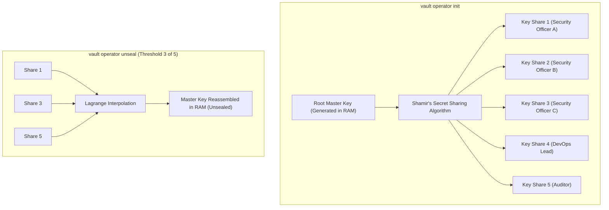
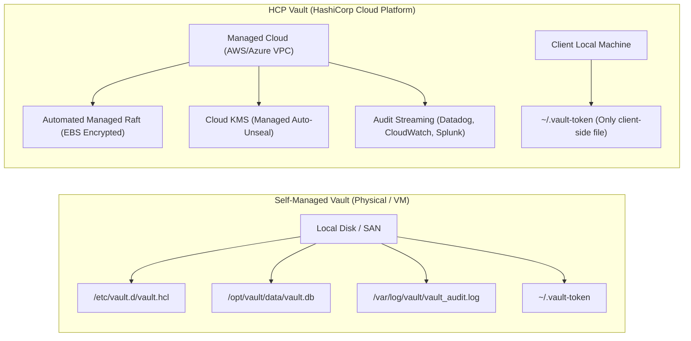

# HashiCorp Vault: Shamir's Secret Sharing and Filesystem Architecture

> [!NOTE]
> **Exam & Operations Context:** Understanding Shamir's Secret Sharing (SSS), key distribution, recovery keys in HCP Vault, and the underlying filesystem storage layout (configuration, Raft storage, logs, token helpers) is essential for HashiCorp Vault Associate and Operations Professional certifications.

**Official Documentation:**
- [Vault Architecture: Seal/Unseal](https://developer.hashicorp.com/vault/docs/concepts/seal)
- [Vault Integrated Storage (Raft)](https://developer.hashicorp.com/vault/docs/configuration/storage/raft)
- [HCP Vault Architecture](https://developer.hashicorp.com/hcp/docs/vault)
- [Vault Audit Devices](https://developer.hashicorp.com/vault/docs/audit)

---

## 1. What is Shamir's Secret Sharing in HashiCorp Vault?

**Shamir's Secret Sharing (SSS)** is an algorithm created by cryptographer Adi Shamir (the "S" in RSA). It enables a single master secret to be divided into $N$ unique pieces (called **Key Shares** or **Unseal Keys**), such that any subset of $T$ pieces (the **Threshold**) can reconstruct the original secret.

$$\text{Threshold Condition: } T \le N \quad (\text{Default: } T = 3, N = 5)$$



### Key Mathematical & Cryptographic Rules
1. **Zero Information Leakage:** Having $T - 1$ shares (e.g., 2 shares when threshold is 3) reveals **mathematically zero** information about the Master Key.
2. **Multi-Party Custody:** Prevents a single rouge operator or compromised credential from decrypting the entire Vault dataset.
3. **Disaster Resilience:** If up to $(N - T)$ operators lose their keys (e.g., 2 out of 5), the remaining operators can still successfully unseal Vault.

---

## 2. Shamir in Self-Hosted Vault vs. HCP Vault

| Aspect | Self-Hosted Vault (Open Source / Enterprise) | **HCP Vault (HashiCorp Cloud Platform)** |
| :--- | :--- | :--- |
| **Primary Unseal Engine** | **Manual Shamir Unseal** (default) or Cloud KMS Auto-Unseal. | **Cloud KMS Auto-Unseal** (AWS KMS / Azure Key Vault managed by HCP). |
| **Role of Shamir** | Used to generate **Unseal Keys** to unseal Vault after every restart. | Used to generate **Recovery Keys** during cluster initialization. |
| **Human Unsealing Needed?** | **Yes** on every restart/node reboot (unless Auto-Unseal is configured). | **No.** Clusters unseal automatically with zero downtime. |
| **What Shamir Protects** | The Master Key decrypting the active storage key. | Break-glass recovery operations (generating root tokens, rekeying). |
| **CLI Command Used** | `vault operator unseal <key>` | Not applicable for unsealing. Used with `vault operator generate-root`. |

> [!IMPORTANT]
> **HCP Vault Exam Tip:** In HCP Vault, operators **never** manually unseal clusters. Shamir's algorithm in HCP Vault only governs **Recovery Keys**, which are held by your team for emergency administrative and break-glass procedures.

---

## 3. Directory and Filesystem Architecture: Folder & Files View

When running HashiCorp Vault on a host (Linux or Windows), Vault creates and interacts with specific files and directories across its lifecycle:

```text
/etc/vault.d/ (or C:\Vault\)
├── vault.hcl                      <-- Configuration file (HCL format)
├── tls/
│   ├── vault-cert.pem             <-- Public TLS certificate
│   ├── vault-key.pem              <-- Private TLS key (chmod 0600)
│   └── ca.pem                     <-- Trusted CA certificate chain
│
/opt/vault/data/ (Storage Directory - Raft Integrated Backend)
├── vault.db                       <-- BoltDB containing core cluster state & metadata
├── raft/
│   ├── raft.db                    <-- Raft log entries & state machine database
│   ├── raft-log.bin               <-- Binary write-ahead consensus log
│   └── snapshots/                 <-- Periodic Raft state snapshots
│       └── 1-2048-1718901234.tmp
│
/var/log/vault/ (Logging Directory)
├── vault.log                      <-- Operational server log (INFO, DEBUG, WARN)
└── vault_audit.log                <-- Audit device file (contains every raw request/response)
│
~/.vault-token (User Home Directory)
└── .vault-token                   <-- Local client authentication token (token helper)
│
Operator Secure Offline Storage (Not on Vault server!)
├── cluster-keys.json (or keys.txt) <-- Unseal shares / Recovery shares & initial root token
```

---

## 4. Detailed Breakdown of Files Created by Vault

### 1. Configuration File (`vault.hcl`)
* **Created by:** Administrator prior to starting Vault.
* **Purpose:** Defines listener IP/port, TLS paths, storage backend (`raft` or `consul`), telemetry, and UI settings.
* **Example:**
  ```hcl
  storage "raft" {
    path    = "/opt/vault/data"
    node_id = "node-1"
  }

  listener "tcp" {
    address       = "0.0.0.0:8200"
    tls_cert_file = "/etc/vault.d/tls/vault-cert.pem"
    tls_key_file  = "/etc/vault.d/tls/vault-key.pem"
  }

  api_addr     = "https://127.0.0.1:8200"
  cluster_addr = "https://127.0.0.1:8201"
  ui           = true
  ```

---

### 2. Storage Backend Files (`/opt/vault/data/`)
* **Created by:** Vault server process upon startup and initialization (`vault operator init`).
* **Files inside Raft storage:**
  * `vault.db`: The embedded BoltDB / bbolt key-value database storing encrypted secrets, token metadata, policies, and barrier configuration. **All data at rest inside this file is encrypted with AES-256-GCM**.
  * `raft/raft.db`: The Raft consensus database maintaining leader election states and node membership.
  * `raft/snapshots/`: Compressed binary snapshots taken automatically to truncate consensus logs and prevent disk exhaustion.
* **Security at rest:** Even if an attacker steals `vault.db`, the secrets are completely unreadable without the Master Key held in memory.

---

### 3. Operator Initialization Output (`cluster-keys.json` / `keys.txt`)
* **Created by:** Running `vault operator init` from the CLI:
  ```bash
  vault operator init -key-shares=5 -key-threshold=3 > cluster-keys.json
  ```
* **Contents:**
  ```json
  {
    "unseal_keys_b64": [
      "2aZ...share1...",
      "9xP...share2...",
      "K12...share3...",
      "mB4...share4...",
      "T99...share5..."
    ],
    "unseal_keys_hex": [...],
    "unseal_shares": 5,
    "unseal_threshold": 3,
    "recovery_keys_b64": [],
    "root_token": "hvs.CAESIJ7..."
  }
  ```
* **Storage Location:** **NEVER** keep this file on the Vault server host. The 5 unseal keys must be split and delivered to 5 separate designated custodians (via PGP/GPG or secure password managers). The `root_token` should be used once to create administrative users and then revoked.

---

### 4. Client Token File (`~/.vault-token`)
* **Created by:** The Vault CLI when a user runs `vault login <token>`.
* **Path:**
  * Linux/macOS: `~/.vault-token`
  * Windows: `C:\Users\<Username>\.vault-token`
* **Purpose:** Stores the client's current active Vault token so subsequent commands (`vault kv get ...`, `vault status`) don't require passing `-token=...` every time.
* **Security:** Should have strict user-only read/write permissions (`chmod 0600`).

---

### 5. Audit Log File (`vault_audit.log`)
* **Created by:** Vault when an administrator enables the file audit device:
  ```bash
  vault audit enable file file_path=/var/log/vault/vault_audit.log
  ```
* **Purpose:** Logs every single API request and response received by Vault.
* **Security & Hash Mechanism:** All sensitive tokens and secret values are automatically hashed using **HMAC-SHA256** with a salt before being written to disk. If this disk fills up and cannot be written to, Vault will pause processing requests to prevent un-audited operations.

---

## 5. Filesystem Perspective: Self-Hosted vs. HCP Vault



### What You Manage in Each Model:
1. **Self-Hosted:**
   * You create and maintain `vault.hcl`, file permissions, TLS cert renewal, Raft snapshot backups, and audit disk rotation.
2. **HCP Vault:**
   * **Zero server files to manage.** HashiCorp manages the server OS, filesystem, Raft databases, snapshots, and disk storage automatically.
   * You only deal with **client-side files** (`~/.vault-token` and downloaded backup snapshot artifacts).

---

## 6. Summary Checklist: Critical Files and Sensitivity

| File Name | Typical Location | Created At | Sensitivity Level | Encryption State |
| :--- | :--- | :--- | :--- | :--- |
| `vault.hcl` | `/etc/vault.d/` or `C:\Vault\` | Pre-installation | Medium (contains paths, network bindings) | Plaintext |
| `vault.db` / `raft.db` | `/opt/vault/data/` | Initialization / Runtime | **Critical** (Holds all Vault secrets) | **Encrypted (AES-256-GCM)** |
| `cluster-keys.json` | Local admin workstation | `vault operator init` | **Maximum** (Master unseal shares + root token) | Plaintext (Must be PGP encrypted) |
| `~/.vault-token` | User home directory | `vault login` | **High** (Active session token) | Plaintext (Protected by OS permissions) |
| `vault_audit.log` | `/var/log/vault/` | When audit device enabled | High (Audit trail of all operations) | Plaintext with HMAC-salted secrets |
| `vault-key.pem` | `/etc/vault.d/tls/` | TLS provisioning | **Critical** (TLS private key) | Plaintext (Protected by `chmod 0600`) |
