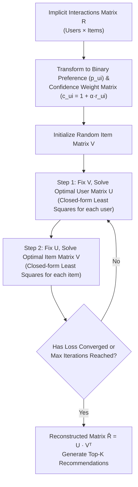

# Weighted Alternating Least Squares (WALS)

> [!NOTE]
> **Domain Context:** WALS is an industry-standard **matrix factorization** algorithm for **collaborative filtering recommendation systems**. It specifically solves the challenge of training on **implicit feedback data** (such as clicks, views, streaming duration, and purchases) at massive scale.

---

## 1. Executive Summary

In traditional collaborative filtering (e.g., standard SVD or basic Matrix Factorization), models expect **explicit feedback**—ratings where users state an exact score (e.g., 1 to 5 stars). 

However, in real-world systems (e-commerce, video streaming, news feeds), more than **99% of user signals are implicit**:
- Page views & clicks
- Video watch time / audio listen completion rate
- Search queries & add-to-cart actions

**WALS (Weighted Alternating Least Squares)** addresses two fundamental flaws of traditional algorithms when applied to implicit data:
1. **Unobserved interactions $\neq$ negative preference:** A user who hasn't clicked an item might hate it, or simply never saw it. WALS assigns confidence weights rather than binary labels.
2. **Extreme matrix sparsity & scale:** Optimizing latent factors alternatingly turns a non-convex matrix factorization problem into a series of standard linear regressions that can be solved in parallel across distributed nodes.

---

## 2. Explicit vs. Implicit Feedback

| Characteristic | Explicit Feedback (SVD / Basic ALS) | Implicit Feedback (WALS) |
|---|---|---|
| **Data Types** | 1–5 star ratings, thumbs up/down, survey answers | Clicks, views, watch time, purchase counts |
| **Availability** | Extremely sparse (< 1% of interactions) | Abundant, continuous stream of user telemetry |
| **Negative Signals** | Clear (e.g., 1-star review) | Ambiguous (did not view $\neq$ dislike) |
| **Confidence** | Fixed (a rating is deliberate) | Variable (10 views indicates higher confidence than 1 click) |
| **Matrix Treatment** | Missing entries are skipped during loss calculation | Missing entries are assigned low-confidence baseline weights |

---

## 3. How WALS Works



### A. Preference and Confidence Transformation
Raw implicit interactions $r_{ui}$ (e.g., number of clicks by user $u$ on item $i$) are mapped into two variables:

1. **Binary Preference ($p_{ui}$):**
   $$p_{ui} = \begin{cases} 1 & \text{if } r_{ui} > 0 \\ 0 & \text{if } r_{ui} = 0 \end{cases}$$

2. **Confidence Weight ($c_{ui}$):**
   $$c_{ui} = 1 + \alpha r_{ui}$$
   - **Observed interactions ($r_{ui} > 0$):** High confidence. The more often a user watches or purchases an item, the higher $c_{ui}$ climbs.
   - **Unobserved interactions ($r_{ui} = 0$):** Baseline weight $c_{ui} = 1$. The model treats zeros as low-confidence negative signals rather than hard negative facts.
   - **Hyperparameter $\alpha$ (Alpha):** Controls how quickly confidence scales with repeated interactions.

---

### B. The Objective (Loss) Function
WALS minimizes the weighted regularized squared error across **all** user-item pairs:

$$\mathcal{L} = \sum_{u} \sum_{i} c_{ui} \left( p_{ui} - u_u^T v_i \right)^2 + \lambda \left( \sum_u \|u_u\|^2 + \sum_i \|v_i\|^2 \right)$$

Where:
- $u_u \in \mathbb{R}^k$: Latent factor embedding vector for user $u$.
- $v_i \in \mathbb{R}^k$: Latent factor embedding vector for item $i$.
- $k$: Latent embedding dimension (e.g., 32, 64, 128).
- $\lambda$: Ridge regularization penalty to prevent overfitting on popular items or active users.

---

### C. Why "Alternating Least Squares"?
Simultaneously optimizing both $U$ and $V$ in the loss function $\mathcal{L}$ is non-convex (NP-hard).

However:
- If **$V$ is held fixed**, $\mathcal{L}$ becomes a quadratic function of $U$. The global minimum for each user vector $u_u$ can be computed analytically using ordinary least squares:
  $$u_u = \left( V^T C^u V + \lambda I \right)^{-1} V^T C^u p_u$$
- If **$U$ is held fixed**, $\mathcal{L}$ becomes a quadratic function of $V$, solved analytically for each item vector $v_i$:
  $$v_i = \left( U^T C^i U + \lambda I \right)^{-1} U^T C^i p_i$$

By alternating between solving for $U$ and solving for $V$, the objective value decreases monotonically on every iteration and converges rapidly (typically in 10–20 iterations).

---

## 4. Key Hyperparameters to Tune

| Hyperparameter | Typical Range | Description & Trade-offs |
|---|---|---|
| **Latent Dimensions ($k$)** | $20 - 200$ | Number of hidden features. Larger $k$ captures nuanced relationships but increases compute and risk of overfitting. |
| **Confidence Multiplier ($\alpha$)** | $10 - 50$ | Controls how aggressively observed interactions increase confidence over unobserved entries. |
| **Regularization ($\lambda$)** | $0.01 - 10.0$ | Penalizes large factor weights. Higher $\lambda$ prevents popular items from dominating recommendations. |
| **Iterations** | $10 - 25$ | Number of alternating passes. ALS usually converges much faster than SGD. |

---

## 5. Architectural Comparison

```
+---------------------+-------------------------------+-----------------------------------+
| Metric              | Weighted ALS (WALS)           | Stochastic Gradient Descent (SGD) |
+---------------------+-------------------------------+-----------------------------------+
| Parallelization     | Embarrassingly parallel       | Requires asynchronous updates     |
|                     | (Independent user/item rows)  | (Hogwild / lock coordination)     |
+---------------------+-------------------------------+-----------------------------------+
| Dense Zeros Problem | Solved efficiently via        | Difficult; sampling negatives is  |
|                     | algebraic shortcuts           | required to avoid O(|U|×|I|) cost |
+---------------------+-------------------------------+-----------------------------------+
| Convergence Rate    | Few iterations (10-20)        | Many epochs required              |
+---------------------+-------------------------------+-----------------------------------+
```

---

## 6. Practical Cloud & Production Implementations

1. **Amazon Personalize / AWS SageMaker**:
   - Recommendation pipelines frequently use matrix factorization and factorization machines derived from WALS principles for cold-start and collaborative filtering baselines.
2. **Distributed Systems (Apache Spark MLlib)**:
   - Spark provides a built-in implementation (`pyspark.ml.recommendation.ALS`) with `implicitPrefs=True`, which implements the WALS algorithm across distributed cluster workers.
3. **Serving at Low Latency**:
   - Once trained, the latent vectors $u_u$ and $v_i$ can be indexed in a vector database (e.g., **Amazon OpenSearch Service**, **pgvector**, or **Pinecone**).
   - Fast inference is achieved via **Approximate Nearest Neighbor (ANN)** cosine/dot-product search: `Top-K = dot(u_user, V_items)`.
