# AWS Network Traffic Monitoring — Exam-Oriented Deep Dive

For the AWS exam, think of **network traffic monitoring** as answering:

> **“Who is communicating with whom, over what protocol/port, was the traffic allowed or rejected, and where can I investigate the problem?”**

The main services/tools to recognize are:

* **VPC Flow Logs**
* **Amazon CloudWatch**
* **Amazon CloudWatch Logs**
* **AWS CloudTrail**
* **AWS CloudTrail network activity events**
* **Amazon GuardDuty**
* **AWS Network Firewall**
* **VPC Traffic Mirroring**
* **AWS Transit Gateway Flow Logs**
* **Route 53 Resolver query logging**
* **AWS Config** — configuration/compliance rather than traffic monitoring
* **AWS X-Ray / Application Signals** — application-level observability, not network packet monitoring

The biggest exam distinction:

> **VPC Flow Logs = network metadata**  
> **Traffic Mirroring = packet-level visibility**  
> **CloudTrail = API activity**  
> **CloudWatch = metrics/logs/alarms**  
> **GuardDuty = threat detection**

---

# 1. First Understand the Layers

Don't mix these services.

Imagine:

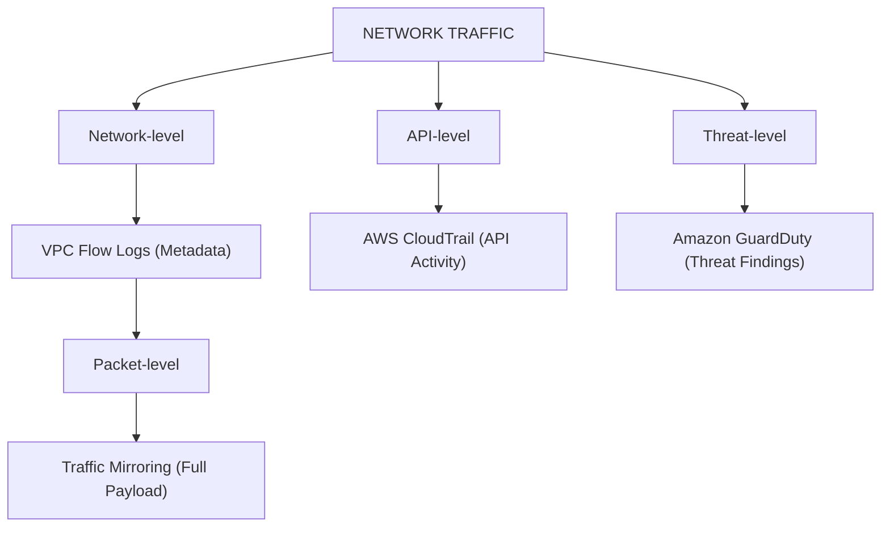

Each answers a different question.

---

# 2. VPC Flow Logs — The Most Important

If you see:

> "Monitor network traffic to and from network interfaces"

Think:

**VPC Flow Logs**

Example:

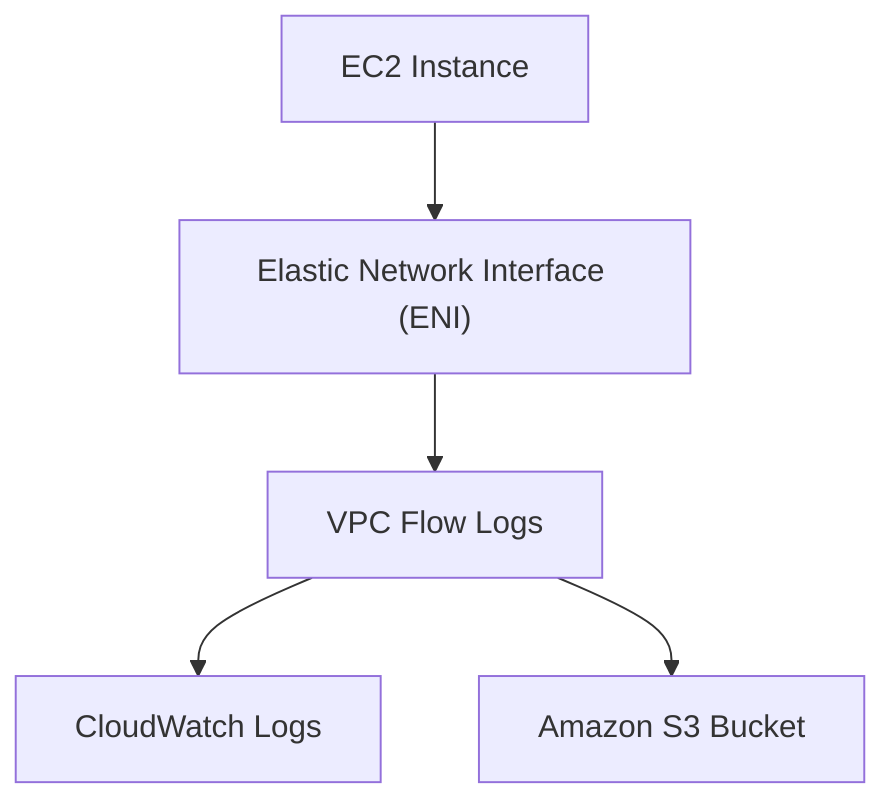

Flow Logs record information about traffic flowing to and from network interfaces.

They contain **metadata**, not the actual packet contents.

---

# 3. What Does a Flow Log Tell You?

Conceptually:

```text
Source IP
Destination IP
Source port
Destination port
Protocol
Bytes
Packets
Start time
End time
ACCEPT / REJECT
```

Example:

```text
10.0.1.10 → 10.0.2.20
TCP
Destination port: 443
ACCEPT
```

You can infer:

> "The application server at 10.0.1.10 communicated with 10.0.2.20 over HTTPS."

---

# 4. What Flow Logs DO NOT Give You

This is a major exam trap.

Flow Logs do **not** provide the actual packet payload.

You don't get:

```text
HTTP request body
Passwords
Full packet contents
Application payload
```

Instead:

```text
10.0.1.10 → 10.0.2.20
TCP/443
ACCEPT
```

### Exam shortcut

> **Need metadata → Flow Logs**

> **Need actual packets → Traffic Mirroring**

---

# 5. VPC Flow Logs Architecture

Typical architecture:

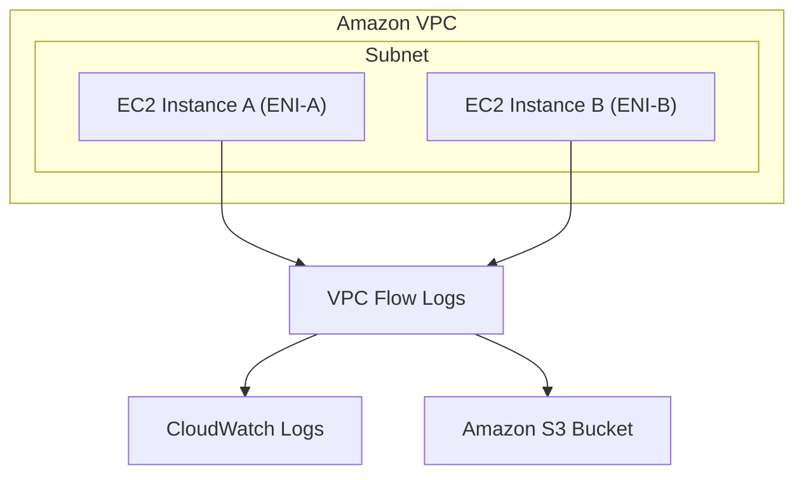

You can then analyze the logs.

---

# 6. Where Can You Enable Flow Logs?

For exam purposes, think about these scopes:

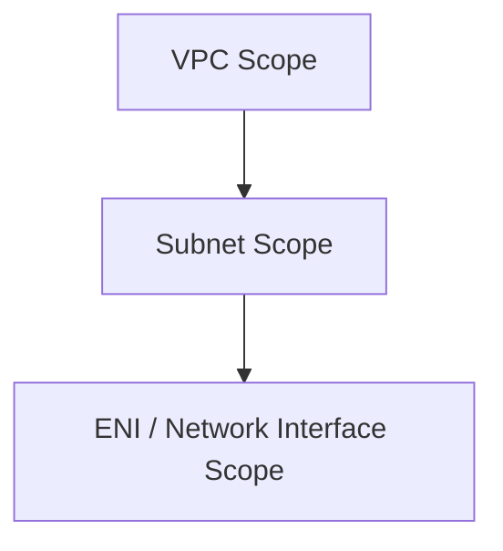

You can create flow logs for VPC resources at appropriate scopes.

### Exam clue

> "Monitor traffic for a particular subnet"

→ Flow Logs associated with the subnet.

> "Monitor traffic for a specific network interface"

→ Flow Logs for that ENI.

---

# 7. ACCEPT vs REJECT

One of the most useful Flow Log fields is whether traffic was accepted or rejected.

Example:

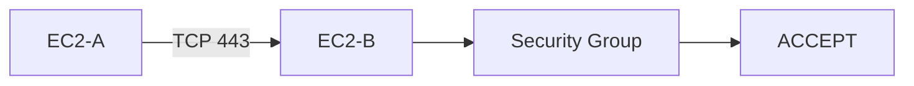

Or:

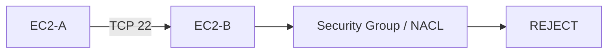

This is extremely useful for troubleshooting.

---

# 8. Troubleshooting Scenario

Question:

> "An application cannot connect to a database. The administrator wants to determine whether network traffic is being rejected."

Think:

```text
VPC Flow Logs
```

Then inspect:

```text
Source
Destination
Port
Protocol
ACCEPT / REJECT
```

This can help determine whether the problem is related to:

* Security Group
* NACL
* Routing
* Connectivity

---

# 9. Flow Logs vs Security Groups

This distinction is important.

### Security Group

Controls:

> **Whether traffic is allowed**

### Flow Logs

Records:

> **What traffic happened and whether it was accepted/rejected**

Think:

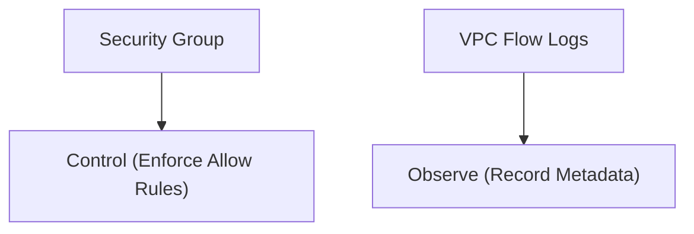

They complement each other.

---

# 10. Flow Logs vs Network ACL

Same concept:

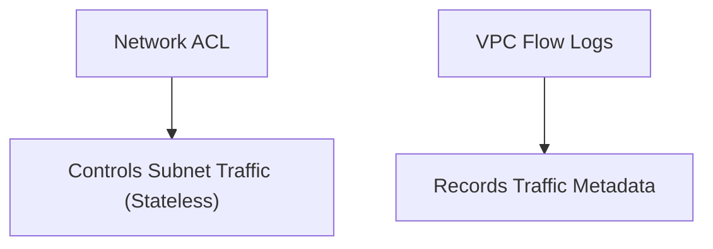

Don't confuse monitoring with enforcement.

---

# 11. CloudWatch

CloudWatch is your broader observability platform.

Think:

> **Metrics + logs + alarms + dashboards**

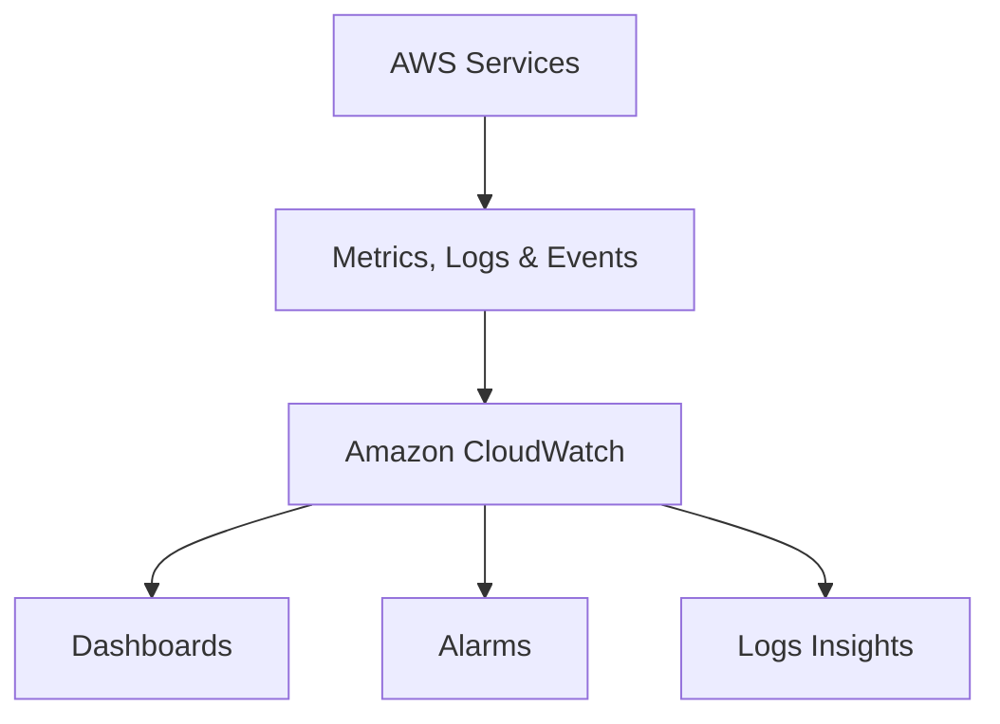

---

# 12. CloudWatch vs VPC Flow Logs

A classic exam distinction:

### VPC Flow Logs

```text
"What network connections are happening?"
```

### CloudWatch

```text
"How is my infrastructure performing?"
```

Example:

CloudWatch:

```text
EC2 CPU = 90%
NetworkIn = 500 MB
NetworkOut = 800 MB
```

Flow Logs:

```text
10.0.1.10 → 10.0.2.20
TCP/443
ACCEPT
```

---

# 13. CloudTrail

CloudTrail is about **API activity**.

Think:

> **Who did what to AWS?**

Example:

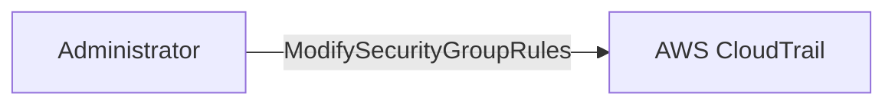

CloudTrail might tell you:

```text
User: Alice
Action: AuthorizeSecurityGroupIngress
Time: 10:30
```

Flow Logs tell you:

```text
10.0.1.10 → 10.0.2.20 TCP/443 ACCEPT
```

### Memorize:

> **CloudTrail = API activity**

> **Flow Logs = network traffic**

---

# 14. CloudTrail vs Flow Logs

| Question | Service |
|---|---|
| Who changed a security group? | CloudTrail |
| Who created a VPC? | CloudTrail |
| Which IP communicated with another IP? | Flow Logs |
| Was traffic accepted/rejected? | Flow Logs |
| Which API call caused a change? | CloudTrail |
| What network connections occurred? | Flow Logs |

---

# 15. Traffic Mirroring

Now we move to a deeper level.

Suppose you need:

> **Actual network packet contents for deep inspection.**

Flow Logs aren't enough.

Use:

**VPC Traffic Mirroring**

Conceptually:

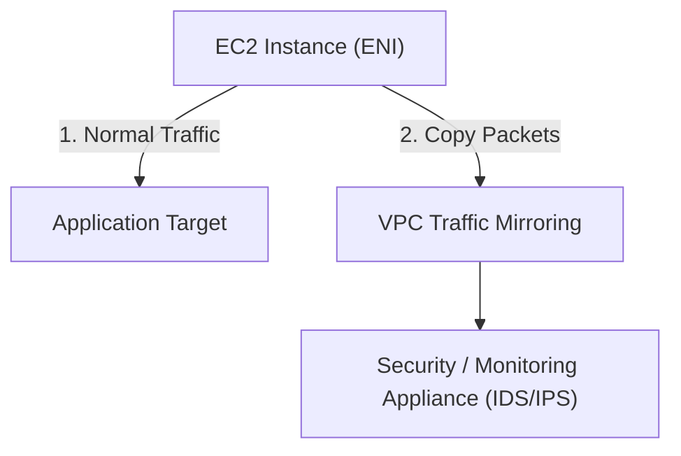

---

# 16. Flow Logs vs Traffic Mirroring

This is one of the most important comparisons.

| Feature | VPC Flow Logs | Traffic Mirroring |
|---|---|---|
| Metadata | ✅ | ✅ |
| Actual packets | ❌ | ✅ |
| Packet payload | ❌ | Can inspect |
| Cost/complexity | Lower | Higher |
| Operational overhead | Low | Higher |
| Deep packet inspection | ❌ | ✅ |
| General network troubleshooting | ✅ | Possible |
| IDS/IPS/security appliance | Limited | ✅ |

### Exam shortcut

> **"Which IP talked to which IP?"**

→ Flow Logs

> **"Inspect packet contents."**

→ Traffic Mirroring

---

# 17. Traffic Mirroring HLD

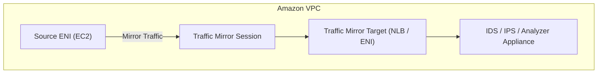

This is useful for:

* Security inspection
* Network troubleshooting
* Intrusion detection
* Packet analysis

But:

> **Don't use Traffic Mirroring when simple flow metadata is enough.**

It has more complexity and potentially more cost.

---

# 18. GuardDuty

GuardDuty is a **threat detection service**.

Think:

> **"Does this traffic/activity look malicious?"**

Instead of simply:

```text
10.0.1.10 → 10.0.2.20
```

GuardDuty might identify suspicious behavior such as:

```text
Potential malicious activity
Suspicious IP
Credential compromise
Reconnaissance
```

### Exam clue

> "Automatically detect threats"

→ **GuardDuty**

---

# 19. Flow Logs vs GuardDuty

Don't confuse them.

### Flow Logs

> **Raw network metadata**

### GuardDuty

> **Threat detection and findings**

Think:

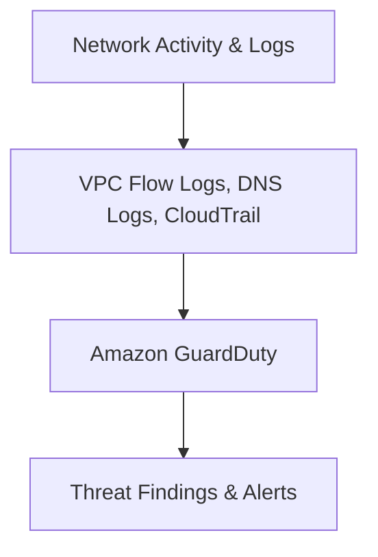

GuardDuty is not simply a replacement for Flow Logs.

---

# 20. AWS Network Firewall

Another important service.

Think:

> **Inspect and control network traffic**

Flow Logs:

```text
Observe
```

Network Firewall:

```text
Inspect + Block/Allow
```

Example:

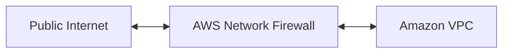

It can provide centralized network traffic filtering.

---

# 21. Monitoring vs Enforcement

This distinction is extremely important.

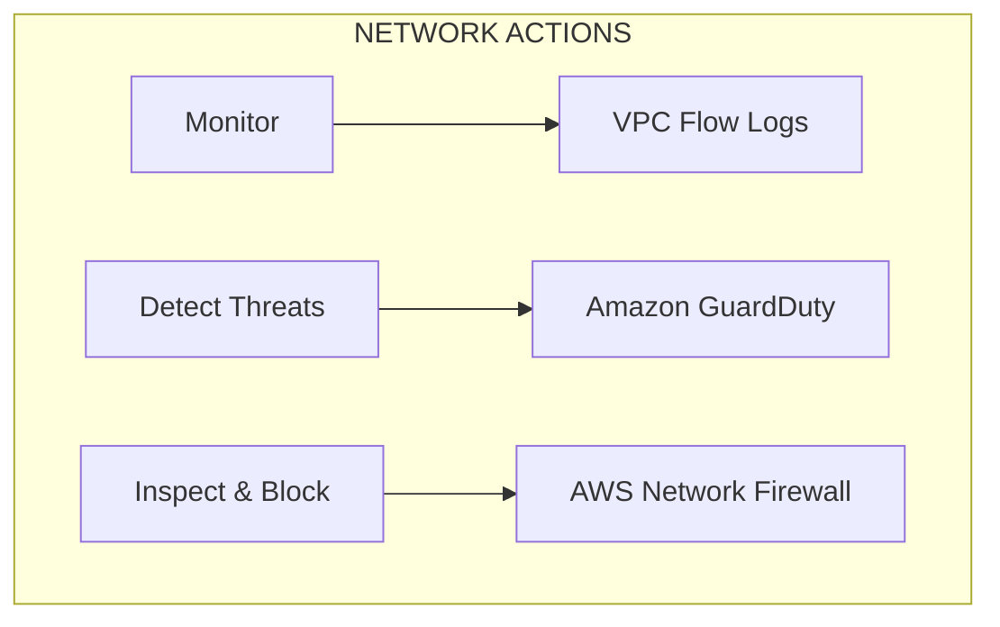

### Flow Logs

**Monitor**

### GuardDuty

**Detect threats**

### Network Firewall

**Inspect/control**

---

# 22. Route 53 Resolver Query Logging

This one belongs to **DNS monitoring**, not general network traffic monitoring.

Suppose:

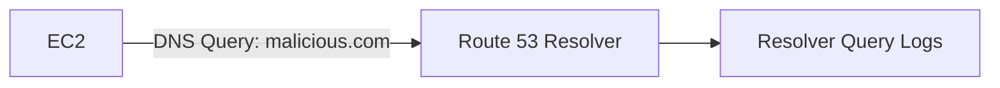

You want to know:

> "Which domains are my resources querying?"

Use:

**Route 53 Resolver query logging**

Example:

```text
EC2
 ↓
query:
malicious-example.com
 ↓
Resolver Query Logs
```

### Exam clue

> "Monitor DNS queries"

→ **Route 53 Resolver query logging**

Not VPC Flow Logs alone.

---

# 23. Transit Gateway Flow Logs

If you're using a Transit Gateway:

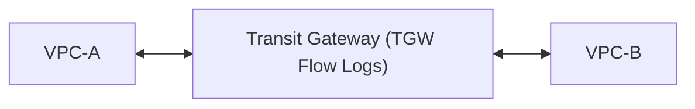

You may need to monitor traffic traversing the TGW.

Think:

**Transit Gateway Flow Logs**

They provide traffic-flow information associated with the Transit Gateway.

### Exam clue

> "Monitor traffic through Transit Gateway."

→ **Transit Gateway Flow Logs**

---

# 24. Centralized Network Monitoring

For a large enterprise:

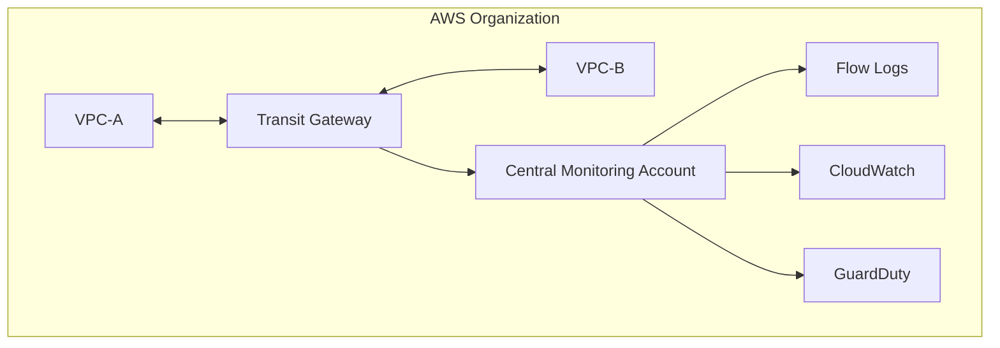

This gives centralized visibility.

---

# 25. HLD — Basic Network Monitoring

For a small environment:

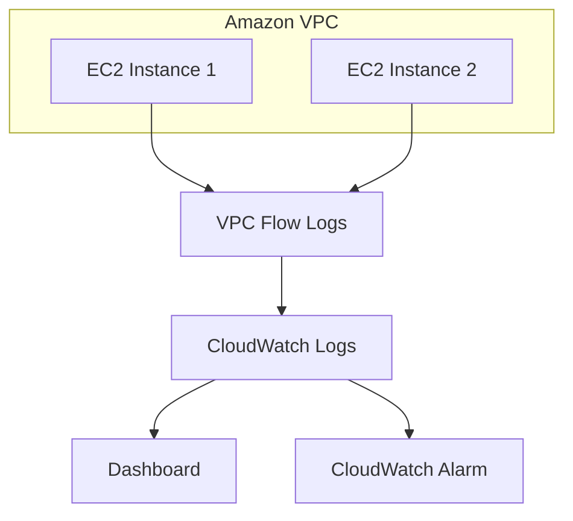

Good when you need:

* Basic visibility
* Troubleshooting
* Accepted/rejected traffic
* Centralized logs

---

# 26. HLD — Enterprise Security Monitoring

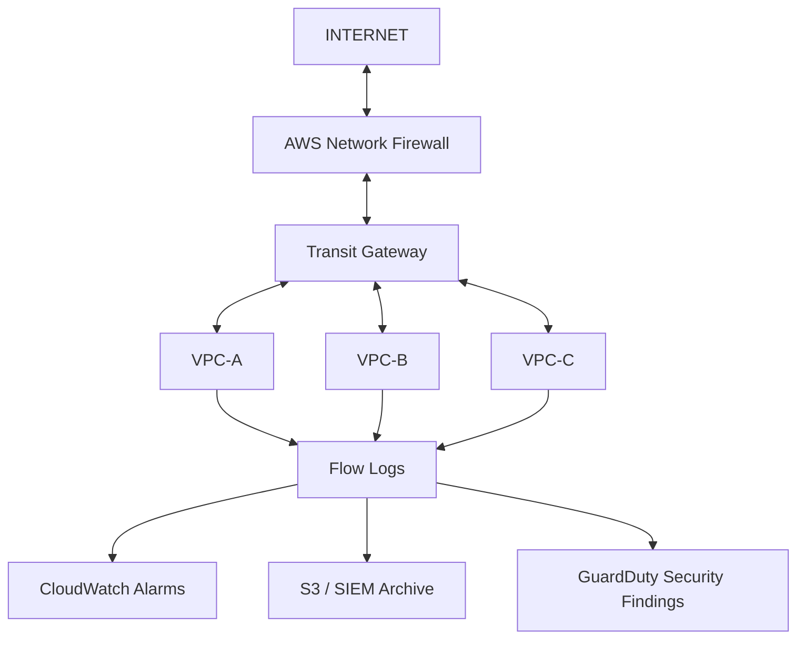

If deep packet inspection is required:

```mermaid
flowchart LR
    ENI["Critical ENI"] --> Mirror["Traffic Mirroring"] --> IDS["IDS / IPS / Analyzer"]
```

---

# 27. Cost Trade-off

This is where the AWS exam mindset matters.

### Option A — Flow Logs

```text
Low operational overhead
        +
Network metadata
```

Best default when you just need visibility.

---

### Option B — Traffic Mirroring

```text
Higher complexity
        +
Packet-level inspection
```

Only use when you actually need packet-level analysis.

---

### Option C — GuardDuty

```text
Managed threat detection
        +
Low operational overhead
```

Good when the requirement is security threat detection rather than raw traffic analysis.

---

### Option D — Self-managed IDS/IPS

```text
EC2
+
Security software
+
Scaling
+
Patching
+
HA
+
Management
```

This has significantly more operational work.

### Exam principle

> **If a managed AWS security service satisfies the requirement, don't build your own monitoring/security infrastructure unless the question requires custom control.**

---

# 28. Monitoring Architecture Comparison

| Requirement | Best starting point |
|---|---|
| Basic network traffic visibility | VPC Flow Logs |
| Accepted/rejected traffic | VPC Flow Logs |
| Network connection metadata | VPC Flow Logs |
| Store/analyze logs | CloudWatch Logs / S3 |
| API activity | CloudTrail |
| Detect malicious behavior | GuardDuty |
| Inspect packet contents | Traffic Mirroring |
| DNS query monitoring | Resolver Query Logging |
| Monitor TGW traffic | Transit Gateway Flow Logs |
| Block/filter network traffic | Network Firewall |
| Infrastructure metrics | CloudWatch |

---

# 29. Flow Logs → CloudWatch vs S3

This is another useful trade-off.

### CloudWatch Logs

Think:

> **Real-time-ish operational monitoring and analysis**

```mermaid
flowchart LR
    FL1["Flow Logs"] --> CWL["CloudWatch Logs"] --> RealTime["Queries / Dashboards / Alarms"]
```

### S3

Think:

> **Long-term storage / centralized analysis / archival**

```mermaid
flowchart LR
    FL2["Flow Logs"] --> S3["Amazon S3"] --> Analytics["Athena / SIEM / Analytics"]
```

### Exam clue

> "Need immediate monitoring and alarms"

→ **CloudWatch**

> "Need long-term centralized storage and analysis"

→ **S3**

---

# 30. CloudWatch Alarm

Suppose:

> "Alert administrators when rejected network traffic exceeds a threshold."

Architecture:

```mermaid
flowchart LR
    FL["VPC Flow Logs"] --> CWL["CloudWatch Logs"] --> MF["Metric Filter"] --> Alarm["CloudWatch Alarm"] --> SNS["Amazon SNS"] --> Notify["Notification"]
```

This is a classic AWS monitoring pattern.

---

# 31. Automation

The monitoring architecture should be automated too.

Example:

```mermaid
flowchart LR
    Alarm["CloudWatch Alarm"] --> SNS["Amazon SNS"] --> Lambda["Lambda / Incident System"] --> Response["Automated Response"]
```

Or:

```mermaid
flowchart LR
    GD["GuardDuty Finding"] --> EB["EventBridge"] --> LambdaRem["Lambda / Security Automation"] --> Fix["Remediation"]
```

### Exam principle

If the question says:

> "Automatically respond to security findings"

Think:

**GuardDuty + EventBridge + Lambda / remediation workflow**

rather than manual investigation every time.

---

# 32. Network Monitoring vs Application Monitoring

Another common trap.

Suppose users report:

> "The application is slow."

You could investigate at multiple layers:

```mermaid
flowchart TD
    User["User Layer"] --> App["Application Tracing (AWS X-Ray / Application Signals)"]
    App --> Net["Network Layer (VPC Flow Logs / Traffic Mirroring)"]
    Net --> Infra["Infrastructure Layer (CloudWatch Metrics)"]
```

### Network

Use:

**VPC Flow Logs / Traffic Mirroring**

### Infrastructure

Use:

**CloudWatch**

### API activity

Use:

**CloudTrail**

### Application tracing

Use:

**AWS X-Ray / Application Signals**

### Security threat

Use:

**GuardDuty**

---

# 33. Troubleshooting Decision Tree

This is extremely useful for the exam.

```mermaid
flowchart TD
    Issue["Something is wrong"] --> Ask{"What are you asking?"}
    
    Ask -->|Network traffic| FlowLogs["VPC Flow Logs"]
    Ask -->|API activity| CloudTrail["AWS CloudTrail"]
    Ask -->|Security threat| GuardDuty["Amazon GuardDuty"]

    FlowLogs --> Pkts{"Need packet payload?"}
    Pkts -->|YES| Mirror["Traffic Mirroring"]
    Pkts -->|NO| FlowLogs
```

---

# 34. Example Exam Questions

### Example 1

> An administrator needs to identify which IP addresses are communicating with an EC2 instance.

Think:

**VPC Flow Logs**

---

### Example 2

> An administrator needs to determine why traffic between two subnets is being rejected.

Think:

**VPC Flow Logs**

Then investigate:

* Security Groups
* NACLs
* Route tables

---

### Example 3

> A security team needs to inspect the contents of packets entering an EC2 instance.

Think:

**VPC Traffic Mirroring**

Not Flow Logs.

---

### Example 4

> A security team wants AWS to automatically identify suspicious network activity.

Think:

**GuardDuty**

---

### Example 5

> An administrator needs to know who modified a security group rule.

Think:

**CloudTrail**

Not Flow Logs.

---

### Example 6

> The organization wants to record DNS queries made by VPC resources.

Think:

**Route 53 Resolver query logging**

---

### Example 7

> An organization needs centralized monitoring of traffic passing through Transit Gateway.

Think:

**Transit Gateway Flow Logs**

---

# 35. A Very Important Distinction

Memorize this table:

| Question | Answer |
|---|---|
| **What network traffic occurred?** | VPC Flow Logs |
| **What packets were sent?** | Traffic Mirroring |
| **Who changed AWS configuration?** | CloudTrail |
| **Is this activity malicious?** | GuardDuty |
| **What DNS queries were made?** | Resolver query logs |
| **What are my infrastructure metrics?** | CloudWatch |
| **Can I block malicious traffic?** | Network Firewall |

---

# 36. Cost + Operational Overhead Hierarchy

A good exam mental model:

```mermaid
flowchart TD
    Vis{"Need visibility?"} --> FL["VPC Flow Logs"]
    FL --> Pkts{"Need packet contents?"}
    Pkts -->|NO| FL
    Pkts -->|YES| TM["Traffic Mirroring"]

    Threat{"Need threat detection?"} --> GD["Amazon GuardDuty"]
    Audit{"Need API audit?"} --> CT["AWS CloudTrail"]
```

Don't deploy the more complicated solution unless the requirement calls for it.

---

# 37. The "Minimum Work" Principle

### Requirement:

> "Identify rejected traffic."

Don't deploy:

❌ Traffic Mirroring  
❌ IDS cluster  
❌ Packet capture appliances

Use:

✅ **VPC Flow Logs**

---

### Requirement:

> "Detect malicious activity."

Don't build:

❌ Custom threat-detection platform

Use:

✅ **GuardDuty**

---

### Requirement:

> "Inspect packets."

Don't use:

❌ Flow Logs

Use:

✅ **Traffic Mirroring**

---

### Requirement:

> "Find who deleted a security group."

Don't use:

❌ Flow Logs

Use:

✅ **CloudTrail**

---

# 38. High-Level Enterprise Architecture

A strong enterprise design might look like:

```mermaid
flowchart TD
    subgraph Org["AWS ORGANIZATION"]
        SecAcc["Security Account (GuardDuty)"]
        NetAcc["Network Account (Transit Gateway)"]
        
        NetAcc <--> VPCA["VPC-A"]
        NetAcc <--> VPCB["VPC-B"]
        NetAcc <--> VPCC["VPC-C"]

        VPCA --> FlowLogs["VPC Flow Logs"]
        VPCB --> FlowLogs
        VPCC --> FlowLogs
        
        FlowLogs --> CentralLogs["Central Log Archive (CloudWatch / S3 / SIEM)"]
    end
```

For packet inspection:

```mermaid
flowchart LR
    CriticalENI["Critical ENI"] --> Mirror["Traffic Mirroring"] --> IDS["IDS / IPS / Security Appliance"]
```

---

# 39. HLD — Simple Production Architecture

If you're designing a normal application:

```mermaid
flowchart TD
    Internet["Internet"] --> ALB["ALB"] --> App["EC2 Instances (AZ-A & AZ-B)"] --> RDS["RDS Multi-AZ"]
    App --> FlowLogs["VPC Flow Logs"] --> CW["CloudWatch / S3 Alerts"]
    App --> GD["GuardDuty (Threat Detection)"]
```

---

# 40. HLD — Security-Focused Architecture

```mermaid
flowchart TD
    Inet["INTERNET"] --> Firewall["Network Firewall"] --> TGW["Transit Gateway"]
    TGW <--> VPCA["VPC-A"]
    TGW <--> VPCB["VPC-B"]
    TGW <--> VPCC["VPC-C"]

    VPCA --> FlowLogs["Flow Logs"]
    VPCB --> FlowLogs
    VPCC --> FlowLogs

    FlowLogs --> CW["CloudWatch Alarms"]
    FlowLogs --> S3["S3 Archive"]
    FlowLogs --> GD["GuardDuty Security Findings"]

    GD --> EB["EventBridge"] --> Lambda["Lambda Auto-Remediation"]
```

This gives:

* Network visibility
* Threat detection
* Automated response
* Centralized logging

---

# 41. What I Would Choose in the Exam

If the question says:

### "Monitor network traffic"

→ **VPC Flow Logs**

### "Monitor rejected traffic"

→ **VPC Flow Logs**

### "Troubleshoot connectivity"

→ **VPC Flow Logs**

### "Inspect packets"

→ **Traffic Mirroring**

### "Detect malicious activity"

→ **GuardDuty**

### "Audit API calls"

→ **CloudTrail**

### "Monitor DNS requests"

→ **Route 53 Resolver query logging**

### "Monitor Transit Gateway traffic"

→ **Transit Gateway Flow Logs**

### "Block unwanted network traffic"

→ **Network Firewall**

### "Create alarms from metrics/logs"

→ **CloudWatch**

---

---

# 42. Real-World Exam Scenario: Private Central VPC Microservices Interconnectivity & Security Log Aggregation

- **Scenario**: A company launches a central employee registry microservices application in Docker running inside a single AWS Region. Management teams in different department VPCs in the same Region must connect to the central VPC. Requirements:
  - Traffic must **NOT traverse the public Internet**.
  - The IT Security team must be notified of any **denied traffic requests (REJECT)** and be able to view the corresponding **source IP addresses** in a central security account.
  What is the recommended architecture?
- **Architecture Solution**:
  - Link each department's VPC to the central VPC using **VPC Peering**. Create **VPC Flow Logs** on each VPC to capture rejected traffic requests (including source IPs) delivered to an **Amazon CloudWatch Logs group**. Set up a **CloudWatch Logs Subscription Filter** that streams the log data to the IT Security account.

```mermaid
flowchart TD
    subgraph DepartmentVPCs["1. Department VPCs (Same AWS Region)"]
        VPC_DeptA["Finance VPC"]
        VPC_DeptB["HR VPC"]
    end

    subgraph CentralVPC["2. Central Microservices VPC"]
        VPC_Central["Central Employee Registry VPC<br/>(Docker Microservices)"]
    end

    subgraph PrivateNetworking["Private AWS Backbone Connectivity"]
        PeerA["VPC Peering Link A<br/>⚡ Zero Public Internet Traversal!"]
        PeerB["VPC Peering Link B<br/>⚡ Zero Public Internet Traversal!"]

        VPC_DeptA <==> PeerA <==> VPC_Central
        VPC_DeptB <==> PeerB <==> VPC_Central
    end

    subgraph SecurityLogging["3. Security Monitoring & Cross-Account Log Streaming"]
        FlowLogs["VPC Flow Logs<br/>(Filters REJECT traffic & captures Source IPs)"]
        CWG["CloudWatch Logs Group"]
        Subscription["CloudWatch Logs Subscription Filter<br/>(Cross-Account Log Stream)"]
        SecAccount["IT Security Central Account<br/>(Analyzes Source IPs & Security Alerts)"]

        VPC_DeptA & VPC_DeptB & VPC_Central ==> FlowLogs ==> CWG ==> Subscription ==> SecAccount
    end

    classDef peer fill:#1864ab,stroke:#0b5394,color:#ffffff;
    classDef log fill:#7950f2,stroke:#5f3dc4,color:#ffffff;

    class PeerA,PeerB peer;
    class FlowLogs,CWG,Subscription,SecAccount log;
```

### Key Technical Rationale:
1. **VPC Peering for Private Inter-VPC Traffic**: VPC Peering routes traffic entirely within the AWS global private network backbone using private IP addresses. It guarantees that inter-VPC traffic **never traverses the public Internet**.
2. **VPC Flow Logs for Source IP & REJECT Capture**: VPC Flow Logs capture network interface traffic metadata, including the `action` (`ACCEPT` or `REJECT`) and `srcaddr` (source IP).
3. **CloudWatch Logs Subscription Filters for Multi-Account Security**: Subscription filters stream real-time log events from CloudWatch Logs to central security accounts (via Kinesis, Lambda, or cross-account log destinations) for audit compliance and alerting.

### Why Distractor Options Fail:
- *IPSec Tunnel / Marketplace VPN over Internet*: IPSec VPN tunnels traverse the **public Internet**, violating the strict mandate that traffic must remain on private AWS network paths.
- *AWS Direct Connect between VPCs*: AWS Direct Connect links on-premises data centers to AWS VPCs via dedicated physical circuits; Direct Connect **cannot** link two AWS VPCs together.
- *Transit VPC + AWS Config Rules*: Marketplace VPNs traverse the public internet. Furthermore, **AWS Config rules do NOT capture network IP traffic or source IP addresses**—only VPC Flow Logs capture network traffic metadata (source IP, destination IP, REJECT status).

---

# 🧠 Final Exam Cheat Sheet

```text
VPC Flow Logs
    ↓
NETWORK METADATA
    ↓
Who ↔ Who?
Which port?
Which protocol?
ACCEPT / REJECT (Source IP Audit)?

VPC Peering
    ↓
PRIVATE INTER-VPC ROUTING
    ↓
Same or Cross-Region
Zero Public Internet Traversal

Traffic Mirroring
    ↓
PACKETS
    ↓
Deep packet inspection

CloudTrail
    ↓
AWS API ACTIVITY
    ↓
Who changed what?

CloudWatch
    ↓
OBSERVABILITY
    ↓
Metrics + Logs + Alarms
```

## 🏆 Your exam decision rule

When you see a monitoring question, first identify **what level you're trying to observe**:

```mermaid
flowchart TD
    Ask{"WHAT DO I NEED TO SEE?"}
    
    Ask -->|Network traffic / Source IP / REJECT| FlowLogs["VPC Flow Logs + CloudWatch Logs Subscription"]
    Ask -->|AWS API activity| CloudTrail["AWS CloudTrail"]
    Ask -->|Security threat| GuardDuty["Amazon GuardDuty"]

    FlowLogs --> Pkts{"Need packet contents?"}
    Pkts -->|YES| Mirror["Traffic Mirroring"]
    Pkts -->|NO| FlowLogs
```

And apply your recurring AWS exam rule:

> **Use the least operationally intensive managed service that provides exactly the visibility required.**

If **VPC Peering + VPC Flow Logs** answer the question, don't introduce **IPSec VPN over Internet** or **Direct Connect between VPCs**.  
If **Flow Logs** capture rejected source IPs, don't select **AWS Config rules**.  
If **CloudTrail** answers the audit question, don't inspect network traffic.

**Observe → Detect → Investigate → Respond** is the overall mental model.