# AWS — Evaluating Connectivity Options for On-Premises, Co-Location & Cloud Integration

For the AWS exam, this topic is mainly about choosing between:

* **AWS Site-to-Site VPN**
* **AWS Direct Connect**
* **Direct Connect + VPN**
* **Transit Gateway**
* **AWS Cloud WAN**
* **AWS Direct Connect Gateway**
* **AWS PrivateLink**
* **VPC Peering / Transit Gateway** for cloud-to-cloud connectivity

The exam is usually testing:

> **Cost vs performance vs reliability vs encryption vs operational overhead vs scale.**

---

# 1. Start With the Big Picture

Imagine your organization has:

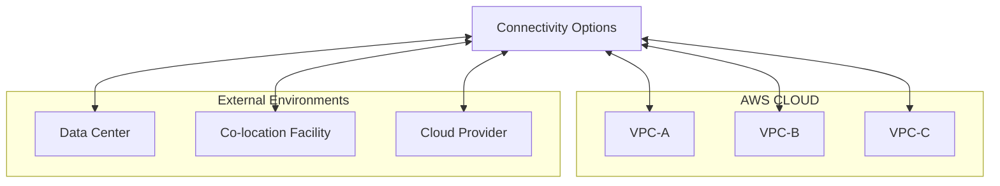

The question is:

> **How should these environments connect?**

---

# 2. First Decision: Internet or Dedicated Network?

This is the first exam decision.

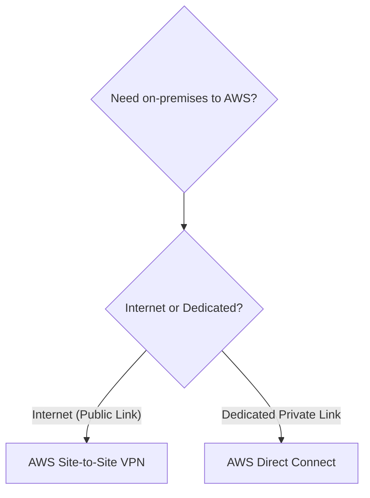

### VPN

Uses the Internet.

### Direct Connect

Uses a dedicated private connection into AWS.

---

# 3. AWS Site-to-Site VPN

Think:

> **Encrypted connectivity over the public Internet.**

Architecture:

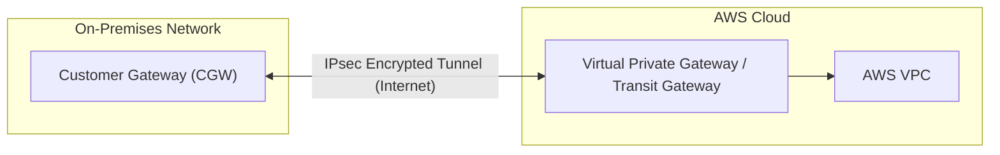

Traffic is encrypted using **IPsec VPN tunnels**.

---

# 4. When Should You Choose VPN?

VPN is attractive when you want:

* Fast deployment
* Lower upfront cost
* Encrypted connectivity
* No dedicated circuit
* Temporary connectivity
* Backup connectivity

### Exam clue

> "Quickly establish secure connectivity between on-premises and AWS."

→ **Site-to-Site VPN**

---

# 5. VPN Cost / Operational Trade-Off

Advantages:

```text
Low setup complexity
+
Lower cost
+
Fast deployment
+
Encrypted
```

Disadvantages:

```text
Internet dependency
+
Less predictable network performance
+
Potentially higher latency/jitter
```

So:

> **VPN is usually the lower-complexity and lower-cost option, but not the best choice when consistent high-performance connectivity is required.**

---

# 6. AWS Direct Connect

Think:

> **Dedicated private network connection from your environment to AWS.**

Conceptually:

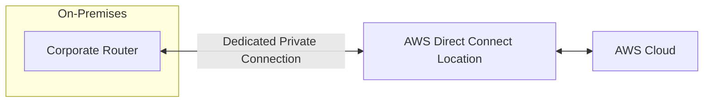

Unlike VPN:


Direct Connect does not send your traffic across the public Internet in the same way.

---

# 7. Why Direct Connect?

Choose Direct Connect when the requirements include:

* Consistent network performance
* High bandwidth
* Predictable latency
* Large data transfers
* Hybrid cloud architecture
* Long-term enterprise connectivity

### Exam clue

> "Predictable network performance"

→ **Direct Connect**

---

# 8. Direct Connect Is NOT Automatically Encrypted

Very important exam trap.

Direct Connect provides a private connection, but:

> **Direct Connect itself does not inherently encrypt your traffic.**

If encryption is required, you can use an additional VPN over the Direct Connect path in appropriate architectures.

Think:

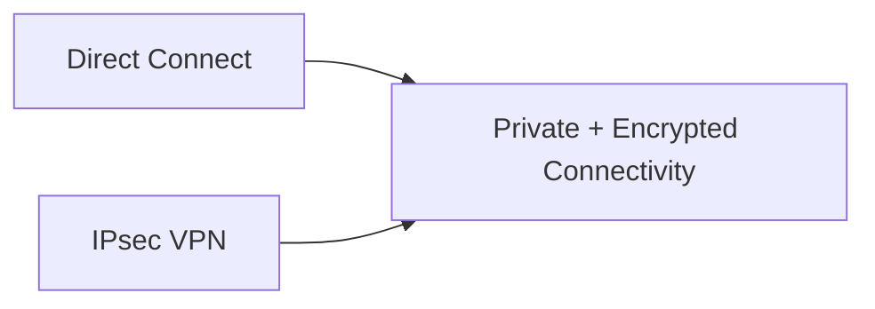

---

# 9. Direct Connect vs VPN

| Feature | Site-to-Site VPN | Direct Connect |
|---|---|---|
| Uses Internet | ✅ | ❌ |
| IPsec encryption | ✅ | ❌ by itself |
| Dedicated connection | ❌ | ✅ |
| Setup speed | Fast | Slower |
| Initial complexity | Low | Higher |
| Cost | Lower | Higher |
| Performance predictability | Lower | Higher |
| Large data transfer | Less ideal | Excellent |
| Enterprise hybrid | Good | Excellent |
| Backup connectivity | Excellent | Excellent |

### Memorize:

> **VPN = fast, cheap, encrypted**

> **Direct Connect = dedicated, predictable, high-performance**

---

# 10. Direct Connect + VPN

This is an excellent exam architecture.

Suppose:

> "The company needs predictable connectivity but also requires encryption."

Use:

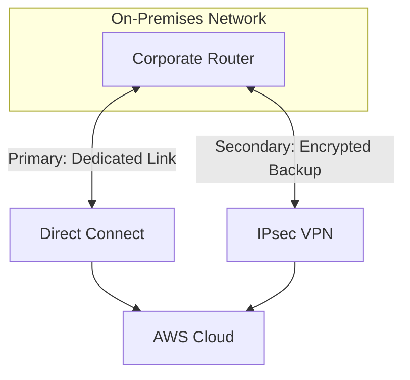

The exact architecture depends on the requirement, but the key idea is:

> **Direct Connect provides dedicated connectivity; VPN can provide encryption and/or redundancy.**

---

# 11. High Availability — Very Important

Don't design:


That's a single point of failure.

Prefer redundancy:

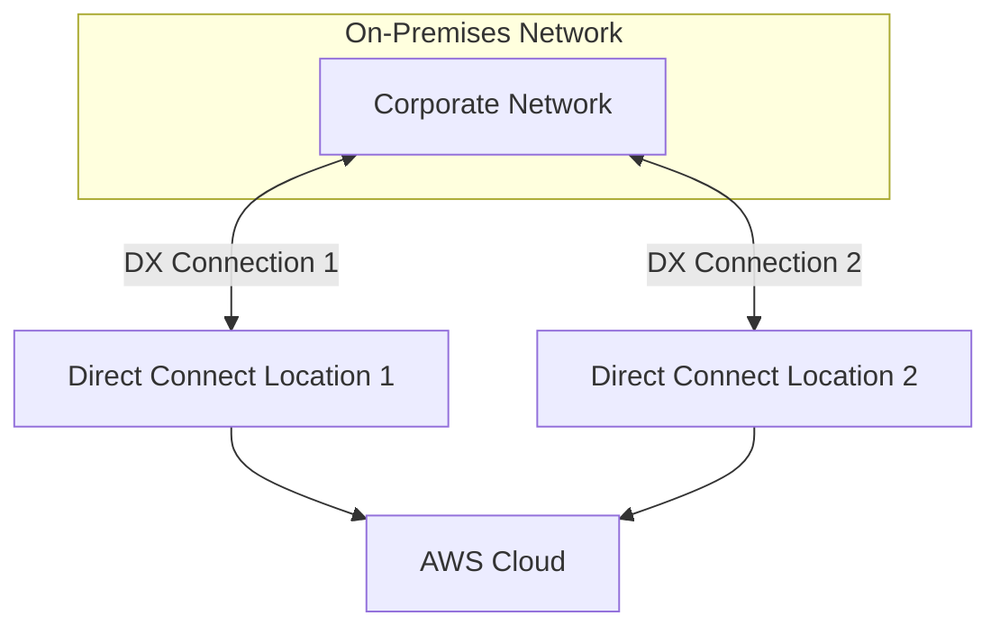

Or use different locations/paths where appropriate.

---

# 12. VPN High Availability

AWS Site-to-Site VPN provides redundant tunnels for a VPN connection.

Conceptually:

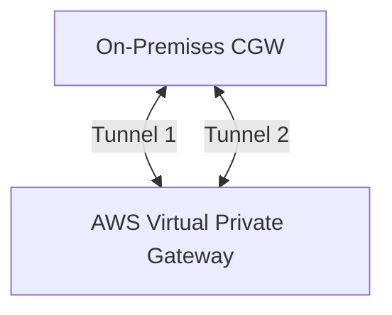

Don't think of a single VPN tunnel as your entire HA strategy.

---

# 13. Co-Location — What Does It Mean?

A co-location facility is a data center where your organization can place its own networking/equipment and connect to network providers and cloud services.

Think:

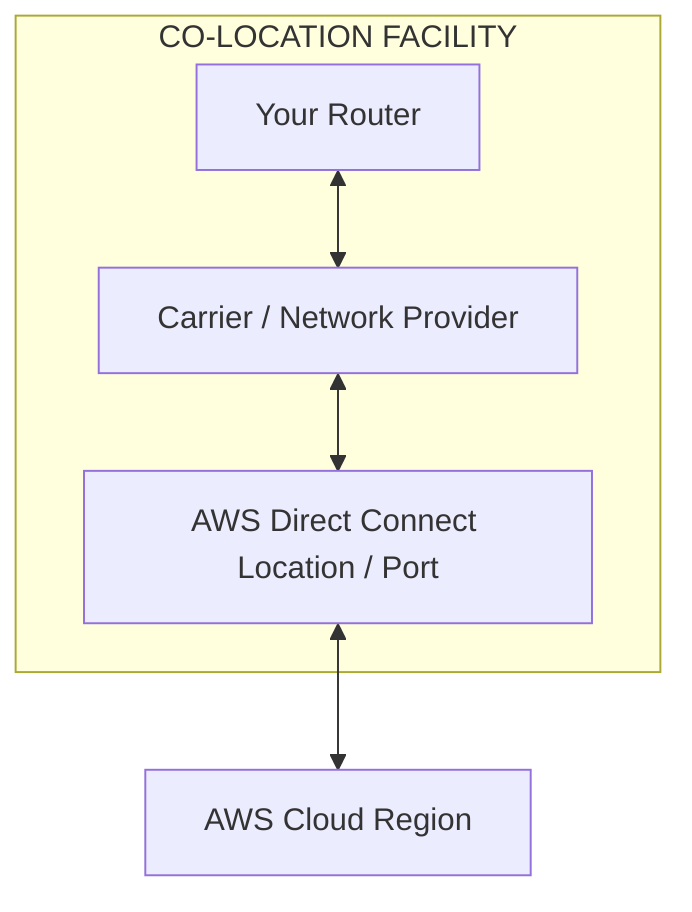

This is particularly relevant to **Direct Connect**.

---

# 14. Direct Connect and Co-Location

A common architecture:


The co-location facility can provide access to the AWS Direct Connect location.

### Exam clue

> "Company has equipment in a co-location facility and wants a dedicated private connection to AWS."

→ **Direct Connect**

---

# 15. Direct Connect Location vs Region

Another useful concept:

A Direct Connect connection is established at a **Direct Connect location**, and then connectivity is associated with AWS resources through the appropriate Direct Connect constructs.

You don't necessarily need your physical equipment to sit inside an AWS data center.

Think:


---

# 16. Direct Connect Virtual Interfaces

This is an important exam concept.

Direct Connect uses **virtual interfaces (VIFs)**.

Three useful categories:

### Private VIF

Connects to:

* VPC via Virtual Private Gateway
* Certain architectures through Direct Connect Gateway

Think:


---

### Public VIF

Used to access:

* AWS public services
* Public AWS endpoints

Think:

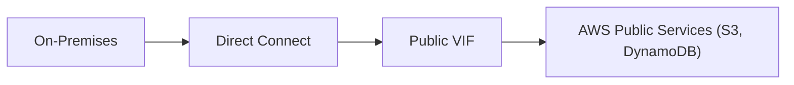

---

### Transit VIF

Used to connect through:

**Direct Connect Gateway + Transit Gateway**

Think:

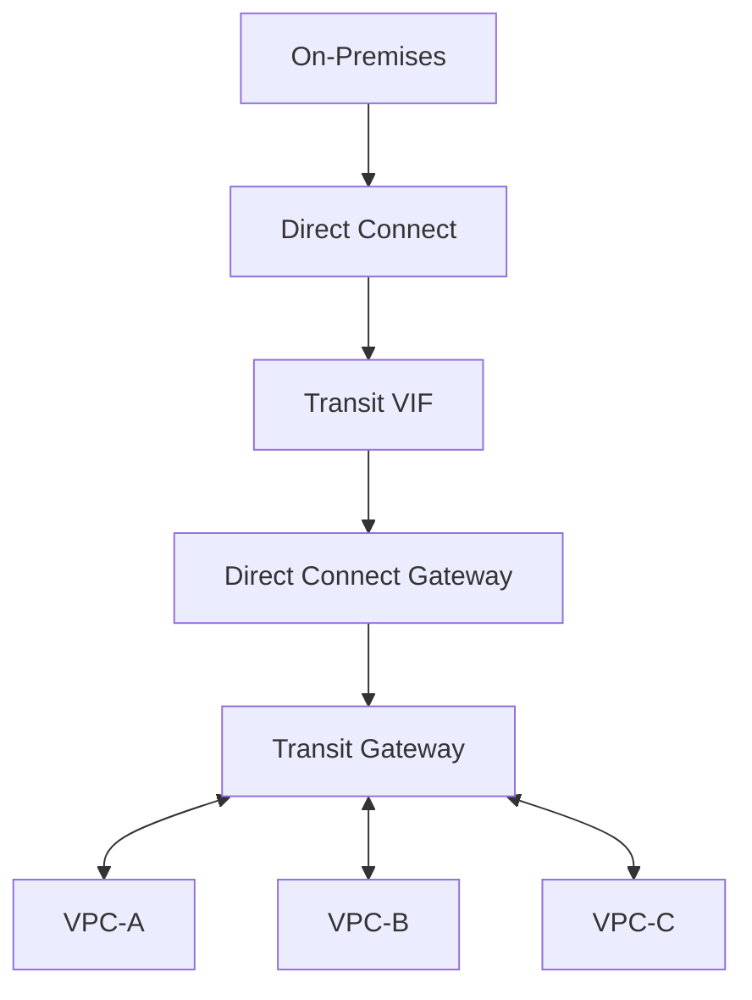

This is extremely useful for multiple VPCs.

---

# 17. Direct Connect Gateway

Suppose you have:

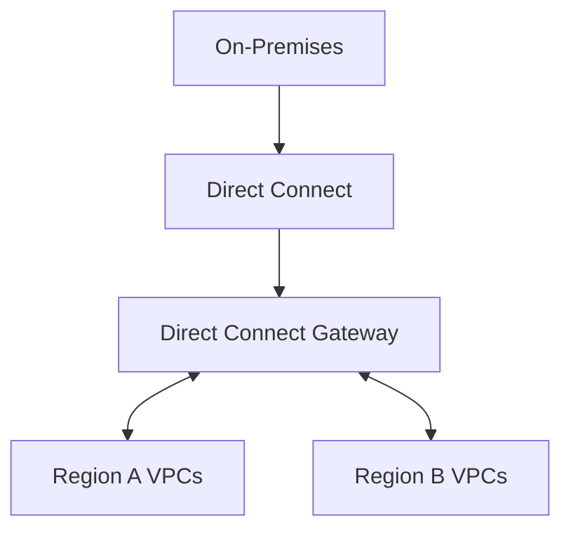

A Direct Connect Gateway helps extend Direct Connect connectivity to multiple VPC-related environments/regions through supported AWS architectures.

### Exam clue

> "One Direct Connect connection needs to reach multiple VPCs."

Think:

**Direct Connect Gateway**, often with **Transit Gateway** depending on architecture.

---

# 18. Direct Connect + Transit Gateway

This is a major enterprise pattern.

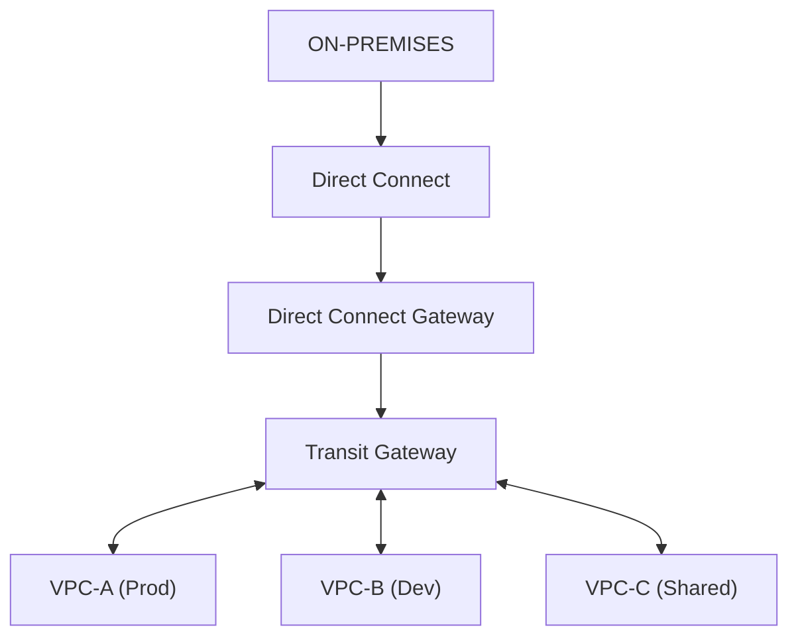

This gives you:

* Dedicated hybrid connectivity
* Centralized VPC routing
* Scalable architecture
* Lower operational complexity than managing many independent connections

---

# 19. Why Not Connect Every VPC Individually?

Imagine:

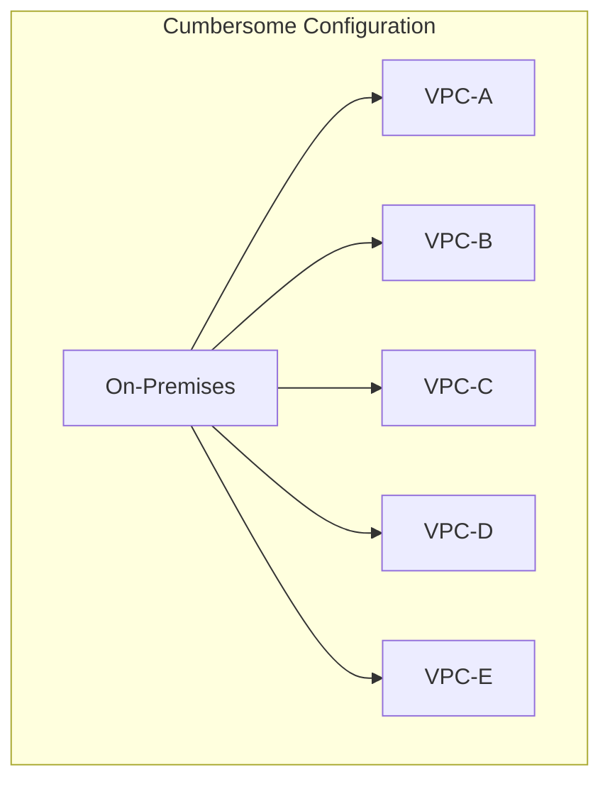

Managing separate connectivity for every VPC becomes cumbersome.

Instead:

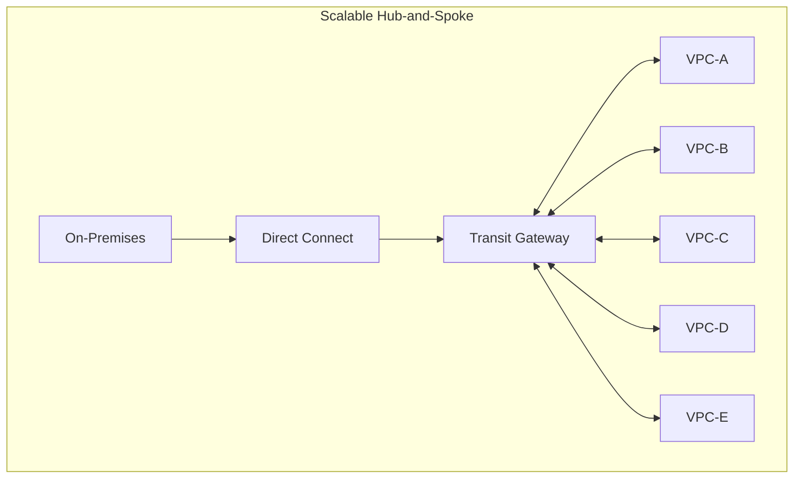

Much easier to manage.

---

# 20. Transit Gateway's Role

Important distinction:

**Direct Connect** answers:

> "How do I connect my on-premises network to AWS?"

**Transit Gateway** answers:

> "How do I route traffic between many connected networks/VPCs?"

Together:

```mermaid
flowchart TD
    OnPrem["On-Premises"] --> DX["Direct Connect"] --> TGW["Transit Gateway Hub"]
    TGW <--> VPC1["VPC 1"]
    TGW <--> VPC2["VPC 2"]
    TGW <--> VPC3["VPC 3"]
    TGW <--> VPC4["VPC 4"]
```

---

# 21. VPN + Transit Gateway

Same concept with VPN:

```mermaid
flowchart TD
    OnPrem["On-Premises"] ==>|"IPsec VPN"| TGW["Transit Gateway"]
    TGW <--> VPCA["VPC A"]
    TGW <--> VPCB["VPC B"]
    TGW <--> VPCC["VPC C"]
```

This is useful when:

* You have multiple VPCs
* You need encrypted hybrid connectivity
* You don't need a dedicated Direct Connect circuit

---

# 22. VPN vs Direct Connect — Cost Strategy

### Small / temporary workload

```text
VPN
```

Why?

```text
Low setup
Low complexity
Fast
Encrypted
```

### Large / permanent workload

```text
Direct Connect
```

Why?

```text
Predictable
High bandwidth
Consistent performance
```

### Critical enterprise workload

```text
Direct Connect
+
VPN backup
```

or redundant Direct Connect connectivity depending on requirements.

---

# 23. PrivateLink in Hybrid/Cloud Integration

PrivateLink can also appear in these questions.

Suppose:

```mermaid
flowchart LR
    VPCA["VPC-A"] --> PL["PrivateLink"] --> ServiceB["Specific Service in VPC-B"]
```

You don't need:

```text
VPC-A ↔ entire VPC-B
```

You only need:

```text
VPC-A → specific service
```

So:

> **PrivateLink = service-level integration**

---

# 24. Cloud-to-Cloud Integration

Suppose you have:

```mermaid
flowchart LR
    AWSVPC["AWS VPC-A"] <-->|"VPN / SD-WAN / Co-Lo Exchange"| OtherCloud["Other Cloud Network (Azure / GCP)"]
```

For general private connectivity to another cloud provider, common approaches include:

* Site-to-Site VPN
* Dedicated connectivity through a network provider
* Co-location / connectivity exchange
* SD-WAN/networking solutions

The exam will usually give you clues about:

* Encryption
* Dedicated connectivity
* Performance
* Cost
* Speed of deployment

---

# 25. Hybrid Connectivity Decision Tree

This is the most useful section.

```mermaid
flowchart TD
    Start{"Need Hybrid Connectivity?"} --> AskType{"On-premises to AWS?"}
    
    AskType -->|"Quick / Low-cost / Encrypted"| VPN["Site-to-Site VPN"]
    AskType -->|"Dedicated / Predictable / High-BW"| DX["Direct Connect"]

    VPN --> MultiVPC{"Multiple VPCs?"}
    DX --> MultiVPC

    MultiVPC -->|"YES"| TGW["Attach via Transit Gateway"]
    MultiVPC -->|"NO"| DirectConn["Direct Connection to VPC / VGW"]
```

So:

```mermaid
flowchart TD
    OnPrem["On-Premises"] --> Link["VPN / Direct Connect"] --> TGW["Transit Gateway"]
    TGW <--> VPCA["VPC A"]
    TGW <--> VPCB["VPC B"]
    TGW <--> VPCC["VPC C"]
```

---

# 26. Full Enterprise HLD

A very exam-friendly architecture:

```mermaid
flowchart TD
    subgraph Corporate ["CORPORATE NETWORK"]
        CorpRouter["Corporate Router"]
    end

    CorpRouter <-->|"Primary: Direct Connect"| DXGW["Direct Connect Gateway"]
    CorpRouter <-->|"Backup: IPsec VPN"| TGW

    DXGW --> TGW["Transit Gateway"]

    TGW <--> VPCA["VPC-A (Production)"]
    TGW <--> VPCB["VPC-B (Development)"]
    TGW <--> VPCC["VPC-C (Shared Services)"]
```

This is the architecture to think about when the question combines:

> **on-premises + multiple VPCs + high availability + centralized routing**

---

# 27. Add Segmentation

You can use Transit Gateway route tables to control connectivity:

```mermaid
flowchart TD
    TGW["Transit Gateway"] --> ProdRT["Production Route Table"]
    TGW --> DevRT["Dev Route Table"]
    TGW --> SharedRT["Shared Route Table"]

    ProdRT --> ProdVPC["Production VPC"]
    DevRT --> DevVPC["Dev VPC"]
    SharedRT --> SharedVPC["Shared Services VPC"]
```

Example policy:

```text
On-Prem → Prod       ✅
On-Prem → Shared     ✅
On-Prem → Dev        ✅

Prod → Dev            ❌
Dev → Prod            ❌
Prod → Shared         ✅
Dev → Shared          ✅
```

This is much more manageable than building individual connections everywhere.

---

# 28. Co-Location HLD

Suppose your company owns networking equipment in a co-location facility.

```mermaid
flowchart TD
    subgraph CoLo ["CO-LOCATION FACILITY"]
        CorpRouter["Corporate Router"] <--> Carrier["Network Provider"]
        Carrier <--> DXLocation["AWS Direct Connect Location"]
    end

    DXLocation <--> AWS["AWS Cloud"]
```

This is useful when:

* Your data center isn't physically near AWS
* You need dedicated connectivity
* A co-location provider can facilitate connectivity

---

# 29. Cost Trade-Off Matrix

| Option | Cost | Performance | Encryption | Setup | Operational overhead |
|---|--:|---|---|---|---|
| Site-to-Site VPN | Low | Variable | ✅ | Fast | Low |
| Direct Connect | Higher | Predictable | ❌ by itself | Slower | Medium |
| Direct Connect + VPN | Higher | High | ✅ | Higher | Medium |
| TGW | Additional | High | N/A | Moderate | Low at scale |
| PrivateLink | Usage-dependent | High/private | Private | Moderate | Low |
| Cloud WAN | Enterprise | High | Depends | Higher | Low relative to global scale |

---

# 30. "Minimum Workload" / Least Operational Overhead

This is the pattern you want to recognize.

### Requirement

> "Small office needs secure AWS connectivity."

Don't choose:

```text
Direct Connect
+ Transit Gateway
+ DX Gateway
```

unless the requirements justify it.

Choose:

```text
Site-to-Site VPN
```

---

### Requirement

> "Large data center transfers terabytes of data to AWS every day with predictable performance."

Think:

```text
Direct Connect
```

---

### Requirement

> "20 VPCs need to communicate with on-premises."

Think:

```mermaid
flowchart LR
    Conn["Direct Connect / VPN"] --> TGW["Transit Gateway"] --> VPCs["20 VPCs"]
```

---

### Requirement

> "Only one application API needs to be exposed to another VPC."

Think:

```text
PrivateLink
```

---

# 31. Reliability Trade-Off

For business-critical hybrid connectivity:

```text
Single connection
      ↓
Single point of failure
```

Better:

```mermaid
flowchart TD
    subgraph OnPrem ["On-Premises"]
        Corp["Corporate Network"]
    end

    Corp <-->|"Primary"| DX["Direct Connect"]
    DX --> AWS["AWS Cloud"]
    Corp <-->|"Backup"| VPN["IPsec VPN"]
    VPN --> AWS
```

Or:

```mermaid
flowchart TD
    subgraph OnPrem ["On-Premises"]
        Corp["Corporate Network"]
    end

    Corp <-->|"Link 1"| DX1["DX Connection 1"]
    DX1 --> AWS["AWS Cloud"]
    Corp <-->|"Link 2"| DX2["DX Connection 2"]
    DX2 --> AWS
```

For the exam:

> **Critical connectivity → eliminate single points of failure.**

---

# 32. Direct Connect vs VPN — What the Question Is Really Testing

When you see:

### "Low cost"

Think:

**VPN**

### "Fast setup"

Think:

**VPN**

### "Encrypted over Internet"

Think:

**VPN**

### "Dedicated connection"

Think:

**Direct Connect**

### "Predictable performance"

Think:

**Direct Connect**

### "High bandwidth"

Think:

**Direct Connect**

### "Critical hybrid architecture"

Think:

**Redundant DX and/or VPN**

---

# 33. Don't Confuse Direct Connect with Transit Gateway

This is a very common exam mistake.

### Direct Connect

```text
Connectivity technology
```

It gets you:

```text
On-Premises → AWS
```

### Transit Gateway

```text
Routing hub
```

It gets you:

```mermaid
flowchart TD
    TGW["Transit Gateway (Central Routing Hub)"] <--> VPCA["VPC-A"]
    TGW <--> VPCB["VPC-B"]
    TGW <--> VPCC["VPC-C"]
    TGW <--> OnPrem["On-Premises"]
```

So:

```mermaid
flowchart LR
    OnPrem["On-Premises"] --> DX["Direct Connect"] --> TGW["Transit Gateway"] --> VPCs["VPC-A, VPC-B, VPC-C"]
```

They solve **different layers of the problem**.

---

# 34. Direct Connect Gateway vs Transit Gateway

Think:

```text
Direct Connect Gateway
        ↓
Connect Direct Connect
to supported AWS networking resources

Transit Gateway
        ↓
Centralized routing
between VPCs/networks
```

In an enterprise architecture they can work together:

```mermaid
flowchart LR
    OnPrem["On-Prem"] --> DX["Direct Connect"] --> DXGW["Direct Connect Gateway"] --> TGW["Transit Gateway"] --> VPCs["VPC-A, VPC-B, VPC-C"]
```

---

# 35. Final Exam Decision Tree

Memorize this:

```mermaid
flowchart TD
    Start["ON-PREM to AWS"] --> Priority{"What is the priority?"}
    
    Priority -->|"Cheap + Fast Setup"| VPN["Site-to-Site VPN"]
    Priority -->|"Dedicated + Predictable"| DX["Direct Connect"]

    DX --> MultiVPC{"Multiple VPCs?"}
    MultiVPC -->|"YES"| TGW["Transit Gateway"]
    MultiVPC -->|"NO"| VGW["VGW / Single VPC"]
```

Then:

```mermaid
flowchart TD
    Specific{"Specific service only?"} -->|"YES"| PL["PrivateLink"]
```

And:

```mermaid
flowchart TD
    Global{"Global enterprise network?"} -->|"YES"| WAN["AWS Cloud WAN"]
```

---

# 🧠 Final AWS Exam Cheat Sheet

| If the question says... | Think... |
|---|---|
| **Quick connectivity** | VPN |
| **Low-cost hybrid connectivity** | VPN |
| **Encrypted connectivity over Internet** | VPN |
| **Dedicated connection** | Direct Connect |
| **Predictable performance** | Direct Connect |
| **High bandwidth / large data transfer** | Direct Connect |
| **Co-location** | Direct Connect |
| **Multiple VPCs + on-prem** | Transit Gateway |
| **Centralized routing** | Transit Gateway |
| **Transitive routing** | Transit Gateway |
| **Direct Connect to multiple VPCs** | DX Gateway + TGW architecture |
| **Specific service only** | PrivateLink |
| **Global enterprise network** | Cloud WAN |
| **High availability** | Redundant connectivity |
| **VPN backup for DX** | DX + VPN |
| **Audit AWS API actions** | CloudTrail |
| **Monitor network traffic** | Flow Logs |

---

## 🔒 Encrypting AWS Direct Connect Traffic via IPsec VPN over Direct Connect (Public VIF Requirement)

AWS Direct Connect provides dedicated private physical connectivity, but **traffic flowing over Direct Connect is UNENCRYPTED by default**. To comply with financial/regulatory compliance mandates requiring end-to-end encryption while preserving Direct Connect's consistent low latency and predictable performance, you must build an **IPsec VPN tunnel OVER the Direct Connect circuit**:

```mermaid
flowchart TD
    subgraph CorporateOnPrem["On-Premises Data Center / Financial Firm"]
        Laptops["Employee Laptops / Desktops"]
        CustomerRouter["On-Premises Edge Router (Customer Gateway)"]
        Laptops ==> CustomerRouter
    end

    subgraph DirectConnectPath["AWS Direct Connect Circuit (Dedicated Fiber)"]
        PublicVIF["Direct Connect Public Virtual Interface (Public VIF)<br/>(Advertises AWS Public IP Prefixes via BGP)"]
    end

    subgraph AWSCloud["AWS VPC Environment"]
        VGW["Virtual Private Gateway (VGW) / Transit Gateway (TGW)<br/>(Public IP VPN Endpoint)"]
        VPNTunnels["IPsec BGP VPN Tunnels<br/>(256-bit AES Encrypted Payload over DX)"]
        PrivateEC2["Private Subnet EC2 Instances<br/>(Legacy Financial Brokerage App)"]

        VGW ==> VPNTunnels ==> PrivateEC2
    end

    CustomerRouter ==>|"1. BGP Peering over Public VIF"| PublicVIF
    PublicVIF ==>|"2. IPsec VPN Tunnel Traffic over DX Fiber"| VGW

    style CorporateOnPrem fill:#fff3cd,stroke:#ffc107,stroke-width:1px;
    style DirectConnectPath fill:#d1ecf1,stroke:#17a2b8,stroke-width:1px;
    style AWSCloud fill:#d4edda,stroke:#28a745,stroke-width:2px;
```

### Why Public VIF is MANDATORY for VPN over Direct Connect:
1. **Public IP Reachability**: AWS Site-to-Site VPN endpoints (on VGW or Transit Gateway) present **public IP addresses**.
2. **Private VIF Incompatibility**: A **Private VIF** only advertises private IP ranges (`10.0.0.0/8`, etc.) within specific VPCs. It **cannot reach** AWS public service endpoints or AWS public VPN endpoints.
3. **Public VIF Mechanism**: A **Public VIF** advertises AWS public IP addresses to your on-premises customer gateway router over BGP. This allows your router to establish IPsec VPN tunnels directly to the AWS public VPN endpoints **over the private Direct Connect fiber**, guaranteeing both **256-bit AES IPsec encryption** AND **consistent Direct Connect performance**.

---

## 🔒 Real-World Exam Scenario: Encrypting Financial Brokerage Traffic over Direct Connect

- **Scenario**: A stocks brokerage firm hosts a legacy application on EC2 in a private VPC subnet. Employees access the app from corporate laptops via Direct Connect. Financial regulatory compliance mandates **encrypting all network traffic from employee laptops to VPC resources**. The solution must maintain Direct Connect's consistent network performance. What is the correct solution?
- **Architecture Solution**:
  1. Using the current Direct Connect connection, create a **Public Virtual Interface (Public VIF)** and input the network prefixes to advertise via BGP.
  2. Create a new **Site-to-Site VPN connection to the VPC using the BGP protocol OVER the Direct Connect connection**.
  3. Configure the company network to route employee traffic to this VPN tunnel across the Direct Connect circuit.

### Why Distractor Options Fail:
- *Using Private VIF for VPN over Direct Connect*: Private VIFs only connect to private VPC IP addresses. AWS VPN endpoints are public IP endpoints, so an IPsec VPN tunnel **CANNOT be established over a Private VIF**.
- *Site-to-Site VPN Connection over the Internet*: Routing VPN traffic over the public internet suffers from variable latency, packet loss, and internet routing jitter, failing the requirement to **maintain the consistent network performance of Direct Connect**.

---

## 🔒 Direct Connect Resiliency & Backup Architecture Patterns

When designing hybrid connectivity redundancy to eliminate single points of failure (SPOF), choose the pattern based on **Cost vs. SLA Resiliency**:

```mermaid
flowchart TD
    subgraph HighAvailability["Pattern 1: Maximum Resiliency / High Availability (99.99% SLA)"]
        DX1["Primary DX Location<br/>(1 Gbps / 10 Gbps DX Connection)"]
        DX2["Secondary DX Location<br/>(1 Gbps / 10 Gbps DX Connection)"]
        NoteHA["⚡ Highest Cost: Pays recurring monthly port charges for 2 DX dedicated circuits."]
    end

    subgraph CostEffective["Pattern 2: Cost-Effective Backup for Direct Connect (Cost-Constrained)"]
        DX_Pri["Primary Direct Connect Connection<br/>(High Throughput / Low Latency)"]
        VPN_Bak["AWS Site-to-Site VPN Tunnels over Public Internet<br/>(Terminates on VGW / TGW with BGP Dynamic Routing)"]
        NoteCost["💰 Most Cost-Effective: VPN handles failover without paying for an idle 2nd DX circuit."]
    end

    style HighAvailability fill:#fff3cd,stroke:#ffc107,stroke-width:1px
    style CostEffective fill:#d4edda,stroke:#28a745,stroke-width:2px
```

### Hybrid Connection Redundancy Comparison Matrix

| Redundancy Strategy | Primary Link | Backup Link | Cost Level | SLA / Throughput | Primary Use Case |
| :--- | :--- | :--- | :--- | :--- | :--- |
| **Cost-Effective Backup (DX + VPN)** | 1x AWS Direct Connect | **AWS Site-to-Site VPN over Internet** | **Lowest** | Failover bandwidth limited to VPN capacity | **Tight budget constraint / Cost-effective SPOF fix** |
| **High Availability DX (2x DX)** | 1x AWS Direct Connect (Location 1) | 1x AWS Direct Connect (Location 2) | Highest | Full DX bandwidth guaranteed on failover ($99.99\%$) | Mission-critical enterprise workloads |
| **Encrypted DX (VPN over Public VIF)**| 1x AWS Direct Connect | IPsec VPN over **Public VIF** | Medium | Encrypted payload + DX performance | **Financial compliance / Sensitive encrypted DX** |

---

## 🔒 Real-World Exam Scenario: Cost-Effective Direct Connect Backup for 10 VPCs

- **Scenario**: An investment bank connects 10 VPCs to its on-premises data center via a single 1 Gbps AWS Direct Connect connection. An IT audit flags this single connection as a single point of failure (SPOF). The company requires the **MOST cost-effective solution** to eliminate the SPOF and evaluate AWS VPN as a potential backup.
- **Architecture Solution**:
  1. Establish **AWS Site-to-Site VPN tunnels** from the on-premises data center to each of the 10 VPCs (terminating on Virtual Private Gateways - VGW, or Transit Gateway).
  2. Configure **Border Gateway Protocol (BGP)** for dynamic failover route management.
- **Why Distractor Options Fail**:
  - *Establishing a 2nd 1 Gbps Direct Connect Connection*: Ordering a 2nd dedicated 1 Gbps Direct Connect circuit provides high availability, BUT it is **NOT cost-effective** (requires expensive recurring monthly port hours and cross-connect fees for a backup circuit that sits idle).
  - *Establishing a 2nd Direct Connect with Public VIF for VPN*: Requires ordering a 2nd Direct Connect circuit, which incurs high DX port charges and fails the cost-effectiveness requirement.
  - *Point-to-Point MPLS Connection directly to VPCs*: AWS VPCs do not natively terminate MPLS lines directly. Connecting MPLS requires a colocation setup with Direct Connect cross-connects, making it invalid for direct VPC termination.

---

## 🔒 AWS Direct Connect Gateway for Inter-Region VPC Access

When an on-premises network requires dedicated private connectivity to multiple VPCs located across **different AWS Regions**, **AWS Direct Connect Gateway** eliminates complex BGP routing setups and full-mesh VPC peering overhead:

```mermaid
flowchart TD
    subgraph OnPremises["On-Premises Central Office (Washington, D.C.)"]
        CorpNetwork["Central Corporate Network"]
    end

    subgraph DirectConnectLayer["AWS Direct Connect Layer"]
        DXLink["AWS Direct Connect Connection<br/>(Dedicated Private Fiber)"]
        PrivateVIF["Private Virtual Interface (Private VIF)<br/>(Attaches to Direct Connect Gateway)"]
        
        CorpNetwork ==> DXLink ==> PrivateVIF
    end

    subgraph DXGWLayer["AWS Centralized Routing Layer"]
        DXGW["AWS Direct Connect Gateway<br/>(Global Resource — Connects Multi-Region VPCs)"]
        PrivateVIF ==> DXGW
    end

    subgraph MultiRegionVPCs["Multi-Region AWS VPC Environment"]
        VGW_East["Virtual Private Gateway (VGW)<br/>VPC-East (Region 1: us-east-1)"]
        VGW_West["Virtual Private Gateway (VGW)<br/>VPC-West (Region 2: us-west-2)"]
        VGW_Central["Virtual Private Gateway (VGW)<br/>VPC-Central (Region 3: us-east-2)"]

        DXGW ==> VGW_East
        DXGW ==> VGW_West
        DXGW ==> VGW_Central
    end

    classDef onprem fill:#fff3cd,stroke:#ffc107,stroke-width:1px;
    classDef dx fill:#d1ecf1,stroke:#17a2b8,stroke-width:1px;
    classDef dxgw fill:#7950f2,stroke:#5f3dc4,color:#ffffff;
    classDef vpc fill:#d4edda,stroke:#28a745,stroke-width:2px;

    class CorpNetwork onprem;
    class DXLink,PrivateVIF dx;
    class DXGW dxgw;
    class VGW_East,VGW_West,VGW_Central vpc;
```

### Key Technical Rationale:
1. **Direct Connect Gateway for Inter-Region Access**: A Direct Connect Gateway is a global AWS resource. Associating a Direct Connect Gateway with Virtual Private Gateways (VGWs) in different AWS Regions enables direct, private, inter-region VPC access over a single Direct Connect connection.
2. **Private VIF for VPC Resources**: **Private Virtual Interfaces (Private VIFs)** are mandatory when connecting to private VPC IP resources (EC2, RDS, private subnets) via VGWs or Direct Connect Gateways.
3. **Low Operational Management Overhead**: Eliminates the need to maintain multiple BGP sessions per VPC or configure complex inter-region VPC peering meshes.

---

## 🔒 Real-World Exam Scenario: Multi-Data Center Hybrid VPN High Availability (Second Customer Gateway vs. Multiple VGWs & NAT Gateway Traps)

- **Scenario**: A major aerospace company extends two existing on-premises data centers into an AWS VPC to support a flight-tracking service. The application relies on resources in both data centers and S3. Currently, a single dual-tunnel Site-to-Site VPN connects a Customer Gateway (CGW) in one data center to a Virtual Private Gateway (VGW) attached to the VPC. What component represents a single point of failure (SPOF) and how should the architecture be updated to maximize high availability?
- **Architecture Solution**:
  - Create **another Customer Gateway (CGW)** representing a VPN appliance in the second on-premises data center.
  - Set up **another dual-tunnel Site-to-Site VPN connection** to the **SAME existing Virtual Private Gateway (VGW)** attached to the VPC.

```mermaid
flowchart TD
    subgraph OnPremisesDataCenters ["1. Multi-Data Center On-Premises Tier"]
        subgraph DC1 ["Data Center 1"]
            CGW1["Customer Gateway 1 (CGW 1)<br/>(Primary VPN Appliance)"]
        end

        subgraph DC2 ["Data Center 2"]
            CGW2["Customer Gateway 2 (CGW 2)<br/>(Secondary Redundant CGW - Fixes SPOF!)"]
        end
    end

    subgraph AWSCloudVPC ["2. AWS Cloud VPC Tier (Strict 1 VGW Limit per VPC)"]
        VGW["Virtual Private Gateway (VGW)<br/>🔒 Single VGW Attached to VPC<br/>(Managed Multi-AZ HA Concentrator)"]
        VPCResources["VPC Subnets & Application Resources"]

        VGW <==> VPCResources
    end

    CGW1 <==|"Dual IPsec Tunnel Connection 1"==> VGW
    CGW2 <==|"Dual IPsec Tunnel Connection 2"==> VGW

    classDef cgw fill:#fff3cd,stroke:#ffc107,stroke-width:1px;
    classDef vgw fill:#7950f2,stroke:#5f3dc4,color:#ffffff;

    class CGW1,CGW2 cgw;
    class VGW,VPCResources vgw;
```

### Key Technical Rationale:
1. **Hard Limit: Exactly 1 Virtual Private Gateway (VGW) per VPC**:
   - A VPC can **ONLY have ONE Virtual Private Gateway (VGW)** attached to it at any given time.
   - The VGW on the AWS side is already an AWS-managed, highly available endpoint spanning multiple Availability Zones internally with dual active IPsec tunnels.
2. **Customer Gateway (CGW) as the On-Premises SPOF**:
   - The single Customer Gateway device (or single physical data center) is the single point of failure.
   - To build a fault-tolerant multi-data center hybrid network, deploy a **second Customer Gateway (CGW)** in the second data center and establish a second dual-tunnel Site-to-Site VPN connection to the **existing VGW**.

### Why Distractor Options Fail:
- *Create a Second Virtual Gateway in a Different AZ (Your Selection)*:
  - **Hard Quota Constraint Violation**: A VPC **CANNOT have more than one VGW** attached! Attempting to attach a second VGW to a VPC will result in an immediate AWS API configuration failure.
- *Create a Second VGW + Second CGW*:
  - **Violates 1 VGW Limit**: Again, you cannot attach two VGWs to the same VPC. Multiple CGWs connect to the *same* VGW.
- *Set up a NAT Gateway in a different data center*:
  - **Service Misuse**: AWS NAT Gateways are managed cloud components deployed inside AWS VPC subnets for outbound IPv4 internet access from private subnets. NAT Gateways **CANNOT** be deployed inside an on-premises data center!

---


## 🔒 Real-World Exam Scenario: High-Performance Real-Time Stock Market Data Ingestion & WebSockets Pipeline (Direct Connect + KPL + API Gateway WebSocket API vs. VPN, KCL & AppSync Traps — Select THREE)

- **Scenario**: An insurance company ingests raw stock market feeds on-premises into an internal Apache Kafka cluster. Management wants to stream the cluster's output to AWS to serve a critical web application requiring **consistent high-performance network connectivity**. What THREE actions should the solutions architect implement?
- **Architecture Solutions (Select THREE)**:
  1. **Dedicated Network Connectivity**: Request an **AWS Direct Connect** connection from the on-premises data center to the AWS VPC to provide consistent, low-latency, private network performance.
  2. **Streaming Data Producer**: Pull messages from the on-premises Apache Kafka cluster using a fleet of Amazon EC2 instances in an Auto Scaling Group, and push data into an **Amazon Kinesis Data Stream** using the **Kinesis Producer Library (KPL)**.
  3. **Bidirectional Client Delivery Pipeline**: Write an **AWS Lambda function** to process the Kinesis Data Stream, create a **WebSocket API in Amazon API Gateway** to invoke the function, and send callback messages to connected clients using the `@connections` API command.

```mermaid
flowchart TD
    subgraph OnPremises ["1. On-Premises Data Center Tier"]
        Kafka["Apache Kafka Cluster<br/>(Raw Stock Market Feeds)"]
    end

    subgraph Connectivity ["2. Network Connectivity Tier"]
        DX["AWS Direct Connect<br/>🌐 Dedicated Private Connection<br/>(Consistent High-Performance Network)"]
        Kafka ==>|"Stream Messages over DX"| DX
    end

    subgraph AWS_Ingestion ["3. AWS Stream Ingestion Tier"]
        EC2_ASG["EC2 Auto Scaling Group Fleet<br/>⚡ Executes Kinesis Producer Library (KPL)"]
        Kinesis["Amazon Kinesis Data Streams<br/>📦 Near-Real-Time Stream Buffer"]

        DX ==> EC2_ASG ==>|"KPL PutRecords"| Kinesis
    end

    subgraph DeliveryTier ["4. Serverless WebSockets Delivery Tier"]
        Lambda["AWS Lambda Function"]
        APIGW["Amazon API Gateway WebSocket API<br/>⚡ Bidirectional Client Connection<br/>(@connections Command Callbacks)"]
        Clients["Web Application Clients"]

        Kinesis ==>|"Event Source Mapping"| Lambda ==> APIGW ==>|"Push Updates"| Clients
    end

    classDef onprem fill:#fff3cd,stroke:#ffc107,stroke-width:1px;
    classDef dx fill:#7950f2,stroke:#5f3dc4,color:#ffffff;
    classDef aws fill:#2b8a3e,stroke:#1e632b,color:#ffffff;

    class Kafka onprem;
    class DX dx;
    class EC2_ASG,Kinesis,Lambda,APIGW aws;
```

### Key Technical Rationale:
1. **AWS Direct Connect for Consistent Performance**:
   - Site-to-Site VPN routes over the public Internet, exposing traffic to variable latency, packet loss, and ISP congestion. To guarantee consistent high-performance network throughput for a critical financial application, **AWS Direct Connect** is required.
2. **Kinesis Producer Library (KPL) for Stream Ingestion**:
   - The **Kinesis Producer Library (KPL)** is designed for pushing/writing records into Kinesis Data Streams efficiently with automatic batching and retry logic.
3. **API Gateway WebSocket APIs + `@connections` Callback**:
   - API Gateway WebSocket APIs support full bidirectional communication. Backend Lambda functions use the `@connections` API endpoint (`@connections.postToConnection`) to push real-time stock updates directly to connected web clients.

### Why Distractor Options Fail:
- *Site-to-Site VPN for Consistent Performance (Your Selection)*:
  - **Public Internet Overhead**: Site-to-Site VPN routes traffic over the public Internet. VPN does NOT provide consistent or predictable network performance.
- *Using Kinesis Consumer Library (KCL) to send data INTO Kinesis*:
  - **Producer vs. Consumer Failure**: The **Kinesis Consumer Library (KCL)** is used for *reading/consuming* records out of a Kinesis stream, NOT for writing records into a stream!
- *Using AWS AppSync GraphQL API with `@connections` command*:
  - **Wrong API Service**: The `@connections` callback API is a feature of **Amazon API Gateway WebSocket APIs**, NOT AWS AppSync GraphQL.

---


## 🔒 Real-World Exam Scenario: Inter-Region Multi-VPC Dedicated Connectivity for Government Agency

- **Scenario**: A government agency has multiple VPCs in various US AWS regions that must connect to an on-premises central office network in Washington, D.C. The central office requires inter-region VPC access over a dedicated private network with predictable performance and minimal management overhead. What is the most secure and effective solution?
- **Architecture Solution**:
  - Utilize **AWS Direct Connect Gateway** for inter-region VPC access. Create a **Virtual Private Gateway (VGW)** in each VPC, then create a **Private Virtual Interface (Private VIF)** for each AWS Direct Connect connection to the Direct Connect Gateway.

### Why Distractor Options Fail:
- *LAG with Public Virtual Interfaces (Your Selection)*:
  - **Public Virtual Interfaces (Public VIFs)** are for accessing public AWS endpoints (S3, DynamoDB, public APIs). Public VIFs **CANNOT** connect to Virtual Private Gateways (VGWs) or Direct Connect Gateways to reach private VPC resources.
  - A **Link Aggregation Group (LAG)** aggregates multiple physical Direct Connect ports at the same location for higher bandwidth; it is irrelevant to multi-region VPC routing.
- *Inter-Region VPC Peering alone*: Inter-Region VPC Peering connects VPC-to-VPC across regions; it does NOT connect an on-premises data center to multi-region VPCs over a dedicated private connection. Establishing a full mesh VPC peering network creates massive operational management overhead.
- *AWS Transit Gateway + Site-to-Site VPN*: Site-to-Site VPN routes over the public internet, failing the requirement for a **dedicated private network connection with predictable performance** (Direct Connect).

---

## 36.15 Real-World Exam Scenario 15: Pre-Production Web Server Isolation & SSL VPN Remote Access (SSL VPN Client + Private Subnet EC2 vs. Public Subnet Placement, Direct Connect & IPsec Traps)

- **Scenario**: A company has recently finished developing a web application hosted on an EC2 instance that will soon enter production. A final test run must be conducted accessible exclusively by internal employees (from the corporate network or remotely over the Internet). Management mandates that the EC2 instance hosting the application server MUST NOT be exposed to the Internet. What is the recommended architecture implementation?
- **Architecture Solution**:
  - Create a **private subnet** in the VPC and place the application server EC2 instances inside it (preventing direct internet exposure).
  - Configure an **SSL VPN (or AWS Client VPN)** on a public subnet of the VPC.
  - Install **SSL VPN client software** on all employee workstations to allow secure, authenticated access to the private subnet application server from anywhere over the Internet.

```mermaid
flowchart TD
    subgraph EmployeeClients ["1. Employee Workstations Tier (Corporate & Remote Internet)"]
        Workstation["Employee Laptops / PCs<br/>💻 Installed with SSL VPN Client Software"]
    end

    subgraph PublicSubnetTier ["2. VPC Public Subnet Tier"]
        SSLVPN["SSL VPN Endpoint<br/>🔒 Authenticates Employee Connections over Internet"]

        Workstation ==>|"Encrypted Tunnel over Public Internet"| SSLVPN
    end

    subgraph PrivateSubnetTier ["3. VPC Private Subnet Tier (Isolated Application Server)"]
        AppEC2["Application EC2 Instance<br/>🚫 NO Public IP & NO Direct Internet Route!<br/>(Protected from internet exposure)"]

        SSLVPN ==>|"Internal VPC Route"| AppEC2
    end

    classDef emp fill:#fff3cd,stroke:#ffc107,stroke-width:1px;
    classDef vpn fill:#7950f2,stroke:#5f3dc4,color:#ffffff;
    classDef private fill:#2b8a3e,stroke:#1e632b,color:#ffffff;

    class Workstation emp;
    class SSLVPN vpn;
    class AppEC2 private;
```

### Key Technical Rationale:
1. **Private Subnet Placement for Server Isolation**:
   - Placing application server EC2 instances in a **private subnet** ensures they lack public IPv4 addresses and direct routes to an Internet Gateway (`0.0.0.0/0`), fully satisfying the requirement that the servers are not exposed to the Internet.
2. **SSL VPN / AWS Client VPN for Remote Employee Access**:
   - SSL VPN client software installed on employee devices allows remote employees working from home or traveling to establish an encrypted TLS tunnel over the public internet to an SSL VPN endpoint in the public subnet, granting them access to private VPC resources.

### Why Distractor Options Fail:
- *Placing Application Servers in a Public Subnet (Your Selection)*:
  - **Violates Mandatory Security Requirement**: Placing application servers in a public subnet assigns them public IPs and direct internet routes, directly violating the explicit constraint that *"the EC2 instance hosting the application server will not be exposed to the Internet."*
- *Using AWS Direct Connect for Individual Employee Workstations*:
  - **Prohibitive Cost & Circuit Misuse**: AWS Direct Connect requires a physical dedicated telecommunications link from an on-premises data center or co-location facility to AWS (taking weeks/months and costing thousands/mo). Individual remote employee laptops operating over public Wi-Fi cannot connect to a Direct Connect circuit.
- *Elastic Load Balancer in Public Subnet with Public Subnet EC2*:
  - Leaves the underlying application servers deployed in a public subnet, exposing them directly to internet traffic and violating server isolation.

---

## 🏆 The mental model


Think of the architecture as **three separate questions**:

```mermaid
flowchart TD
    Q1{"1. HOW DO I GET INTO AWS?"}
    Q1 --> VPN["Site-to-Site VPN"]
    Q1 --> DX["Direct Connect"]

    Q2{"2. HOW DO I REACH MANY VPCS?"} --> TGW["Transit Gateway"]

    Q3{"3. DO I NEED THE WHOLE NETWORK?"}
    Q3 -->|"YES"| TGW_Peer["TGW / Peering"]
    Q3 -->|"NO"| PrivateLink["PrivateLink"]
```

And the **exam trade-off hierarchy** is:

> **VPN → cheapest/quickest/operationally simple**  
> **Direct Connect → dedicated/predictable/high bandwidth**  
> **DX Gateway + Private VIF → multi-region VPC access over dedicated DX**  
> **Public VIF → access public AWS services (S3) or VPN over DX (NOT for private VPC VGWs!)**  
> **DX + VPN Backup → most cost-effective hybrid redundancy (SPOF fix)**  
> **Dual DX Locations → maximum enterprise SLA resiliency (99.99%)**  
> **Transit Gateway → scalable centralized routing**  
> **PrivateLink → least-privilege service-level connectivity**  
> **Cloud WAN → large-scale global network management**  

That distinction—**connectivity path vs routing hub vs service-level connectivity**—is the key to solving most AWS hybrid connectivity questions.