# AWS — Selecting Regions & Availability Zones Based on Network and Latency Requirements

For the AWS exam, this topic is really testing whether you can choose the **right AWS Region, Availability Zone, and network architecture** based on:

* User location
* Application latency
* Data residency
* Availability requirements
* Disaster recovery
* Cost
* Inter-region networking
* Data transfer
* Service availability
* Operational overhead

The core mental model is:

> **Region = geographic location / data residency / major isolation boundary**  
> **AZ = isolated infrastructure location inside a Region / high availability**  
> **Edge Location = bring content closer to users / low-latency delivery**

---

# 1. First Understand the Hierarchy

Think:

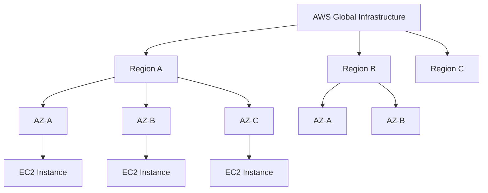

### Region

A geographic AWS location containing multiple Availability Zones.

### Availability Zone

A physically separate infrastructure location within an AWS Region.

### Edge Location

Used by services such as CloudFront to bring content closer to users.

---

# 2. Region vs Availability Zone

This distinction is extremely important.

### Region

Think:

> **Where geographically should my application/data live?**

### AZ

Think:

> **How do I make my application highly available within that Region?**

Example:

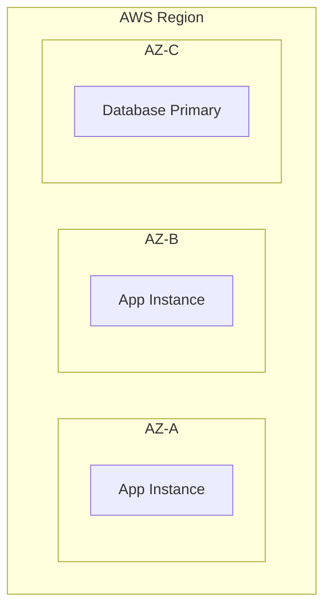

---

# 3. User Latency Determines Region Selection

Suppose your users are primarily in India.

You generally want to evaluate AWS Regions geographically close to those users.

Conceptually:

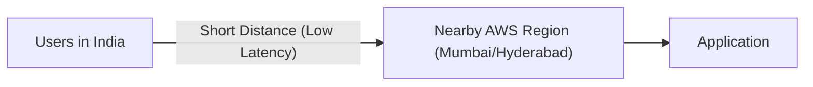

Instead of:

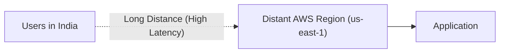

Why?

Longer physical distance generally means:

* Higher network latency
* Potentially worse user experience
* More variable network performance

### Exam clue

> "Minimize latency for users in a particular geographic area."

Think:

> **Choose a geographically appropriate AWS Region.**

---

# 4. But Don't Choose a Region Based Only on Distance

This is a classic exam trap.

Region selection also depends on:

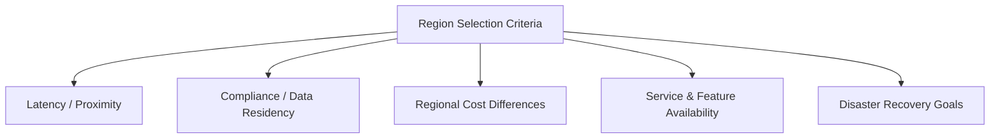

So the nearest Region is **not automatically the correct Region**.

---

# 5. Data Residency

Suppose the requirement says:

> "Customer data must remain within a specific country."

Then:

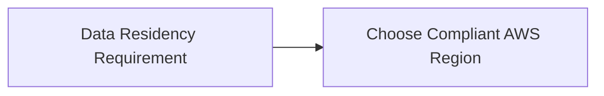

Even if another Region provides slightly better latency, compliance may take priority.

### Exam priority

When the question explicitly says:

> "Data must remain in X country"

Treat that as a hard architectural constraint.

---

# 6. Service Availability

Not every AWS service or feature is available identically in every Region.

Suppose:

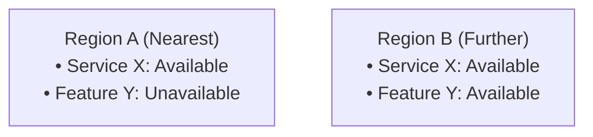

You may need to choose Region B even if Region A is geographically closer.

### Exam clue

> "The required AWS service/feature is unavailable in the closest Region."

→ Select another supported Region.

---

# 7. Cost Matters Too

AWS pricing can differ by Region.

For example:

```text
Region A
EC2 → $X

Region B
EC2 → $Y
```

Also consider:

* Data transfer
* NAT Gateway
* Load Balancer
* Storage
* Inter-region traffic
* Direct Connect
* CloudFront
* Other regional services

Therefore:

> **Region selection is an architectural decision, not merely a latency decision.**

---

# 8. Availability Zones — Why Multiple AZs?

Suppose you deploy everything in one AZ:

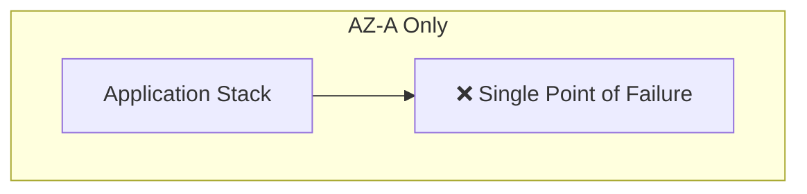

If AZ-A has an infrastructure problem:

```text
AZ-A
  ↓
Failure
  ↓
Application unavailable
```

Instead:

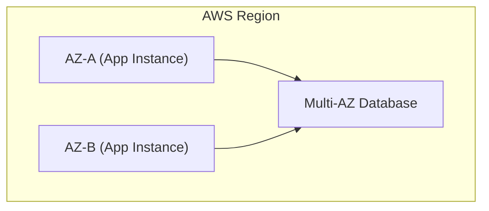

Now the application can survive an AZ failure if designed correctly.

---

# 9. AZs Are the HA Building Blocks

The exam mental model:

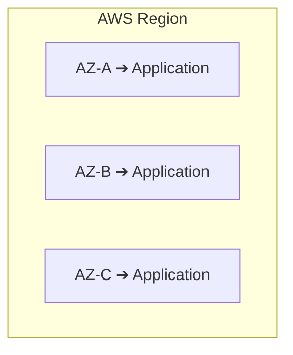

Use multiple AZs when you need:

> **High availability and resilience against an AZ-level failure.**

---

# 10. Region vs AZ Failure

Think of failure boundaries:

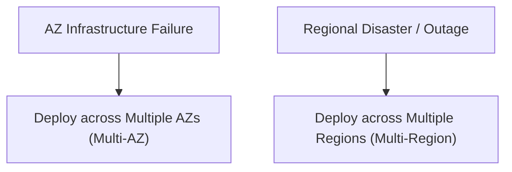

So:

> **Multi-AZ protects against AZ failure.**

> **Multi-Region protects against regional failure.**

---

# 11. Multi-AZ Architecture

A standard HLD:

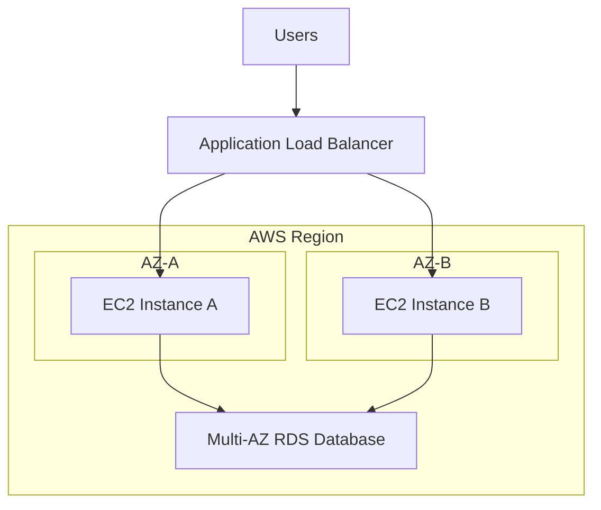

This is a very common exam architecture.

---

# 12. Availability Zone ≠ Data Center

Don't oversimplify:

> "One AZ = one data center."

An AZ can consist of **one or more discrete data centers**.

The exam generally wants you to think:

```text
AZ = isolated failure domain
```

rather than:

```text
AZ = exactly one building
```

---

# 13. AZ Selection Based on Latency

Inside a Region, AWS designs AZs for low-latency connectivity.

Therefore, you generally don't manually select:

> "AZ-A because it has lower latency than AZ-B."

The important architectural decision is usually:

> **Spread workloads across multiple AZs.**

---

# 14. The Important Network Latency Principle

Think about latency as:

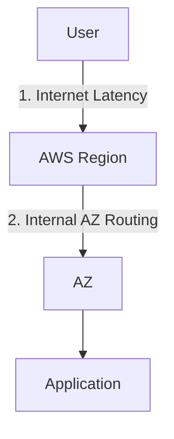

You want to minimize:

```text
User → Application
```

latency.

Not merely:

```text
AZ-A → AZ-B
```

latency.

---

# 15. Edge Locations — A Different Solution

Suppose users are globally distributed:

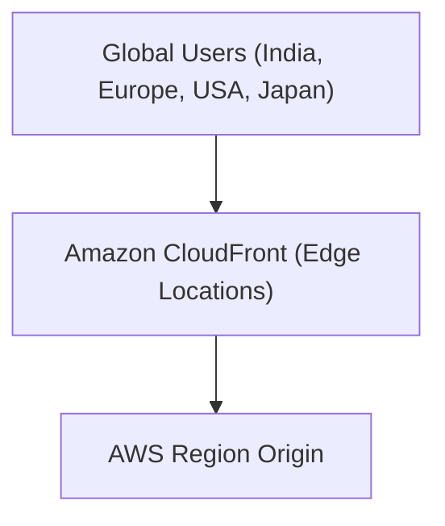

Instead of deploying the application in every country, use **Amazon CloudFront** where appropriate.

CloudFront caches content at edge locations closer to users.

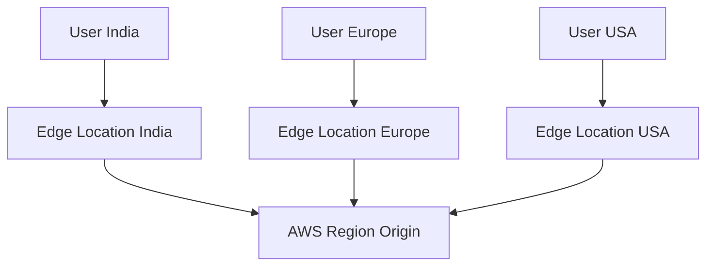

This can dramatically reduce latency for cacheable/static content.

---

# 16. Region vs CloudFront

### Question:

> "Users around the world need low-latency access to static content."

Think:

**CloudFront**

Not:

> "Create an AWS Region in every continent."

---

# 17. Dynamic Application Traffic

For dynamic applications, CloudFront can still help with:

* TLS termination
* Caching where appropriate
* Edge delivery
* Reducing origin requests
* Some request/response acceleration patterns

But you should not assume:

> "CloudFront makes every dynamic request originate from the nearest AWS Region."

The origin still matters.

---

# 18. Global Application Architecture

For a global application:

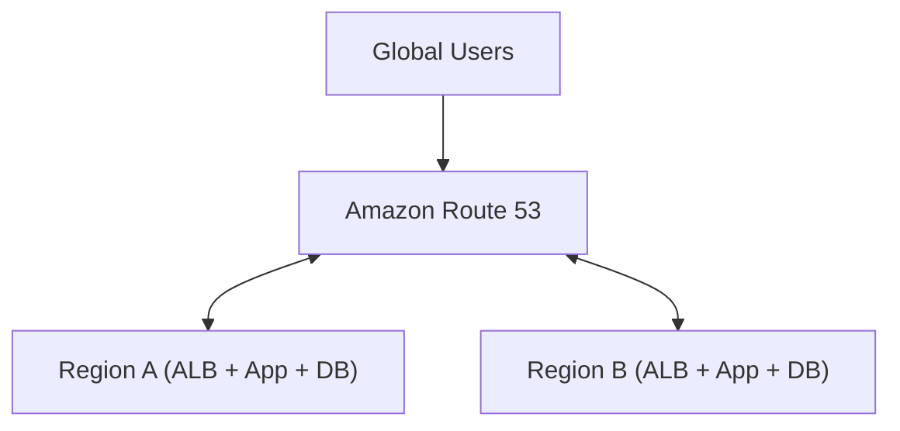

You might use Route 53 routing policies such as:

* Latency-based routing
* Geolocation routing
* Geoproximity routing
* Failover routing
* Weighted routing

depending on the requirement.

---

# 19. Latency-Based Routing

Suppose:

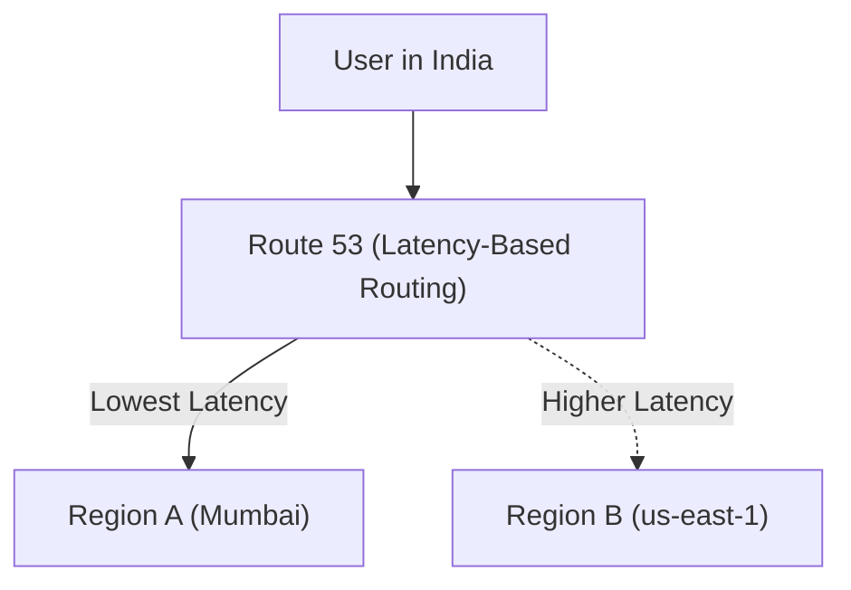

Latency-based routing can direct users toward the AWS Region that provides the lowest latency among your configured resources.

### Exam clue

> "Route users to the Region with the lowest network latency."

→ **Route 53 latency-based routing**

---

# 20. Geolocation vs Latency Routing

This is another exam trap.

### Latency-based

Question:

> "Which endpoint has the lowest latency?"

Think:

**Latency-based routing**

### Geolocation

Question:

> "Users from a specific country should go to a specific endpoint."

Think:

**Geolocation routing**

Example:

```text
India → Region A
USA   → Region B
Germany → Region C
```

This is about **location policy**, not measured lowest latency.

---

# 21. Geoproximity Routing

Geoproximity routing is useful when routing based on geographic proximity and when you want to adjust routing using **bias**.

Think:

```text
Geographic location
       +
Proximity
       +
Bias
```

For most exam questions, distinguish it from:

```text
Latency routing → lowest latency
Geolocation → user location
```

---

# 22. Multi-Region HLD

A common architecture:

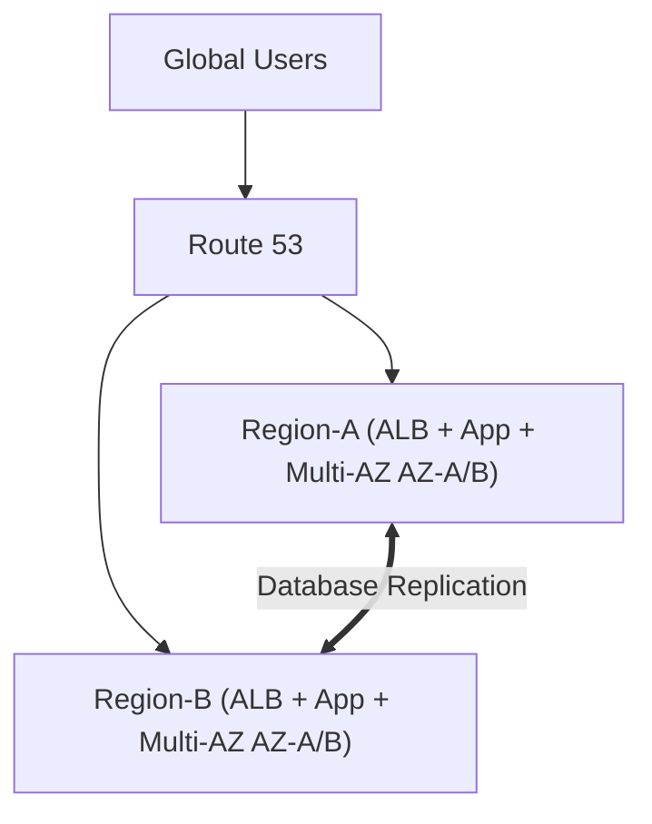

The database architecture depends on the workload and chosen database service.

---

# 23. Multi-Region = More Cost

This is an important trade-off.

```text
Single Region
      ↓
Lower cost
Lower complexity
```

versus:

```text
Multi-Region
      ↓
Higher availability
Lower regional failure risk
Potentially lower global latency
BUT
Higher cost
Higher operational complexity
```

So don't choose multi-Region merely because:

> "It's more highly available."

The requirement has to justify it.

---

# 24. Cost Trade-Off

| Architecture | Cost | Complexity | Availability | Latency |
|---|--:|--:|--:|---|
| Single AZ | Lowest | Lowest | Low | Good |
| Multi-AZ | Higher | Medium | High | Good |
| Multi-Region | Much higher | High | Very high | Potentially excellent |
| CloudFront + one Region | Moderate | Medium | Good for delivery | Excellent for cached content |
| CloudFront + multi-Region | Highest | High | Very high | Excellent |

---

# 25. Exam Principle — Don't Overengineer

Question:

> "A small internal application needs to run in AWS with basic HA."

Don't jump to:

```text
Multi-Region
+
CloudFront
+
Global routing
```

A better solution might be:

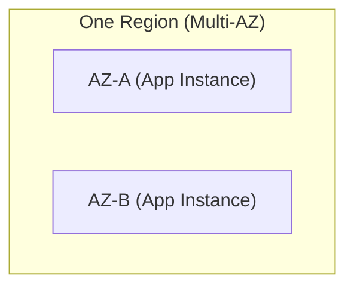

This provides Multi-AZ availability with much less operational overhead.

---

# 26. "Minimum Operational Overhead"

This is a common AWS certification theme.

### Requirement:

> "Application needs HA within a Region."

Use:

**Multi-AZ**

instead of:

**Multi-Region**

unless regional disaster recovery is explicitly required.

---

### Requirement:

> "Global users need low-latency static content."

Use:

**CloudFront**

instead of deploying multiple application stacks around the world.

---

### Requirement:

> "Global users need active application endpoints in multiple Regions."

Now consider:

**Multi-Region + Route 53**

---

# 27. Network Latency vs Availability

These are separate requirements.

### Latency

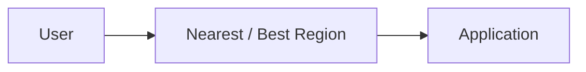

### Availability

```mermaid
flowchart TD
    Region["AWS Region"] --> AZA["AZ-A"]
    Region --> AZB["AZ-B"]
```

### Regional Disaster Recovery

```mermaid
flowchart LR
    RegA["Region-A (Primary)"] <== "Replication / DR" ==> RegB["Region-B (Secondary)"]
```

The exam may combine them.

---

# 28. Hybrid Network + Region Selection

Suppose:

```mermaid
flowchart LR
    OnPrem["On-Premises"] --> DX["Direct Connect"] --> Region["AWS Region"]
```

Region selection should consider:

* Distance from data center
* Direct Connect location availability
* Latency
* Bandwidth
* Data residency
* AWS service availability
* Cost

For example:

```mermaid
flowchart LR
    DC["Corporate DC"] --> DXLoc["DX Location"] --> Region["AWS Region"]
```

The physical network path matters.

---

# 29. AWS Region + Direct Connect

A common enterprise design:

```mermaid
flowchart TD
    DC["Corporate DC"] --> CoLo["Co-location"] --> DX["Direct Connect"] --> RegA["AWS Region A"]
    RegA --> TGW1["Transit Gateway"] <--> VPCs1["VPC A, B, C"]

    TGW1 <== "Inter-Region TGW Peering" ==> TGW2["Transit Gateway (Region B)"] <--> VPCs2["VPC D, E, F"]
```

---

# 30. AWS Global Infrastructure Exam Map

Memorize:

```mermaid
flowchart TD
    Global["AWS GLOBAL INFRASTRUCTURE"] --> Regions["Regions (Geographic Isolation)"]
    Regions --> AZs["Availability Zones (High Availability)"]
    Global --> Edge["Edge Locations (Low-Latency Content Delivery)"]
    Global --> NetServices["Regional / Global Networking Services"]
```

### Region

**Geographic isolation**

### AZ

**High availability**

### Edge

**Low-latency content delivery**

---

# 31. Region Selection Decision Tree

This is the one I'd memorize.

```mermaid
flowchart TD
    Start["Choose AWS Region"] --> Res{"Data residency required?"}
    
    Res -->|YES| Compliant["Choose Compliant Region"]
    Res -->|NO| Latency["Evaluate Latency / Distance"]

    Latency --> Services{"Required services available?"}
    Services -->|NO| AltReg["Choose Supported Region"]
    Services -->|YES| Cost["Evaluate Regional Cost"]

    Cost --> DR{"DR / Multi-Region required?"}
    DR -->|NO| SingleReg["Single Region Architecture"]
    DR -->|YES| MultiReg["Multi-Region Architecture"]
```

---

# 32. AZ Selection Decision Tree

```mermaid
flowchart TD
    App["Application Stack"] --> HA{"Need high availability?"}
    HA -->|YES| MultiAZ["Deploy across Multiple AZs (AZ-A & AZ-B)"]
```

Don't put all production components in:

```text
AZ-A only
```

Prefer:

```mermaid
flowchart TD
    subgraph Region["AWS Region"]
        AZA["AZ-A App"]
        AZB["AZ-B App"]
    end
```

---

# 33. Region vs AZ — Exam Shortcut

| Requirement | Answer |
|---|---|
| Protect from server failure | Auto Scaling / redundancy |
| Protect from AZ failure | Multi-AZ |
| Protect from Region failure | Multi-Region |
| Lowest user latency | Appropriate Region / edge |
| Global static content | CloudFront |
| Country-specific routing | Route 53 Geolocation |
| Lowest-latency endpoint routing | Route 53 Latency-based |
| Global active application | Multi-Region |
| Data residency | Appropriate compliant Region |
| Reduce operational overhead | Avoid unnecessary Multi-Region |

---

# 34. Common Exam Traps

### Trap 1

> "For maximum availability, deploy in every AWS Region."

❌ Usually overkill.

Think:

**Multi-AZ first.**

Use Multi-Region only when regional resilience/business requirements justify it.

---

### Trap 2

> "Users are globally distributed, so deploy application in every Region."

❌ Not necessarily.

For static/cacheable content:

**CloudFront** may be enough.

---

### Trap 3

> "Closest Region is always best."

❌ Not necessarily.

Check:

```text
Latency
+
Compliance
+
Services
+
Cost
+
DR
```

---

### Trap 4

> "Different AZs mean different Regions."

❌

AZs are inside a Region.

```text
Region
 ├── AZ-A
 ├── AZ-B
 └── AZ-C
```

---

### Trap 5

> "Multi-AZ protects against regional failure."

❌

Multi-AZ protects against **AZ-level failure**.

Multi-Region is used for **regional resilience**.

---

# 35. Cost Optimization Pattern

Suppose the requirement is:

> "Minimize cost while maintaining high availability."

Use:

```mermaid
flowchart TD
    subgraph Region["Single Region (Multi-AZ)"]
        AZA["AZ-A (App Instance)"]
        AZB["AZ-B (App Instance)"]
    end
```

rather than:

```mermaid
flowchart TD
    subgraph RegA["Region A"]
        AppA["App + DB"]
    end
    subgraph RegB["Region B"]
        AppB["App + DB"]
    end
    RegA <== "Costly Inter-Region Replication" ==> RegB
```

unless cross-Region resilience is required.

---

# 36. Global Low-Latency Pattern

If your application is mostly static:

```mermaid
flowchart TD
    Users["Users Worldwide (India, Europe, USA)"] --> CF["CloudFront Edge Locations"] --> Origin["AWS Region Origin"]
```

This minimizes latency while keeping the origin architecture relatively simple.

---

# 37. Global Dynamic Application Pattern

For active applications:

```mermaid
flowchart TD
    Users["Global Users"] --> R53["Route 53 (Latency / Geolocation)"]
    R53 --> RegA["Region-A (ALB + App + Multi-AZ)"]
    R53 --> RegB["Region-B (ALB + App + Multi-AZ)"]
```

Possible routing:

```text
Latency-based
or
Geolocation
or
Failover
```

depending on the requirement.

---

# 38. Network Cost Is More Than EC2 Cost

When comparing Regions, don't only compare:

```text
EC2 price
```

Consider:

```mermaid
flowchart TD
    TotalCost["Total Regional Cost"] --> EC2["EC2 + EBS + RDS"]
    TotalCost --> Infra["NAT Gateway + ALB"]
    TotalCost --> Net["Data Transfer + Inter-Region Traffic + Direct Connect + CloudFront"]
```

For distributed systems, **data transfer can become a significant architectural cost**.

---

# 39. Important Multi-Region Cost Trap

Suppose:

```mermaid
flowchart LR
    RegA["Region A"] -->|"Large Data Transfer Costs"| RegB["Region B"]
```

Even if EC2 in Region B is cheaper, moving huge amounts of data between Regions can make the overall solution more expensive.

Therefore:

> **Minimize unnecessary cross-Region traffic.**

---

# 40. HLD — Recommended General Production Architecture

For a normal regional production workload:

```mermaid
flowchart TD
    Users["USERS"] --> R53["Route 53"] --> ALB["Application Load Balancer"]
    
    subgraph Region["AWS Region"]
        subgraph AZA["AZ-A"]
            EC2A["App EC2"]
        end
        subgraph AZB["AZ-B"]
            EC2B["App EC2"]
        end

        DB["Multi-AZ Database"]
    end

    ALB --> EC2A
    ALB --> EC2B
    EC2A --> DB
    EC2B --> DB
```

This is often the **lowest-complexity architecture that provides strong availability**.

---

# 41. HLD — Global Production Architecture

For a global requirement:

```mermaid
flowchart TD
    Users["GLOBAL USERS"] --> R53["Route 53"]
    
    R53 --> RegA["Region-A (ALB + App + Multi-AZ AZ-A/B)"]
    R53 --> RegB["Region-B (ALB + App + Multi-AZ AZ-A/B)"]
    
    RegA <== "Data Replication" ==> RegB
```

Add CloudFront when content delivery benefits from caching/edge delivery.

---

# 42. HLD — Hybrid Global Architecture

For an enterprise:

```mermaid
flowchart TD
    Users["Global Users"] --> CF["CloudFront"] --> R53["Route 53"]
    R53 --> RegA["Region A (Multi-AZ App Stack)"]
    R53 --> RegB["Region B (Multi-AZ App Stack)"]

    RegA <== "Global Network / Inter-Region TGW" ==> RegB
    RegA <== "Direct Connect" ==> OnPrem["On-Premises Data Center"]
```

The actual implementation depends heavily on the database and application architecture.

---

# 43. The Exam's "Least Operational Overhead" Pattern

Always ask:

> **What is the simplest architecture that satisfies the requirement?**

Examples:

### Basic HA

```text
One Region
+
Two AZs
```

### Global static content

```text
One Region
+
CloudFront
```

### Global active application

```text
Multiple Regions
+
Route 53
```

### Regional disaster recovery

```text
Primary Region
+
Secondary Region
```

### Mission-critical global application

```text
Multi-Region
+
Multi-AZ
+
Global routing
+
Appropriate data replication
```

---

---

# 44. Real-World Exam Scenario: Global Multi-Region Relational Application Architecture (Aurora Global Database + Route 53 Geolocation & Failover)

- **Scenario**: A company operates a read-heavy smartwatch fitness tracking application serving North American and Asian users. The application pings servers at regular intervals for user authorization. The architect must design a multi-region architecture that:
  - Is fault-tolerant to regional outages.
  - Keeps database writes highly available in a single primary Region with relational database semantics (ACID/SQL).
  - Enables local database reads across multiple Regions.
  - Maintains an active-active, resilient application tier in each Region.
  What TWO options must the Solutions Architect implement?
- **Architecture Solution (Select TWO)**:
  1. **Route 53 Routing**: Create a **geolocation routing policy on Amazon Route 53** to direct global users to their designated regional endpoints. Combine this with a **failover routing policy with health checks** to direct users to a healthy backup region if an entire Region experiences an outage.
  2. **Database & Compute Tier**: Deploy the application tier on an **Auto Scaling group of EC2 instances in each Region in an active-active configuration**. Create a cluster of **Amazon Aurora Global Database** spanning both Regions. Configure the application tier to use the in-Region Aurora database endpoint for read operations (and route writes back to the primary Region). Regularly snapshot application servers and store snapshots in Amazon S3 buckets in both regions.

```mermaid
flowchart TD
    subgraph GlobalUsers["Global Smartwatch App Users"]
        US_User["North America User"]
        Asia_User["Asia User"]
    end

    subgraph DNS_Layer["1. Route 53 DNS Steering"]
        R53["Route 53 DNS<br/>• Geolocation Routing (NA -> Primary Region / Asia -> Secondary Region)<br/>• Failover Routing Policy (Auto-failover on regional health check breach)"]
    end

    subgraph PrimaryRegion["2. Primary AWS Region (e.g. us-east-1)"]
        US_ASG["EC2 Auto Scaling Group<br/>(Active Application Fleet)"]
        Aurora_Primary[("Amazon Aurora Primary Cluster<br/>⚡ Accepts ALL SQL Writes & Local Reads")]
        US_ASG ==> Aurora_Primary
    end

    subgraph SecondaryRegion["3. Secondary AWS Region (e.g. ap-northeast-1)"]
        Asia_ASG["EC2 Auto Scaling Group<br/>(Active Application Fleet)"]
        Aurora_Secondary[("Amazon Aurora Secondary Cluster<br/>⚡ Serves Low-Latency Local Reads")]
        Asia_ASG ==> Aurora_Secondary
    end

    US_User ==> R53
    Asia_User ==> R53
    R53 ==>|"Primary Route"| US_ASG
    R53 ==>|"Primary Route"| Asia_ASG

    Aurora_Primary ==>|"Dedicated Storage Replication (< 1s Latency)"| Aurora_Secondary
    Asia_ASG -.->|"Write Forwarding to Primary Writer"| Aurora_Primary

    classDef dns fill:#e67700,stroke:#b05a00,color:#ffffff;
    classDef app fill:#1864ab,stroke:#0b5394,color:#ffffff;
    classDef db fill:#2b8a3e,stroke:#1e632b,color:#ffffff;

    class R53 dns;
    class US_ASG,Asia_ASG app;
    class Aurora_Primary,Aurora_Secondary db;
```

### Key Technical Rationale:
1. **Amazon Aurora Global Database for Relational Cross-Region Read/Write**: Aurora Global Database replicates storage blocks across regions in under 1 second with zero performance impact on the primary writer. It supports low-latency local reads in secondary regions while enforcing single-primary relational SQL write consistency.
2. **Route 53 Geolocation + Failover Combo**: Geolocation routing directs users to their nearest designated regional server (e.g., North America users $\rightarrow$ `us-east-1`, Asian users $\rightarrow$ `ap-northeast-1`). Combining Geolocation with Failover routing and Route 53 Health Checks ensures that if a region fails, traffic automatically reroutes to the remaining healthy region.

### Why Distractor Options Fail:
- *RDS for MySQL with Cross-Region Replication (Your Selection)*: Standard RDS MySQL with cross-region read replicas requires manual failover and does **not** support automated storage-level sub-second replication or native write-forwarding like **Amazon Aurora Global Database**. Furthermore, attempting to deploy two standalone RDS MySQL database masters that both accept local writes creates split-brain data corruption because standard RDS MySQL cross-region replication is strictly single-master.
- *Route 53 Geoproximity + Multivalue Answer Routing*: Multivalue answer routing returns up to 8 random healthy records without considering client geographic location. Users in North America could randomly be directed to servers in Asia, causing high latency!
- *Standalone RDS MySQL on each region with snapshots*: Standalone RDS MySQL instances in separate regions cannot perform continuous multi-region data replication, resulting in immediate data divergence.

---

# 🧠 Final AWS Exam Cheat Sheet

```text
REGION
↓
Geography
Data residency
Service availability
Cost
Regional disaster boundary


AZ
↓
High availability
AZ failure protection
Low-latency regional architecture


EDGE LOCATION
↓
Bring content closer to users
CloudFront
Low-latency content delivery
```

### If you see:

> **"Users are concentrated in one geography."**

→ Choose an appropriate nearby Region.

> **"Application must survive an AZ failure."**

→ Multi-AZ.

> **"Application must survive a regional outage."**

→ Multi-Region.

> **"Global users need low latency for static/cacheable content."**

→ CloudFront.

> **"Route users to the endpoint with lowest latency."**

→ Route 53 latency-based routing.

> **"Users from different countries must go to specific endpoints."**

→ Route 53 geolocation routing.

> **"Global multi-region relational app with local reads and central writes."**

→ **Amazon Aurora Global Database + Route 53 Geolocation & Failover Routing**.

> **"Global application needs active deployments in multiple Regions."**

→ Multi-Region architecture + appropriate Route 53 routing.

> **"Minimize cost and operational overhead while providing HA."**

→ **Prefer Multi-AZ over Multi-Region unless regional DR is actually required.**

> **"Closest Region has no required service/feature."**

→ Choose a supported Region that satisfies the complete set of requirements.

## 🏆 The mental model to memorize

```mermaid
flowchart TD
    Q1{"WHERE? (Geography / Compliance)"} --> Region["Region Selection"]
    Region --> Q2{"HOW? (High Availability)"} --> MultiAZ["Multi-AZ Deployment"]
    MultiAZ --> Q3{"GLOBAL USERS?"}
    
    Q3 -->|Static / Cacheable| CF["CloudFront Edge Delivery"]
    Q3 -->|Dynamic Active-Active Relational| AuroraGlobal["Multi-Region + Aurora Global DB + Route 53 Geolocation"]
```

**The AWS exam usually rewards the solution that meets the stated requirement with the least unnecessary complexity.** Don't choose Multi-Region merely because it sounds "more highly available"; don't choose the nearest Region without checking compliance and service availability; and don't create a global architecture when **Multi-AZ + CloudFront** solves the actual problem.