# Hybrid DNS — AWS Exam-Oriented Deep Dive

For the exam, think of **Hybrid DNS** as:

> **“How do DNS queries get resolved when some resources are in AWS and others are on-premises?”**

The core services are:

* **Amazon Route 53**
* **Route 53 Resolver**
* **Route 53 Resolver endpoints**
* **On-premises DNS servers**
* **VPC DNS**
* **AWS Private Hosted Zones**
* **Route 53 Resolver forwarding rules**

The most important mental model is:

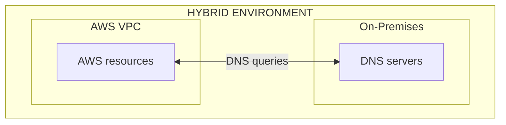

---

# 1. First: What is DNS?

DNS translates names into IP addresses.

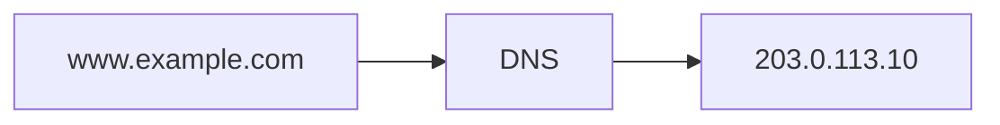

Without DNS, applications would need to know IP addresses directly.

In a hybrid environment, you can have **two DNS worlds**:

```text
AWS
│
├── app.aws.internal
├── db.aws.internal
└── service.aws.internal

On-Premises
│
├── app.corp.example
├── db.corp.example
└── printer.corp.example
```

The challenge is:

> **How can AWS resolve on-premises names, and how can on-premises systems resolve AWS names?**

That's what **hybrid DNS integration** solves.

---

# 2. The Core AWS Service: Route 53 Resolver

This is the most important service for this topic.

**Route 53 Resolver** provides DNS resolution for VPCs.

Conceptually:

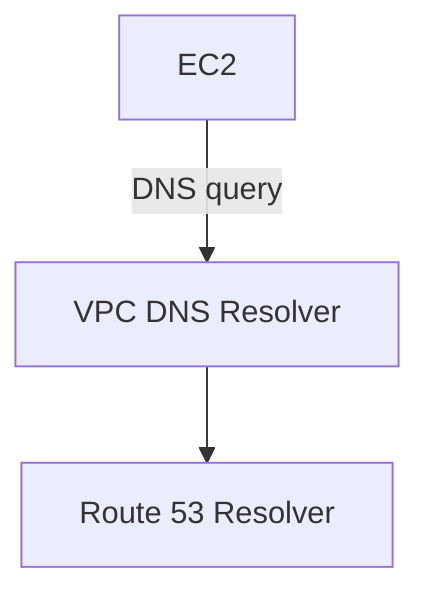

AWS provides DNS resolution inside VPCs automatically.

You don't normally deploy your own DNS server just to resolve normal AWS/VPC DNS names.

### Exam mindset

If the question says:

> "DNS resolution within an AWS VPC"

Think:

**Route 53 Resolver / VPC DNS**

---

# 3. Why Do We Need Hybrid DNS?

Imagine:

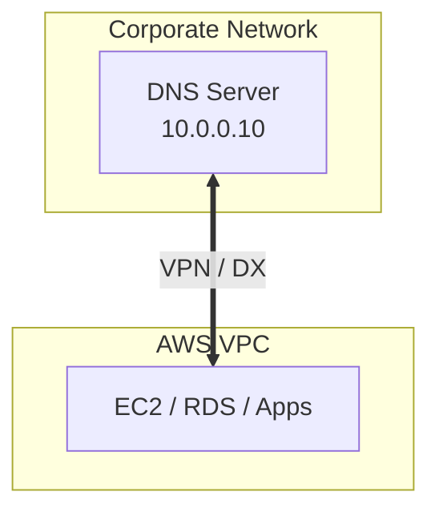

On-premises has:

```text
db.corp.example → 10.10.20.30
```

AWS has:

```text
database.aws.internal → 10.20.30.40
```

Applications may need to resolve **both**.

So we need:

```text
AWS DNS  ←→  On-prem DNS
```

---

# 4. The Two Most Important Resolver Endpoints

Memorize this:

## Inbound Endpoint

> **On-premises → AWS DNS**


Example:

On-prem application asks:

```text
db.aws.internal
```

The query goes:

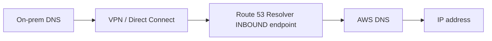

### Exam clue

> "On-premises clients need to resolve private AWS DNS names."

→ **Route 53 Resolver inbound endpoint**

---

# 5. Outbound Endpoint

Reverse direction.

> **AWS → On-premises DNS**

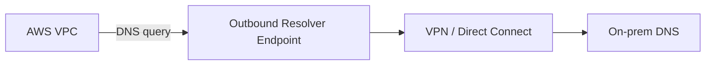

Example:

AWS EC2 asks:

```text
server.corp.example
```

The Resolver sees that `corp.example` should be resolved by the corporate DNS server.

It forwards the query:

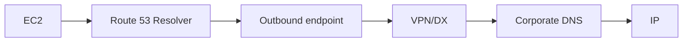

### Exam clue

> "AWS resources need to resolve on-premises DNS names."

→ **Route 53 Resolver outbound endpoint + forwarding rule**

---

# 6. The Easiest Way to Remember Inbound vs Outbound

Don't think about AWS terminology.

Think about **where the DNS query starts**.

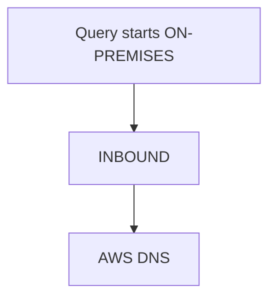

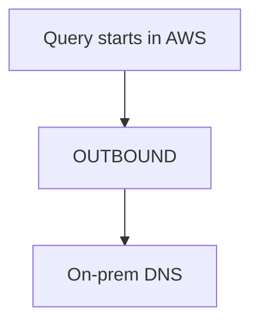

### Memorize:

> **Inbound = into AWS Resolver**

> **Outbound = out of AWS Resolver**

---

# 7. High-Level Architecture

A typical hybrid DNS architecture looks like this:

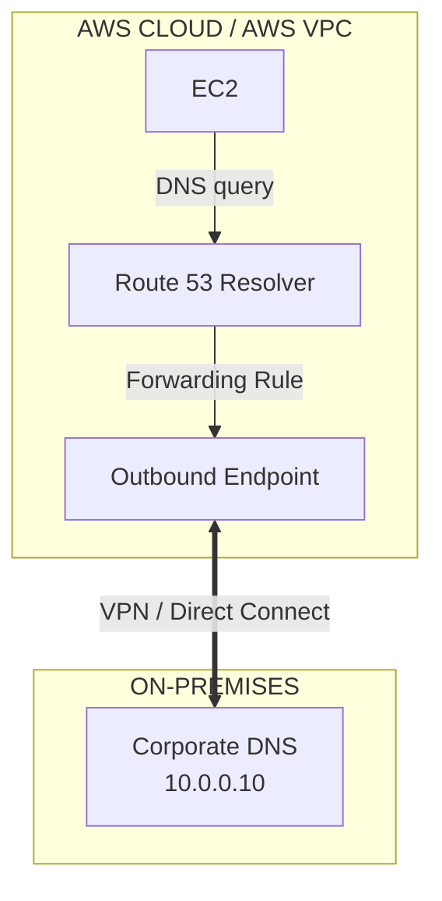

---

# 8. What Is a Resolver Rule?

This is another exam-important concept.

Suppose your company owns:

```text
corp.example
```

And the corporate DNS server is:

```text
10.0.0.10
```

You can configure a Route 53 Resolver forwarding rule:

```text
Domain:
corp.example

Forward to:
10.0.0.10
```

Now:

```text
EC2 asks:
server.corp.example
```

Resolver says:

> "corp.example belongs to the corporate DNS system."

Then:

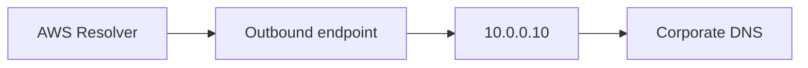

---

# 9. Forwarding Rule Illustration

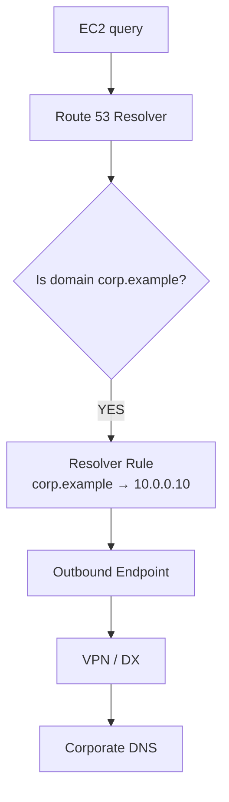

This is the standard hybrid DNS pattern.

---

# 10. Reverse Direction: On-Premises → AWS

Now imagine AWS has:

```text
database.aws.internal
```

On-premises users need to resolve it.

Architecture:

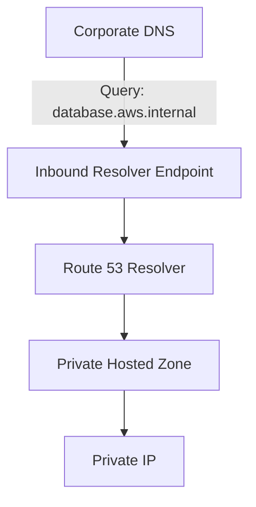

This is why **inbound Resolver endpoints** exist.

---

# 11. Private Hosted Zone

A **Route 53 private hosted zone** is used for DNS names inside your VPC.

Example:

```text
aws.internal
```

Records:

```text
db.aws.internal     → 10.20.1.10
api.aws.internal    → 10.20.2.10
```

These names are not publicly resolvable.

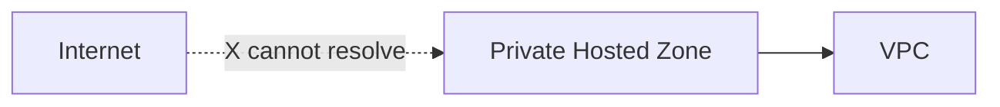

But with hybrid DNS:


On-premises can resolve the private AWS names.

---

# 12. Route 53 Public Hosted Zone vs Private Hosted Zone

Very important distinction.

|                            | Public Hosted Zone | Private Hosted Zone |
| -------------------------- | ------------------ | ------------------- |
| Accessible from Internet   | Yes                | No                  |
| Used for public websites   | Yes                | No                  |
| Used for internal services | Sometimes          | **Yes**             |
| Associated with VPC        | No                 | **Yes**             |
| Example                    | `example.com`      | `corp.internal`     |

### Exam shortcut

> **Public users → Public Hosted Zone**

> **Private/internal resources → Private Hosted Zone**

---

# 13. Route 53 Resolver vs Route 53 Hosted Zones

Don't confuse them.

### Hosted Zone

Stores DNS records.

```text
example.internal
 ├── app → 10.0.1.10
 ├── db  → 10.0.2.10
```

### Resolver

Handles DNS queries.

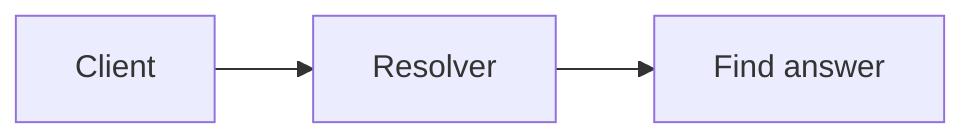

Think:

> **Hosted Zone = DNS data**

> **Resolver = DNS resolution**

---

# 14. Route 53 Resolver vs Route 53

A useful exam distinction:

### Route 53

Broad DNS service:

* Domain registration
* Hosted zones
* DNS records
* Routing policies
* Health checks
* Resolver

### Route 53 Resolver

Specifically focuses on:

* DNS resolution
* VPC DNS
* Hybrid DNS
* DNS forwarding
* Inbound/outbound endpoints

---

# 15. Associated Services

Hybrid DNS rarely works alone.

You should recognize this architecture:

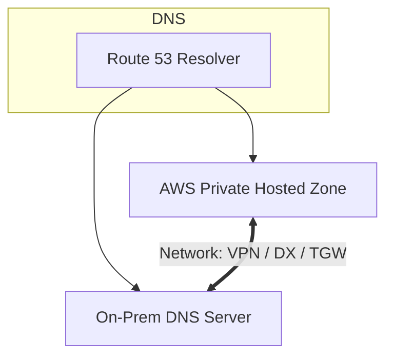

Associated services can include:

### Networking

* VPC
* Route tables
* Transit Gateway
* Site-to-Site VPN
* Direct Connect

### DNS

* Route 53
* Route 53 Resolver
* Private Hosted Zones
* Resolver Rules

### Security

* Security Groups
* Network ACLs
* DNS query logging
* IAM

---

# 16. VPN vs Direct Connect in Hybrid DNS

DNS forwarding needs **network connectivity** between AWS and on-premises.

You therefore need something such as:

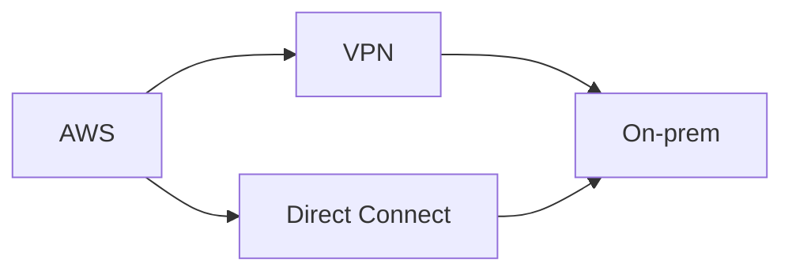

### VPN

Choose when:

* Lower cost
* Quick deployment
* Encrypted connectivity
* Moderate requirements

### Direct Connect

Choose when:

* Dedicated connection
* Predictable network performance
* Large-scale enterprise hybrid connectivity

### Exam mindset

Don't choose Direct Connect merely because the question says "hybrid."

Ask:

> **Does the requirement actually need dedicated connectivity?**

If not, VPN may be the lower-cost, lower-overhead solution.

---

# 17. Transit Gateway + Hybrid DNS

Suppose you have:

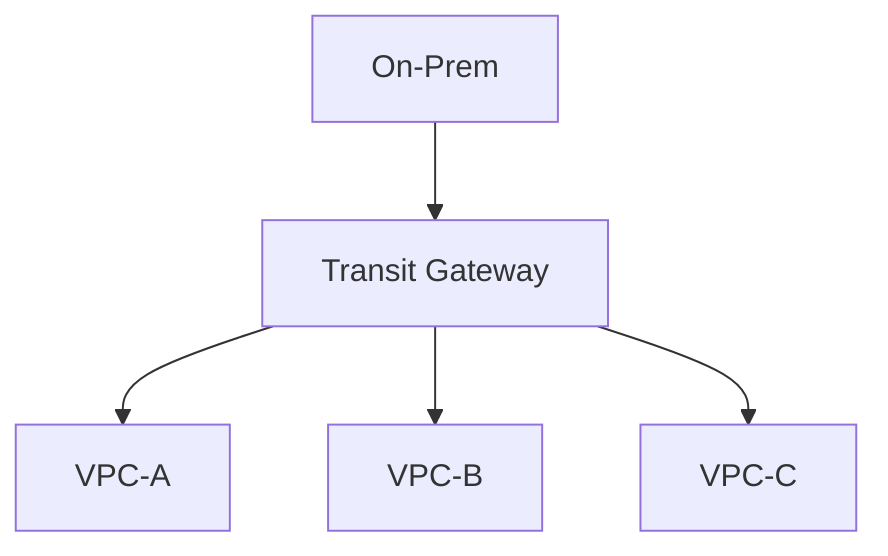

You don't necessarily want to configure separate DNS infrastructure for every VPC.

You can centralize Resolver infrastructure.

For example:

```mermaid
flowchart TD
    TGW["Transit Gateway"] --> VPCA["VPC-A"]
    TGW --> VPCB["VPC-B"]
    TGW --> VPCC["VPC-C"]
    VPCA --> Central["Central DNS VPC"]
    VPCB --> Central
    VPCC --> Central
    Central --> EP["Resolver Endpoint"] --> OnPrem["On-prem DNS"]
```

This becomes particularly useful in large AWS environments.

---

# 18. Centralized DNS Architecture

For a large enterprise:

```mermaid
flowchart TD
    Org["AWS ORGANIZATION"] --> TGW["Transit Gateway"]
    TGW --> VPCA["VPC-A"]
    TGW --> VPCB["VPC-B"]
    TGW --> VPCC["VPC-C"]
    VPCA --> DNSVPC["DNS VPC"]
    VPCB --> DNSVPC
    VPCC --> DNSVPC
    DNSVPC --> R53["Route 53 Resolver & Resolver Rules (corp.example)"]
    R53 --> Endpoints["Inbound/Outbound Endpoints"]
    Endpoints <== "VPN / DX" ==> OnPrem["On-Prem DNS"]
```

This is a **High-Level Design (HLD)** pattern for larger environments.

---

# 19. Cost Trade-offs

This is where your exam strategy becomes important.

## Option 1 — Use AWS-managed Resolver

```mermaid
flowchart LR
    VPC["VPC"] --> R53["Route 53 Resolver"]
```

### Advantages

* Managed by AWS
* No DNS servers to patch
* Highly available service
* Less operational work

### Disadvantage

* Resolver endpoints/rules incur charges
* DNS query volume can affect cost

---

## Option 2 — Deploy your own DNS servers on EC2

```mermaid
flowchart LR
    EC2["EC2"] --> BIND["BIND / Windows DNS"] --> DNS["DNS"]
```

You now have to manage:

* EC2
* OS patching
* DNS software
* HA
* Scaling
* Monitoring
* Backup
* Security
* Failure recovery

### Exam perspective

Unless you have a specific requirement for custom DNS software:

> **Prefer Route 53 Resolver.**

Because it has lower operational overhead.

---

# 20. Operational Overhead Comparison

| Architecture              |          Cost | Operational overhead | Scalability             |
| ------------------------- | ------------: | -------------------: | ----------------------- |
| Route 53 Resolver         |            $$ |              **Low** | High                    |
| Self-managed DNS on EC2   |          $–$$ |             **High** | Manual                  |
| On-prem DNS only          | Existing cost |                 High | Existing infrastructure |
| Resolver + VPN            |            $$ |       **Low/medium** | Good                    |
| Resolver + Direct Connect |           $$$ |               Medium | Excellent               |

The exam is usually asking:

> **Can AWS manage this for me?**

If yes, that's often the preferred solution.

---

# 21. Minimum Workload / Minimum Work Principle

Let's say:

> "An AWS application needs to resolve `corp.example` hosted on-premises."

You don't need:

❌ Another DNS server in AWS  
❌ A second DNS cluster  
❌ Manual DNS synchronization  
❌ Full DNS migration

You can use:

```mermaid
flowchart LR
    AWS["AWS"] --> R53["Route 53 Resolver"] --> OutboundEP["Outbound Endpoint"] --> VPN["VPN"] --> OnPrem["On-prem DNS"]
```

That's the minimum architecture that satisfies the requirement.

---

# 22. Another Example: On-Prem → AWS

Requirement:

> On-premises applications must resolve private AWS services.

Minimum architecture:

```mermaid
flowchart LR
    OnPrem["On-prem DNS"] --> Link["VPN / DX"] --> InboundEP["Route 53 Resolver Inbound Endpoint"] --> PHZ["Private Hosted Zone"] --> IP["AWS private IP"]
```

Again:

**Don't deploy unnecessary DNS infrastructure.**

---

# 23. High Availability

This is an important HLD point.

Don't build:

```mermaid
flowchart LR
    DNS["DNS"] --> EP["Resolver EP"] --> SingleAZ["One AZ only"]
```

For production, design endpoints across multiple AZs.

Conceptually:

```mermaid
flowchart TD
    VPC["VPC"] --> AZA["AZ-A Resolver Endpoint"]
    VPC --> AZB["AZ-B Resolver Endpoint"]
    AZA <==> OnPrem["On-prem DNS"]
    AZB <==> OnPrem
```

This gives you AZ-level resilience.

### Exam clue

If the question says:

> "Highly available hybrid DNS"

Think:

**Resolver endpoints across multiple AZs + redundant network connectivity.**

---

# 24. Network Connectivity HA

DNS availability depends not only on Resolver but also on connectivity.

For example:

```mermaid
flowchart TD
    AWS["AWS"] --> VPNA["VPN-A"] --> OnPrem["On-prem"]
    AWS --> VPNB["VPN-B"] --> OnPrem
```

Or:

```text
Direct Connect
      +
VPN backup
```

Depending on requirements.

### Important exam principle

> **A highly available DNS design requires highly available network connectivity too.**

---

# 25. Common Exam Traps

### Trap 1

> AWS instances need to resolve on-prem DNS names.

❌ Inbound endpoint

✅ **Outbound Resolver endpoint**

Because the DNS query originates in AWS.

---

### Trap 2

> On-premises clients need to resolve AWS private DNS names.

❌ Outbound endpoint

✅ **Inbound Resolver endpoint**

Because the query enters AWS.

---

### Trap 3

> Need DNS forwarding from AWS to corporate DNS.

Think:

**Outbound endpoint + forwarding rule**

---

### Trap 4

> Need on-premises DNS to resolve private hosted-zone records.

Think:

**Inbound endpoint**

---

### Trap 5

> Need a DNS server inside AWS.

Don't immediately launch EC2.

Ask:

> **Can Route 53 Resolver satisfy the requirement?**

Usually yes.

---

# 26. The Most Important Diagram

Memorize this:

```mermaid
flowchart TD
    subgraph AWSCloud["AWS CLOUD / VPC"]
        EC2["EC2"] -->|"1. Query"| R53["Route 53 Resolver"]
        R53 --> PHZ["Private Zone"]
        R53 --> Rule["Forwarding Rule (corp.example)"]
        Rule --> OutboundEP["Outbound Endpoint"]
        InboundEP["Inbound Endpoint"] --> PHZ
    end

    OutboundEP <== "VPN / Direct Connect" ==> CorpDNS
    CorpDNS <== "VPN / Direct Connect" ==> InboundEP

    subgraph OnPremises["ON-PREMISES"]
        CorpDNS["Corporate DNS<br/>10.0.0.10<br/>(corp.example)"]
    end
```

---

# 27. HLD — Small Company

If the environment is small:

```mermaid
flowchart TD
    Internet["Internet"] --> R53["Route 53 Public DNS"]
    subgraph Net["Network Connection"]
        VPC["AWS VPC"] <== "VPN" ==> OnPrem["On-Prem"]
    end
    VPC --> Resolver["Resolver"] --> OutboundEP["Outbound"] --> OnPremDNS["DNS Server"]
```

Use this when:

* One/few VPCs
* Small hybrid environment
* Simple DNS requirements
* Low operational complexity

---

# 28. HLD — Enterprise

For an enterprise:

```mermaid
flowchart TD
    AWS["AWS"] --> TGW["Transit Gateway"]
    TGW --> VPCA["VPC-A"]
    TGW --> VPCB["VPC-B"]
    TGW --> VPCC["VPC-C"]
    VPCA --> Central["Central DNS VPC"]
    VPCB --> Central
    VPCC --> Central
    Central --> R53["Route 53 Resolver"]
    R53 --> Inbound["Inbound Endpoint"]
    R53 --> Outbound["Outbound Endpoint"]
    Inbound <== "VPN / Direct Connect" ==> OnPrem["On-Prem DNS"]
    Outbound <== "VPN / Direct Connect" ==> OnPrem
```

### Benefits

* Centralized DNS
* Less duplication
* Easier management
* Consistent forwarding rules
* Easier scaling
* Centralized monitoring

---

# 29. Alternative Services — Know When NOT to Use Them

| Service                    | Use it for                       | Don't confuse it with |
| -------------------------- | -------------------------------- | --------------------- |
| Route 53                   | DNS management/routing           | Resolver              |
| Route 53 Resolver          | DNS resolution                   | Hosted zone           |
| Private Hosted Zone        | Private DNS records              | Public hosted zone    |
| Resolver Inbound Endpoint  | On-prem → AWS DNS                | Outbound              |
| Resolver Outbound Endpoint | AWS → on-prem DNS                | Inbound               |
| VPN                        | Encrypted network connectivity   | DNS                   |
| Direct Connect             | Dedicated connectivity           | DNS                   |
| Transit Gateway            | Network connectivity/routing     | DNS                   |
| PrivateLink                | Private service access           | DNS forwarding        |
| CloudFront                 | Content delivery                 | DNS resolution        |
| Global Accelerator         | Application traffic acceleration | DNS hosting           |

---

# 30. Exam Decision Tree

When you see a hybrid DNS question:

```mermaid
flowchart TD
    Req["DNS requirement"] --> Start{"Where does query start?"}
    Start -->|AWS| Outbound["Outbound Endpoint"] --> Rule["Forwarding Rule"]
    Start -->|On-prem| Inbound["Inbound Endpoint"] --> PHZ["Private Hosted Zone"]
    Rule --> Conn{"Network connectivity"}
    PHZ --> Conn
    Conn -->|cheaper/quick| VPN["VPN"]
    Conn -->|dedicated/predictable| DX["Direct Connect"]
```

---

# 31. Cost + Operational Overhead Decision Matrix

| Requirement                   | Best starting point | Why                      |
| ----------------------------- | ------------------- | ------------------------ |
| Normal VPC DNS                | Route 53 Resolver   | Managed                  |
| AWS → on-prem DNS             | Outbound endpoint   | Minimal architecture     |
| On-prem → AWS DNS             | Inbound endpoint    | Minimal architecture     |
| Small hybrid network          | VPN                 | Low cost + easy          |
| Large enterprise connectivity | Direct Connect      | Predictable performance  |
| Many VPCs                     | Transit Gateway     | Centralized connectivity |
| Private AWS DNS               | Private Hosted Zone | Managed DNS              |
| Custom DNS software required  | Self-managed DNS    | Only when necessary      |

---

# 32. 🧠 Final Exam Cheat Sheet

If you remember only this, you're in good shape:

```text
Route 53
   ↓
DNS service

Route 53 Resolver
   ↓
DNS resolution

Private Hosted Zone
   ↓
Private DNS records

Inbound Resolver Endpoint
   ↓
ON-PREM → AWS DNS

Outbound Resolver Endpoint
   ↓
AWS → ON-PREM DNS

Resolver Rule
   ↓
"Send this domain to that DNS server"

VPN
   ↓
Cheap / quick encrypted hybrid connectivity

Direct Connect
   ↓
Dedicated / predictable hybrid connectivity

Transit Gateway
   ↓
Many VPCs + transitive routing
```

---

## 28.1 Multi-Account Private DNS Management via Route 53 Private Hosted Zone VPC Associations

When managing private DNS across a multi-account AWS Organization (e.g., 50+ team accounts managed by a central CCoE team), AWS allows sharing a single **Route 53 Private Hosted Zone (PHZ)** across multiple VPCs and AWS accounts:

```mermaid
flowchart TD
    subgraph CentralAccount["Central AWS Account (Cloud Center of Excellence)"]
        PHZ["Central Route 53 Private Hosted Zone<br/>(e.g., internal.corp.example)"]
        SharedVPC["Shared Services VPC"]
        PHZ --- SharedVPC
    end

    subgraph MemberAccounts["Member AWS Accounts (50 Research Teams)"]
        VPC1["Team Account 1 VPC"]
        VPC2["Team Account 2 VPC"]
        VPC50["Team Account 50 VPC"]
    end

    subgraph NetworkConnectivity["VPC Peering / Transit Gateway Network Mesh"]
        TGW["Transit Gateway / Peering Mesh"]
    end

    SharedVPC <==> TGW <==> VPC1 & VPC2 & VPC50

    PHZ -.->|"1. Authorize & Programmatically Associate VPC"| VPC1
    PHZ -.->|"2. Authorize & Programmatically Associate VPC"| VPC2
    PHZ -.->|"3. Authorize & Programmatically Associate VPC"| VPC50

    classDef central fill:#d4edda,stroke:#28a745,stroke-width:2px;
    classDef member fill:#d1ecf1,stroke:#17a2b8,stroke-width:1px;

    class CentralAccount,PHZ,SharedVPC central;
    class VPC1,VPC2,VPC50 member;
```

### Workflow for Multi-Account Private Hosted Zone Sharing:
1. **Central Account Authorization**: In the central account, run `aws route53 create-vpc-association-authorization` to grant authorization for the member VPC in Account B to associate with the central PHZ.
2. **Member Account Association**: In the member account (or via automation script), run `aws route53 associate-vpc-with-private-hosted-zone` to complete the binding.
3. **Seamless DNS Query Resolution**: Instances in all 50 member VPCs resolve domain names in the central PHZ directly via local VPC DNS Resolvers (`169.254.169.253`) without configuring complex DNS forwarders or self-managed BIND servers.

---

## 32.1 Real-World Exam Scenario: Simplified Multi-Account Private DNS for 50 Research Teams

- **Scenario**: An enterprise implements a multi-account strategy with ~50 dedicated AWS accounts for research teams. A central Cloud Center of Excellence (CCoE) manages all private domains and subdomains. The architect must design the **LEAST complex DNS architecture** allowing all VPCs to resolve central private domain names.
- **Architecture Solution**:
  1. On the central account, set up a **Shared Services VPC** (using AWS RAM for shared subnets or VPC Peering / Transit Gateway).
  2. Create a **Route 53 Private Hosted Zone (PHZ)** in the central account associated with the Shared Services VPC.
  3. Programmatically **associate the VPCs from the 50 member accounts with this central Private Hosted Zone**.

### Why Distractor Options Fail:
- *Configuring NS records in member PHZs pointing to central DNS*: Creating a local PHZ in child accounts and editing NS records to point to central Route 53 IPs **DOES NOT WORK** for Route 53 Private Hosted Zones across VPCs. Route 53 PHZs require explicit **VPC-to-PHZ associations**.
- *Setting `enableDnsHostnames` and `enableDnsSupport` to FALSE*: Disabling these VPC DNS attributes completely disables Amazon VPC DNS Resolution, breaking all internal DNS resolution.
- *Using Direct Connect between internal AWS VPCs*: Direct Connect is for connecting on-premises data centers to AWS, NOT for interconnecting AWS VPCs.

---

## 28.2 Cross-Account Private Hosted Zone VPC Association 2-Step API Workflow

> [!IMPORTANT]
> **CLI / API Only Rule for Cross-Account PHZ Associations**:
> You **CANNOT** use the AWS Management Console to authorize or complete a VPC-to-Private Hosted Zone association across different AWS accounts. This action **MUST** be performed programmatically using the AWS CLI, AWS SDK, or Route 53 API.

```mermaid
flowchart TD
    subgraph AccountA["1. Account A (Private Hosted Zone Owner)"]
        PHZ_A["Route 53 Private Hosted Zone<br/>(Contains db.tutorialsdojo.com -> RDS Endpoint)"]
        CLI_A["Step 1: AWS CLI (Account A)<br/>create-vpc-association-authorization<br/>(Authorizes Account B VPC to associate)"]
        PHZ_A ==> CLI_A
    end

    subgraph AccountB["2. Account B (VPC Owner)"]
        VPC_B["Account B VPC<br/>(Hosts EC2 & RDS Instances)"]
        CLI_B["Step 2: AWS CLI (Account B)<br/>associate-vpc-with-hosted-zone<br/>(Binds VPC B to PHZ A)"]
        Cleanup_B["Step 3 (Optional Cleanup):<br/>delete-vpc-association-authorization"]

        CLI_A ==>|"Grants Association Permission"| CLI_B
        VPC_B ==> CLI_B ==> Cleanup_B
    end

    subgraph DNSResolution["3. Active Cross-Account Resolution"]
        EC2_App["EC2 Application Instance (Account B)"]
        VPC_Resolver["VPC DNS Resolver (169.254.169.253)"]

        EC2_App ==>|"Resolves db.tutorialsdojo.com"| VPC_Resolver ==>|"Queries Associated PHZ A"| PHZ_A
    end

    classDef accA fill:#7950f2,stroke:#5f3dc4,color:#ffffff;
    classDef accB fill:#2b8a3e,stroke:#1e632b,color:#ffffff;

    class PHZ_A,CLI_A accA;
    class VPC_B,CLI_B,Cleanup_B accB;
```

---

## 32.2 Real-World Exam Scenario: Cross-Account Private Hosted Zone Resolution Failure for Amazon RDS Endpoint

- **Scenario**: A company hosts a central Private Hosted Zone in Amazon Route 53 on **Account A** containing a CNAME record (`db.tutorialsdojo.com`) for an Amazon RDS endpoint. Application EC2 instances and the RDS database are deployed in a VPC in **Account B**. Upon deployment, the application on EC2 fails to start because `db.tutorialsdojo.com` is unresolvable. What TWO options must be implemented to resolve this issue? (Select TWO)
- **Architecture Solution (Select TWO)**:
  1. **On Account A**, create an authorization to associate its private hosted zone to the new VPC in Account B (`aws route53 create-vpc-association-authorization`).
  2. **On Account B**, associate the VPC to the private hosted zone in Account A (`aws route53 associate-vpc-with-hosted-zone`). Delete the association authorization after the association is created.

### Why Distractor Options Fail:
- *Create a duplicate PHZ in Account B and replicate (Your Selection)*: Route 53 does NOT support cross-account Private Hosted Zone replication. Creating duplicate private hosted zones is impossible to sync natively across accounts.
- *VPC Peering + Pointing EC2 `/etc/resolv.conf` to Account A DNS Resolver (Your Selection)*: VPC Peering alone does not grant Account B's VPC DNS Resolver (`169.254.169.253`) permission to query Account A's Private Hosted Zone. Route 53 PHZs explicitly mandate VPC-to-PHZ association. Furthermore, pointing `/etc/resolv.conf` to a remote VPC IP across peering breaks native VPC DNS features.
- *Hardcoding Static IPs in EC2 `/etc/resolv.conf` AMI*: RDS endpoints resolve to dynamic private IP addresses that change during Multi-AZ failovers or maintenance. Hardcoding static IP mappings in `/etc/resolv.conf` causes application outages when RDS IPs change.

---

---

## 32.3 Real-World Exam Scenario: Internal Centralized Database DNS Resolution (Private Hosted Zone & VPC DNS Attributes)

- **Scenario**: A multi-national company has multiple VPCs connected via VPC Peering. A new central database server (`database.tutorialsdojo.com`) must be accessible by internal applications across the peered VPCs. The domain must be resolvable and accessible **only within the associated VPCs** (not over the public internet). What is the correct implementation?
- **Architecture Solution**:
  - Set up a **Route 53 Private Hosted Zone** for `tutorialsdojo.com` and associate it with all required VPCs.
  - Create an **A record** for `database.tutorialsdojo.com` mapping to the **private IP address** of the central database EC2 instance.
  - Set both **`enableDnsHostnames = true`** and **`enableDnsSupport = true`** on all associated VPCs.

```mermaid
flowchart TD
    subgraph PeeredVPCs["1. Peered VPC Tier (Application Fleet)"]
        VPC_App1["App VPC 1<br/>enableDnsHostnames = true<br/>enableDnsSupport = true"]
        VPC_App2["App VPC 2<br/>enableDnsHostnames = true<br/>enableDnsSupport = true"]
    end

    subgraph VPCResolverTier["2. Amazon VPC DNS Resolver Tier"]
        Resolver1["VPC DNS Resolver<br/>(169.254.169.253)"]
        Resolver2["VPC DNS Resolver<br/>(169.254.169.253)"]

        VPC_App1 ==> Resolver1
        VPC_App2 ==> Resolver2
    end

    subgraph PHZTier["3. Route 53 Private Hosted Zone Tier"]
        PHZ["Route 53 Private Hosted Zone<br/>tutorialsdojo.com<br/>(Associated with App VPC 1 & App VPC 2)"]
        ARecord["A Record: database.tutorialsdojo.com<br/>➔ Maps to Private IP 10.0.2.45"]

        Resolver1 & Resolver2 ==> PHZ ==> ARecord
    end

    subgraph CentralDBTier["4. Internal Database Tier"]
        DBInstance[("Central DB EC2 Instance<br/>Private IP: 10.0.2.45 (No Public IP)")]
        ARecord ==> DBInstance
    end

    classDef vpc fill:#d1ecf1,stroke:#17a2b8,stroke-width:1px;
    classDef resolver fill:#fff3cd,stroke:#ffc107,stroke-width:1px;
    classDef phz fill:#7950f2,stroke:#5f3dc4,color:#ffffff;
    classDef db fill:#2b8a3e,stroke:#1e632b,color:#ffffff;

    class VPC_App1,VPC_App2 vpc;
    class Resolver1,Resolver2 resolver;
    class PHZ,ARecord phz;
    class DBInstance db;
```

### Key Technical Rationale:
1. **Route 53 Private Hosted Zone for Internal-Only DNS**: Private Hosted Zones restrict DNS resolution exclusively to specified VPCs, preventing internal IP records from leaking to the public internet.
2. **A Record Mapping to Private IP**: Mapping the A record to the private IPv4 address (`10.x.x.x`) ensures traffic flows privately over VPC Peering without using public internet routes.
3. **VPC DNS Attributes Alignment**:
   - **`enableDnsSupport = true`**: Enables the VPC Amazon-Provided DNS Resolver at `169.254.169.253` (or base VPC IP + 2). Setting this to `false` completely disables VPC DNS resolution.
   - **`enableDnsHostnames = true`**: Enables instances launched in the VPC to receive DNS hostnames. Must be combined with `enableDnsSupport = true` for Route 53 Private Hosted Zone queries to succeed.

### Why Distractor Options Fail:
- *Public Hosted Zone*: Public hosted zones publish records on the public internet, exposing private database endpoints and violating internal-only access requirements.
- *Mapping A Record to Elastic IP*: Elastic IPs are public IPv4 addresses reachable from the internet. Using an Elastic IP routes traffic over the public internet instead of keeping it strictly internal within peered VPCs.
- *Setting `enableDnsSupport = false`*: Disabling `enableDnsSupport` disables the VPC Resolver (`169.254.169.253`), rendering the Route 53 Private Hosted Zone unresolvable inside the VPC!

---

# 32. 🧠 Final Exam Cheat Sheet

If you remember only this, you're in good shape:

```text
Route 53
   ↓
DNS service

Route 53 Resolver
   ↓
DNS resolution

Private Hosted Zone
   ↓
Private DNS records

Cross-Account Private Hosted Zone Association
   ↓
Step 1 (Account A): create-vpc-association-authorization (CLI/API ONLY - Console forbidden!)
Step 2 (Account B): associate-vpc-with-hosted-zone (CLI/API ONLY)
Step 3 (Optional): delete-vpc-association-authorization

Multi-Account Private DNS
   ↓
Programmatically associate member VPCs with Central Private Hosted Zone

Inbound Resolver Endpoint
   ↓
ON-PREM → AWS DNS

Outbound Resolver Endpoint
   ↓
AWS → ON-PREM DNS

Resolver Rule
   ↓
"Send this domain to that DNS server"

VPN
   ↓
Cheap / quick encrypted hybrid connectivity

Direct Connect
   ↓
Dedicated / predictable hybrid connectivity

Transit Gateway
   ↓
Many VPCs + transitive routing
```

### And your AWS exam strategy:

> **1. Identify where the DNS query originates.**  
> **2. Choose inbound or outbound Resolver.**  
> **3. Determine whether DNS records are public, private, or on-premises.**  
> **4. Determine the required AWS/on-prem connectivity.**  
> **5. Prefer managed Route 53 Resolver over self-managed DNS when requirements allow.**  
> **6. Use VPN when dedicated connectivity isn't required.**  
> **7. Use Direct Connect when predictable dedicated connectivity is actually required.**  
> **8. Use Transit Gateway when the network has many VPCs and needs centralized/transitive routing.**  
> **9. For HA, distribute Resolver endpoints across AZs and provide redundant connectivity.**  
> **10. Always choose the minimum architecture that satisfies the requirement.**

**The single most important exam distinction:**

> **AWS needs to resolve ON-PREM DNS → OUTBOUND Resolver endpoint.**  
> **ON-PREM needs to resolve AWS DNS → INBOUND Resolver endpoint.**  
> **Multi-Account VPC Private DNS → Programmatic VPC Association with Central PHZ.**

That's the pattern you should recognize immediately.